[书本配套答案](https://github.com/Troy922/Computer-Network/blob/master/计算机网络自顶向下方法答案(英文第六版).pdf)

> 2020-01-07 Joke-Lin

## Chapter 1 计算机网络和因特网

### 1. 网络边缘

#### 物理媒介

分为两类：导引型（guided media），非导引型（unguided media）

- 双绞铜线（Twisted-Pair Copper Wire）
- 同轴电缆（Coaxial Cable）
- 光纤（Fiber Optics）
- 陆地无线电信道（Terrestrial Radio Channels）
- 卫星无线电信道（Satellite Radio Channel）

### *2. 网络核心

> the mesh of packet switches and links that interconnects the Internet’s end systems

#### i. Packet Switching 分组交换

> breaks **long messages** into smaller chunks of data known as **packets**. Between source and destination, each packet travels through **communication links** and **packet switches** (for which there are two predominant types, routers and linklayer switches) 
>
> Packets are transmitted over each communication link at a rate equal to the **full transmission rate of the link.** 

##### a. Store-and-Forward Transmission 存储转发传输

Store-and-forward transmission means that the packet switch **must receive the entire packet before it can begin to transmit the first bit of the packet** onto the outbound link. 

P个分组经过N条链路，每一个分组大小是L，速率为R

端到端的时延是：$(N+P-1)\frac{L}{R}$

##### b. Queuing Delays and Packet Loss

Packet Swith have a **output buffer(output queue),** which stores packets that the router is about to send into that link.  In addition to the **store-and-forward delays**, packets suffer output buffer **queuing delays**. When the output buffer is full, **packet loss** will occur.

##### c. Forwarding Tables and Routing Protocols

each router has a **forwarding table** （转发表）that maps destination addresses (or portions of the destination addresses) to that router’s outbound links. 

#### ii. Circuit Switching 电路交换

>  the resources needed along **a path (buffers, link transmission rate) to provide for communication between the end systems are reserved** for the duration of the communication session between the end systems
>
> **end-to-end** connection

##### Multiplexing in Circuit-Switched Networks

-  frequency-division multiplexing (FDM)  频分复用 ：

  The width of the range of frequency is called, not surprisingly, the **bandwidth**.

- time-division multiplexing (TDM) 时分复用:

  circuit switching is **wasteful** because the dedicated circuits are idle during **silent periods**(静默期)

#### iii. Packet Switching Versus Circuit Switching

##### Packet Switching

- it offers better sharing of transmission capacity
- it is simpler, more efficient, and less costly to implement
- great for bursty data
- but excessive congestion possible

##### Circuit Switching

- good for real-time serives
- silent periods would cause time waste

#### IV. A Network of Networks

- ISP: 互联网服务提供商
- IXP： Internet Exchange Point 因特网交换点 保证同级ISP对等（peering）
-  content provider networks：内容提供商网络

### 3. *Delay, Loss, and Throughput 

> in Packet-Switched Networks

#### Types Of Delay

-  **nodal processing delay**（节点处理时延）: 

  The time required to **examine the packet’s header** and **determine where to direct the packet** is part of the processing delay.

- **Queuing Delay**（排队时延）：

  At the queue, the packet experiences a queuing delay as it waits to be transmitted onto the link.

- **Transmission Delay**（传输时延）：

  Denote the length of the packet by L bits, and denote the transmission rate of the link from router A to router B by R bits/sec.  The transmission delay is L/R

- **Propagation Delay**（传播时延）：

  Once a bit is pushed into the link, it needs to propagate to router B. The time required to propagate from the beginning of the link to router B is the propagation delay

#### Queuing Delay and Packet Loss

-  **traffic intensity**（流量强度）： let *a* denote the **average rate at which packets** arrive at the queue (*a* is in units of packets/sec)（包到达平均速度）Recall that R is the transmission rate（传输速度）; Also suppose, for simplicity, that all packets consist of L bits. Then the average rate at which bits arrive at the queue is *La* bits/sec（包到达路由平均速度） The ratio *La/R*, called the traffic intensity. 保证流量强度<=1才能正常工作
- **Packet Loss**（丢包）：With no place to store such a packet, a router will drop that packet; that is, the
  packet will be lost.

#### End-to-End Delay

 suppose there are **N - 1** routers between the source host and the destination host

$ d_{end-end} = N(d_{proc}+d_{trans}+d_{prop})$

#### Throughput in Computer Networks

-  **instantaneous throughput**:at any instant of time is the rate (in bits/sec) at which Host B is receiving the file
-  **average throughput**: For all file
-  the **throughput** depends not only on the transmission rates of the links along the path, but also on the intervening traffic

### 4. Protocol Layers and Their Service Models

#### Layered Architecture

> Protocol layering has conceptual and structural advantages 
>
> the protocols of the various layers are called the **protocol stack**

 Five-layer Internet protocol stack:

1. **Application Layer**: HTTP

   The application layer is where **network applications and their application-layer protocols** reside. this packet of information at the application layer as a **message**（报文）.

2. **Transport Layer**：TCP UDP

   The Internet’s transport layer transports application-layer messages between application endpoints. Transport-layer packet as a **segment**(报文段).

   TCP guaranteed delivery of application-layer messages to the destination and flow control (that is,
   sender/receiver speed matching) But UDP not.

3. **Network Layer**：IP

   The Internet’s network layer is responsible for moving network-layer packets known as **datagrams** (数据报)from one host to another. 

4. **Link Layer**:

    To move a packet from one node (host or router) to the next node in the route, the network layer relies on the services of the link layer. The services provided by the link layer depend on the **specific link-layer protocol**(特定链路层协议) that is employed over the link. refer to the linklayer packets as **frames.**（帧）

5. **Physical Layer**：

    the job of the physical layer is to **move the individual bits** within the frame from one node to the next.

**OSI Model**：

> There are application layer, presentation layer, session layer, transport layer, network layer,
> data link layer, and physical layer from up to down.

- **presentation layer** is to provide services that allow communicating applications to interpret the meaning of data exchanged. These services include **data compression** and **data encryption** as well as **data description**.
-  **The session layer** provides for **delimiting and synchronization of data exchange**(数据交换和定界), including the means to build a checkpointing and recovery scheme.

#### Encapsulation

we see that at each layer, a packet has two types of fields: **header fields**（首部字段） and a **payload field**（有效载荷字段）. The payload is typically a packet from the layer above.

In every layer, the layer encapsulates the data from last layer as payload field, then add its own header information, to build whole information.

## Chapter 2 Application Layer

> 2.2 2.5 2.6 are important
>
> DNS protocol not important
>
> 2.3 2.4-

### 1. Principles of Network Applications

#### i. Network Application Architectures

> two predominant（主要的） architectural paradigms used in modern network applications: the client-server architecture or the peer-to-peer (P2P) architecture

- **the client-server architecture：**

  client and server are separate and fixed, and they perform they own functions

- **P2P architecture:**

  Because the peers（对等方） communicate without passing through a dedicated（专用的） server, the architecture is called peer-to-peer. These peers can be server also can be clientz.

  P2P is **self-scalability and cost effective**. And have three **challenges**: ISP Friendly, Security, Incentives（激励）.

#### ii. Processes Communicating

> In truth, server and client are just two process

 A process sends messages into, and receives messages from, the network through a software interface called a socket（套接字）. It is also referred to as the Application Programming Interface (API) between the application and the network

We use **IP address and port number** to do addressing process.

#### iii. Transport Services Available to Applications

- Reliable Data Transfer
- Throughput
- Timing
- Security

#### IV. Transport Services Provided by the Internet

- TCP Servies

  Connection-oriented service and Reliable data transfer service

- UDP

  UDP is a no-frills, lightweight transport protocol, providing minimal services. UDP is **connectionless, unreliable**. UDP provides **no guarantee** that the message will ever reach the receiving process. Furthermore, messages that do arrive at the receiving process may arrive **out of order**. And no  congestion-control mechanism（拥塞机制）.

#### V. Services Not Provided by Internet Transport Protocols

But in our brief description of TCP and UDP, conspicuously（明显的） missing was any mention of throughput or timing guarantees—services not provided by today’s Internet transport protocols.  

### *2. The Web and HTTP

#### i. Overview of HTTP

The **HyperText Transfer Protocol (HTTP)**, the Web’s application-layer protocol, is at the heart of the Web. . Because an HTTP server maintains no information about the clients, HTTP is said to be a **stateless protocol**（无状态协议）.  We also remark that the **Web uses the client-server application architecture,**

#### ii. Non-Persistent and Persistent Connections

> Attention: 对多并发的例子中，线程之间对其他线程的连接一般是不可见的
>
> 流水线式不一定是绝对好的，本质是提高链路的利用率（充分利用带宽时延积）
>
> 先获取HTML然后在获取其它对象
>
> 1. 可能会因为头包过大造成链路阻塞
> 2. 返回必须按照接收顺序，已处理好的必须等前一个发送后才可以发送

- **non-persistent connections**: 
  each request/response pair be sent over a separate TCP connection
- **persistent connections**: all of the requests and their corresponding responses be sent over the same TCP connection，注意持久化一般是流水线

**round-trip time (RTT 往返时延)**：the time it takes for a small packet to travel from client to server and then back to the client

**the total response time:(总响应时间)** two RTTs plus the transmission time at the server of the HTML file.

Non-persistent connections have some **shortcomings**. 

- a brand-new connection must be established and maintained for each requested object. 
- each object suffers a delivery delay of two RTTs

#### iii.  HTTP Message Format 

1.  HTTP Request Message 

   - request line（请求行）: first line
     - method field:   **GET, POST**, HEAD, PUT, and DELETE 
     - URL field
     - HTTP Version field
   - header line（首部行）:  subsequent  line
     -  Host :  specifies the host on which the object resides 
     - Connection : whether use  persistent connections 
     - User-agent :  specifies the user agent , that is, the browser type.  This header line is useful because the server can actually send different versions of the same object to different types of user agents.
     - Accept-language:   indicates that the user prefers language version
     - POST method:  has an entity body for post data, but get also can do use work with saving data in URLs.

2.  HTTP Request Message 

   -  status line : first line

     version + status code + phrase

     - 200 OK :  succeeded 
     - 301 Moved Permanently : Requested object has been permanently moved and new URL will be returned
     - 400 Bad Request :   the request could not be understood by the server. 
     - 404 Not Found : The requested document does not exist on this server 
     -  505 HTTP Version Not Supported : ~~~

   - header line: subsequent line :

     - Connection :   tell the client that whether close the TCP connection after sending the message
     - Date : **indicates the time and date when the HTTP response was created and sent by the server**.  Note that this is not the time when the object was created or last modified; it is the time when the server retrieves the object from its file system, inserts the object into the response message, and sends the response message.
     - Server :  analogous to the User-agent
     - Last-Modified : the time and date when the object was created or last modified
     - Content-Length : data size
     - Content-Type : data type such as HTML

   - entity body : save data

#### iv. User-Server Interaction: Cookies 

> cookies allow sites to keep track of users 

Cookie has four components:

1. a cookie header line in the HTTP **response** message
2. a cookie header line in the HTTP **request** message
3. a cookie file kept on the user’s end system and managed by the user’s **browser** 
4. a back-end database at **the Web site**

Although cookies often simplify the Internet shopping experience for the user, they are controversial because they can also be considered as an invasion of privacy

#### V. Web Caching 

> A Web cache—also called a proxy server（代理服务器）—is a network entity that satisfies HTTP requests on the behalf of an origin Web server

It works like this: 

Note that a cache is ***both a server and a client*** at the same time.

Advantages:

- ***A Web cache can substantially reduce the response time for a client request***, particularly if the bottleneck bandwidth between the client and the origin server is much less than the bottleneck bandwidth between the client and the cache （加速）
- Web caches can substantially reduce traffic on  an institution’s access link to the Internet.  So they does not have to upgrade bandwidth as quickly, thereby reducing costs. （减少通信量降低带宽不耗钱）
- Web caches can substantially reduce Web traffic in the Internet as a whole, thereby improving performance for all applications. （降低网络流量，提高性能）

**Content Distribution Networks (CDNs)** （内容分发网络）: A CDN company installs many geographically distributed caches throughout the Internet, thereby localizing much of the traffic.  

#### VI. The Conditional GET

> - the request message uses the GET method
> - the request message includes an **If-ModifiedSince**: header line 

Use the conditional get to guarantee the file in proxy server is up to date.

###  5. DNS—The Internet’s Directory Service

> domain name system: a directory service that translates hostnames to IP addresses 53端口

Definition:

1. a distributed database implemented in a hierarchy of DNS servers
2. an application-layer protocol that allows hosts to query the distributed database 

#### i.  Services Provided by DNS 

- Host aliasing
- Mail server aliasing
- Load distribution（负载分配）（一个域名对应多个服务器IP）

####  ii. Overview of How DNS Works 

- centralized design:  A simple design for DNS would have one DNS server that contains all the mappings 
  - A single point of failure
  - Traffic volume
  - Distant centralized database
  - Maintenance
- distributed hierarchical design:  uses a large number of servers, organized in a hierarchical fashion and distributed around the world 
  - root DNS servers :  In the Internet there are 13 root DNS servers 
  - top-level domain (TLD) servers
  - authoritative DNS servers（权威域名服务器）:  Every organization with publicly accessible hosts (such as Web servers and mail servers) on the Internet must provide publicly accessible DNS records that map the names of those hosts to IP addresses 
  - local DNS server :  A local DNS server does not strictly belong to the hierarchy of servers but is nevertheless central to the DNS architecture;  When a host makes a DNS query, the query is sent to the local DNS server, which acts a proxy.
    - recursive：如果全部采用这种方式会给更服务器极大的压力
    - iterative

#### iv.  DNS Records and Messages 

resource records (RRs): provide hostname-to-IP address mappings

**format :  (Name, Value, Type, TTL)**  

- Type = A : Name is a hostname and Value is the IP address for the hostname.
- Type = NS : Name is a domain (such as foo.com) and Value is the hostname of an authoritative DNS server that knows how to obtain the IP addresses for hosts in the domain
- Type = CNAME : Value is a canonical hostname for the alias hostname Name
- Type = MX : Value is the canonical name of a mail server that has an alias hostname Name

### 电子邮件

3个组成部分：用户代理，邮件服务器，SMTP

#### SMTP(保存状态)

25 号端口，简单邮件传输协议。它是一组用于从源地址到目的地址传输邮件的规范，通过它来控制邮件的中转方式。SMTP 协议属于 TCP/IP 协议簇，它帮助每台计算机在发送或中转信件时找到下一个目的地。SMTP 服务器就是遵循 SMTP 协议的发送邮件服务器。

#### POP3

Post Office Protocol 3的简称，即邮局协议的第3个版本,它规定怎样将个人计算机连接到Internet的邮件服务器和下载电子邮件的电子协议

#### IMAP（保存状态）

Internet Mail Access Protocol，即交互式邮件存取协议

开启了IMAP后，您在电子邮件客户端收取的邮件仍然保留在服务器上，同时在客户端上的操作都会反馈到服务器上

### FTP（保存状态）

两个TCP连接，一个控制连接，一个控制数据连接（20，21端口）

## Chapter 3 Transport  Layer

> A transport-layer protocol provides for **logical communication** between application ***processes*** running on different hosts. 
>
> 3.6 不做要求

###　3.1 Introduction and Transport-Layer Services

#### Relationship Between Transport and Network Layers

transport layer lies just above the network layer in the protocol stack. Whereas a transport-layer protocol provides logical communication between ***processes*** running on different hosts, a network-layer protocol provides logical communication between *hosts*.

#### Overview of the Transport Layer in the Internet

- IP service model —— **best-effort delivery service**

	IP makes its “best effort” to deliver segments between communicating hosts, but it makes no guarantees. So IP is unreliable service.

- multiplexing & demultiplexing

	 Extending **host-to-host** delivery to **process-to-process** delivery

- TCP

	**reliable data transfer and provides congestion control**. TCP congestion control prevents any one TCP connection from swamping the links and routers between communicating hosts with an excessive amount of traffic.

### 3.2 Multiplexing and Demultiplexing

a process can have one or more ***sockets***, doors through which data passes from **the network to the process** and through which data passes from the process to the network.

- demultiplexing: delivering the data in a transport-layer segment to the correct socket

- multiplexing: 

	gathering data chunks at the source host from **different sockets**, encapsulating each data chunk with header information (that will later be used in demultiplexing) to create segments, and passing the segments to the network layer

Socket:

1. unique identifiers to identify UDP, TCP sockets
2.  the **source port number field** and the **destination port number field**

the port number ranges from 0 to 65535 (16 bits to express), [0, 1024) is well-known port numbers

#### Connectionless Multiplexing and Demultiplexing

可能是因为UDP是无连接，而TCP是有连接的协议的区分

 UDP socket is fully identified by a **two-tuple** consisting of a **destination IP address and a destination port number**.

#### Connection-Oriented Multiplexing and Demultiplexing

identified by four values:

1. the source port number in the segment
2. the IP address of the source host
3. the destination port number in the segment
4. its own IP address

当一个UDP服务器接收到一个UDP报文段时，它会根据收到的UDP报文段的源IP和源端口号，把数据发送回客户端，它并不需要创建一个新的套接字来处理该报文段；

而对于一个TCP服务器，当它接受一个连接时，它会产生一个新的套接字，然后通过新的套接字来与客户端通信，也就是通过新的套接字来把数据发送回给客户端。由于每一个连接都会产生一个新的套接字，所以具有不同的源IP或源端口号的连接就是一个不同的连接，对应着产生的新的不同的套接字
原文链接：https://blog.csdn.net/ljianhui/article/details/21660629

### 3.3 Connectionless Transport: UDP

- *No connection state.* TCP maintains connection state in the end systems.

- *Small packet header overhead.* The TCP segment has 20 bytes of header over head in every segment, whereas UDP has only 8 bytes of overhead.
- we mention that it is possible for an application to have reliable data transfer when using UDP. This can be done if reliability is built into the application itself

####  UDP Segment Structure

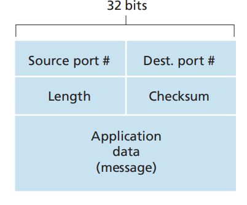

#### UDP Checksum

UDP at the sender side performs the 1s complement of the sum of all the 16-bit words in the segment, with any overflow encountered during the sum being wrapped around(**add the overflow bits with the sum**)

### 3.4 Principles of Reliable Data Transfer

#### Building a Reliable Data Transfer Protocol

1. **rdt1.0**

	the underlying channel is completely reliable

	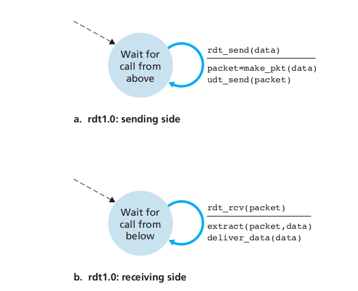

2. **rdt2.0**: Reliable Data Transfer over a Channel with Bit Errors

  an ARQ (Automatic Repeat reQuest) protocols 

  include RDT2.0-3, gbn, sr, tcp

  - checksum

  - feedback (ACK,NAK)

  - resend

  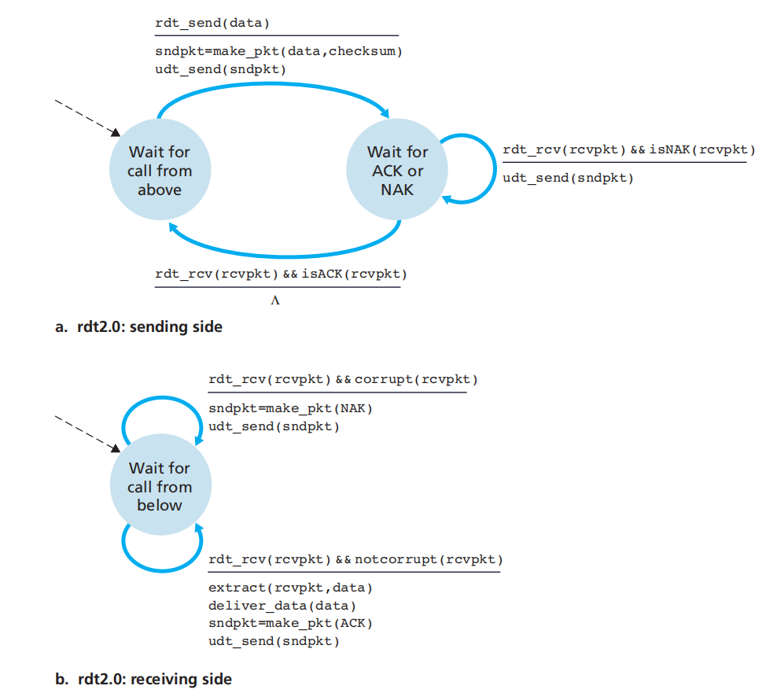

3. **rdt2.1**: can detect ACK or NAK errors based on 2.0

	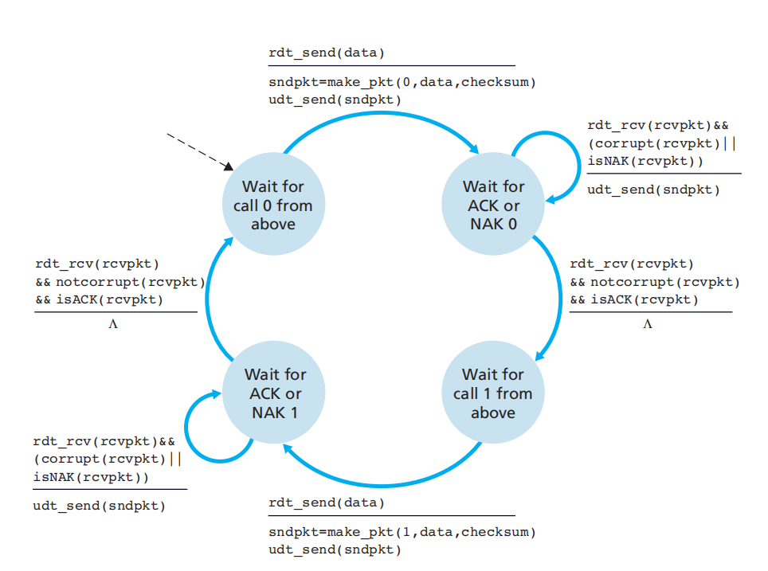
	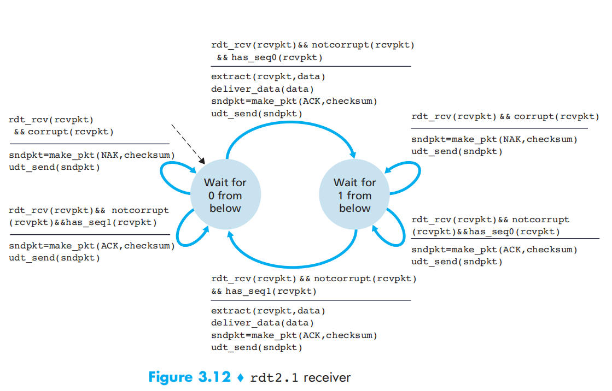
	
4. **rdt2.2**: implement without NAK based on 2.1

	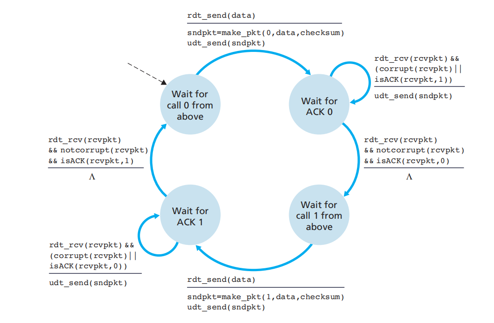
	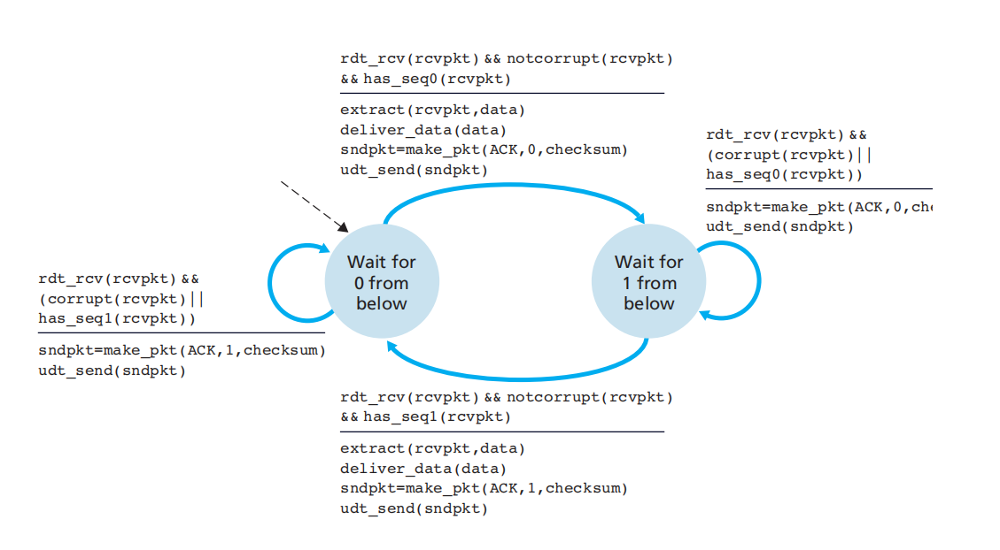

5. **rdt3.0**: Reliable Data Transfer over a Lossy Channel with Bit Errors

	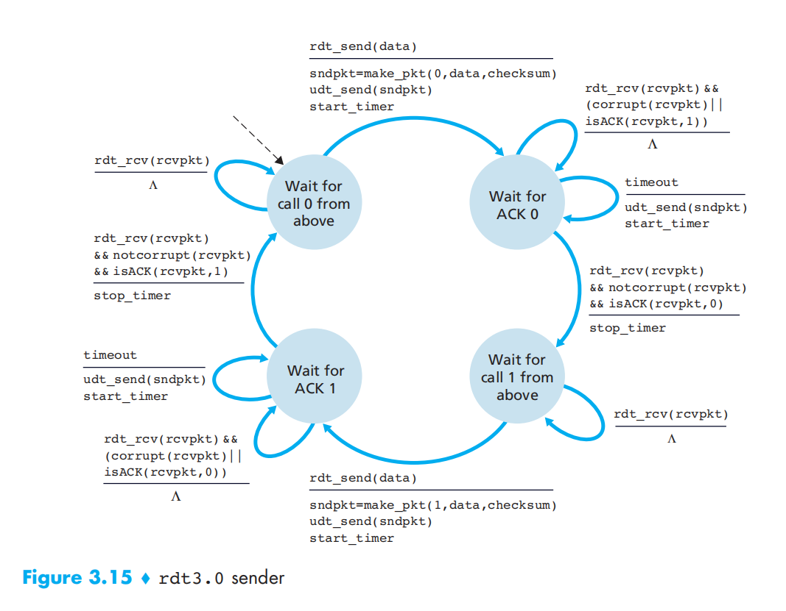

 

#### Pipelined Reliable Data Transfer Protocols

1. Stop&Wait: rdt

2. PipeLine: gbn, sr, tcp  in order.

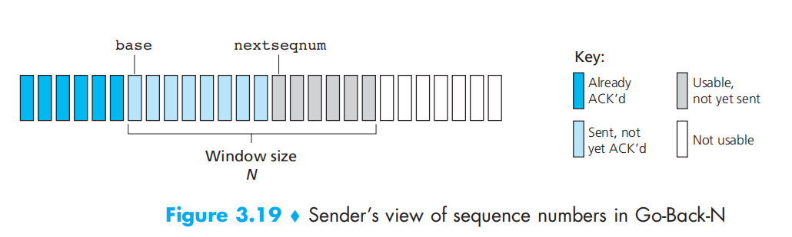

  Example:

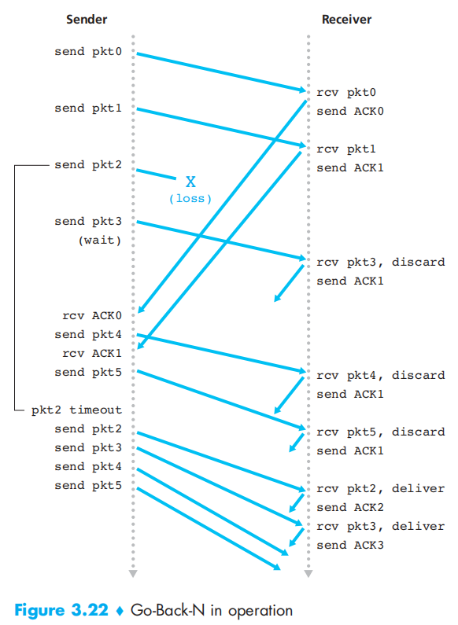

  The window size will move as long as getting the ACK.

  **only a single timer**, which can be thought of as a timer for the oldest transmitted but not yet acknowledged packet. If an ACK is received but there are still additional transmitted but not yet acknowledged packets, the timer is restarted. If there are no outstanding, unacknowledged packets, the timer is stopped.

- **Selective Repeat (SR)**

	sequence-number space format:

	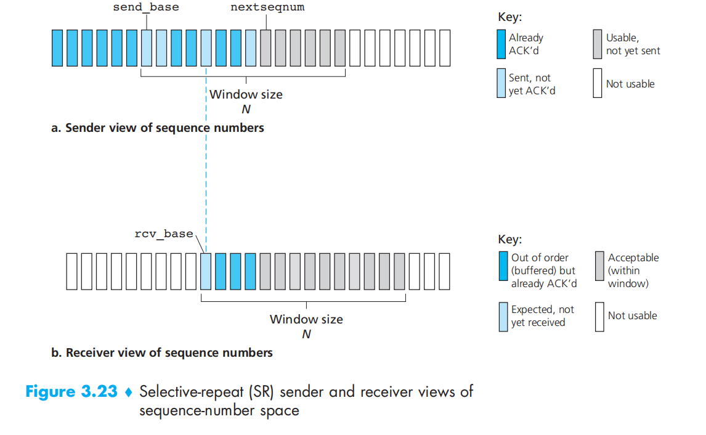

	Actions in sender:

	1. Data received from above
	2. Timeout:  **each packet must now have its own logical timer**, since only a single packet will be transmitted on timeout
	3. ACK received: **the windows will move right to the unacknowledged packet with the smallest sequence number** when received the most left ACK

	The SR receiver will acknowledge a correctly received packet whether or not it is in order. Out-of-order packets are buffered until any missing packets (that is, packets with lower sequence numbers) are received, at which point a batch of packets can be delivered in order to the upper layer.

	Actions in receiver:

	1. Packet with sequence number in [rcv_base, rcv_base+N-1] is correctly received. In this case, the received packet falls within the receiver’s window and a selective ACK packet is returned to the sender. If the packet was not previously received, it is buffered. If this packet has a sequence number **equal to the base of the receive window (rcv_base in Figure 3.22), then this packet, and any previously buffered and consecutively numbered (beginning with rcv_base)** packets are delivered to the upper layer. The receive window is then moved forward by the number of packets delivered to the upper layer.
	2. Packet with sequence number in [rcv_base-N, rcv_base-1] is correctly received. return an ACK

	**SR’s problem**: can’t know ***a new packet or a retransmission?***

	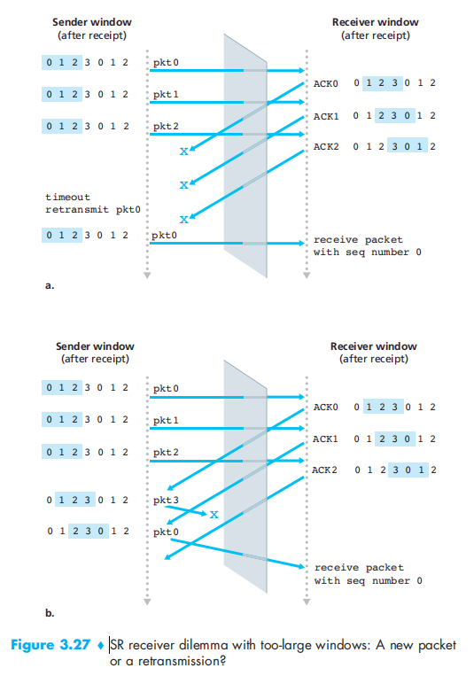

	The solution of this problem: ***the window size must be less than or equal to half the***
	***size of the sequence number space for SR protocols.***

**Summary:**

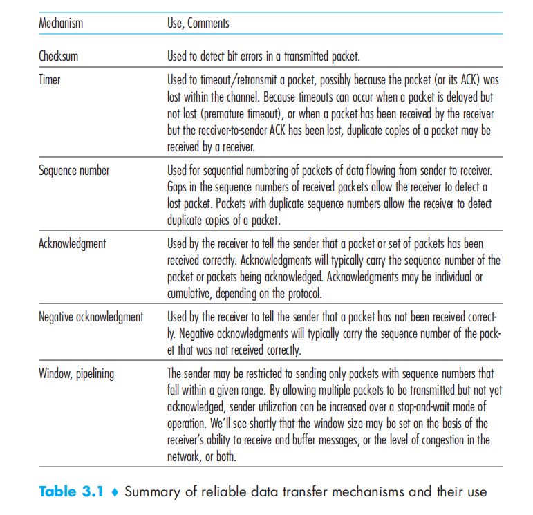

### 3.5 Connection-Oriented Transport: TCP

GBN-SR 窗口不变, TCP 窗口可以变

#### The TCP Connection

-  connection-oriented
- full-duplex service（全双工）
- point-to-point
- three-way handshake
- **maximum segment size (MSS):** The maximum amount of data that can be grabbed and placed in a segment
-  **maximum transmission unit (MTU):** the length of the largest link-layer frame that can be sent by the local sending host

#### TCP Segment Structure

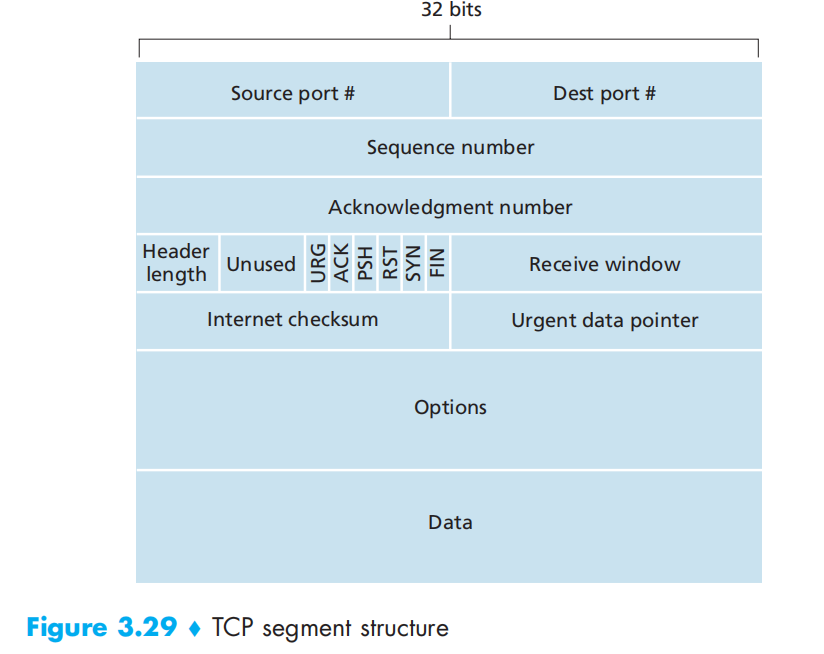

- **Sequence Numbers(SEQ)**: the byte-stream number of the first byte in the segment
- **Acknowledgment Numbers(ACK)**:  Host A puts in its segment is the sequence number of the next byte Host A is expecting from Host B（想要的下一个序号）TCP is said to provide **cumulative acknowledgments**

Example：

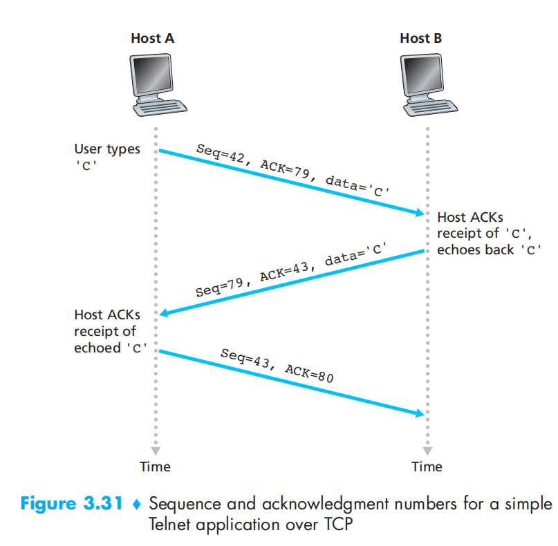

#### Round-Trip Time Estimation and Timeout

The sample RTT, denoted SampleRTT, for a segment is the amount of time between when the segment is sent (that is, passed to IP) and when an acknowledgment for the segment is received.

 TCP never computes a SampleRTT for a segment that has been retransmitted; it only measures SampleRTT for segments that have been transmitted once.

- use **exponential weighted moving average (EWMA)** to estimate RTT

$EstimatedRTT = (1 – \alpha) • EstimatedRTT + \alpha • SampleRTT$

- In addition to having an estimate of the RTT, it is also valuable to have a measure of the variability of the RTT.

$ DevRTT = (1 – \beta) • DevRTT + \beta•| SampleRTT – EstimatedRTT |$

- use this formula the get RTT time

$ TimeoutInterval = EstimatedRTT + 4 • DevRTT$

#### Reliable Data Transfer

- **Doubling the Timeout Interval**
- **Fast Retransmit**:In the case that three duplicate ACKs are received (except the first ACK)

#### Flow Control

TCP流控是因为应用层处理速度太慢了, 发送者和接收者的协调,拥塞是路由器和发送者

eliminate the possibility of the sender overflowing the receiver’s buffer. Flow control is thus a speed-matching service—matching the rate at which the sender is sending against the rate at which the receiving application is reading

TCP通过让发送方维护一个称为接收窗口的变量来提供流量控制

A通过TCP连接向B发送一个大文件

- LastByteRead: 主机B上的应用程序进程从缓存独出的数据流的最后一个字节的编号
- LastByteRevd: 网络到达已放入接收缓存的最后一个字节编号

保持下式成立

$ LastByteRcvd-LastByteRead \le RevBuffer $

接收窗口用rwnd表示，可得 $rwnd=RcvBuffer-[LastByteRcvd-LastByteRead]$

在发送方有 $LastByteSent-LastByteAcked \le rwnd$

**当主机B接收窗口为空时，主机A继续发送只有一个字节数据的报文段，避免A被阻塞的情况**

#### TCP Connection Management

MSS在传输SYN时传输确定, TCP可以将包合并发就合并发, SYN 包要独占一个序列号
SYN：1.同步网络参数 2.同步序列号
FIN：表示不发了，但可以接收

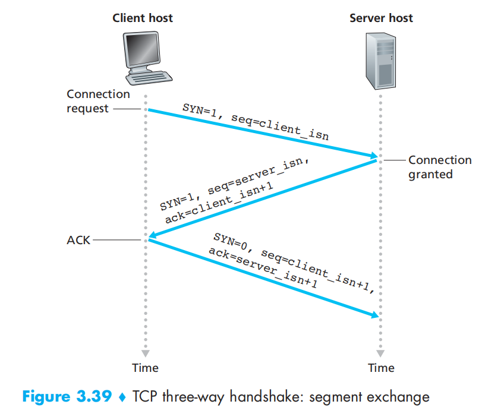

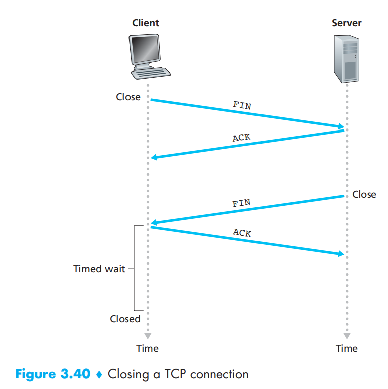

### 3.7 TCP Congestion Control

**each side of a TCP connection** consists of a **receive buffer, a send buffer, and several variables** (LastByteRead, rwnd, and so on). The TCP congestion-control mechanism operating at the sender keeps track of an additional variable, the congestion window. **The congestion window**, denoted cwnd, imposes a constraint on the rate at which a TCP sender can send traffic into the network.

TCP uses acknowledgments to trigger (or clock) its increase in congestion window size, TCP is said to be **self-clocking**.

**书本中的TCP标准遵循单一重传定时器的推荐** 

**FSM**：

对快速重传的快速恢复的cwnd有减半加三（考虑重传时没有拥塞）和不加三两种操作，这里采用不加三

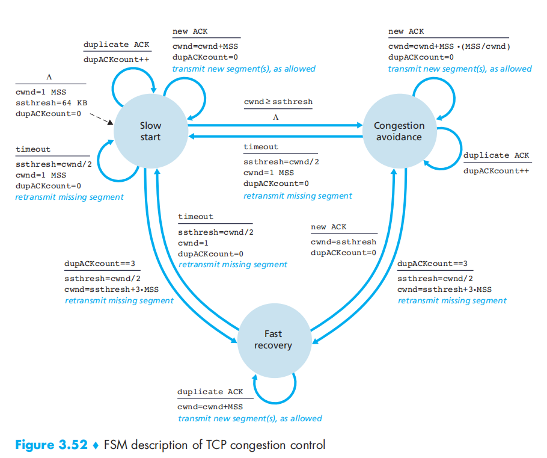

**TCP congestion-control algorithm**:

1. Slow Start

	**begin with 1 MSS** then **doubling** of the last sending rate every RTT until meets ssthresh or a loss, then enter congestion avoidance

2. congestion avoidance

	**linear increase** (of 1 MSS per RTT) until meet a loss, then **set the ssthresh to half** and enter fast recovery

3. fast recovery

	两个版本在超时后都置为1, 丢包（快速重传）处理不一样

	- Tahoe: set cwnd to 1 MSS
	- Reno: set the rate to the half of the last rate (real fast recovery)

Example:

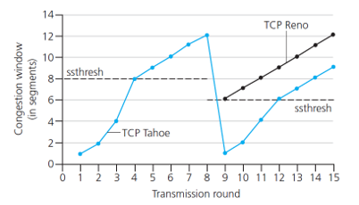

TCP is **fair**

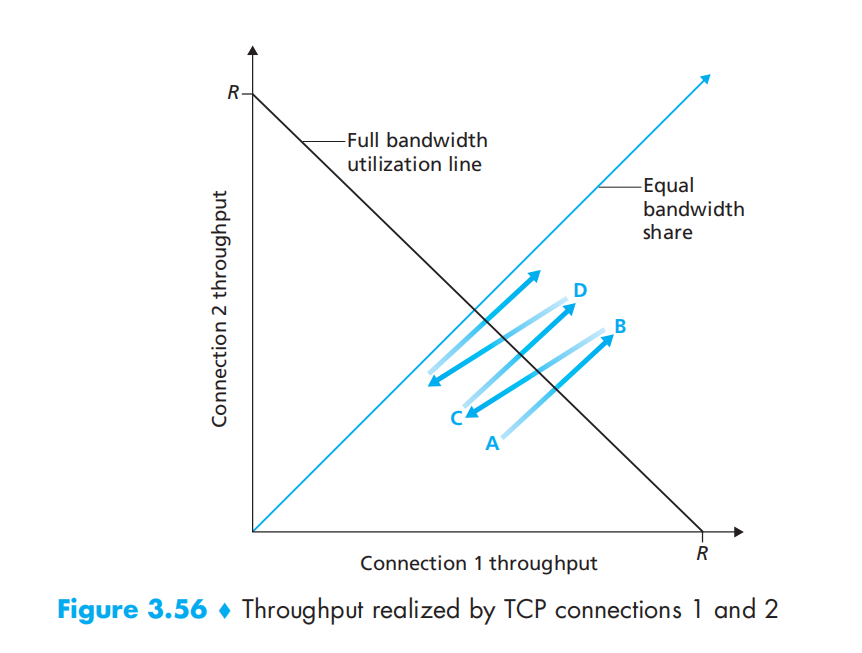

these two connection will infinitely approach *the equal bandwidth share line*.

## Chapter 4 The Network Layer

### 4.1 Introduction

- **Forwarding（转发）**: When a packet arrives at a router’s input link, the router must move the packet to the appropriate output link
- **Routing**: The network layer must determine the route or path taken by packets as they flow from a sender to a receiver. The algorithms that calculate these paths are referred to as routing algorithms

 Every router has a **forwarding table**.

ATM services models:

- CBR: **Constant bit rate (CBR) ATM network service.**
- ABR: **Available bit rate (ABR) ATM network service**

### 4.2 Virtual Circuit and Datagram Networks

#### Virtual-Circuit Networks

consists of:

-  a **path** (that is, a series of links and routers) between the source and destination hosts
- **VC numbers**, one number for each link along the path
- entries in the **forwarding table** in each router along the path

Whenever a new VC is established across a router, an entry is added to the forwarding table. Similarly, whenever a VC terminates, the appropriate entries in each table along its path are removed.

**three identifiable phases in a virtual circuit**:

1. VC setup
2. Data transfer
3. VC teardown

#### Datagram Networks

the router uses ***the longest prefix matching rule*** in datagram networks.

Because forwarding tables in datagram networks **can be modified at any time**, a series of packets sent from one end system to another may follow different paths through the network and may arrive **out of order**.

### 4.3 What’s Inside a Router?

#### Architecture

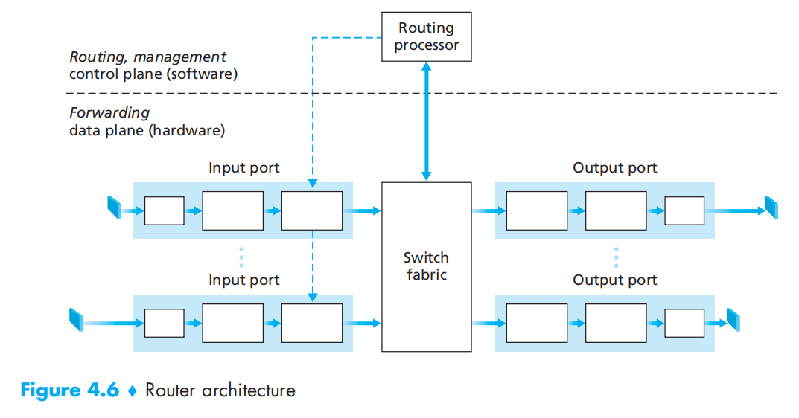

#### Switching

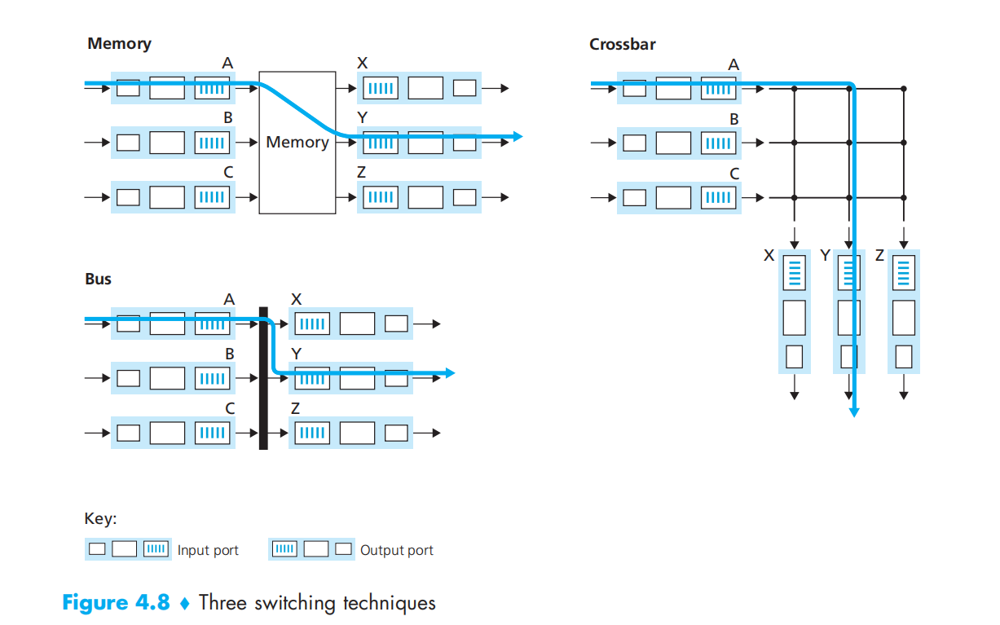

#### Where Does Queueing Occur?

the router’s memory can eventually be exhausted and packet loss will occur when no memory is available to store arriving packets.

**packet scheduler（分组调度）**:

**active queue management（AQM 主动队列管理）**

- drop-tail（弃尾）
- Random Early Detection (RED随机早期检测)

**head-of-the-line (HOL) blocking（线路前部阻塞）**: 前一个分组和其他的输入端口竞争，阻塞了后面没有冲突的分组的发送

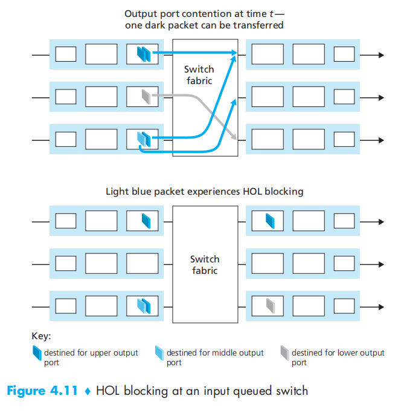

#### The Routing Control Plane

software pass....

### 4.4 IP

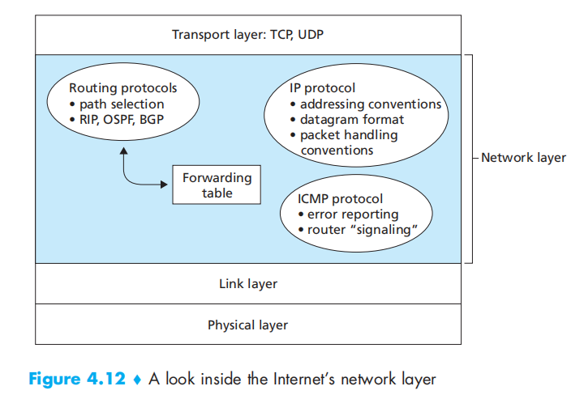

#### Datagram Format

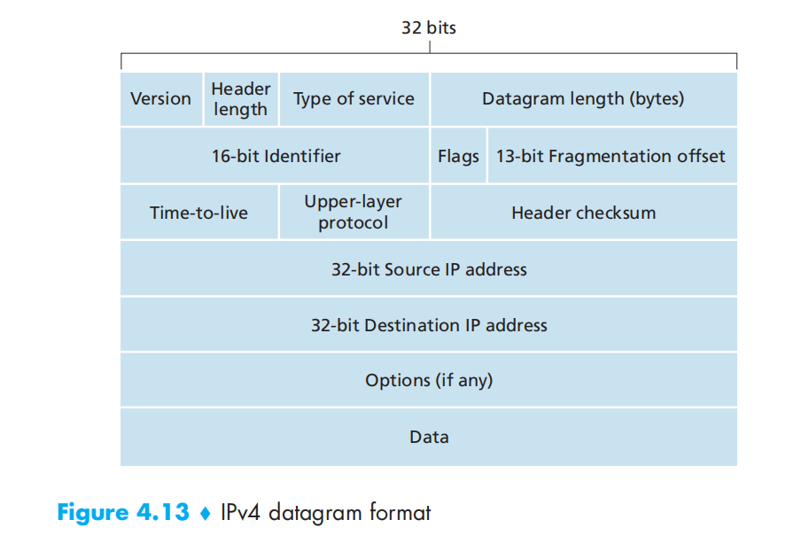

此处校验和计算方法和UDP处出现的校验和计算方法一致

**IP Datagram Fragmentation**

datagram: 4000 bytes

MTU: 1500 bytes

IP header: 20 bytes

#### IPv4 Addressing

The boundary between the host and the physical link is called an **interface**.

To determine the subnets, detach each interface from its host or router, creating islands of isolated networks, with interfaces terminating the end points of the isolated networks. Each of these isolated networks is called a subnet. 没有穿越路由器属于一个子网

子网可用IP地址需要减2，一个是主机位全0的子网地址和主机位全1的子网广播地址

子网本身IP地址：前缀+全零

子网本身IP地址：前缀+全1(直接广播地址)（对目标子网广播）

255.255.255.255 子网广播地址（受限广播地址）（广播本子网）

0.0.0.0 网卡本身地址

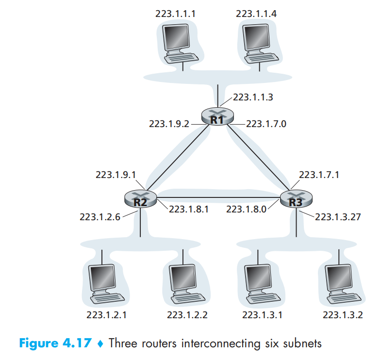

- **Classless Interdomain Routing (CIDR 无类别区域间路由选择)**

	a.b.c.d/x ; use prefix can reduce the size of the forwarding table

- **classful addressing 分类编址**

	A：8 bits ；B：16 bits；C：24bits

#### DHCP: the Dynamic Host Configuration Protocol

a **plug-and-play protocol**(即插即用协议)

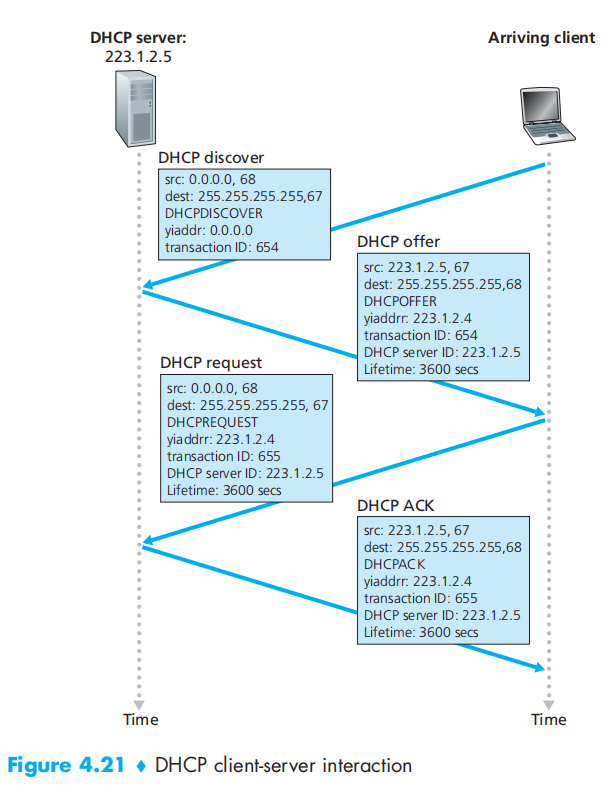

因为可能存在多个DHCP服务器所以需要二次确认，客户端选择一个IP并告知（一般都是第一个）

#### Network Address Translation (NAT)

use a **NAT translation table** at the NAT router, and to include port numbers as well as IP addresses in the table entries

NAT interferes with P2P applications.

可以采用第三方来通信 （Skype）

**NAT traversal**（NAT穿越）克服两台主机同属于不同NAT之后的通信，使用UPnP(Universal Plug and Play)协议

#### Internet Control Message Protocol (ICMP)

The most typical use of ICMP is for error reporting

使用IP协议的网络层协议

#### IPv6

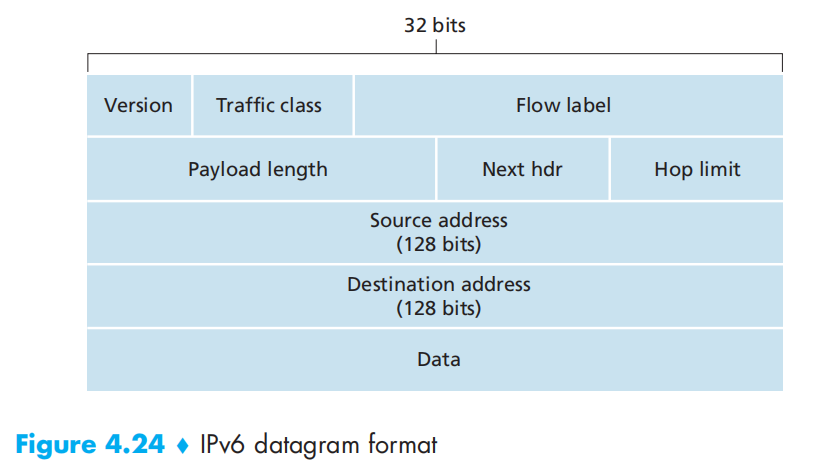

- Next hdr:交付到哪一个协议（TCP/UDP）和v4的协议字段相同
- IPv6不允许在路由器上分片和组装
- IPv6没有选项字段，使得其为定长40字节
- 首部校验和消失，完全交付给上层协议处理
- payload length: 数据长度

**Transitioning from IPv4 to IPv6**

- **dual-stack**：使用既可以处理v4也可以处理v6的路由器，但可能丢失流标签（或者其他v6特有标签）

	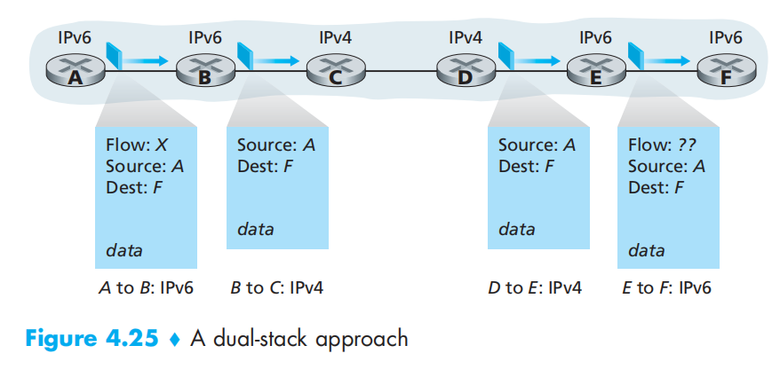

-  **tunneling**（建隧道）：将v6整体作为v4的数据段传递

	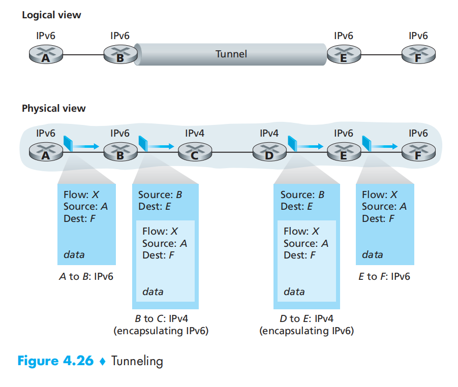

### 4.5 Routing Algorithms

classification 

1. **global routing algorithm(LS)** & **decentralized routing algorithm(DV)**
2. **static routing algorithms** & **Dynamic routing algorithms**
3. **load-sensitive algorithm** &  **load-insensitive(RIP, OSPF, BGP)**

#### Link-State Algorithm (LS)

- D(v): cost of the least-cost path from the source node to destination v as of this iteration of the algorithm.
- p(v): previous node (neighbor of v) along the current least-cost path from the source to v.
- N' : subset of nodes; v is in N’ if the least-cost path from the source to v is definitively known.

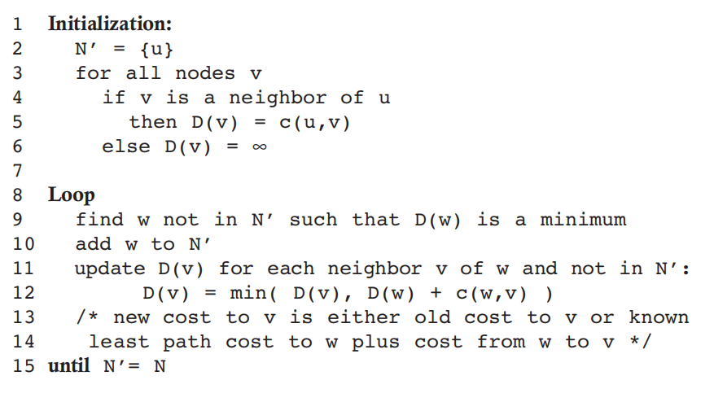

Example:

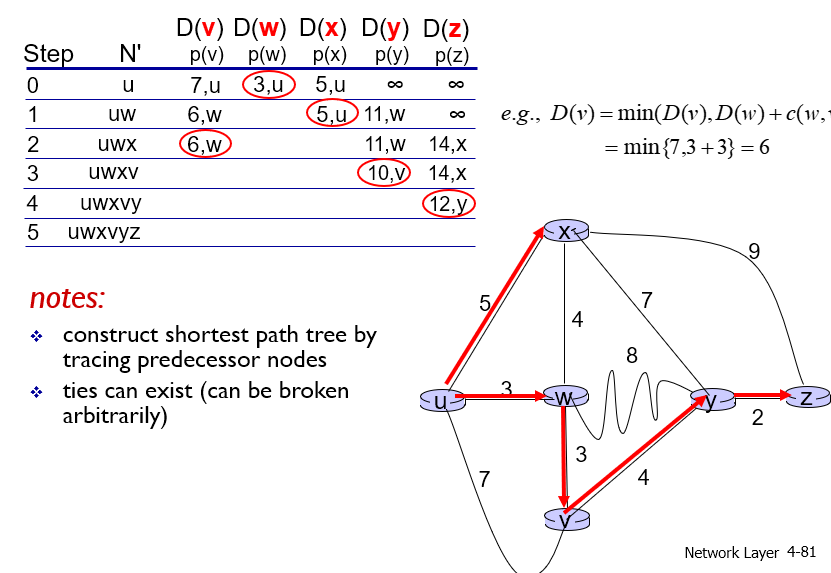

Then we can get the forward table of u:

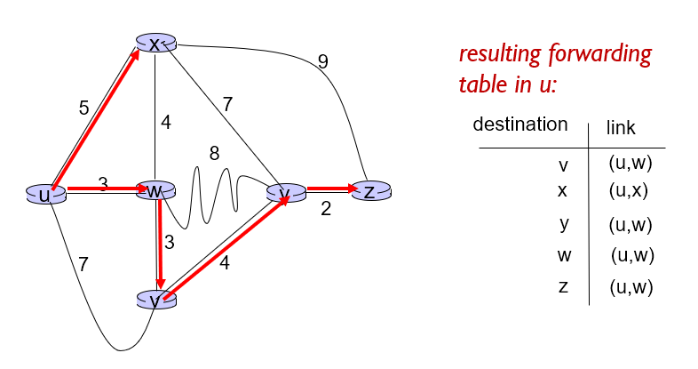

oscillations occur in any algorithm, not just an LS algorithm, that uses a congestion or delay-based link metric

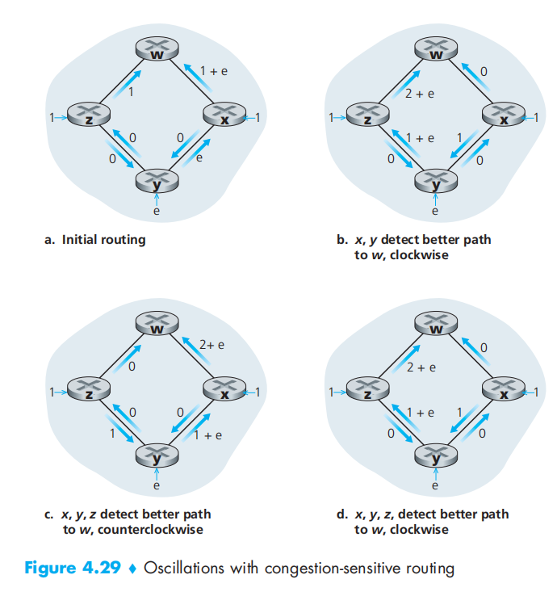

One way to avoid such self synchronization is for each router to randomize the time it sends out a link
advertisement.

#### The Distance-Vector (DV) Routing Algorithm

- For each neighbor v, the cost ***c(x,v)*** from x to directly attached neighbor, 
- Node x’s distance vector, that is, **Dx** = [Dx (y): y in N], containing x’s estimate of its cost to all destinations, y, in N
- The distance vectors of each of its neighbors, that is, **Dv** = [Dv (y): y in N] for each neighbor v of x

use this formula to update forwarding table:

$D_x(y)=min_v\{c(x,v)+D_v(y) \tag{for each node y in N}\} $

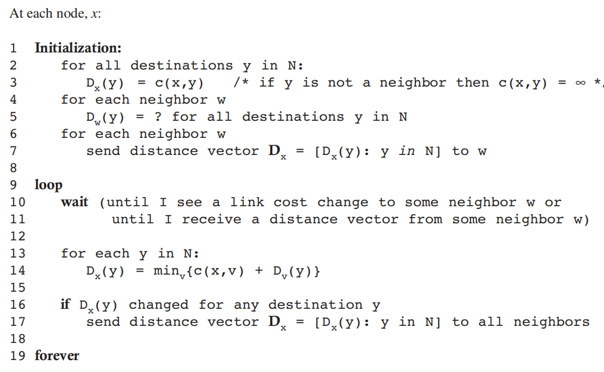

Examlpe:

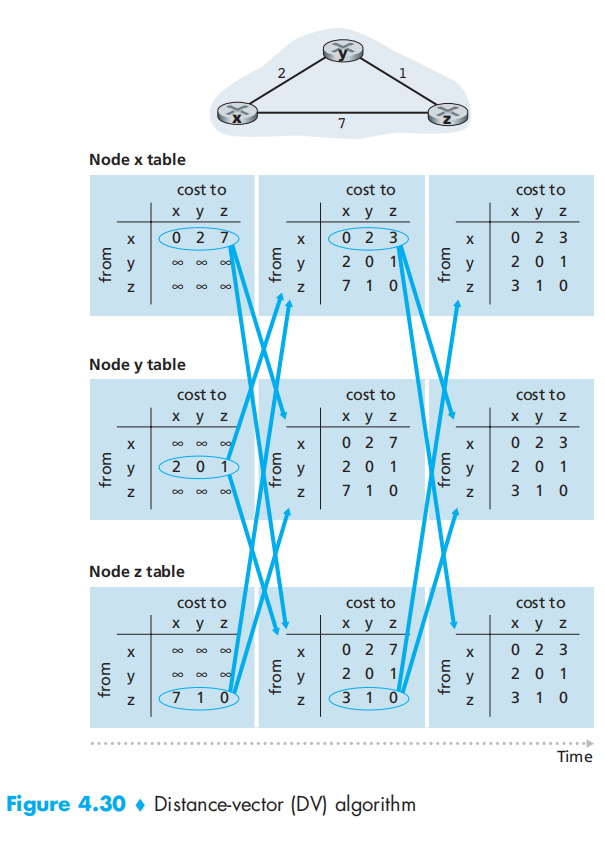

#### Distance-Vector Algorithm: Adding Poisoned Reverse

好消息: 链路开销减小, 迭代次数少便收敛

坏消息 链路开销增加, 可能陷入无穷迭代（原因在于消息的虚假，增加的这条链路被其他节点引用但无法更新）

https://blog.csdn.net/tianlongtc/article/details/80261581

毒性逆转：The idea is simple—if z routes through y to get to destination x, then z will advertise to y that its distance to x is infinity

#### A Comparison of LS and DV Routing Algorithms

- Message complexity：
- Speed of convergence（收敛速度）：DV收敛慢，可能遇到环路和无穷计数，LS较快
- Robustness（健壮性）：LS更健壮，路由器故障时，DV会无穷欺骗

#### Hierarchical Routing

- **autonomous systems (ASs)**: consisting of a group of routers that are typically under the same administrative control

- **intra autonomous system routing protocol**: The routing algorithm running within an autonomous system

- **gateway routers**: forwarding packets to destinations outside the AS
- **inter-AS routing protocol**: obtaining reachability information from neighboring ASs and propagating the reachability information to all routers internal to the AS
- **hot-potato routing**: 如果有两个网关都可以通向到另外一个AS那么简单的选择最近的那一个就可以

### 4.6 Routing in the Internet

**intra autonomous system routing protocol** also named **interior gateway protocols**

1. Routing Information Protocol (RIP) DV(下层ISP或企业)
2. Open Shortest Path First (OSPF) LS (上层ISP)

#### Intra-AS Routing in the Internet: RIP

**hop**: the number of subnets traversed along the shortest path from source router to destination subnet, including the destination subnet

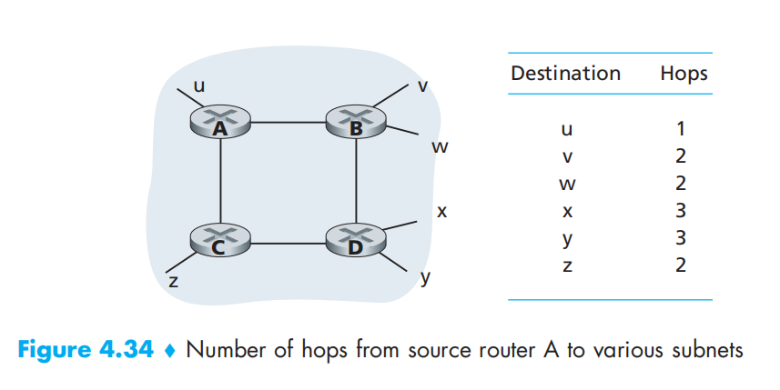

The maximum cost of a path is limited to 15 in RIP.

In RIP, routing updates are exchanged between neighbors approximately every 30 seconds using a **RIP response message**(RIP advertisements)

Example:

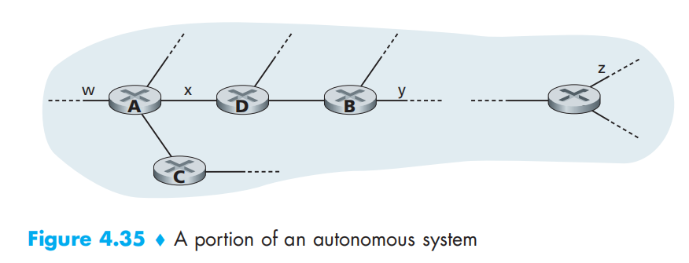

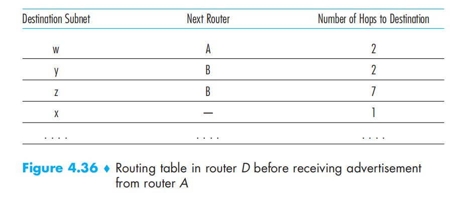

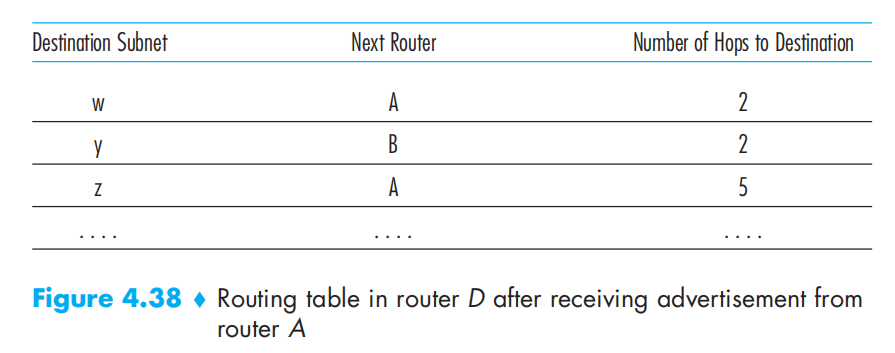

#### Intra-AS Routing in the Internet: OSPF

OSPF  broadcasts routing information to **all** other routers in the autonomous system

Some of the advances embodied in OSPF：

1. *Security*
2. *Multiple same-cost paths*（允许使用多条路径发送）
3. *Integrated support for unicast and multicast routing*
4. *Support for hierarchy within a single routing domain*

OSPF可以配置为多个区域，每个区域都有区域边界路由器（**area border routers**）负责向流域以外的分组提供路由选择。AS内只有一个主干区域（backbone），主干的主要作用是为AS内其他区域之间的流量提供路由选择，包括了所有区域边界路由器和一些非边界路由器。在AS内区域间的路由选择要求分组首先路由到一个区域边界路由去，然后听过主干路由到位于母的区域的边界路由器

#### Inter-AS Routing: BGP（Border Gateway Protocol）

\***BGP转发的对象是前缀（子网）**

BGP provides each AS a means to

1. Obtain subnet reachability information from neighboring ASs.
2. Propagate the reachability information to all routers internal to the AS
3. Determine “good” routes to subnets based on the reachability information and on AS policy

Most importantly, BGP allows each subnet to advertise its existence to the rest of the Internet.

- **BGP peers**：TCP连接的两个端点
- **BGP session**：发送BGP报文的TCP连接
- **external BGP** (**eBGP**) **session**：跨越AS
- **internal BGP** (**iBGP**) **session**：内部

每一个AS都有一个ASN（autonomous system number），但是桩（stub）AS没有，这种AS只承担目的地址为本AS的流量。AS号是ICANN 分配的

When a router advertises a prefix across a BGP session, it includes with the prefix a number of BGP attributes. In BGP jargon, a prefix along with its attributes is called a route

- *AS-PATH*:包含了前缀的通告已经听过的那些AS
- Providing the critical link between the inter-AS and intra-AS routing protocols, the NEXT-HOP attribute has a subtle but important use. **The NEXT-HOP is the router interface that begins the AS-PATH.**

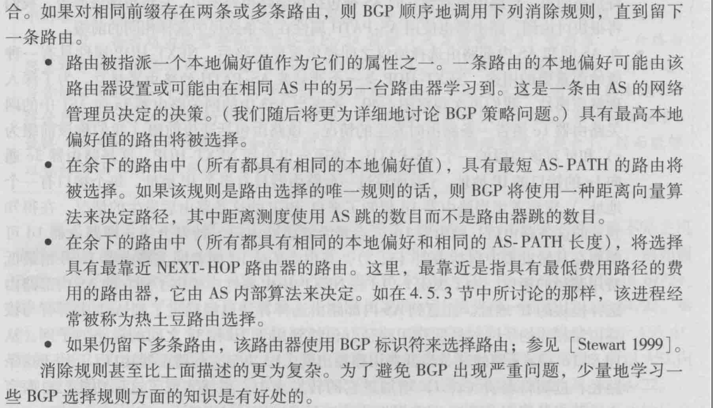

## Chapter 5 The Link Layer: Links, Access Networks, and LANs

### 5.1 Introduction to the Link Layer

- **node**: any device that runs a link-layer protocol
- **links:**the communication channels that connect adjacent nodes along the communication path
- **link-layer frame**: link-layer data transmission format

####　The Services Provided by the Link Layer

1. *Framing*(成帧)
2. *Link access*(链路接入)
3. *Reliable delivery.*
4. *Error detection and correction*

#### Where Is the Link Layer Implemented?

**network adapter** also named **network interface card (NIC)**

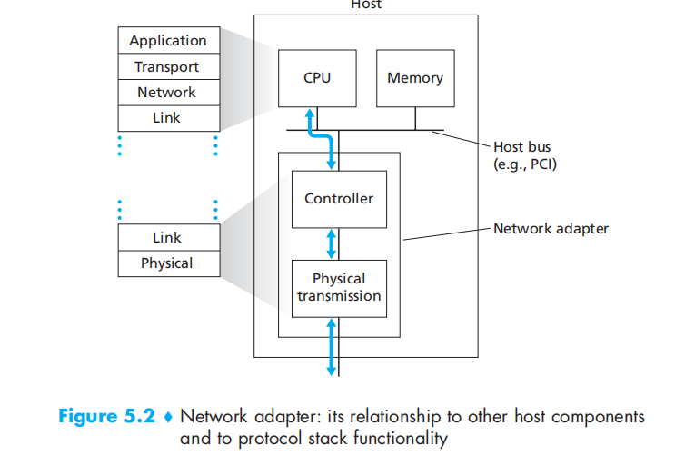

### 5.2 Error-Detection and -Correction Techniques

use  **error-detection and -correction bits(EDC)** to detect and correct error bits

Even with the use of error-detection bits there still may be **undetected bit errors**

#### Parity Checks

奇偶校验只需要查看加上检验比特(奇偶校验位)的1 是奇数还是偶数

二维奇偶校验:

对每一行每一列都进行奇偶校验,然后对列行奇偶校验位进行奇偶校验, 就校验可以检测和纠正单个比特错误,可以检测但是不能纠正两个比特的任意错误组合

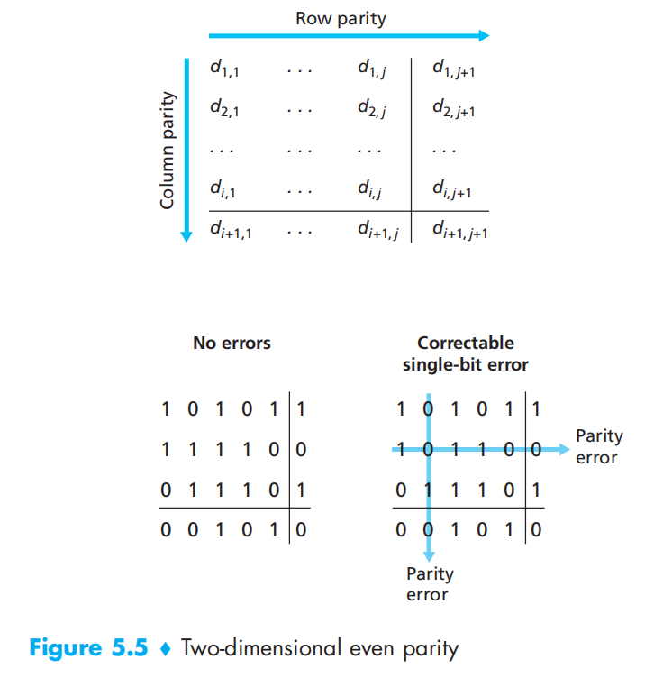

The ability of the receiver to both detect and correct errors is known as **forward error correction (FEC前向纠错)**.

#### Checksumming Methods

和UDP/TCP中的类似

#### Cyclic Redundancy Check (CRC)

also named **polynomial codes**(多项式编码)

1. 确定多项式 例如 x3+x2+1 = 1101

2. 在目标码后加上多项式码长度-1 的0

3. 做模2除法(除的过程不是减是异或)

把最后的余数添加到原码的末尾,在接收端使用相同多项式除看余数是否是0

### 5.3 Multiple Access Links and Protocols

- **point-to-point link**: consists of a single sender at one end of the link and a single receiver at the other end of the link
- **broadcast link**: enables a single source node to send a copy of a packet to a subset of the other network nodes

1. channel partitioning protocols 信道划分协议
2. random access protocols 随机访问协议
3. taking-turns protocols 轮流协议

a multiple access protocol for a broadcast channel of rate R bits per second should have the following desirable
characteristics:

1. 当仅有一个节点发送数据时,具有R bps的吞吐量

2. 当M给节点发送时,每个结点吞吐量为 R/M bps的平均传输速率

3. 协议是分散的,不会因为某个主节点故障而使整个系统崩溃

	no special node to coordinate transmissions

	no synchronization of clocks, slots

4. 协议是简单的,使实现不昂贵

#### Channel Partitioning Protocols

- time-division multiplexing (TDM):  divides time into time frames and further divides each time frame into N time slots(时隙) 仅有一个节点他的速度任然是R/N的速度

- frequency-division multiplexing (FDM): 将R bps 信道划分为不同的频段, 具有TDM的缺点

#### Random Access Protocols

- **Slotted ALOHA (时隙 ALOHA)**: 

	有如下假设:

	- All frames consist of exactly L bits.
	- Time is divided into slots of size L/R seconds (that is, a slot equals the time to transmit one frame).
	- Nodes start to transmit frames only at the beginnings of slots.
	- The nodes are synchronized so that each node knows when the slots begin.
	- If two or more frames collide in a slot, then all the nodes detect the collision event before the slot ends.
	
	p 是一个0-1的概率, 有如下操作:
	
	- 当节点要发送一个新帧时,需要在下一个时隙开始并在该时隙传输整个帧
	- 如果没有碰撞则成功传输,不需要考虑重传
	- 如果有碰撞,该结点在时隙结束之前检测到碰撞,之后以p在之后的每一杠时隙重传,直到成功
	
	此协议需要时钟同步,但是当只有一个结点时,效率是R
	
	此协议效率定义为:有大量活跃结点发送大量帧时,长期运行中成功时隙的份额
	
	在p的概率下 N个结点的效率为$Np(1-p)^{N-1}$ N趋于无穷时有极限1/e = 0.37
	
	

- ALOHA

	时隙ALOHA的无时钟同步版本, 效率降低一半

- Carrier Sense Multiple Access (CSMA 载波监听多路访问)

	规则:

	1. *Listen before speaking*, this is called **carrier sensing**
	2. *If someone else begins talking at the same time, stop talking*, this is called **collision detection**

	These two rules are embodied in the family of **carrier sense multiple access(CSMA)** and **CSMA with collision detection (CSMA/CD)** protocols 

	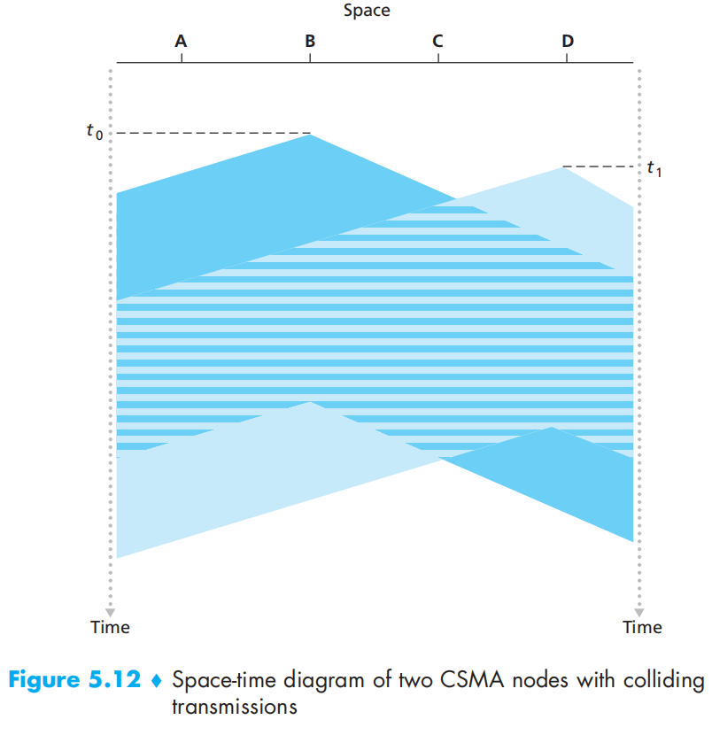

	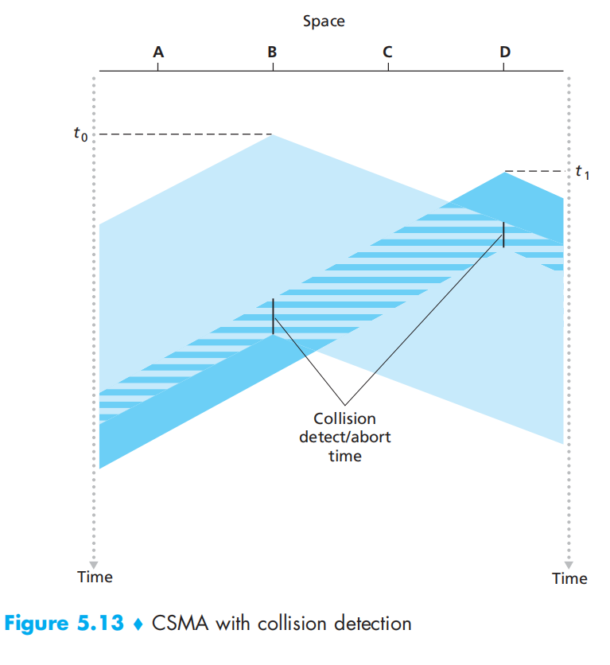
	
	CSMA/CD 的运行
	
	1. The adapter obtains a datagram from the network layer, prepares a link-layer frame, and puts the frame adapter buffer.
	2. If the adapter senses that the channel is idle (that is, there is no signal energy entering the adapter from the channel 即在96比特时间内没有检测到信道上有信号), it starts to transmit the frame. If, on the other hand, the adapter senses that the channel is busy, it waits until it senses no signal energy and then starts to transmit the frame.
	3. While transmitting, the adapter monitors for the presence of signal energy coming from other adapters using the broadcast channel.
	4. If the adapter transmits the entire frame without detecting signal energy from other adapters, the adapter is finished with the frame. If, on the other hand, the adapter detects signal energy from other adapters while transmitting, it aborts the transmission (that is, it stops transmitting its frame).
	5. After aborting, the adapter waits a random amount of time and then returns to step 2.
	
	选择随机回退时间算法:
	
	**binary exponential backoff(二进制指数后退)**algorithm
	
	经历n次碰撞之后,结点随机的从$\{0,1,2,...,2^n-1\}$选择一个值作为回退时间
	
#### Taking-Turns Protocols

Recall that two desirable properties of a multiple access protocol are (1) when only one node is active, the active node has a throughput of R bps, and (2) when M nodes are active, then each active node has a throughput of nearly R/M bps. The ALOHA and CSMA protocols have this first property but not the second.

- **polling protocol(轮询协议)**: 在一个主结点的控制下轮询各个结点
- **token-passing protocol(令牌传递协议)**:结点构成一个环,将令牌传递,有令牌的发送,结束后传递给下一个

具有单点失效性

### 5.4 Switched Local Area Networks

#### Link-Layer Addressing and ARP

- **MAC(LAN address, a physical address)**: 48 bits, FF-FF-FF-FF-FF-FF **broadcast address**

- **Address Resolution Protocol (ARP)**: 

	ARP 维护一个ARP表

	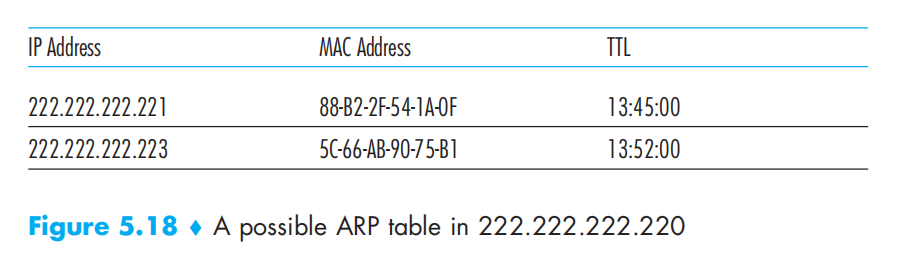

	表中没有所需要的项时,就会发送一个ARP分组并向子网广播获取对方的MAC地址,当需要发送到子网以外时,需要先获取网关路由器的MAC地址,然后一步步转发出去

####  Ethernet

- hub(集线器): 比特级复制数据,可以达到广播的目的
- switch(交换机):存储转发功能,且无碰撞(因为有缓存)

结构:

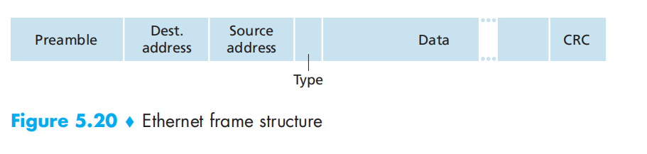

以太网技术提供不可靠服务,接收方会执行CRC校验,失败则丢弃,但不对发送方产生任何的反馈信息

#### Link-Layer Switches

- **Filtering**:  determines whether a frame should be forwarded to some interface or should just be dropped. 
- **Forwarding**: determines the interfaces to which a frame should be directed, and then moves the frame to those interfaces.

一个目的MAC通过一个接口x到达交换机有3种情况:

1. 没有此目的MAC的表项则广播
2. 此表项和x已经关联,丢弃
3. 不等于x的y接口是此目的MAC 则转发

交换机是自学习的,即插即用,双工设备

1. 初始交换机为空
2. 对每个接口接收到的帧,存储 MAC, 接口, 时间信息
3. 在老化期(aging time)之后没有收到该地址作为源的帧删除

交换机的优点:

1. *Elimination of collisions*
2. *Heterogeneous links*(异质的链路)
3. *Management*

交换机和路由器比较:

- 交换机: 即插即用、高转发过滤速率、没有提供广播风暴保护措施

- 路由器：一般不会死循环（TTL）、广播风暴有有防火墙保护，非即插即用，处理时间长