### Chapter 1 Introduction

> 2020-01-06 Joke-Lin

#### Basic Concepts

1. **Database**: is a collection of interrelated data
2. **Database Management System (DBMS)**: A system software between user and OS
   - Data-definition language (DDL)
   - Data-manipulation language (DML)

3. **Database System**: A computer system with database

#### Characteristics of Database System

1. Complex **data structures**: main characteristic

2. Data **redundancy** is small: share data

3. Data **independency** is high: physical and logic independency

4. A **unified** （统一的）data management, control function：Data’s safety, integrity，concurrency，recovery

	安全性+完整性

#### Data Model

> A collection of conceptual tools for describing data, data relationships, data semantics, and consistency constraints
>
> **Reality、easy to understand、feasible**

##### Kinds Of Data Model

- **Conceptual model**: Modeling data and information based on **users**’ view, for database design

- **Logical model**: Modeling data based on **computer system’**s view, for the implements of DBMS

  such as hierarchical data model、network data model、Relational Model、Object-Based Data Model

- **Physical model**: The abstraction of the low-level data

Data model is the **kernel** and **foundation** of a database system

##### Components of data model

1. **data structure**:  The set of data types - Description for static characteristics
3. **data-manipulation**：The set of operations to access or manipulate data – Description for dynamic characteristics
3. **integrity constraint**:The set of integrity rules (supported by DBMS rather than programs)

##### Conceptual Model 

> The Intermediate level between the real world and the machine world

**Basic Concepts**:

- **entity**: thing can be distinguished by others
- **attribute**: a function that maps from the entity set into a domain
- **Key**: a set of attributes that suffice to distinguish entities from each other
- **Domain**: The possible values of an attribute
- **Entity type**: The common characteristics of entities with the **same attributes**
- **Entity set**: The set of entities with the **same entity type**
- **Relationship**: Mainly focus on the relationships among different entities

##### Constraints on relationships

1. mapping cardinalities / cardinality ratios 基数约束
2. participation constraints (参与性约束 )

- One 2 One
- One 2 Many
- Many 2 Many

##### E-R Model

1. **is-a** Model: A is a B when A has attributes B doesn’t have
2. Weak Entity Set: 
   - An entity set that does **not have sufficient attributes** to form a **primary key**
   - The relationship from weak entity B to entity A must be many(One)-to-one 

**Entity-Relationship Diagrams**:

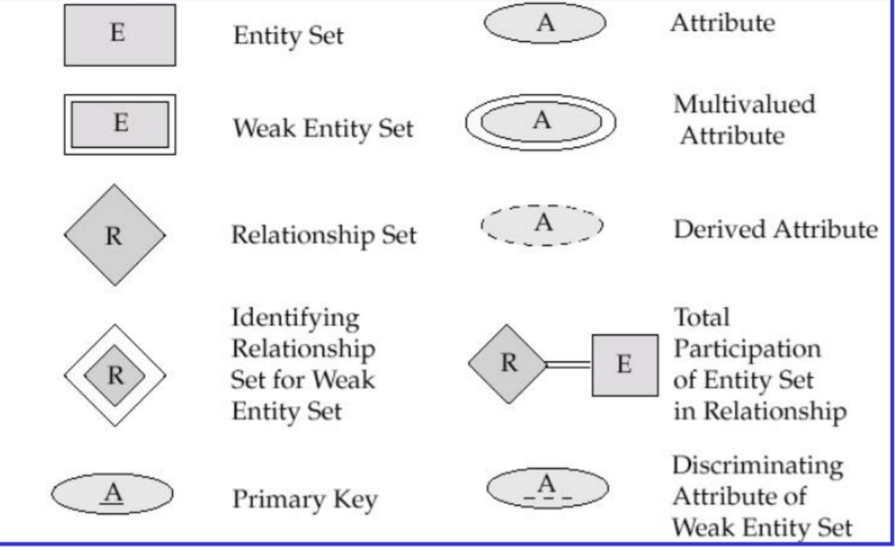


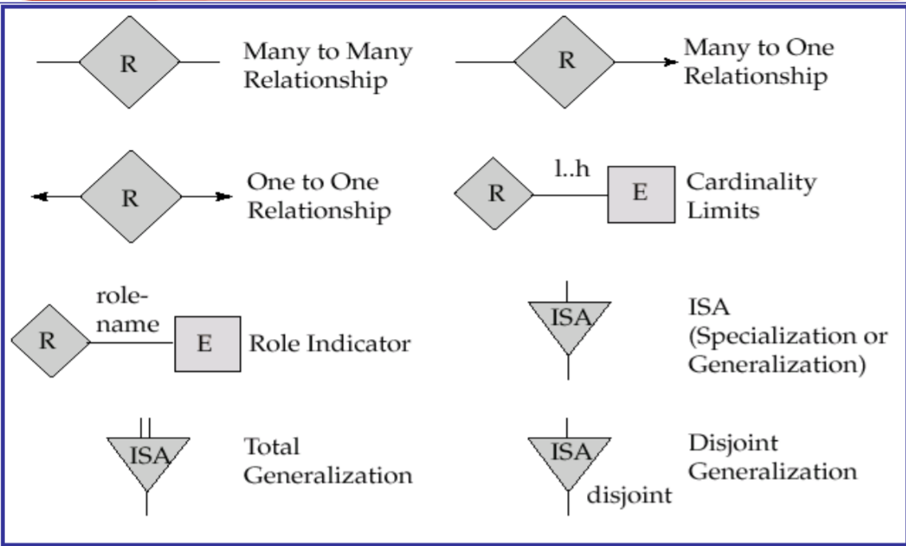

##### Relational Model

> in relational model, the **relationships among entities** are represented by relations.

- Data structure
  - **relation**: refers to a table that can’t be split
  - **tuple**: a row of a table
  - **attribute**: a colume
  - **key**: uniquely identify the tuple
  - **domain**: a set of permitted values for each attribute of a relation
  - **relation instance**: a specific instance of a relation
  - **relation schema**: the programming language notion of type definition
- Data manipulation and integrity constraints
  - **operations**: query, insert, delete, update
  - **integrity constraints**: entity integrity, referential integrity, user-defined integrity
  - **one time one set**
  - what to do instead of how to do
  - data is more independent in relational model than non-relational model
- Storage Structure: easy for users
- Advantages/Disadvantages
	1. depend on strict mathematical model (e.g. set theory）
	2. the concept is simple. All relationships among entities are represented by relations.
	3. query path is transparent to the user
	4. query efficiency is lower to non-relational model
		- DBMS can optimize users’ query requests

#### Architecture of Database System

#### Two Kinds

1. from view of DBMS: three level schema architecture
	-  external schema 
	-  (Conceptual) schema  
	-  internal schema 

2. two mapping external-schema, schema-internal

  The two-level mappings among three-level schemas guarantee that the data has strong **logical independence and physical independence**

3. from the end of users of DB: C/S & B/S

## Chapter2 Relational Database

### 1. Summary of the relational model

> contains three parts: 
>
> - relational data structure
> - collection of relational operations
> - integrity constraints.
>
> **relationship is solo data structure**

#### Relational Operation

- Only gives the ability of relational operation and no the special grammer of RDBMS language

- The Characteristics: **Set- at-a-Time**

#### Abstract Query Language

> SQL is a standard query language in mid of relational algebra and relatinoal calculus

#### Three kinds Of Integrity Constraints of Relation

> these are assured by DBMS rather than the application

- Must satisfy: **entity, referential integrity constraints**
- Many semantic constraints in the field of application is assured by **user-defined integrity** of DBMS

### 2. *Relational Data Structure And Definition

#### Relation

- Domain:  a collection of values with the same data type
- Cartesian product: ...
- Cardinality: the size of the domain
- **Relation**: Any subset of D1XD2XDn donoted by R(D1, ..., Dn) n is the degree (The subset can be empty, the order is ingnored in relation, can be infinite)

- **Candidate Key(候选码**):  if the value of an attribute group in a relation can uniquely identify a tuple, says the attribute set of the relation is a candidate key. (候选码) (the group is minimum set)
- **Primary Key**: One of the candidate key
- **Primary Attribute**: An attribute contained in any candidate key is a primary attribute, while others are non-primary attributes.(只要包含在候选码之中的属性都是主属性 候选码是一个集合那么其中所有的属性都是主属性)
- **All-Key**: All attributes of the relation is the only candidate key of the relation

**Six Basic Properties**: 三列两行一分量

1. Column is homogeneous (同类的);

2. Different columns can from the same domain, each column is an attribute. Different attributes (columns) should have different names;
3. The order of columns can be exchanged;
4. Any two tuples cannot be the same;
5. The order of rows can be exchanged;
6. Each component cannot be splitted.

#### Relation Schema

> RS is the description of relation, denoted by R(U, D, dom, F):
>
> - R: the name of relation
> - U: the names of attributes selected in the relation,
> - D: the domains of attributes contained in U,
>  - dom: the set of mappings from attributes to domains,
>  - F: the set of dependencies among attributes

Can be Represented as:

R(U) or R(A1, ..., An)

### 3. Relation Operation

#### Basic relational operation

- **Query**: select, projection, join, divide, union, subtract, and generalized Cartesian product
- **Update**: Insert, delete, update

#### Relational data language classification

同样的表达能力

- **Relational algebra** is used to express the requirements on the relation proposed by a query
- **Relational calculus** uses predicate (谓词) to express the query demand
- **SQL**(Structured Query Language): between relational algebra and relational calculus language

#### Relation Integrity

> Entity and referential integrities are applicable to any relational database system.

1. **Entity Integrity**:

   Attributes in the primary key (primary attributes) cannot have a null value. A null value is “unknown” or “uncertain”.

2. **Referential Integrity(参照完整性)**：

   F is an attribute or a set of attributes in relation R, but not the key（候选码） of R. If F references the primary key Ks of relation S, then F is the foreign key of R (外码), R is called the referencing relation (参照关系), and S is called the referenced relation (被参照关系) or target relation (目标关系). R and S may be different or not.

   Rules: if F is foreign key of R, the value of  F must be NULL or the exist value in Ks.

3. **User-Defined Integrity**:

   User-defined integrity is a specific constraint for relational database, it reflects the semantic requirements for data in a specific application

### 4. Relational Algebra

> The are four classes of operators in relational algebra: collection operator, specialized relational operator, arithmetic comparison operator, and logical operator

#### Traditional Set Operations

- $$ \bigcup$$: $$ R \bigcup S = \{t| t\in R \bigvee t \in S\} $$
- $\bigcap$: $$ R \bigcup S = \{t| t\in R \bigwedge t \in S\} $$

- $-$:$$ R - S = \{t| t\in R \bigwedge t \notin S\} $$

- $\times$: $$ R \times S = \{\widehat{{tr}{ts}}| tr\in R \bigwedge t \in S\} $$

#### Specialized Relational Operations

1. Selection： For Example: $ \sigma_{A=B \wedge D<5}(R)$

2. Projection: $\prod_a(R)=\{t[a] | t \in R\}$

    Basic ideas: eliminating some attributes from a relation(it will remove some duplicate rows)

3. Join:

   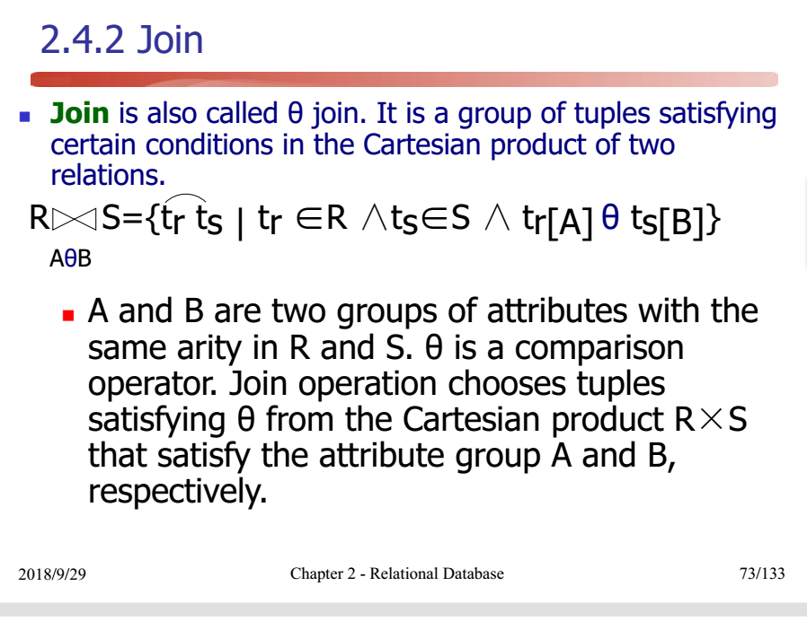

   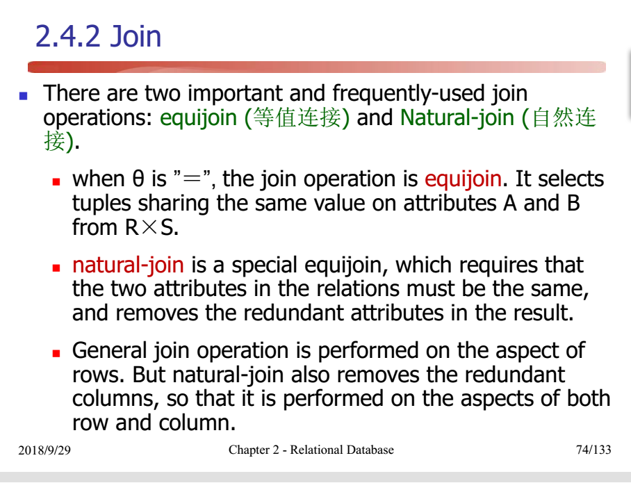
   
4. division

    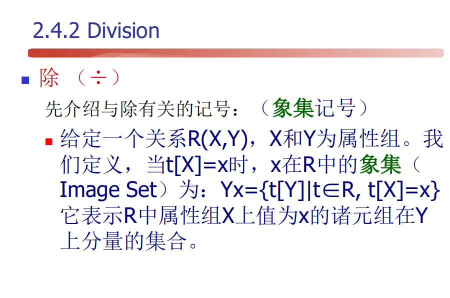

    

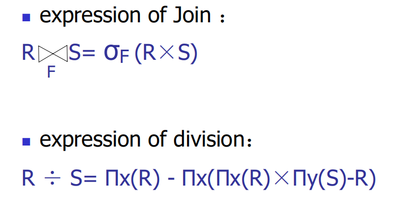

## Chapter 3 Structured Query Language 

...

## Chapter 6  Relational Database Theory 

###  1. Relational Schema 

>  Can be defined as follows:
>  $R(U, D, DOM, F)$ also can be written shortly as $R(U,F)$
>  F is data-dependency set
>  $R<U,F>$ means relation R on U s.t. F

- **1NF**: each attribute has atomic domains
- **Data-Dependency**:  Functional-Dependency (FD, 函数依赖) & Multivalued-Dependency (MVD 多值依赖)

-  **Problems brought by Over Redundancy**:
	-  Abnormal insertion 
	-  Abnormal deletion 
	-  Complex update 
- Target:  key→ non-primary attributes 

### 2. Normalization 

去除冗余和异常

#### Functional Dependency

$$
a \subseteq R \and  b \subseteq R \\
a \rightarrow b, s.t. \forall t_1, t_2, if \quad t_1[a]=t_2[b] \rightarrow t_1[b]=t_2[b] \\
if \quad b \subsetneq a\rightarrow nontrivial \\
otherwise \quad trivial \\
completely:X \rightarrow Y, \nexists X'\rightarrow Y s.t. X' \subseteq X \Rightarrow X\rightarrow^F Y \\
partial: otherwise X\rightarrow^P Y \\
transitive: X\rightarrow^TY
$$

#### Key

 Let K be an attribute or a set of attributes in R<U,F> . If $K\rightarrow^FU$ Then K is a candidate key.

####  Normal Form 

> $5NF \subset 4NF \subset 3NF \subset 2NF \subset 1NF$

- 2NF:

  R is 1NF, for all nontrivial $X\rightarrow Y \in R$, Y is prime attribute or X is not a proper set of any key.

  另外一种相同描述：对所有的非主属性，存在对码的完全函数依赖

  消除了非主属性对键的部分依赖（如果X是真子集说明码还不是最小的）

- 3NF：

	R is 1NF,对非平凡函数依赖 $X\rightarrow Y$ 要么Y是主属性要么X中含有码，在2NF基础上消除了非主属性对码的传递函数依赖

	2NF的X可以是多个key中每一个部分的并，3NF消除了key->else; else->Y, else = 主1主2非主

- BCNF：

	R is 1NF,对非平凡函数依赖 $X\rightarrow Y$ X中均含有码，在3NF基础上消除了主属性对码的部分和传递依赖

	BCNF completely eliminates the over redundancy and corresponding problems due to the functional dependency

	不过会损失语义

- 4NF：

	多值依赖：设有关系模式R(U)，X, Y, Z是U的非空子集。对R(U)的任一关系r，任意两元组s和t，如果s[X]=t[X]，则交换s和t的Y值所得两个新元组必在r中 记为：$X\rightarrow\rightarrow Y$

	对每个$X\rightarrow\rightarrow Y$ X中含有码消除了多值依赖

### 3. Data-dependency Theory

#### Armstrong’s axioms 

> 1. it is sound:  由F出发根据Armstrong公理推导出来的每个函数依赖一定在F+中 
> 2. it is complete:  F+中的每一个函数依赖，必定可以由F出发根据Armstrong公理推导出来

对于关系模式R<U，F>，其任何一个关系r，若函数依赖X→Y都成立（即r中任意两元组s，t，若t[X]=s[X]，则t[Y]=s[Y]），则称函数依赖集F逻辑蕴含X→Y

-  Reflexivity rule: $b\subseteq a \Rightarrow a\rightarrow b$
-  Augmentation rule（增广率）: $a\rightarrow b, ar\rightarrow br$
-  Transitivity rule:...

#### Corollary of Armstrong’s axioms 

- Union rule: $a\rightarrow b,a \rightarrow r \Rightarrow a \rightarrow br$
- Decomposition rule:  Contrary to the above 
- Pseudotransitivity rule(伪传递规则): $a \rightarrow b,rb\rightarrow z\Rightarrow ar \rightarrow z $

####  Closure

1. Closure of a Set of Functional Dependencies

	$F^+$: 所有能够被其逻辑蕴含的函数依赖

2. Closure of Attribute Sets

	$X_{F}^{+}$ :设F是属性集U上的一组函数依赖集，$X\subseteq U$，$X_{F}^{+}$＝{A|X$\rightarrow$A能由F根据公理导出}

	Algorithm: 滚雪球算法

	```c
	result = x
	while(changes to result) do
	    for each V->W in F do
	        begin
	        	if V in result
	                result = result U W
	return result               
	```

	Algorithm: 寻找所有的码

	1. 找所有不在右边的属性集合（不被函数依赖）X
	2. 判断$X_{F}^{+}$ == U 是 则是码，否则进入下一步
	3. 从左向右拓展X 对新的X重复过程2

	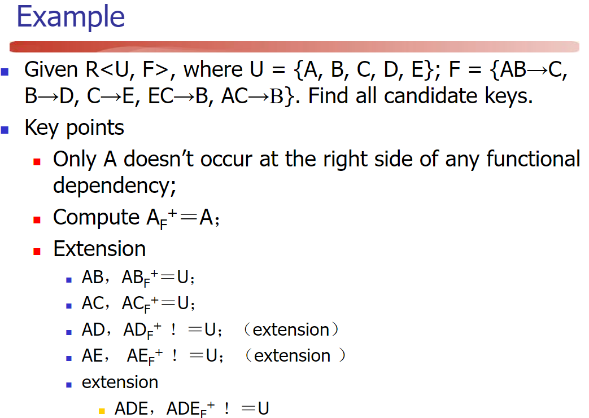

	

####  Proof of completeness

> Corollary : 任何$X\rightarrow Y$是$F^+$的成员的充分必要条件：$Y \subseteq X_F^+$

改为证明**逆否命题**：

***若函数依赖 X -> Y 不能由F出发从Armstrong公理导出，则它本身不为F所蕴含***

1. $V\rightarrow W, V \in X_F^+ \Rightarrow w \in X_F^+$

2. 构建如下图：

  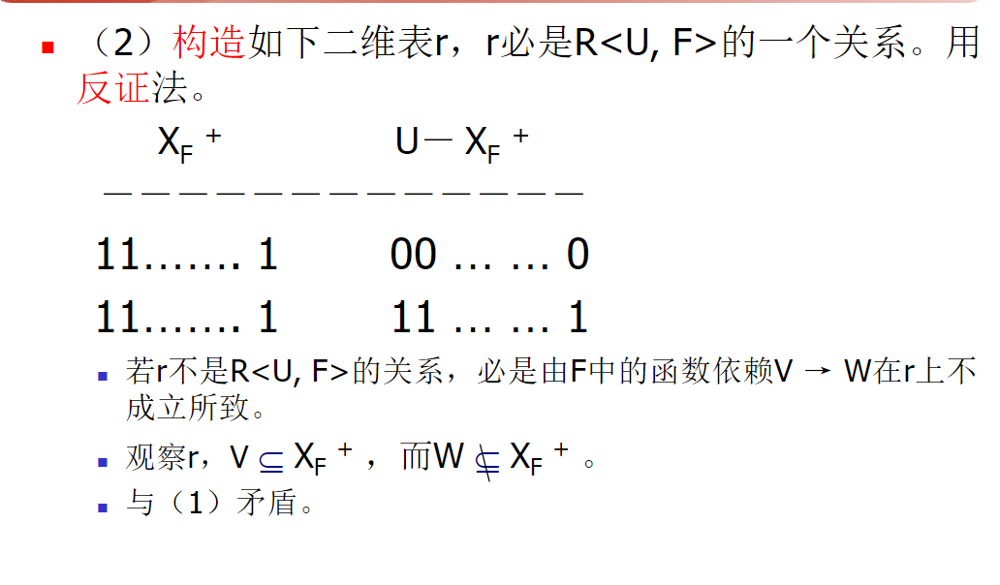

3. 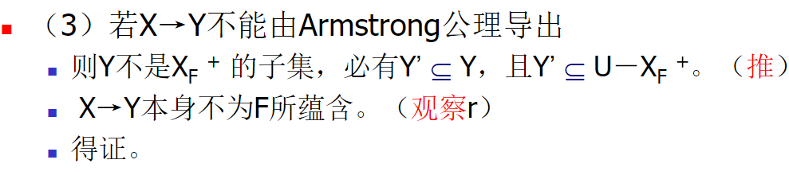

####  Canonical Cover 最小依赖集

>  右部唯一, 无多余函数依赖, 无部分函数依赖 表示为 $F_m$
>
> $F_m$ 不唯一 $F^+$唯一

Algorithm：

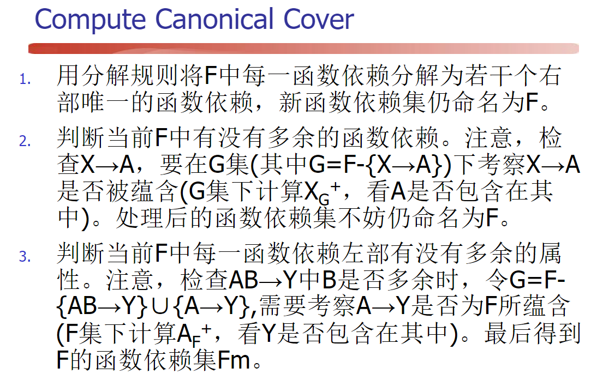

### 4.  Schema Decomposition 

 https://www.jianshu.com/p/63ca10d358de 

## Chapter 9  Relation Query Process and Query Optimization 

### 1.  Procedure of Query Process 

1.  Query analysis 
2.  Query check 
3.  Query optimization 
4.  Query execution 

####  Implementation of Join Operation 

-  Nested Loop Method
-  Merge Join
-  Index Join
-  Hash

### 2.  Query Optimization by RDBMS 

advantages:

- It is unnecessary for users to consider how to express query for the sake of efficiency
- The optimization by the system can do better than the user program

1. It is better to compose a join operation by combining Cartesian product with corresponding selection
2. Do selection as early as possible

### 3.  Algebra Optimization 

####  Equivalence Rules 

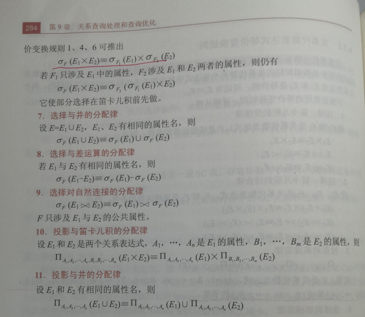

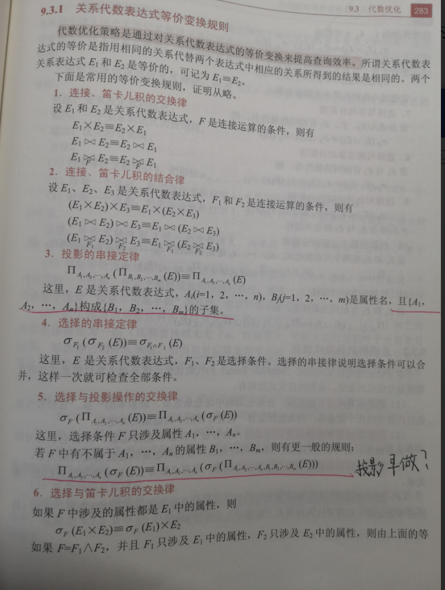

#### Steps

1. Deconstruct conjunctive selection operations into a sequence of individual selections
2. Do selection as early as possible  一次只能选一个
3. Do projection as early as possible 
4. Execute multiple selections and projections simutaneously
5. Group 

### 4.  Physical Optimization 

...

## Chapter 10 **Database Recovery**

**Transaction** processing includes ***database recovery*** and ***concurrency control***

### 1. Transaction Concept

The recovery is based on transaction.

**transaction**: a unit of program execution that accesses and possibly updates various data items

#### Transaction Concept

The transaction consists of all operations executed between the **begin transaction** and **end transaction**.

#### Properties of Transaction (ACID)

- Atomicity (原子性): 事务的操作要么都做，要么都不做
- Consistency (一致性)：事务必须从一个一致性状态到另外一个一致性状态
- Isolation (隔离性)：一个事务内部的操作及使用的数据对其它并发事务是隔离的，并发执行的各个事务之间不能互相干扰
- Durability (持续性)：一个事务一旦提交，它对数据库中的数据的改变就应该是永久性的，不能回滚

### 2. Database Recovery

An integral part of a database system is a **recovery scheme** that can restore the database to the consistent state that existed before the failure.

The recovery scheme must also provide **high availability**; that is, it must minimize the time for which the database is not usable after a failure

### 3. Failure Classification

1. **Transaction failure** (UNDO)
	- Logical error: because of some internal condition(bad input, overflow...)
	- System error: such as deadlock
	
2.  **System crash** (UNDO + REDO)

	硬件失效，或者数据库系统的Bug

	When the system restarts, ***UNDO all unfinished transactions***, and ***REDO all committed transactions.***

3. **Disk failure**

	Probability of disk failure is the smallest, while the effect is the worst.

4. **Virus or hacking attacks**

	Manmade failure or crash.

### 4. Recovery Techniques

The base of recovery —— **Redundancy**

#### Data Backup

performed by DBA regularly

- Static backup: no transaction is allowed during the execution
- Dynamic backup: do not block any DML or DDL operations
- Massive backup: backup all data
- incremental backup: just update the latest data

#### Log Record

Fields:

- Transaction identifier
- Data-item identifier
- Old value
- New value

Usage：

- Recovery from both transaction failure and system crash
- it is essential to create and add log records are necessary during executing dynamic backup
- For static backup, log records can be used for REDO

Create log records：

- Create and add according to the order of execution
- Whenever a transaction performs a write, it is essential that the log record for that write be created and added to the log, before the database is modified.

### 5. Recovery Strategies

UNDO; General strategy

1. Use database backup to reload the database
2. Scan (forward or backward) the logs to determine REDO or UNDO transactions

#### Recovery from Transaction Failure

performed by the system

The log is scanned backward, and for each log record of Ti of the form <Ti , Xj , V1, V2> that is found:

- 反向扫描日志文件，查找该事务的更新操作。
- 对该事务的更新操作执行反操作，即对已经插入的新记录进行删除操作，对己删除的记录进行插入操作，对修改的数据恢复旧值，用旧值代替新值。这样由后向前逐个扫描该事务已做的所有更新操作，并做同样处理，直到扫描到此事务的开始标记，事务故障恢复完毕为止。并写入  <Ti abort>

#### Recovery from System Crash

UNDO＋REDO ; performed by the system

1. Scan the logs forward. For each committed transaction, put it into the REDO queue. For each uncommitted transaction, put it into UNDO queue.
2. UNDO each transaction in the UNDO queue
3. REDO each transaction in the REDO queue.

#### Recovery from Disk Failure

Secondary backup ＋ REDO; Need the help from DBA

1. Load the latest secondary backup, so that the database is consistent with the status when executing the backup operation
2. Load the copy of logs. REDO transactions based on logs

### Recovery with Checkpoints

错误发生时,必须查询所有的日志以寻找出需要撤销或者重做的事务

这种方式存在两个主要的困难点:

- The search process is time-consuming.
- Most of the transactions need to be redone have already written their updates into the database. Although redoing them will cause no harm, it will nevertheless cause recovery to take longe

**A checkpoint is performed as follows:**

1. Output onto stable storage all log records currently residing in main memory.
2. Output to the disk all modified buffer blocks.
3. Output onto stable storage a log record of the form <checkpoint L>, where L is a list of transactions active at the time of the checkpoint.

Transactions are not allowed to perform any update actions, such as writing to a buffer block or writing a log record, while a checkpoint is in progress.

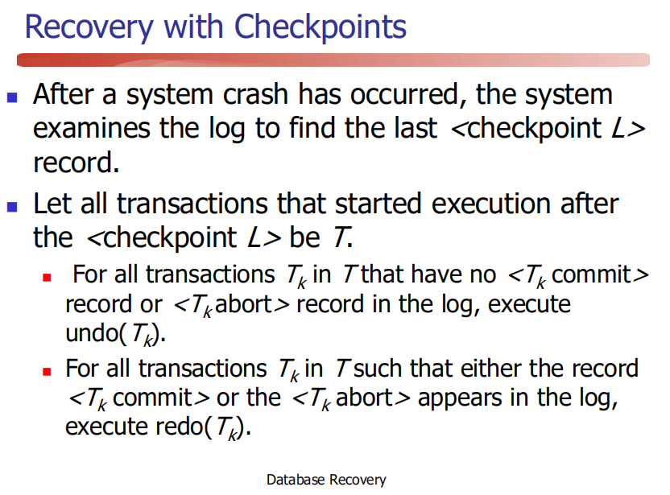

### 7. Database Mirrors

完整的拷贝一份一样的到另外一个磁盘中

在遇到磁盘崩溃时,可以采用数据镜像恢复

## Chapter 11 Concurrency Control

并发的场景

- Multiuser system
- Run multiple transactions in parallel or in serial

为什么需要并发

- Improved throughput and resource utilization
- Reduced waiting time

### 1. Overview of Concurrency Control

#### Inconsistency by concurrency control

- lost-update

- dirty read

	The transaction reads values written by another transaction that hasn’t committed yet

	事务T1将某一值修改，然后事务T2读取该值，此后T1因为某种原因撤销对该值的修改，这就导致了T2所读取到的数据是无效的

- non-repeatable read

	A transaction reads the same object twice during execution and finds a different value the second time, although the transaction has not changed the value in 
	the meantime.

	事务T1读取某一数据，事务T2读取并修改了该数据，T1为了对读取值进行检验而再次读取该数据，便得到了不同的结果。

- Phantom read(幻像读)

	不可重复读的集合版本,上为读一句,这里是执行查询语句

### 2. Locking

One way to ensure isolation is to require that data items be accessed in a ***mutually exclusive manner***(互斥)

使用锁实现互斥

#### Lock Modes

- Shared

	If a transaction Ti has obtained a ***shared-mode lock (denoted by S)*** on item Q, then Ti can read, but cannot write, Q.

- Exclusive

	 If a transaction Ti has obtained an ***exclusive-mode lock(denoted by X)*** on item Q, then Ti can both read and write Q.

#### Lock-compatibility matrix 

If a resource is already locked by another transaction, then a new lock request can be granted only if the mode of the requested lock is compatible with the mode of the existing lock.

Any number of transactions can hold shared locks on an item, but if any transaction holds an exclusive lock on item, no other transaction may hold any lock on the item.

|           | Shared | Exclusive |
| :-------: | :----: | --------- |
|  Shared   |  True  | False     |
| Exclusive | False  | False     |

### 3. Locking Protocol

**locking protocol**: indicating when a transaction may lock and unlock each of the data items.

#### Three-level locking protocol 

proposed to overcome the problems of lost-update,dirty read and non-repeatable read.

1. Level-One
	- 一个事务更新数据时,须获取X锁,直到事务结束(Commit & ROLLBACK)
	- 避免丢失修改的问题,事务能够被恢复
	- 事务需要读取数据时不需要锁(不能避免脏读和不可重复读）
2. Level-Two
	- 在等级1的基础上,事务还要获取S锁在需要读取数据的时候直到结束读
	- 在1的基础上避免了脏读
3. Level-Three
	- 在1 的基础上,事务必须获取S锁在需要读取数据时直到结束事务
	- 消除了丢失修改,脏读,不可重复读

#### Isolation Level

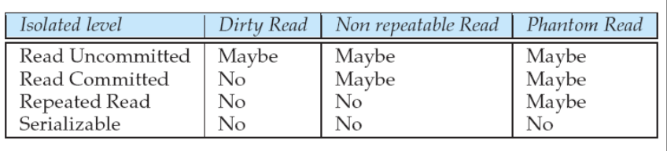

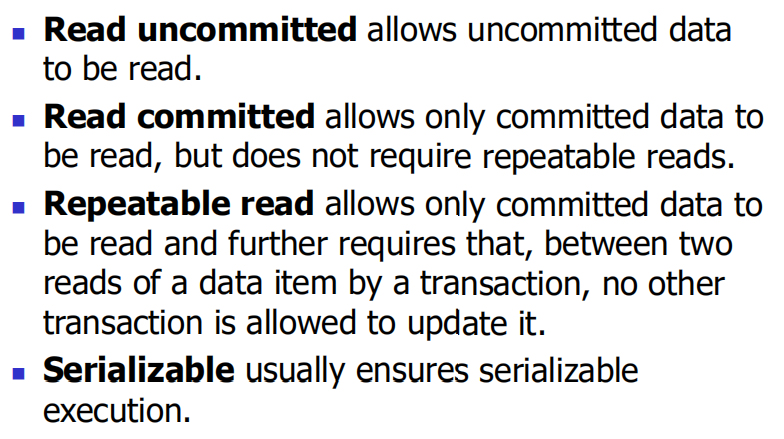

#### Starved & Deadlock

locking can lead to an undesirable situation

**Starved** :

T2 在一数据上有S锁,T2请求X锁,T3请求S锁. T3和T2是兼容的,那么T1 就要等到T3结束才能获取锁

解决方案: First Come First Serve

**Deadlock**:

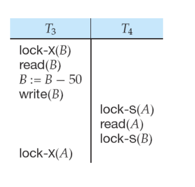

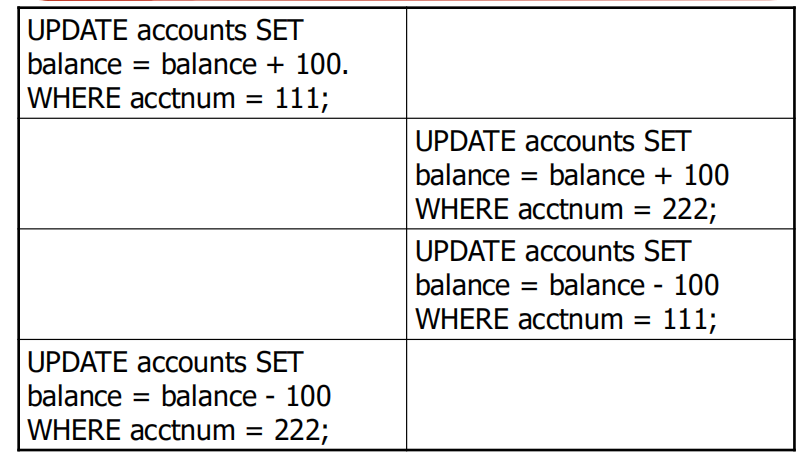

#### Deadlock Handling

1. **Deadlock Prevention**

	- Ensure that the system will never enter a deadlock state

	- Destroy the conditions of deadlock

	- methods

		- requiring all locks together (一次封锁)
			- 开始事务前获取所有的锁
			- 缺点: 1. 预测困难 2. 数据项使用率可能低
		- requiring locks in a sequence (顺序封锁)
			- 强制对所有数据项进行排序，并要求事务只按照与排序一致的顺序锁定数据项。
			- 锁请求可能是动态的
			- 预测依旧困难

		- Alternatively, DBMS can allow the system to enter a deadlock state, and then try to recover by using a deadlock detection and deadlock recovery scheme

2. **Deadlock detection and deadlock recovery**

	- lock timeouts (超时法)

		给事务加一个时间,在改时间结束时,如果该事务还没有被授予锁,就回滚并重开始

	- wait-for graph (等待图法)
	
		由一个G（V，E）构成, 结点是事务 Ti->Tj表示Ti等待Tj释放一个锁
	
		如果存在环 则存在死锁，存在死锁，回滚最低开销的事务

### 4. Serializability

https://blog.csdn.net/lee18254290736/article/details/79531550

https://blog.csdn.net/gqqnb/article/details/6313277

**如果一个调度的结果与某一串行调度执行的结果等价，则称该调度是可串行化调度，否则是不可串调度。**

如果调度中一对连续操作是冲突的，则意味着如果它们的执行顺序交换，则至少i改变其中一个事务的最终执行结果。

如果两个连续操作不冲突，则可以在调度中交换顺序。

**一个调度S在保证冲突操作的次序不变的情况下，通过交换两个事务不冲突操作的次序得到另一个调度S’，如果S’是串行的，称调度S为冲突可串行化（Conflict Serializability）的调度。**(不能调换冲突指令的顺序)

**如果一个调度满足冲突可串行，则该调度是可串行化调度**。但可串行化调度不一定满足冲突可串行。冲突可串行为可串行的充分条件。

### 5. Two-phase Locking (2PL)

The main method for concurrency control.

1. **Growing phase**. A transaction may obtain locks, but may not release any lock.

2. **Shrinking phase**. A transaction may release locks, but may not obtain any new locks.

**The two-phase locking protocol ensures conflict serializability.**

- The method of requiring all locks together is under 2PL
- 2PL doesn’t require all locks together. Thus, **2PL does NOT ensure freedom from deadlock.**并不保证没有死锁

Two-phase locking protocol is used to guarantee the **serializability** of concurrent execution.

**概念**

**两段锁协议是指所有事务必须分两个阶段对数据项加锁和解锁：**

1. 在对任何数据进行读、写操作之前，要申请并获得对该数据的封锁。

2. 每个事务中，所有的封锁请求先于所有的解锁请求。

### 6. Multiple-granularity locking scheme 多粒度封锁协议

####  Granularity

Define multiple levels of **granularity**.

#### Granularity hierarchy

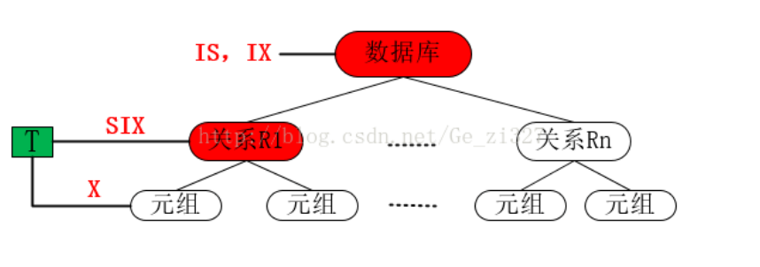

#### explicit lock

Locks on some data items by the requirements from transactions

#### implicit lock

该结点的所有子节点都含有此节点的锁

#### Intention Lock Modes

https://www.jianshu.com/p/325a492a859b

意向锁的含义是如果对一个结点加意向锁，则说明该结点的下层结点正在被加锁；对任一结点加锁时，必须先对它的上层结点加意向锁。

引进意向锁是为了提高封锁子系统的效率。该封锁子系统支持多种封锁粒度

- **intention-shared (IS) mode**
- **intention-exclusive (IX) mode**
- **shared and intention-exclusive (SIX) mode** SIX = S + IX

**Compatibility Matrix**：

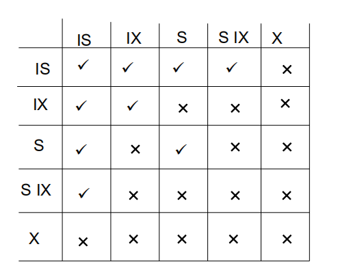

#### Supplement: Multiversion Concurrency Control (MVCC, 多版本并发控制)

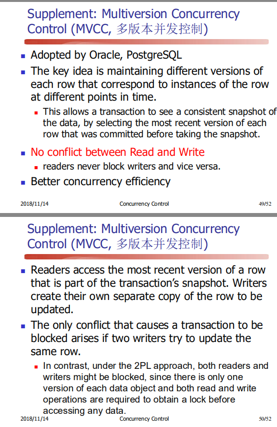