# 操作系统精髓与设计原理 第8版 阅读笔记

> 2020-2-27 Joke-Lin
>
> [个人博客查看（Github不支持Markdown数学公式）](https://joke-lin.top/os/tutorial%20&%20note/2020/02/28/Operating-System-Internals-and-Design-Principles-8th-Note/)

操作系统是管理计算机硬件与软件资源的系统软件，同时也是计算机系统的内核与基石。操作系统需要处理如管理与配置内存、决定系统资源供需的优先次序、控制输入与输出设备、操作网络与管理文件系统等基本事务。操作系统也提供一个让用户与系统交互的操作界面。—— 维基百科

> 前几章为引言部分 略

##  第二部分 进程


### 第三章 进程描述和控制

--------------------------------------------------

#### 1. 进程的几个定义

- 一个正在执行的**程序**
- 一个正在**计算机**上执行的程序实例
- 能分配给**处理器**并由处理器执行的实体
- 由一组执行的**指令**，一个**当前状态**和一组相关的**系统资源**表征的活动单元

#### 2. 基本元素

程序代码 + 数据集

#### 3. 进程控制块 （PCB）

- 标识符
- 状态：新建，运行，就绪，挂起，阻塞，退出
- 优先级
- 程序计数器： 保存下一条指令的地址
- 内存指针：代码 / 数据 / 其它进程的指针
- 上下文数据：处理器执行时寄存器里的值
- I/O 状态信息：I/O 请求； I/O 设备； 文件列表
- 记账信息：处理器时间，记账号

#### 4. 进程状态

**轨迹**：进程执行的指令序列

##### 两状态模型

非运行态 $\Leftrightarrow$ 运行态

##### 五状态模型

- 运行态：进程正在执行，假设为一个计算机，那么一次最多只有一个进程处于此状态
- 就绪态：进程做好了准备，随时可以处于运行态
- 阻塞态：在发生某些事件前不能执行，如I/O
- 新建态：已创建PCB但还未加载到内存中的进程
- 退出态：操作系统从可执行进程组释放出的进程

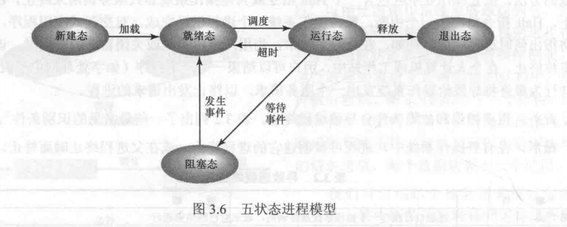

#### 5. 进程的挂起

**原因**：当所有进程都处于阻塞态时，处理器处于休闲状态。此时将某个进程的一部分或者全部移入磁盘，然后从挂起队列加载一个新进程，放入内存中运行

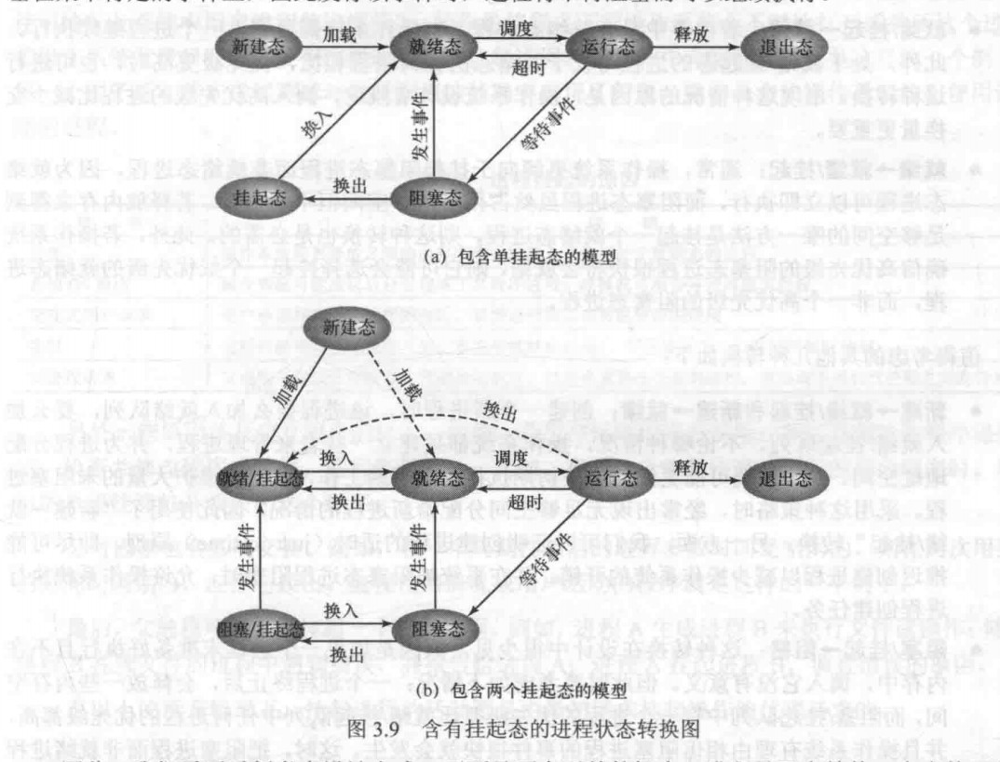

##### 进程挂起的原因

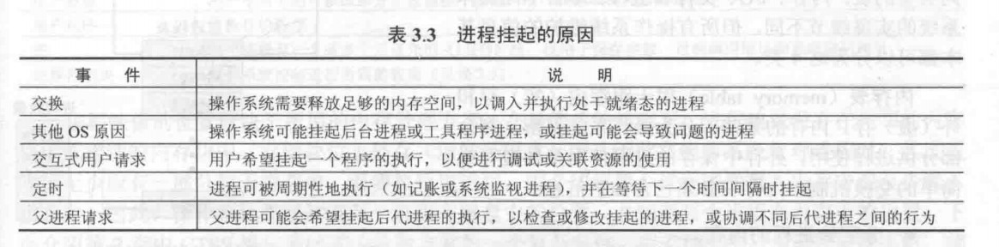

#### 6. 进程创建和终止

- 进程创建的原因：

	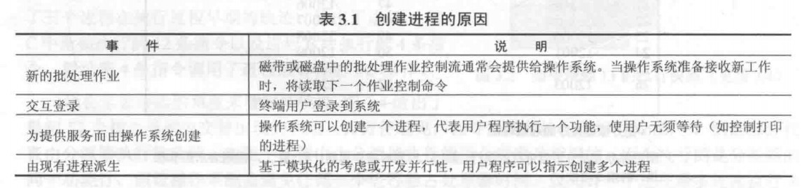

- 进程终止的原因：

	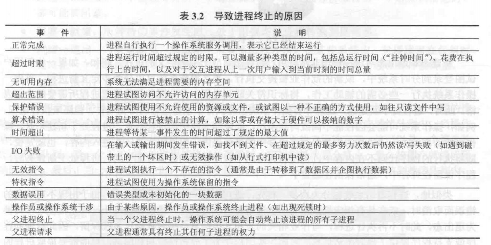

#### 7. 操作系统控制结构

- 内存表：跟踪内存和外（虚）存（交换机制）
	- 分配给进程的内存
	- 分配给进程的外存
	- 内存块或虚存块的任何保护属性
	- 管理虚存所需要的任何信息
- I/O 表：管理I/O 设备和通道
- 文件表：文件管理：是否存在，位置等信息
- 进程表：内存，I/O， 文件是代表进程而被管理的 

#### 8. 进程控制结构

进程映像：程序 + 数据 + 栈 + 属性

##### PCB 进程控制块

- 进程标识信息：存储在PCB中的数字标识符,包括: 进程ID，父进程ID，用户ID

- 进程状态信息（处理器状态信息）：存储所有的程序状态字（PSW）
- 进程控制信息：操作系统协调各种活动进程的额外信息

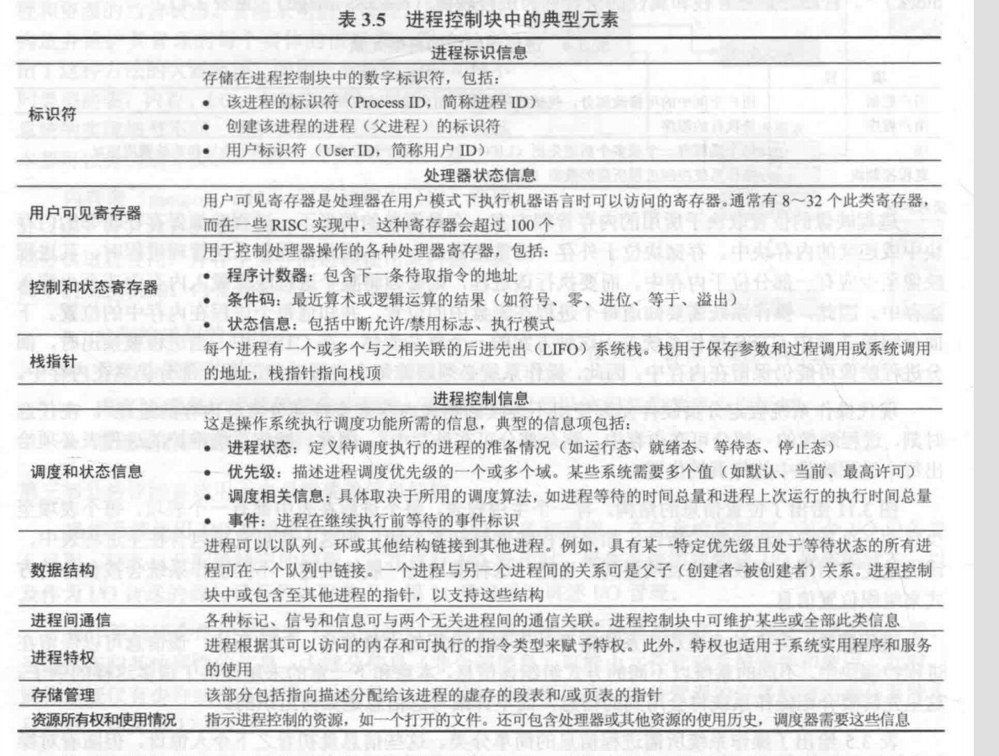

##### PCB 的作用

> PCB 是操作系统中最重要的数据结构，包含操作系统所需进程的全部信息
>
> PCB 集合定义了OS的状态

如何在发生错误和变化时，保护PCB，具体表现为两个问题：

- 一个例程（如中断处理程序）中的错误可能会破坏进程控制块，进而破坏系统对受影响进程的管理能力
- 进程控制块结构或语义中的设计变化可能会影响到操作系统中的许多模块

#### 9. 进程控制

##### 执行模式

特权模式称为系统模式，控制模式或者**内核模式**，非特权模式又称为用户模式

**原因**：保护操作系统和重要的操作系统表 不受用户程序的干扰

**ELSE**：PCB 中有指示执行模式的位，因事件变化而变化，当用户调用OS服务或中断触发系统例程时，执行模式变为内核模式，返回到用户进程时变为用户模式

##### 内核的典型功能

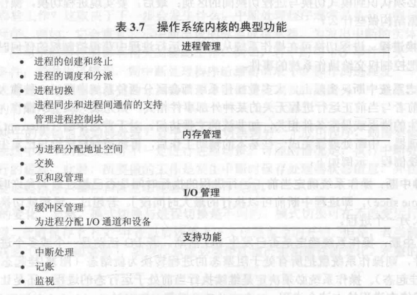

#### 10. 进程创建 具体过程

1. 为新进程分配一个唯一的进程标识符
2. 为进程分配空间
3. 初始化PCB
4. 设置正确的链接：放入新建/就绪挂起 链表中
5. 创建或扩充其他数据结构：记账文件

#### 11. 进程切换

##### 何时切换进程

> 可在OS从当前正在运行的进程获得控制器的任何时刻发生

- 系统中断： 时钟中断（超过运行时间片）；I/O 中断；内存失效
- 陷阱：处理一个错误和一个异常条件
- 系统调用：显示请求，调用操作系统函数

##### 模式切换

出现中断时，处理器将：

- 将从程序计数器置为中断处理程序的开始地址
- 从用户模式切换到内核模式，以便中断处理代码包含特权指令
- 保存已中断例程的上下文

##### 进程切换

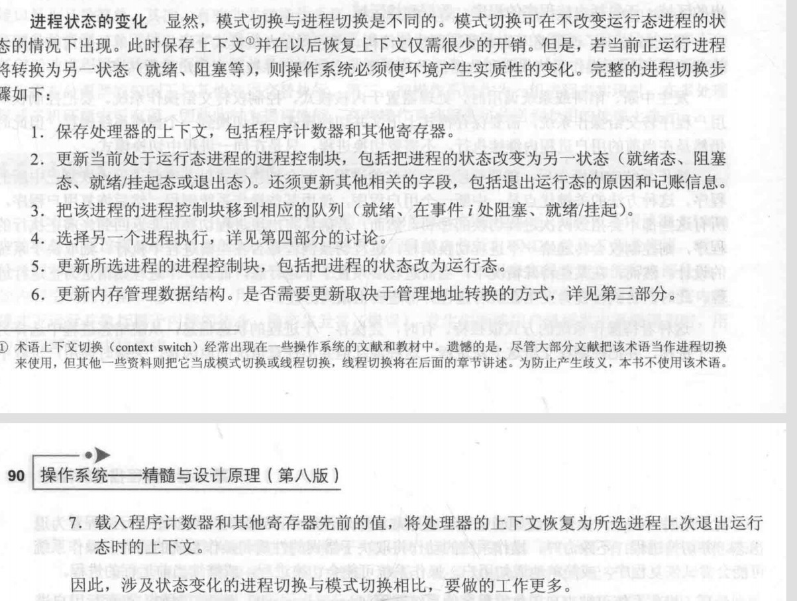

#### 12. 操作系统的执行

> 第二章指出操作系统的两个特殊事实：
>
> - OS 和普通软件以相同的方式运行，也是一个程序
> - OS 会频繁的释放控制权，并依赖于处理器来恢复控制权

##### 无进程内核

在所有进程外部执行操作系统内核，进程概念只适用于用户程序，操作系统则是则是在特权模式下单独运行的实体

##### 在用户进程内运行

操作系统是用户调用的一组例程，在用户进程的环境中执行并实现各种功能。进程映像不仅包括自己的程序，数据，栈还包括**内核程序**的程序，数据，和栈区域。操作系统代码和数据位于共享地址空间中，并被所有用户进程所共享。只需要在同一进程中切换模式，而不需要切换进程

##### 基于进程的操作系统

把操作系统作为一组系统进程来实现

优点：

1. 鼓励模块化操作系统设计原理，使模块间接口最小且最简单 
2. 有些非关键系统功能可简单的用独立的进程来实现（例如监视各种资源和状态的程序）
3. 在多处理器和多机环境中很有用

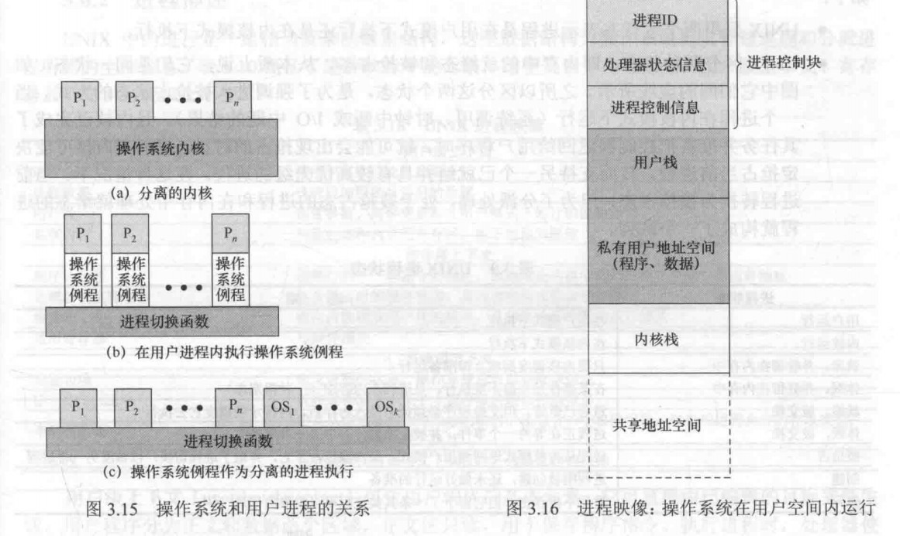

### 第四章 线程

--------------------------------------------------

#### 1. 进程和线程

##### 进程特点

- 资源所有权：进程包括存放进程映像的虚拟地址空间
- 调度/执行：进程具有执行态和优先级，是可被OS调度和执行的实体

> 这两个特点是独立的，为了区分这两个特点，通常将分派的单位称为线程（轻量级进程LWP）
>
> 而将资源所有权的单位称为进程（任务）

##### 多线程

> 指OS在单个进程内支持多个并发执行路径的能力

在多线程环境中，进程定义为资源分配单元和一个保护单元，与进程相关联的有：

- 容纳进程映像的虚拟地址空间
- 对处理器，其他进程，文件，I/O 的受保护访问

每个线程都有：

- 一个线程的执行状态
- 线程上下文，线程可视为进程内运行的一个独立程序计数器
- 一个执行栈
- 局部变量的静态存储空间
- 与其他线程共享的内存和资源的访问

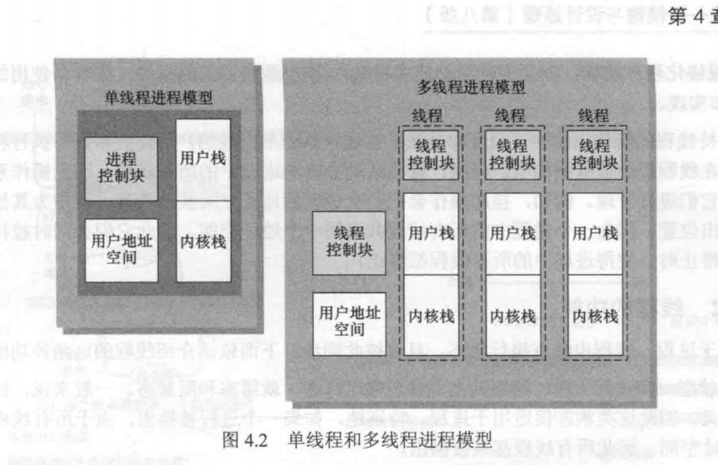

使用线程的几个例子：

- 前台和后台工作
- 异步处理
- 执行速度
- 模块化程序结构

**线程的优点**

> **Why**: 因为线程共享一个地址，内存，文件空间，ULT中不用切换到内核

- 创建线程的时间少于创建进程的时间
- 终止线程的时间少于终止进程的时间
- 同一个内线程切换时间少于进程间切换的时间
- 线程提高了不同执行程序间通信的效率

##### 线程的功能

线程状态：就绪态，运行态，阻塞态

基本操作：派生，阻塞，解除阻塞，结束

线程同步：同步线程的活动是它们互不干扰且不破坏数据结构，如两个线程向一个链表加入元素，则可能会丢失

#### 2. 线程分类

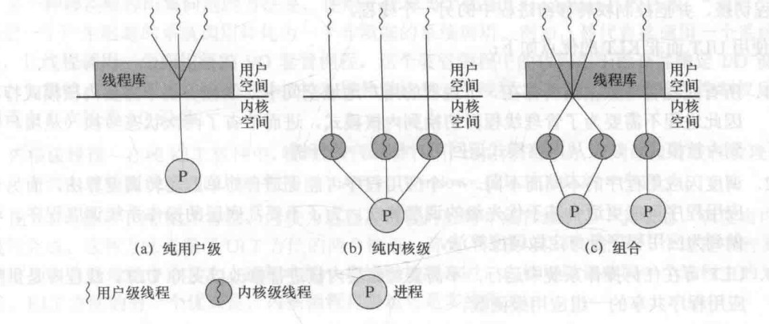

##### 用户级（ULT）

管理线程的所有工作都由应用程序完成，内核意识不到线程的存在。任何应用程序都可以设计成多线程程序。线程库提供了所有关于线程的操作

**ULT相较于KLT的优点**：

- 所有线程都在一个进程的用户地址空间中，线程切换不需要内核模式特权，因此不需要切换到内核状态，节省了两次状态转换
- 调度因程序的不同而不同
- ULT 可以在任何操作系统中运行

**ULT相较于KLT的缺点**：

- ULT 执行一个系统调用的话，不仅阻塞当前线程，也会阻塞进程内的所有线程
- 多线程应用程序不能利用多处理技术，这里线程对操作系统是不可见的，内核一次把一个进程分配给处理器，这样一个进程内只能运行一次一个线程，相当于在一个进程内实现了多道程序设计

##### 内核级线程（KLT）

管理线程的所有操作由内核完成，应用级只有一个到内核线程实施的应用编程接口（API）

**KLT 的优点：**

- 内核可以把进程中的多个线程调度到多个处理器中
- 进程的一个线程阻塞时，不影响其他线程的调度
- 内核例程也可以是多线程的

**KLT 的缺点：**

- 线程转换时 需要切换到内核状态

##### 混合

> 结合两者优点

#### 3、多核和多线程

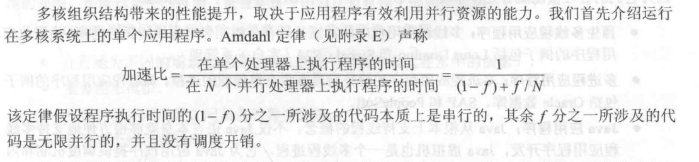                                      

> 并不是核越多越好，管理起来越麻烦，会有更多多余的开销

**影响多核系统上软件性能的因素**

- 核的数量
- 串行代码比例
- 多处理器任务调度和通信以及高速缓存一致性带来的额外开销

### 第五章 并发性：互斥和同步

---------------------------------------------------------------------------

操作系统的核心问题是进程和线程的管理：

- 多道程序设计技术：管理单处理器中的多个进程
- 多处理器技术：管理多处理器中的多个进程
- 分布式处理器技术：管理多台分布式计算机中多个进程的执行（集群）

***并发是所有问题的基础，也是操作系统设计的基础（设计问题：进程通信，资源共享和竞争）***

出现的环境：

- 多应用程序：程序间动态共享处理器时间
- 结构化应用程序：。。。
- 操作系统结构：。。。

#### 1、并发的原理

##### 并发处理的问题（难点)

- 全局资源的共享充满了危险
- OS很难对资源进行最优化分配
- 定位程序设计错误非常困难               

```c
zvoid echo() {
    chin = getchar();
    chout = chin;
    putchar(chout);
}
```

这个打印字符的程序很容易发生数据的丢失，出现这种问题的原因是中断可能在进程的任何地方发生，解决方案是控制对共享资源的访问

##### 竞争条件

竞争条件发生在多个进程或线程读写数据时，其最终结果取决于进程的指令执行顺序

##### 进程的交互

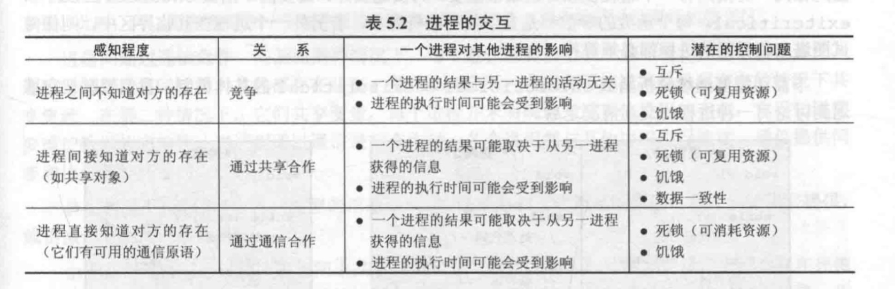

有几个基本概念：

***临界资源*** ：就是上面谈到的一个不可分享的资源

***临界区***：使用这一部分资源的程序称为程序的临界区

***死锁***：两个进程互相控制两个资源，但又还需要对方持有的资源才可以继续工作，这样就产生了死锁（两个进程都不能继续工作）

***饥饿***：有三个进程ABC，每个进程都需要访问资源R，资源被AC交替访问，却始终没有分配给B这样B就处于饥饿状态

##### 互斥的要求

> 互斥：简单来说，就是两个或多个进程需要访问一个不可分享的资源的保护机制

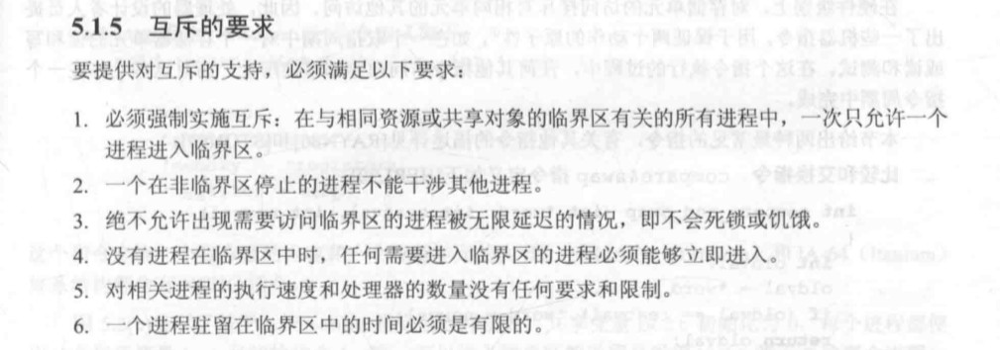

#### 2、互斥：硬件的支持

##### 中断禁用

```c
while(true) {
    /* 禁用中断 */
    /* 临界区 */
    /* 启用中断 */
    /* 其余部分 */
}
```

临界区不能被中断，所以可以保证互斥，为了保证互斥只需要保证一个进程在访问资源的时候不被中断。

但是，这种方法的代价非常高。由于处理器被限制得只能交替执行程序，因此执行的效率会明显降低。而且它不能用于多处理器体系结构。当一个计算机系统含有多个处理器时，通常可能有多个进程同时执行。这种情况下，中断不能保证互斥。因为在多处理器配置中，***几个处理器对内存的访问不存在主从关系，处理器之间的行为是无关的，表现出一种对等的关系，处理器之间没有支持互斥的中断机制。***

##### 专用机器指令

在硬件级别上，对存储单元的访问排斥对相同单元的其他访问，因此处理器的设计人员提出了一些机器指令，用与保证两个动作的原子性（不能被中断的指令），**在这个指令执行的过程中，任何其他指令访问内存都将被总之，而且这些动作在一个指令周期中完成**

- **比较和交换指令：**

定义如下：

```c
int compare_and_swap(int *word, int testval, int newval)
{
    int oldval;
    oldval = *word;
    if(oldval == testval) *word = newval;
    return oldval;
}
```

使用一个测试值检查一个内存单元，如果内存单元的当前值是`testval`，就使用`newval`取代该值，否则保持不变，并返回旧内存值。因此如果返回值和测试值相同，表示内存单元已经被更新，整个过程按原子操作执行，不接受中断。这个过程的另一个版本为返回`bool`值，判断是否完成交换

- **exchange指令**

定义如下：

```c
void exchange(int *register, int *memory)
{
    int temp;
    temp = *memory;
    *memory = *register;
    *register = temp;
}
```

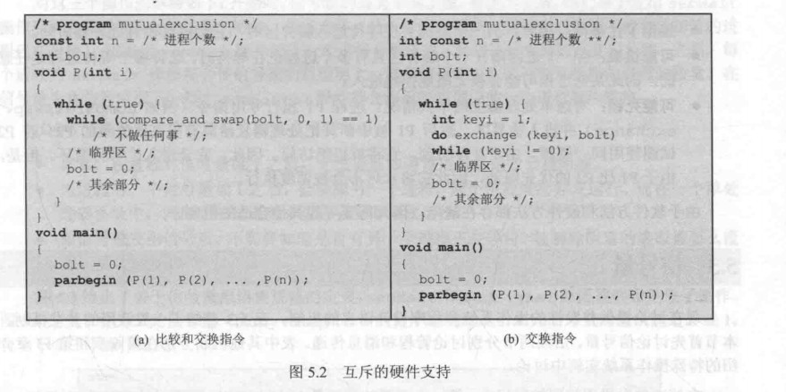

**忙等待（自旋等待）**：进程在得到临界区访问权之前，它只能继续执行测试变量的指令来得到访问权，除此之外不能做任何事情

对于上图 **a** ,唯一可以进入临界区的进程是发现bolt为0的那个进程，并把bolt置为1在它访问临界区的时候，此时其他的进程都处于忙等待中，访问结束后继续讲bolt置为0，此时下一个可以进入临界区的进程就是在这之后最早执行`compare&swap`指令的进程

对于上图**b** ,工作原理和 **a** 几乎一致。由于变量初始化的方式和交换算法的本质，下面的表达式恒成立：

$$ bolt + \sum_ikey_i = n $$

若`bolt = 0`，则没有任何一个进程在他的临界区中，若`bolt = 1`，则只有一个进程在临界区中，且为 ***key为 0*** 的那个进程

##### 机器指令方法的特点

有如下的优点：

- 适用于单处理器或共享内存的多处理器上的任意数量的进程
- 简单且易于证明
- 可以用支持多个临界区，每个临界区可以用它自己的变量定义

但也有一些严重的缺点：

- 使用了忙等待：在一个进程在等待进入临界区时，它依然在消耗处理器时间
- 可能饥饿：选择哪个等待进程时任意的，因此有些进程会被无限拒绝进入
- 可能死锁：考虑单处理器下的情况：进程P1执行专用指令（上面的两个）并进入临界区，然后P1被中断并交给更高优先级的P2执行，P2由于互斥机制讲被拒绝访问，但是由于P1优先级低，它也永远不会被调度执行

#### 3、信号量

> <https://www.cnblogs.com/jhcelue/p/7080146.html>

讨论的是提供并发性的操作系统和设计语言的机制

常用的并发机制：

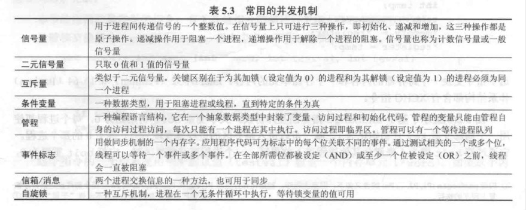

基本原理如下：

两个或多个进程可以通过简单的信号进行合作。强迫一个进程在某个位置停止，知道它接受到一个特定的信号，其中使用了一个称为**信号量**的特殊变量。通过信号量 s 传送信号，进程须执行原语`semSignal(s)`;要通过信号量 s接受信号需要执行原语`semWait(s) `;若相应信号未发送则阻塞进程，知道发送完为止

为达到预期效果，可把信号量视为一个值为整数的变量，定义了三个操作：

- 一个信号量可以初始化为非负数
- `semWait` 使信号量减1，若值变成负数，则阻塞执行`semWait`的进程，否则继续执行
- `semSignal`操作使信号量加1，若值小于等于0，则被`semWait`操作阻塞的进程解除阻塞

信号量为正数时代表发出`semWait`后可以继续执行的进程数量，信号量为负数时，每个`semSignal`操作都会将等待进程中的一个进程接触阻塞

对于信号量有三个重要结论：

- 通常，在进程对信号量-1之前，无法提前知道该信号量是否会被阻塞
- 当进程对信号量+1后，会唤醒另一个进程，两个进程继续并发运行。而在一个单处理器系统中，无法知道哪一个进程会继续运行
- 向信号量发出信号后，不需要知道是否有另外一个进程在等待，被接触的进程数要么没有，要么为1

信号量原语的定义：

```c
struct semaphore {
    int count;
    queueType queue;
}
void semWait(semaphore s)
{
    s.count--;
    if (s.count < 0) {
        // 把当前进程插入队列
        // 阻塞当前进程
	}
}
void semSignal(semaphore s) 
{
    s.count++;
    if (s.count <= 0) {
        // 把进程P从队列移除
        // 把进程P插入就绪队列
	}
}
```

二元信号量的定义：

```c
struct binary_semaphore {
    enum {zero, one} value;
    queueType queue;
}
void semWaitB(binary_semaphore) 
{
    if(s.value == one) s.value = zero;
    else {
        // 插入阻塞队列
	}
}
void semSignalB(semaphore s)
{
    if(s.queue is empty()) s.value = one;
    else {
        // 将进程P解除阻塞
	}
}
```

> 理论上二元信号量更易于实现，且可以证明与普通信号具有同样的表达能力，非二元信号量也称作**计数信号量**或**一般信号量**

与二元信号量有关的还有***互斥锁（Mutex）***。互斥是一个编程标志位，用来获取和释放一个对象。可以对一个资源进行**加锁**和**解锁**操作，即为置0和置1，可以由互斥量和二元信号量实现，二者区别在于，**互斥量解锁和加锁的进程必须是同一个进程，二元信号量进行加锁操作，而由另一个进程解锁**

- 强信号量：进程按照FIFO策略将进程从队列溢移除的信号量
- 弱信号量：没有规定队列移除顺序的信号量

可以理解强信号量不会导致饥饿，而弱信号量可能导致饥饿

**信号量机制示例**

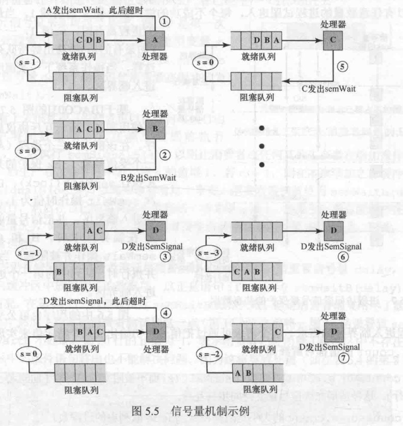

##### 互斥

使用信号量的互斥：

```c
const int n = /*进程数*/;
semaphore s = 1;
void P(int i)
{
    while(true) {
        semWait(s);
        //临界区
        semSignal(s);
        //Else
	}
}
void main() {
    parbegin(P(1), P(2), ..., P(n));
}
```

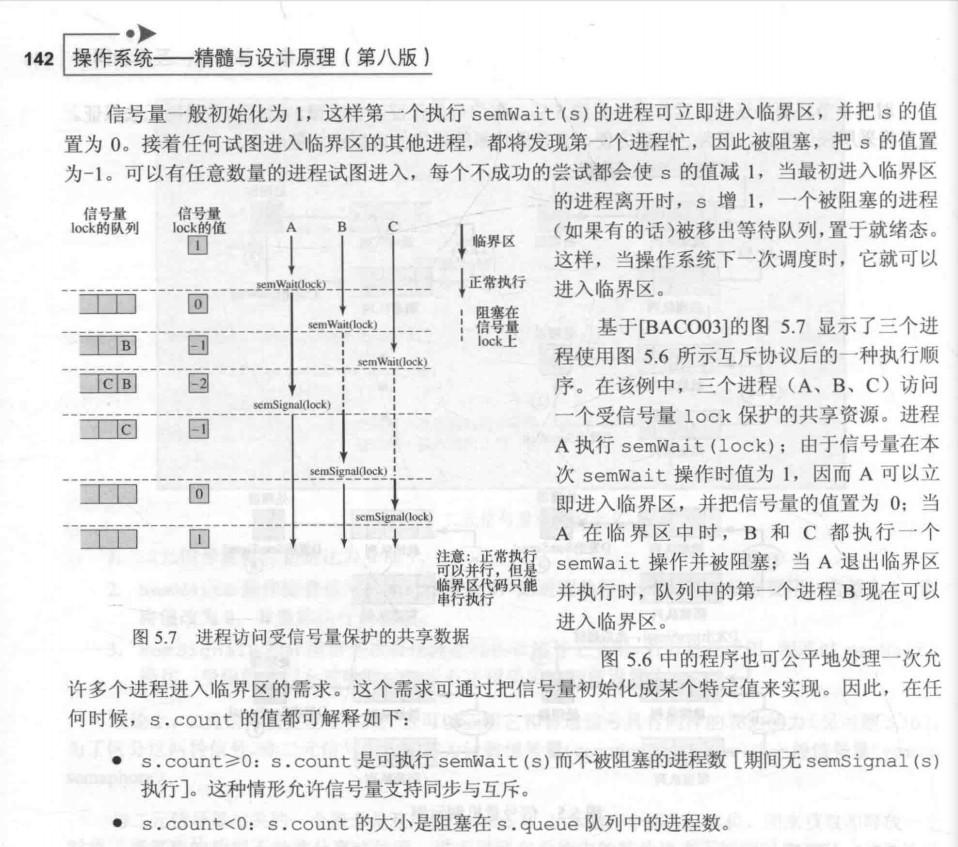

##### 生产者消费者问题

***问题描述***：有一个或多个生产者生产某种类型的数据，并防止在缓冲区中；有一个消费者从缓冲区中取数据，每次取一项，任何时候只有一个主体访问缓冲区。问题是要确保：当缓存已满时，生产者不会继续向其中添加数据，当缓存为空时，消费者不会从中移走数据

首先假设缓冲区是无限的，且是一个线性数组，可以使用二元信号量和计数信号量实现

**二元信号量错误的方法**：

```c
int n;	// 缓冲区剩余生产量
// delay：用于解决空的时候消费者不移走数据
// s：用于互斥,控制资源访问
binary_semaphore s = 1, delay = 0;
void producer() {
    while(true) {
        produce();
        semWait(S);
        append(); // 正式将数据加入缓冲区
        n++;
        // 告诉消费者缓冲区已经有数据了
        if (n == 1) semSignal(delay);
        semSignal(S);
	}
}
void consumer() {
    semWait(delay);
    while(true) {
        semWiat(s);
        take();
        n--;
        semSignal(s);
        consume();
        // 消费完之后阻塞当前进程 因为在此循环中delay不会为1
        if (n == 0) semWait(delay);
	}
}
void main() {
    n = 0;
    parbegin(producer,consumer);	//创建线程/进程
}
```

为什么是错误的，可能造成消费完之后继续取

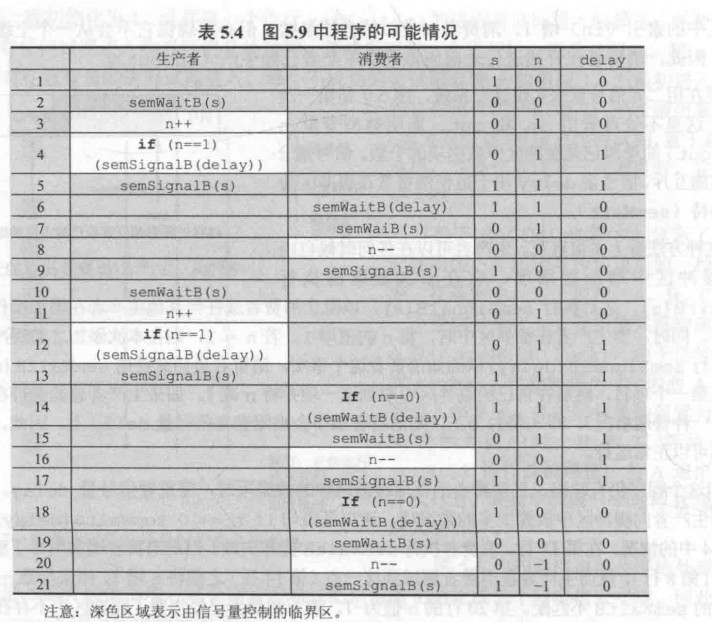

也就是在消费者消费之后已经不属于互斥资源保护区，发生中断之后不能保护原有变量的值，正如上图第10行，本来应该阻塞消费者进程，但是由于中断使n++，并且有重新将delay置1，而后恢复消费者进程消费完缓冲区之后delay信号仍然为1所以，此时缓冲区为空但是并不会阻塞进程，所以还会继续从已经为空的缓冲区拿东西（也就是delay信号并不能匹配了）

**二元信号量正确的方法**：

```c
int n;	// 缓冲区剩余生产量
// delay：用于解决空的时候消费者不移走数据
// s：用于互斥,控制资源访问
binary_semaphore s = 1, delay = 0;
void producer() {
    while(true) {
        produce();
        semWait(S);
        append(); // 正式将数据加入缓冲区
        n++;
        // 告诉消费者缓冲区已经有数据了
        if (n == 1) semSignal(delay);
        semSignal(S);
	}
}
void consumer() {
    int m;
    semWait(delay);
    while(true) {
        semWiat(s);
        take();
        n--;
        // 保护变量m这样就不怕之前的n被修改
        m = n;
        semSignal(s);
        consume();
        // 消费完之后阻塞当前进程 因为在此循环中delay不会为1
        if (m == 0) semWait(delay);
	}
}
void main() {
    n = 0;
    parbegin(producer,consumer);	//创建线程/进程
}
```

使用一般信号量（计数信号量），可得到一种更好的解决方法，如下

```c
semephore n = 0, s = 1;
void producer() {
    while(true) {
        produce();
        semWiat(s);
        append();
        semSignal(s);
        semSignal(n);
	}
}
void consumer() {
    while(true) {
        semWiat(n);
        semWait(s);
        take();
        semSignal(s);
        consume();
	}
}
void main()....
```

如果是有限缓冲区的话，只需要对缓冲区大小也设置信号量保护即可

```c
const int sizeofBuffer = //缓冲区大小
semephore n = 0, s = 1, e = size
void producer() {
    while(true) {
        produce();
        semwait(e);	// e表示缓冲区中空的个数
        semWiat(s);
        append();
        semSignal(s);
        semSignal(n);
	}
}
void consumer() {
    while(true) {
        semWiat(n);
        semWait(s);
        take();
        semSignal(s);
        semSignal(e);	// 已经消耗一个 有空位了
        consume();
	}
}
void main()....
```

##### 信号量的实现

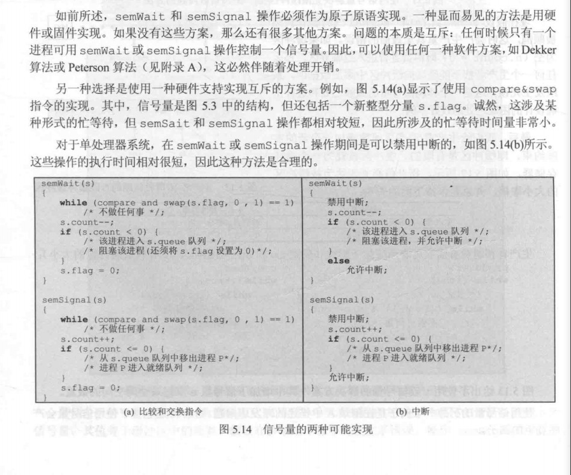

#### 4、管程

> 管程是一种程序设计语言结构（C/C++语言没有JAVA支持）
>
> 它提供的功能与信号量相同但是更易于控制

##### 管程的特点

1. 局部数据变量只能被管程的过程访问，任何外部过程都不能访问
2. 一个进程通过调用管程的一个过程进入管程
3. 在任何时候，只能有一个进程在管程中执行，调用管程的任何其他进程都被阻塞以等待管程可用

##### 函数

管程通过使用**条件变量**来支持同步，这些条件变量包含在管程中，并且只有在管程中才能被访问

有两个函数可以操作条件变量：

- cwait(c): 使当前进程阻塞在条件c上
- csignal(c): 使阻塞在c条件上的一个进程就绪

##### 管程的结构

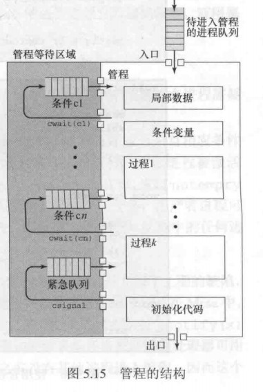

##### 例子：重写消费者生产者问题

> 暂略

这个例子表明，与信号量相比，管程担负的责任不同。对于管程，它有自己的互斥机制：两个进程不能同时访问缓冲区，但是***cwait csignal*** 原语的位置需要注意。管程优于信号量之处在于，所有的同步机制都被限制在管程内部，因此不但易于验证同步的正确性，而且易于检测出错误。此外若一个管程被正确的编写，则所有进程对受保护资源的访问都是正确的，而对于信号量，只有当所有资源的进程都被正确编写时，资源访问才是正确的。

##### 管程的通知和广播

上述方法有两个缺陷

- 产生 `csignal` 的进程在管程内还未结束，则需要两次额外的进程切换：阻塞进程需要一次切换，管程可用时又需要一次切换
- 与信号有关的进程调度必须非常可靠

在新的管程规则（Mesa）中，`csignal`原语被`cnotify`代替，

`cnotify`可以解释如下：当一个正在管程中的进程执行`cnotify(x)`中，会使得x 条件队列得到通知，但发信号的进程还在继续执行。但是由于不能保证在他之前没有其他进程进入管程，因而这个等待进程必须重新检查条件。

`cbroadcast`原语：广播可以使所有在该条件上等待的进程置于就绪态，当一个进程不知道有多少进程被激活时，这种方法非常方便

#### 5、消息传递

> 进程交互式必须满足两个基本要求：**同步和通信**，为实施互斥，进程间需要同步；为实现合作，进程需要交换信息，提供这一方法之一就是消息传递

***注***：互斥和同步的联系：——摘自[百度知道](<https://zhidao.baidu.com/question/414593560.html>)：

​		相交进程之间的关系主要有两种，同步与互斥。所谓互斥，是指散步在不同进程之间的若干程序片断，当某个进程运行其中一个程序片段时，其它进程就不能运行它 们之中的任一程序片段，只能等到该进程运行完这个程序片段后才可以运行。所谓同步，是指散步在不同进程之间的若干程序片断，它们的运行必须严格按照规定的 某种先后次序来运行，这种先后次序依赖于要完成的特定的任务。
　　显然，同步是一种更为复杂的互斥，而互斥是一种特殊的同步。
　　也就是说互斥是两个线程之间不可以同时运行，他们会相互排斥，必须等待一个线程运行完毕，另一个才能运行，而同步也是不能同时运行，但他是必须要安照某种次序来运行相应的线程（也是一种互斥）！
　　**总结**：互斥：是指某一资源同时只允许一个访问者对其进行访问，具有唯一性和排它性。但互斥无法限制访问者对资源的访问顺序，即访问是无序的。
　　**同步**：是指在互斥的基础上（大多数情况），通过其它机制实现访问者对资源的有序访问。在大多数情况下，同步已经实现了互斥，特别是所有写入资源的情况必定是互斥的。少数情况是指可以允许多个访问者同时访问资源。

**特点（优点）**：可以在分布式系统、共享内存的多处理器系统和单处理器系统中实现

***消息传递原语***：

- `send(destination, message)`
- `receive(source, message)`

##### 同步

> 两个进程之间的消息通信隐含着某种同步的信息：只有当一个进程发送消息后，接受者才能接受消息

一个进程发出`send`或者`receive原语`后，我们需要确定会发生什么：有三种组合：

- 阻塞`send`，阻塞`receive`：

	发送者和接收者都被阻塞，直到完成信息的投递，也叫做会合，考虑进程间 的紧密同步

- 无阻塞`send`，阻塞`receive：`

	发送者可以继续，但接收者会被阻塞直到请求的消息到达，适用于服务器给其他的进程提供服务和资源

- 无阻塞`send`，无阻塞`receive：`

	不要求任何一方等待

##### 寻址

> 两个原语的中确定源进程或目标的方案有两类：**直接和间接寻址**

**直接寻址：**

`send`原语包含目标进程的标识号，而`receive`有两种处理方式，一种是显示的指定源进程，该进程需要事先直到希望接受来自哪一个进程的消息。另一种是不指定所期望的源进程，例如打印机接受其他进程的打印请求。

**间接寻址：**

消息不直接从发送者发送到接收者，而是发送到一个共享数据结构，由临时保存消息的队列组成，称为**信箱**，具有一对一，多对一，一对多，多对多三种形式。其中**多对一**的信箱又叫做**端口**。

进程和信箱的关联可以是静态的，也可以是动态的。

还有就是所有权问题。对于端口来说，信箱的所有几乎都是接受进程（多对一），由接受进程创建，对于通用信箱，可以视信箱为创建它的进程所有和该进程一起终止，或是为操作系统所有，这时销毁信箱需要一个显示命令

##### 消息格式

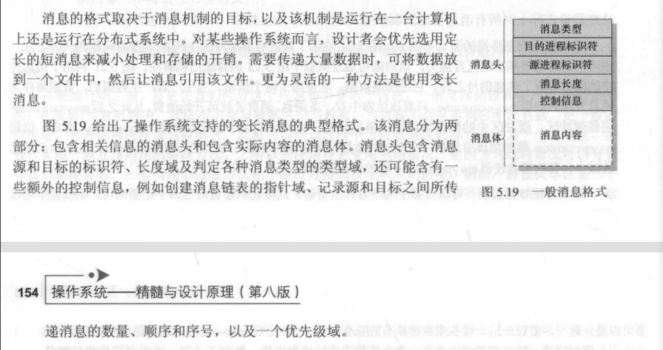

##### 排队原则

最简单的排队原则是先进先出，还有优先级原则，以及允许接收者检查消息队列并选择下一次接受哪个消息

##### 互斥

```c
const int n = /* 进程数 */
void P(int i)
{
    message msg;
    while(true) {
        receive(box, msg);
        /* 临界区 */
        send(box, msg);
        /* Else */
	}
}

void main()
{
    create mailbox(box);
    send(box, null)
    parbegin(P(1), P(2)...)
}
```

使用无阻塞`send`和阻塞`receive`实现互斥

**生产者消费者问题：**

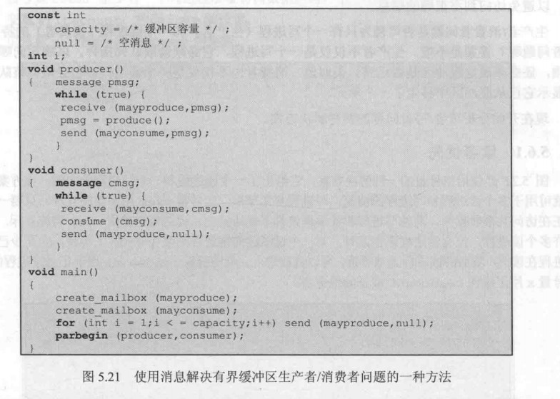

#### 6、**读者写者问题**

暂略

### 第六章 并发：死锁和饥饿

---

#### 6.1 死锁原理

死锁定义为一组相互竞争系统资源或进行通信的进程间的**“永久”**阻塞，所有死锁都涉及两个或者多个进程之间对资源需求的冲突。

简单来说两个进程都希望获得已经掌握的资源才能继续执行，就产生了死锁。

##### 资源的分类：

- 可重用资源：一次仅供一个进程安全使用且不因使用而耗尽的资源。包括处理器、I/O通道，内存和外存等
- 可消耗资源：可被创建和销毁的资源。包括中断、信号、消息和I/O缓冲取中的消息

操作系统中死锁检测、预防和避免方法小结：

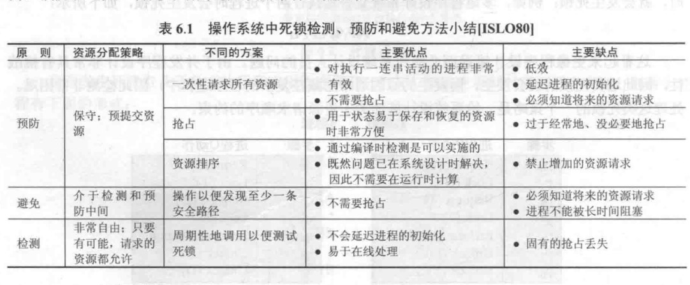

##### 资源分配图

表征进程资源分配的有效工具是Holt引入的**资源分配图**，如下：

其中原点表示资源的一个实例，边表示请求资源和占有资源

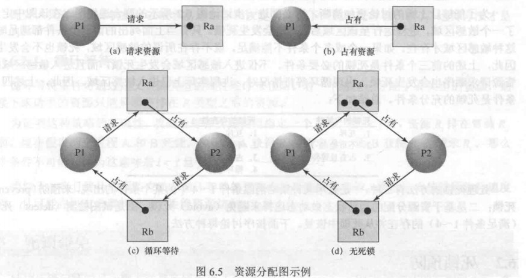

如果资源分配图中出现环，并且环中存在资源实例个数小于环中进程的个数，则可能导致死锁

##### 死锁的条件

死锁有三个必要条件：

- 互斥：一次只有一个进程可以使用资源
- 占有且等待：当一个进程等待其他进程时，继续占有已分配的资源
- 不可抢占：不能强行抢占已占有的资源

**这三个为必要条件并非充分条件**，要产生死锁还需要第四个条件：

**循环等待**：存在一个闭合的进程链，每个进程至少占有此链中下一个进程所需的一个资源

第四个条件是前三个条件的潜在结果，满足前三个条件，然后在特定顺序的进程调度下就有可能产生死锁。

#### 6.2 死锁预防

死锁预防策略是设计一种系统来排除发生死锁的可能性，死锁预防分为两类

- 间接死锁预防方法，即阻止前面必要条件中的一个即可
- 直接死锁预防方法：防止循环等待的发生

##### 互斥

此条件不可能禁止，对于多进程的并发执行调度中，互斥是必须满足的条件

##### 占有且等待

预防此条件，可以要求进程一次性地请求所有需要的资源，并阻塞这个进程直到所有请求都同时满足，显然，这个方法是低效的

1. 一个进程可能被阻塞很长时间来等待所有的请求被满足，而实际上只要有一部分资源它就可以继续执行
2. 一个进程可能实现并不知道它所需要的所有资源

##### 不可抢占

1. 占有某些资源的一个进程进一步申请资源时若被拒绝，则该进程必须释放最初占有的资源，必要时可再次申请这些资源和其他资源
2. 一个进程请求被其他进程占有的资源时，可以抢占另一个进程，要求它释放资源

##### 循环等待

循环等待条件可通过定义资源类型的线行顺序来预防，若一个进程分配了R类型的资源，则接下来请求的资源只能是排在R类型之后的资源

类似占有且等待的预防方法，循环等待的预防方法是低效的，会使进程执行速度变慢，且在没必要的情况下拒绝资源访问

#### 6.3 死锁避免

死锁避免允许三个必要条件，但通过特定的选择，确保永远不会到达死锁点，死锁避免可允许更多的并发，死锁避免通过当前的资源分配采取措施，所以需要直到未来进程资源请求的情况

书本给出两种死锁避免方法：

- 若一个进程的请求会导致死锁，则不启动该进程
- 若一个进程增加的资源请求会导致死锁，则不允许这一资源分配

##### 进程启动拒绝

考虑 n 个进程和 m 种不同类型资源的系统，有以下定义：

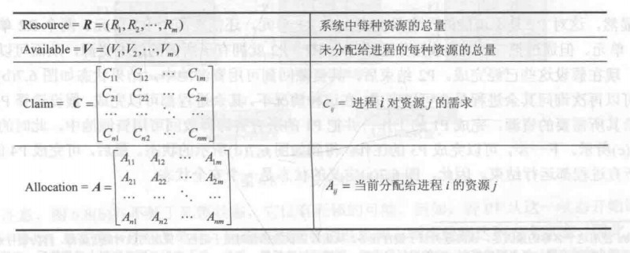

从中可以得知：

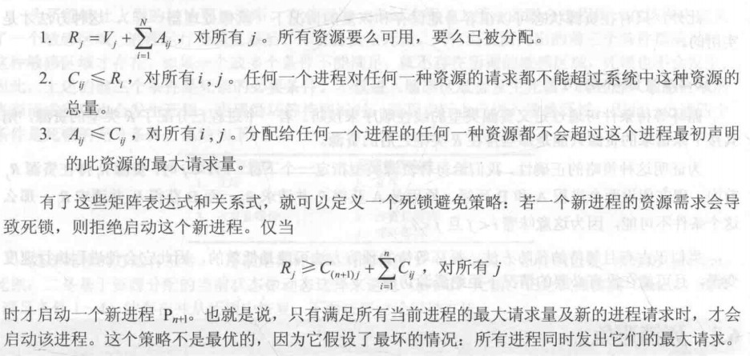

##### 资源分配拒绝

资源分配拒绝策略，即**银行家算法**，定义了安全状态和不安全状态，进程请求一组资源时，查看同意此请求之后的状态，若还为安全状态，则分配资源，否则拒绝

- 安全状态：至少有一个资源分配序列不会导致死锁
- 不安全状态：非安全的一个状态

但在此处，不可能真的对所有资源分配序列进行探查，判断是否存在此分配序列，所以通常根据下面的关系式判断是否是安全序列：

$C_{ij} - A_{ij} \le V_j , 对所有的j$

一个安全状态的例子：

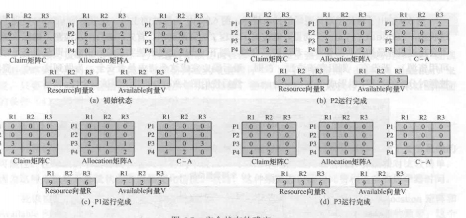

**死锁避免的优点**：无须死锁预防的抢占和回滚进程，且与死锁预防相比限制较少

**死锁避免的限制**：

- 必须实现声明每个进程请求的最大资源
- 所讨论的进程必须是无关的，即它们的执行顺序必须没有同步要求的限制
- 分配的资源数量必须是固定的
- 在占有资源时，进程不能退出

#### 6.4 死锁检测

##### 死锁检测算法

死锁预防策略非常保守，它们通过限制访问资源和进程上强加约束来解决死锁问题，而死锁检测不限制资源访问或约束进程行为，只要有可能就会给进程分配其所需要的资源，操作系统周期性的执行一个算法来检测前面的条件（4）（循环等待条件）

书本中死锁检测的算法，在之前定义的基础上还存在一个请求矩阵$Q$，其中$Q_{ij}$表示进程 $i$ 请求资源 $j$ 的数量，此算法主要是一个标记未死锁进程的过程，最初所有进程都是未标记的，然后执行以下步骤：

1. 标记 Allocation 矩阵中一行全为零的进程
2. 初始化一个临时向量 W，令 W等于 Available 向量
3. 查找下标 i，使得对所有的$1 \le k \le m, Q_{ik} \le W_k$，若找不到 i，终止
4. 若找到这样的行，标记进程 i，并把 Allocation 矩阵中的相应行加到 W 中，即对所有的 $1\le k \le m, 令 W_k += A_{ik}$，返回步骤3

##### 死锁恢复

检测到死锁后就需要某种策略来恢复死锁，下面为按复杂度递增的顺序列出可能的方法：

1. 取消所有的死锁进程，操作系统最常采用的方法
2. 把每个死锁进程回滚到前面定义的某些检查点，并重新启动
3. 连续取消死锁进程直到不存在死锁，所选取消进程的顺序基于某种最小代价原则，每次取消后重新检测是否存在死锁
4. 连续抢占资源直到不存在死锁，和 3 一样依赖某种最小代价原则，一个资源被抢占的进程必须回滚到获得这个资源之前的某一状态

对于（3）（4）可参考以下原则：

- 目前为止小号的处理器时间最小
- 目前为止产生的输出最少
- 预计剩下的时间最长
- 目前位置分配的资源总量最少
- 优先级最低

#### 6.5 一种综合的死锁策略

以上解决死锁的策略都各有优缺点，所以操作系统可以在不同的情况下使用不同的策略

- 把资源分成几组不同的资源类
- 为预防在资源类之间由于循环等待产生死锁，采用前面的线性排序策略
- 在一个资源类中，使用该类资源最适合的算法

其中资源可分为：

- **可交换空间**：进程交换所用外存中的存储块
- **进程资源**：可分配的设备、如磁带设备和文件
- **内存**：可按页或段分配给进程
- **内部资源**：诸如 I/O 通道

在每一类资源中，可采取一下策略确定次序：

- **可交换空间**：要求一次性分配所有请求资源预防死锁
- **进程资源**：死锁避免通常是有效的，因为进程可以实现声明所需要的资源，采用资源排序的预防策略也是可能的
- **内存**：对于内存。基于抢占的预防是最适合的策略，当一个进程被抢占后，它被换到外村，释放空间可以解决死锁
- **内部资源**：可以使用基于资源排序的预防策略

#### 6.6 哲学家就餐问题

有五位哲学家，他们的就餐在一张圆桌上，圆桌上有5个盘子，盘子之间有一把叉子，每位想吃饭的哲学家就餐时使用盘子两侧的叉

为避免死锁的风险，可再买5把叉子，另一种方法是只允许四位哲学家同时进入餐厅，由于最多有4位哲学家就座，因而至少有一位哲学家可以拿到两把叉子

两种方案的解决代码如下：

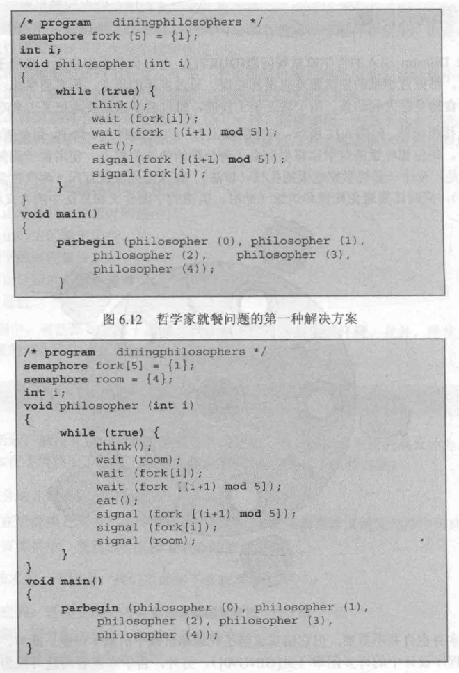


## 第三部分 内存


### 第七章 内存管理

---

在单道程序设计系统中（本书主要讨论单道），内存划分为两部分

- 操作系统专用
- 提供“用户”进程使用

简单的内存管理术语：

- 页框：**内存**中固定长度的块
- 页：**固定长度的数据块**，存储在二级存储中，可以临时复制到内存的页框中
- 段：**变长数据块**，存储在二级存储中，整个段临时复制到内存中（分段），或将段变为页，然后单独将每页复制到内存中（分段、分页相结合）

#### 7.1 内存管理的需求

##### 重定位

为了使处理器利用率最大化，程序换出到磁盘后，下次换入到换出之前的内存区域很困难，相反，我们需要把进程重定位到内存的不同区域。这样就会带来寻址的问题。处理器**硬件**和**操作系统软件**必须能以某种方式把程序代码中的内存访问转换为实际的物理内存地址，并反映程序在内存中的当前位置。

##### 保护

每个进程都应受到保护，以免其他进程有意或无意地干扰。

通常用户进程不能访问操作系统的任何部分，无论是程序还是数据。此外，一个进程中的程序通常不能跳转到另一个进程中的指令，若无特别许可，一个进程的程序不能访问其他进程的数据区。

内存保护需求必须由**处理器（硬件）**而非操作需要（软件）来满足，因为操作系统不能预测程序可能产生的所有内存访问，即使可以预测检查也非常费时。

##### 共享

任何保护机制都必须具有一定的灵活性，以允许多个进程访问内存的同一部分。内存管理系统在不损害基本保护的前提下，必须允许对内存共享区域进行受控访问。

##### 逻辑组织

计算机系统的内存和外存总是被组织成**线性的地址空间**。大多数程序被组织成模块，某些模块是不可修改的，若操作系统和计算机硬件能够有效地处理以某种模块形式组织的用户程序与数据，则会带来许多好处：

1. 可以独立地编写和编译模块
2. 通过适度的额外开销，可以为不同的模块提供不同的保护级别
3. 可以引入某种机制，使得模块被多个进程共享

最易于满足这些需求的根据是**分段**

##### 物理组织

计算机系统分为两级，内存和外存，内存提供快速的访问，成本高，易失性；外存较慢且便宜，非易失性。

在这种两级方案中，系统主要关注的是内存和外存之间信息流的组织，组织这一信息流是由系统负责的，而不能由程序员负责。

#### 7.2 内存分区

内存管理的主要操作是处理器把程序装入内存中执行，内存管理技术由以下几种：

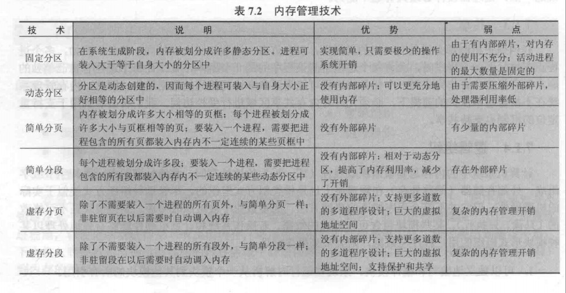

##### 固定分区

管理用户内存空间的最简方案就是对它分区，以形成若干边界固定的区域

分区大小：

- 大小相等的分区
- 大小不等的分区

**内部碎片**：装入的数据块小于分区大小，因而导致分区内部存在空间浪费，这种现象称为内部碎片

**放置算法**：

对于大小相等的分区，只需要把每个进程分配到能够容纳它的最小分区中，每个分区都需要维护一个调度队列，用于保存从这个分区换出的进程

对于大小不等的分区，也可以采取上面这种方式，对于单个分区来说是最优的，可以达到最小的内部碎片，但是从整个系统看不是最佳的，小内存的进程可能被阻塞即使有大的空闲分区，所以一种更可取的方式是为所有的进程只提供一个队列。如果所有都被占据，则必须进行交换，一般优先考虑一些诸如优先级之类的其他因素，或者优先选择换出阻塞的进程而非就绪进程

固定分区方案简单，但存在以下缺点：

- 分区的数量在系统生成阶段已经确定，因而限制了系统中活动进程的数量
- 分区的大小是在系统生成阶段实现设置的，因而小作业不能有效地利用分区空间

##### 动态分区

对于动态分区，分区长度和数量是可变的，进程装入内存时，系统会给他分配一块与其所需容量完全相等的内存空间，动态分区方法会在内存中形成许多小空洞（外部碎片），内存利用率随之下降

克服外部碎片的一种方法是**压缩**，操作系统不时地移动进程，使得进程占用的空间连续，使得所有空闲空间连成一片。

压缩是一个非常耗时的过程，另外，压缩需要动态重定位的能力，能够把程序从内存的一块区域移动到另一块区域，且不会使程序中的内存访问无效

**放置算法**：

可供考虑的放置算法有三种：

- **最佳适配：**选择大小最接近的块，性能较差
- **首次适配：**从头开始扫描，选择大小足够的第一个可用块，通常是最简单有效的
- **下次适配：**从上一次放置的位置开始，选择下一个可用块，较首次适配差，常常会在内存的末尾分配空间，导致末尾的 最大空闲存储块很快分裂为小碎片，因此可能会需要更多的压缩

##### 伙伴系统

伙伴系统中内存块大小为 $2^K$ 个字，$L \le K \le U$，$2^L$ 表示分配的最小快尺寸，$2^U$ 表示分配的整个内存的大小，伙伴系统简单来说就是，给定大小为 $2^i$ （i为不小于此进程大小的最小整数），然后寻找一个大小为 $2^i$ 的空闲块，每个大小为 $2^i$ 的块都有维护列表，空闲块可以由对半分裂从大小为 $2^{i+1}$ 的列表移出，并在 $2^i$ 列表中产生两个伙伴，当 $2^i$ 列表一对伙伴都未分配时，则合并移入到 $2^{i+1}$ 中，可以由下面算法找到一个 $2^i$ 大小的空闲块

```c
void get_hole(int i) {
    if(i == U+1) <failure>;
    if(<i_list empty>) {
        get_hole(i+1);
        <split hole into buddies>;
        <put buddies on i_list>;
    }
    <take first hole on i_list>;
}
```

例子：

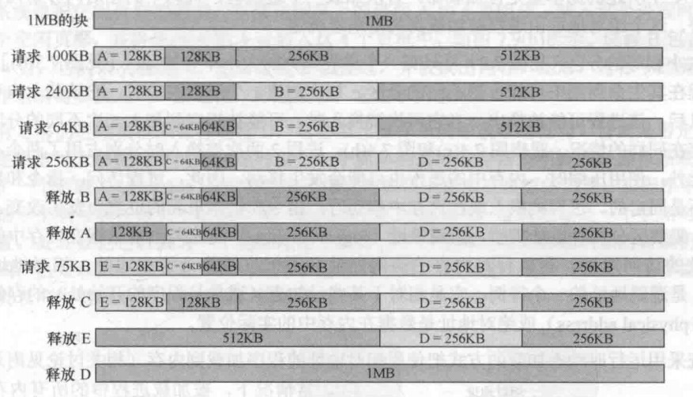

释放B后的二叉树：

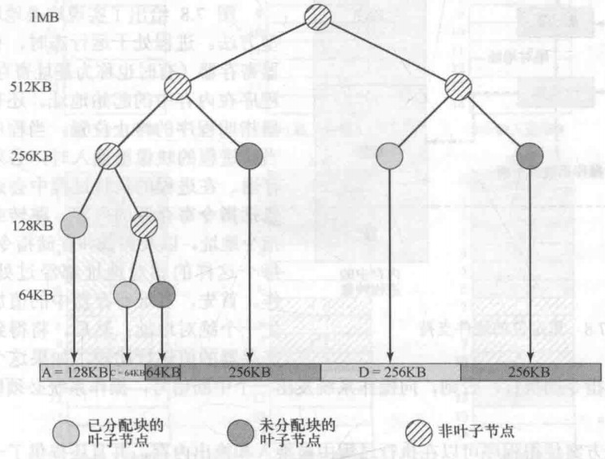

##### 重定位

在内存中放置进程需要的一种技术。进程在重新换入到内存后其地址是不确定的，所以需要**逻辑地址**和**物理地址**的转换

- 逻辑地址：与物理分配地址无关的地址
- 相对地址：逻辑地址的特例，相对已知点的存储单元
- 物理地址：在内存中的实际位置

重定位的硬件支持如下：

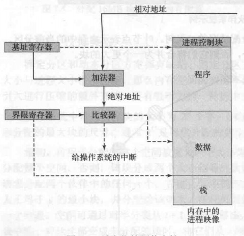

#### 7.3 分页

将内存和进程都划分为大小固定，相等且比较小的块，在进程中的称为页，在内存中的称为页框。使用分页技术，每个进程在内存中浪费的空间，仅是基础最后一页一小部分形成的内部碎片，没有外部碎片。

他和固定分区不同的是：**采用分页技术的分区相当小，一个程序可以占据多个分区，并且这些分区不需要是连续的**。

实现上述的方法之一是，每个进程维护一个**页表**，页表给出了该进程每页对应页框的位置。在程序中，每个逻辑地址包括一个页号和该页中的偏移量。

为了使分页方案更加方便，**规定页和页框的大小必须是2的幂，以便容易地表示出相对地址**，有以下两个好处：

1. 逻辑地址方案对编程者、汇编器和链接是透明的，程序每个逻辑地址与其相对地址是一致的
2. 用硬件实现允许时动态地址转换比较容易。考虑一个 n+m 位地址，最左边的 n 位是页号，最右边的 m 位是偏移量，地址转换经过以下步骤：
	- 提取页号，即逻辑地址左侧 n 位
	- 以这个页号为索引，查找进程页表中对应的页框号 k
	- 页框的起始物理地址为 $k\times 2^m$，被访问字节的物理地址是这个数加上偏移量。可以简单地把偏移量附加到页框号后面来构建物理地址。

简单分页的图形表示如下：

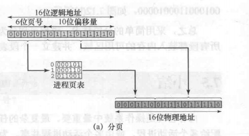

#### 7.4 分段

采用分段技术，可以把程序和与其相关的数据划分到几个段，尽管段的最大长度有限制的，但不要求长度都相等，和分页一样，其逻辑地址由段号和偏移量组成。

同样会产生外部碎片，但是由于块可以设置的很小所以外部碎片也很小，分段也不要求分区是连续的。

分页对程序员是透明的，**分段则是可见的**。为实现模块化设计，程序或数据分段或进一步分段。

采用大小不等的段的另一个结果是，逻辑地址和物理地址不再是简单的对应关系，在简单的分段方案中，每一个进程都有一个**段表**，系统也会维护一个内存中的空闲块列表，段表项必须给出相应段在内存中的起始地址，还必须指明段的长度，以确保不会使用无效地址。

考虑一个 n+m 位的地址，左侧n位是段号，右侧m位是偏移量，进行地址转换有以下步骤：

1. 提取段号，即左侧n位
2. 以这个段号为索引，查找进程段表中该段的起始物理地址
3. 最右侧m位，表示偏移量，若偏移量大于段长度则该地址无效
4. 物理地址为该段起始物理地址与偏移量之和

简单分段的图形表示：

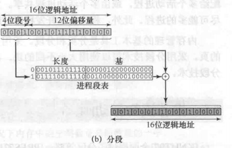

这里讨论的还是**简单分页和简单分段，进程必须把所有全部加载到内存中**，如果采用了覆盖或者虚存技术，则可以部分加载内存中，这部分在下一章讨论。

[**覆盖：**](https://blog.csdn.net/dongyanxia1000/article/details/51425141)所谓***覆盖***，就是把一个大的程序划分为**一系列覆盖**，每个覆盖就是一个相对独立的程序单位，**把程序执行时并不要求同时装入内存的覆盖组成一组，称为覆盖段**。***一个覆盖段内的覆盖共享同一存储区域*，**该区域成为覆盖区，它与覆盖段一一对应。显然，为了使一个覆盖区能为相应覆盖段中的每个覆盖在不同时刻共享，其大小应***由覆盖段中的最大覆盖***来确定。


### 第八章 虚拟内存

---

简单的虚拟内存相关定义：

- **虚拟内存**：

	虚拟内存是计算机系统内存管理的一种技术。它使得应用程序认为它拥有连续的可用的内存（一个连续完整的地址空间），而实际上，它通常是被分隔成多个物理内存碎片，还有部分暂时存储在外部磁盘存储器上，在需要时进行数据交换。目前，大多数操作系统都使用了虚拟内存，如Windows家族的“虚拟内存”；Linux的“交换空间”等。

- **虚拟地址**：

	在虚拟内存中分配给某一位置的地址，使得该位置可被访问，如同内存

- **虚拟地址空间**：分配某进程的虚拟存储

- **地址空间**：用户某进程的内存地址范围

- **实地址**：内存中存储位置的地址


#### 8.1 硬件和控制结构

分页和分段存在着这样的特点：

- **进程中所有的内存访问都是逻辑地址。**意味着一个进程可被换入或换出内存，因此进程可在执行过程中的不同的时刻占据不同区域
- **一个进程可划分为许多块，执行中不需要连续的位于内存中。**页表和段表的使用保证这一特点

这样的特点可以使得一个进程在执行的过程中，**该进程不需要所有页或段都在内存中**，只需要在内存保存下一条指令所在块，以及将访问的数据块即可。（这里的块都代表页或段）

进程执行过程中任何时刻都在内存中的部分称为进程的**常驻集（resident set）**，只要所有的内存访问都是常驻集中的单元，执行就可以顺利进行，并且处理器可以判断是否如此。当访问一个不再内存中（驻留集）的逻辑地址，会产生一个中断，操作系统会将此进程置于**阻塞态**，为此操作系统产生一个**磁盘I/O读请求**，在执行此I/O期间，操作系统可以调度另一个进程运行，在读入内存后（按某种置换策略），产生一个I/O中断，操作系统则将原来被阻塞的进程置为**就绪态**。

内存又称为**实存储器**，简称实存，但程序员或用户感觉到的是一个更大的内存，且通常分配在磁盘上，称为**虚拟内存（virtual memory）**，简称虚存。虚存支持更有效的系统并发度，解除用户与内存之间没有必要的紧密联系。

分页和分段的特点：

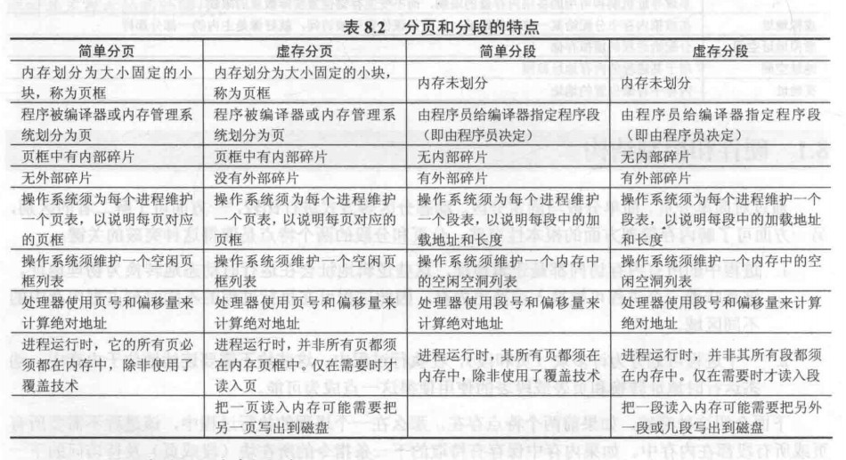

##### 局部性和虚拟内存

---

虚拟内存的开销收到**系统抖动（thrashing）**的影响。在虚存的机制下操作系统读取一块到内存，通常要将另一块换出，如果这块正好在将要用到之前换出，操作系统不得不很快的将他收回，会**导致处理器大部分的时间都用于交换快而非执行指令**。

避免系统抖动的算法都根据最近的历史来猜测将来最可能用到的块。这类推断基于**局部性原理**（一个进程中程序和数据引用的集簇倾向）

局部性原理表明虚存方案是可行的，要使虚存比较实用且有效，需要两方面因素：

1. 必须有对分页或分段方案的硬件支持
2. 操作系统必须有管理页或段在内存和辅存之间移动的软件


##### 分页

---

> 主要有二级页表、倒排页表、转换检测缓冲区等结构

虚存分页和简单分页一样都有页表，其中**页表项（Page Table Entry，PTE）**相比简单分页也多了一些内容，如下：

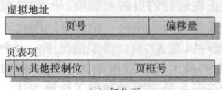

其中的 **P** 表示它所对应的页当前是否在内存中，如果在内存中，则还包括页框号，另一位是**修改位（M）**表示相应的内容装入内存后是否发生变化，若没有改变则无需重新写入辅存，负责需要用该页更新原来的页。

同简单分页类似，逻辑地址依然由页号和偏移量组成，而物理地址由页框号和偏移量组成，页表的长度基于进程长度的变化而变化，以下给出了一种硬件实现：

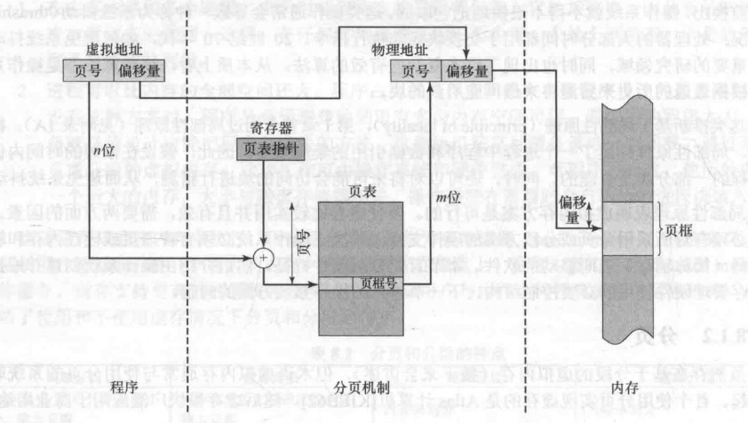

上述页表的简单处理在虚存空间大的时候会导致页表项的也十分大，一种解决方案是在虚存中保存页表，着以为着**页表和其他页一样服从分页管理**，一个进程在运行时，它的页表至少有一部分在内存中，这一部分包括正在运行的页的页表项，有一种**两级层次页表结构**来组织大型页表，典型情况如下：

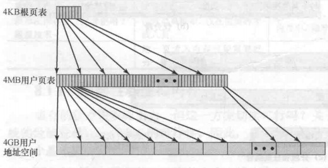

以上是32位地址两级方案的例子，假设采用字节级寻址，页尺寸为 $4KB (2^{12})$ ,则$4GB (2^{32})$虚拟地址空间由$2^{20}$页组成，若这些页的每一页都由一个4字节的页表项映射，则可创建由$2^{20}$页表项组成的页表，这时需要$4MB(2^{22})$的内存空间。这个由$2^{10}$页组成的巨大用户页表可以保留在虚存中，并由一个包括$2^{10}$个页表项的根页表映射，根页表占据的内存为$4KB(2^12)$，二级页表的地址转换如下图：

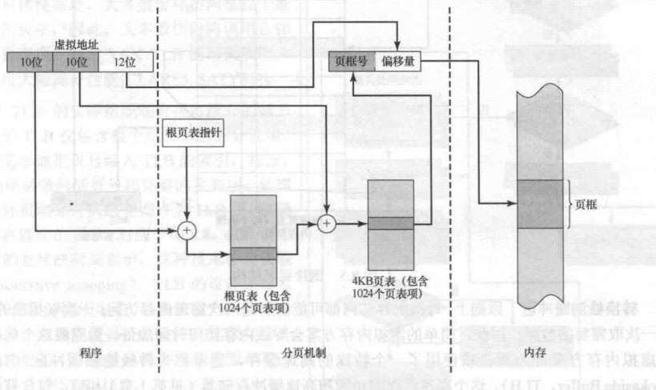

---

即使是二级页表，页表大小与虚拟地址空间的大小成正比，可以使用**倒排页表**替代这种结构，称为“倒排”的原因是，它使用页框号而非虚拟页号来索引页表项，它的大小是固定的，在虚存空间特别大的时候开销比多级页表少。

在这种方法中，虚拟地址的页号部分使用一个散列函数映射到散列表中。散列表包含指向倒排表的指针，而倒排表中含有页表项，页表项包含以下内容：

- **页号**：虚拟地址的页号部分
- **进程标识符**：使用该页的进程，页号和标识符确定一个特定进程的一页
- **控制位**：包含一些标记，如有效，访问，修改和锁定信息
- **链指针**：以为散列函数可能会将多个值散列到一个区域，所以存在链（下一项的索引值）

下图是一个n位页号m位数索引倒排表的页表结构图：

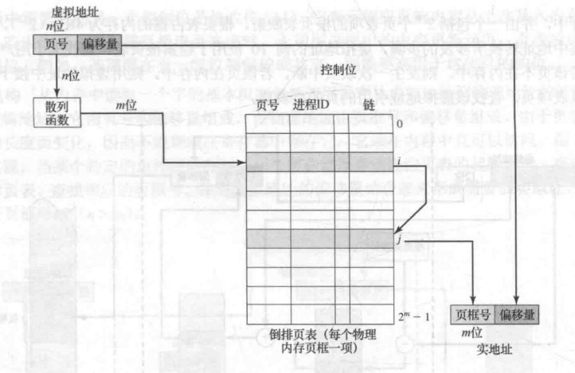

---

每次虚存访问都可能会引起两次物理内存访问：

- 取相应的页表项
- 取需要的数据

因此简单的虚拟内存方案会导致内存访问时间加倍，为克服这个问题，可以采用**转换检测缓冲区（Translation Lookaside Buffer，TLB）**（一个特殊的高速缓存，包含最近用过的页表项）。给定一个虚拟地址，处理器首先检查TLB，若需要的页表项在其中，则检索页框号形成实地址，若未找到则使用页号检索检查页表。然后查看其”存在位“状态，若不在内存中，则会产生一次内存访问故障，称为**缺页（page fault）**中断，此时由操作系统负责装入所需要的页，并更新页表。基本机理如下：

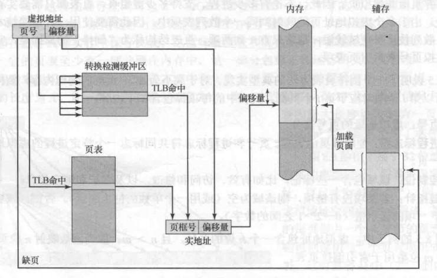

TLB使用流程如下，图中未显示磁盘I/O过程中可以调度另外进程执行。根据局部性原理大多数虚存访问都位于最近使用过的页中，所以此方案可以提高性能。

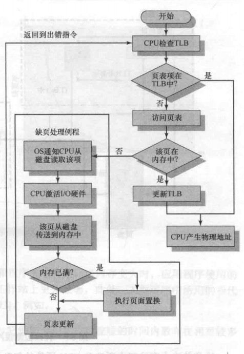

TLB的实际组织还有许多额外细节，由于TLB仅包含整个页表中的部分表项，因此不能简单地把页号编入TLB的索引，所以TLB的项必须包含页号和完整的页表项（和倒排表一样），这两种技术对应直接映射（索引）和关联映射，如下所示：

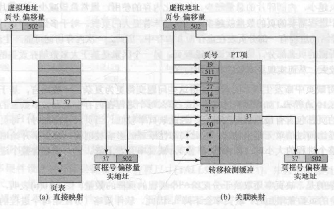

虚存机制须与高速缓冲系统（内存高缓）进行交互。首先，内存系统查看TLB是否存在匹配的页表项，若不存在则从页表中读取页表项。产生一个TAG标记和其余部分组成的实地址后，查看高速缓存中是否存在，若有则返回给CPU，若没有，则从内存中检索这个字。若被访问的字在磁盘中，则包含该字的页必须装入内存，且所在的块须装入高速缓存，且其页表项必须更新。

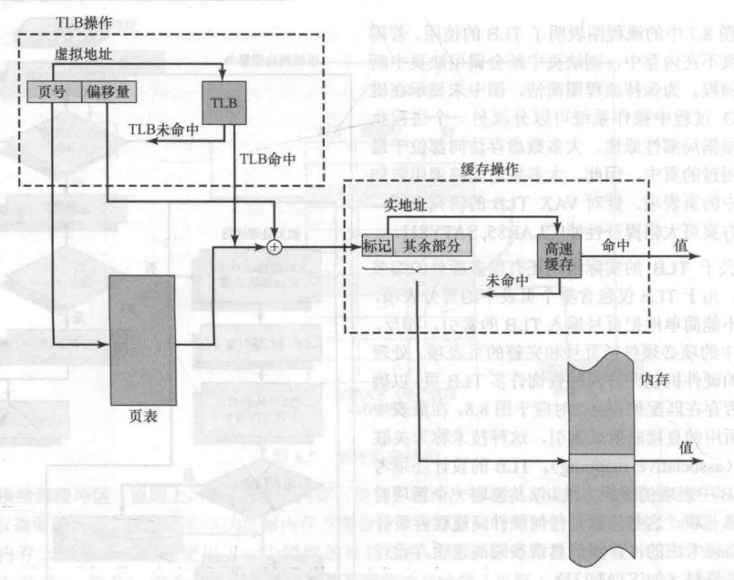

---

页尺寸是一个重要的硬件设计决策，页越小，内部碎片总量越少；另一方面，页越小，每个进程需要的页数量越多，页表也会变得更大。大页表不容易存储(二级页表)会导致产生两次缺页中断（读取页表，读取页），但大页表又利于数据块传送。大体来说，**缺页率**和**页尺寸**和分配的**页框数**有关系。

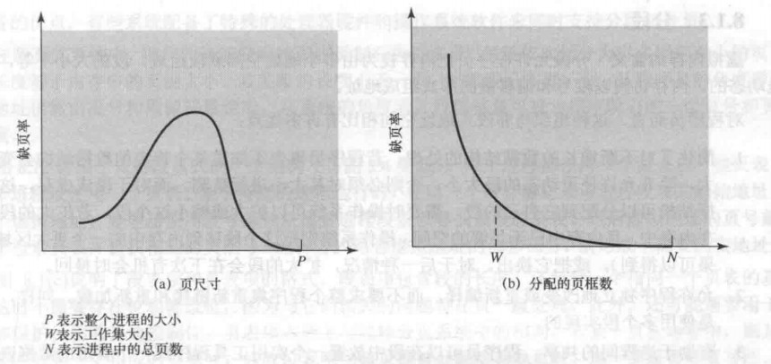

页尺寸的设计问题还与物理内存大小和程序大小有关。


##### 分段

---

分段组织与非段式有许多优点：

1. 简化了对不断增长的数据结构的处理
2. 允许程序独立地改变或重新编译
3. 有助于进程间的共享
4. 有助于保护

类似的虚存分段和简单分段一样也为每个进程维护一个段表，段表项包含存在位和修改位，以及该段的起始地址和长度。分段的地址转换如下图：

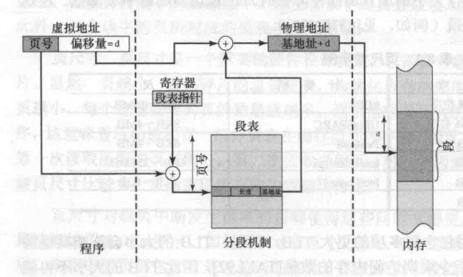

---

##### 段页式

分段和分页各有所长，在段页式系统中，用户地址空间被程序员划分为许多段，每段划分为和内存页框大小相同的页。逻辑地址仍然由段号和偏移量组成，段偏移量可视为指定段中的页号和页偏移量。其地址转换如下图：

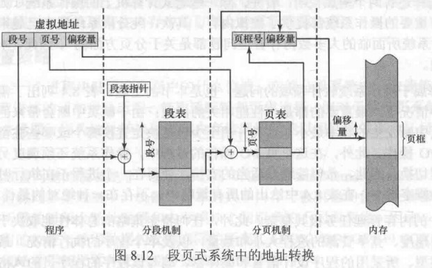


#### 8.2 操作系统软件

操作系统内存管理设计取决于三个基本的选择：

- 是否使用虚存技术
- 是使用分页还是分段，或同时使用两者
- 为各种存储管理特征采用的算法

前两者取决于所用的硬件平台（当前计算机主流提供了虚存的支持，且纯分段的系统也越来越少，**结合分段分页后操作系统内存管理问题都是面向分页的**）第三个就是操作系统软件领域的问题，也是本节所述。

虚拟内存的操作系统策略：

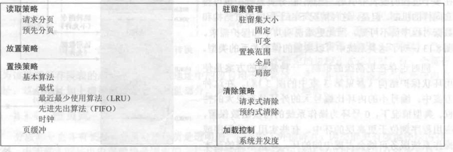

上表不存在一种绝对的最佳策略，**在所有的策略中都要做到通过适当的安排，使得一个进程在执行时，访问一个未命中的页中的字的概率最小**。


##### 读取策略

---

读取策略决定某页何时取入内存，常用的两种方法是请求分页和预先分页

- **请求分页（demand paging）**：只有当访问到某页中的一个单元时才将该页取入内存，开始缺页率高由于局部性原理之后缺页率会逐渐减少
- **预先分页（prepaging）**：利用大多数辅存设备的寻道时间和合理的延迟，一次读取多个连续的页，如果额外读取的页没有使用到，则低效


##### 放置策略

----

在纯分段系统中，放置策略并不是重要的设计问题（最佳适配、首次适配等均可）**对于分页和段页式系统，如何放置通常无关紧要，以为地址转换硬件和内存访问硬件能以相同的效率为任何页框组合执行相应的功能**


##### 置换策略

----

置换策略涉及到的问题有：

- 给每个活动进程分配多少页框
- 计划置换的页集是局限于哪些产生缺页中断的进程还是所有页框都在内存中的进程
- 在计划置换的页集中，选择换出哪一页

前两个为驻留集管理，之后讨论，置换策略专指第三个概念

**页框锁定**：注意的是对于被锁定的页框，则不能被用于置换，锁定是给每个页框关联一个锁定位实现的，可以包含在页框表和当前的页表中

基本算法有：

- **最佳（Optimal，OPT）**：

	选择置换下次访问距当前时间最长的那些页，这种方法是最优的，但是操作系统必须直到将来的事件，因此不可能实现，仅作为一种衡量标准

- **最近最少使用（Least Recently Used，LRU）**：

	置换内存中最长时间未被引用的页，根据局部性原理，这也是最近最不可能访问到的页，其性能接近OPT策略，但较难实现，开销大

- **先进先出（First In First Out，FIFO）**：

	将分配给进程的页框视为一个循环缓冲区，并按循环方式移动页，需要一个指针在页框中循环，这种策略实际是置换驻留在内存时间最长的页，但通常导致频繁的换入换出页

- **时钟（CLock）**：

	最简单的时钟策略给每个页框附加一个使用位，每当该页装入内存，或被访问时使用位置为1，并有一个指针与之相关联，当一页被置换时，该指针指向位下一个页框。需要置换一页时，操作系统扫描缓冲区，查找一个使用位为0的页框，扫描过程中遇到使用位为1时，将其置为0。

四种方法的比较：

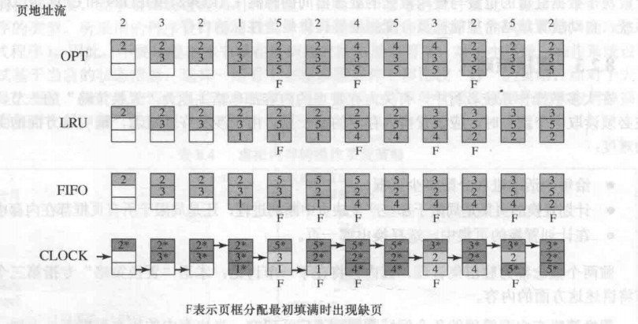

对固定页框数量且为局部页面置换，有如下关系：

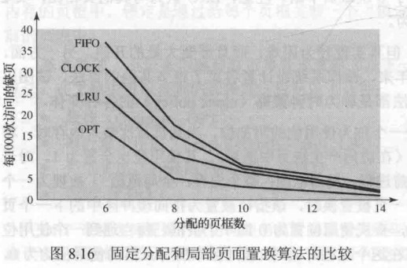

一种更有效的时钟算法采取了**使用位和修改位**，此时每个页框状态有：

- 最近未被访问，也未被修改 (u = 0; m = 0)
- 最近被访问，但未被修改 (u = 1; m = 0)
- 最近未被访问，但被修改 (u = 0; m = 1)
- 最近被访问，且被修改 (u = 1; m = 1)

此时的时钟算法执行过程如下：

1. 从指针的当前位置开始扫描缓冲区，选择遇到的第一个 (u = 0; m = 0) 用户置换
2. 若第一步失败，则重新扫描，查找 (u = 0; m = 1) 的页框，选择第一次遇到的用于置换，在这一扫描过程中将每个跳过的页框的使用位置为0
3. 若第2步失败，则指针回到最初的位置，且集合中所有页框的使用位均为0，重复第1步，并在必要时重复第二步，直到寻找到可用于置换的页框

此策略查找自被取入至今未被修改且未访问的页，由于未被修改，则不需要写回辅存。

还有一种称为**页缓冲**的方法允许使用较简单的页面置换策略（FIFO）。这种算法不丢弃置换出的页而是分配到两个表中（不移动页移动对应的页表项）：

1. 若未被修改，分配到空闲链表中
2. 若已被修改则分配到修改页链表中

这种方法的特定是，**被置换的页仍然留在内存中**，若进程访问该页，则可迅速返回该进程的驻留集且代价很小，实际上就是充当了高速缓存的角色


##### 驻留集管理

---

对于驻留集（操作系统给进程分配的内存空间）大小，需要考虑以下几个因素：

- 分配给一个进程的内存越少，则驻留在内存中的进程数就越多。增加了操作系统至少找到一个就绪进程的可能性，减少了由于交换而消耗的处理器时间
- 若一个进程在内存的页数较少，尽管有局部性原理，缺页率仍相对较高
- 给特定进程分配的内存空间超过一定大小后，由于局部性原理，改进程的缺页率没有明显的变化

当代操作系统通常采取两种策略：

- **固定分配策略**：为一个进程在内存中分配固定数量的页框
- **可变分配策略**：允许分配给一个进程的页框在该进程的生命周期中不断的发生变化

可变分配策略的难点在于要求操作系统评估活动进程的行为，会增加操作系统的软件开销

对于**置换范围**有局部和全局两类

- **局部置换策略**：仅在产生这次缺页的进程的驻留页中选择
- **全局置换策略**：内存中所有未锁定的页都是置换目标

置换范围和驻留集大小之间的关系：

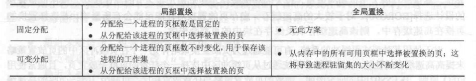

**工作集策略**：略


##### 清除策略

---

清除策略用于确定何时将已修改的一页写回辅存，通常有两种选择：

- **请求式清除**：只有当一页被选择用于置换时写回
- **预约式清除**：将已修改的多页在需要使用它们占据的页框之前成批写回

完全使用一种策略都存在危险，预约式请求可能在写回后又发生更改，这样就没太大的意义，请求式则意味着写回修改页和读入新页，且读入在写回前，会降低处理器的利用率

一种较好的方法是结合**页缓冲技术**：只清除可用于置换的页，去除了清除和置换操作之间的成对关系，被置换页可放于修改表和未修改表。修改表中的页可以周期性的成批写出，并移到未修改表中。未修改表的一页要么被访问到而回收，要么在其页框分配给另一页时被淘汰。


##### 加载控制

---

加载控制会影响到驻留在内存中的进程数量，着称之为系统并发度。如果驻留进程过少，那么所有进程都处于阻塞态概率就较大，因而许多时间花费在交换上。另一方面，进程过多，那么驻留集大小可能会不够用，会发生频繁的缺页中断，导致系统抖动

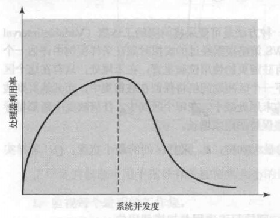

解决上述冲突，可以使用工作集策略或PFF算法。还有人提出了 L=S 准则，通过调整系统并发度，来使缺页中断之间的平均时间等于处理一次缺页中断所需的平均时间。这样处理器的利用率达到最大。

也可以采用时钟页面置换算法，监视该算法中扫描页框的指针循环缓冲区的速度。速度低于某个给定的最小阈值时，表明出现了如下的一种或两种情况：

1. 很少发生缺页中断，因此很少需要请求指针前进
2. 对每个请求，指针扫描的平均页框数很小，表明有许多驻留页未被访问到，且均易于被置换

在上述情况下，系统并发度可以安全的增加，另一方面，指针扫描速度超过某个阈值，表明缺页率很高，要么难以找到可置换页，说明系统并发度过高

系统并发度减小时，一个或多个当前驻留进程须被挂起（换出），可根据以下标准换出进程：

- **最低优先级进程**：实现调度策略决策，与性能无关
- **缺页中断进程**：原因在于很有可能是中断任务的工作集还未驻留，因而挂起它对性能的影响最小。此外，由于它阻塞了一个一定会被阻塞的进程，并且消除了页面置换和I/On操作的开销，可以立即收到成效
- **最后一个被激活的进程**：这个进程的工作集最有可能还未驻留
- **驻留集最小的进程**：在将来再次装入时的代价最小，不利于局部性较小的程序
- **最大空间的进程**：可在过来使用的内存中得到最多的空闲页框，使它不会很快又处于去活状态
- **具有最大剩余执行窗口的进程**：类似最短处理时间优先的调度原则


## 第四部分 调度


### 第九章 单处理器调度

---

多道程序设计系统中，需要提高处理器处理效率，所以需要合理的调度策略以达到效率的最大化。多道程序涉及的关键就是调度，典型的调度类型有四种，处 I/O 调度外其他三种调度类型都属于处理器调度

- **长程调度**：决定加入待执行进程池
- **中程调度**：决定加入部分或全部位于内存中的进程集合
- **短程调度**：决定处理器执行哪个可运行进程
- **I/O调度**：决定I/O设备处理哪个进程挂起的I/O请求

长程调度和中程调度主要由于系统并发度相关的性能驱动，这些在前面的章节就讨论过

#### 9.1 处理器调度的类型

处理器调度的目的是，**以满足系统目标（响应时间、吞吐率、处理器效率）的方式，把进程分配到一个或多个处理器上执行**。

调度的层次结构以及进程状态和其所属调度种类如下：

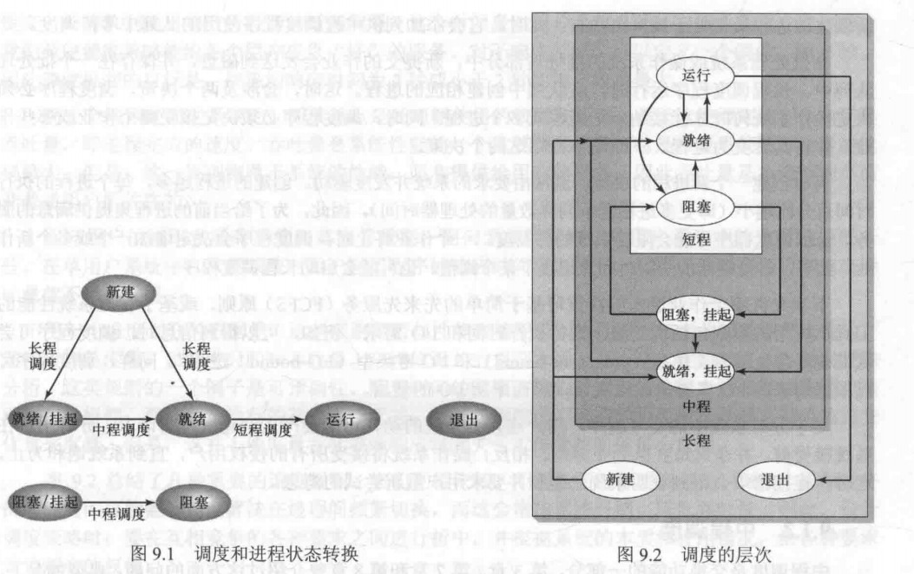

调度决定哪个进程须等待、哪个进程能继续运行，因此会影响系统的性能。本质上说调度属于队列管理，用于在排队环境中减少延迟并优化性能。

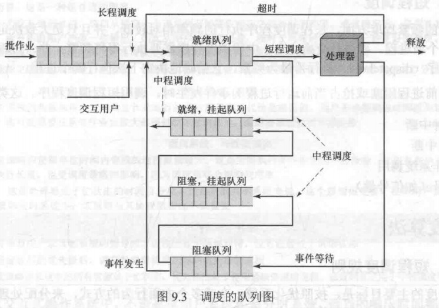

##### 长程调度

---

长程调度决定哪个程序可以进入系统中处理，因此它控制了系统的并发度。调度程序必须决定操作系统**何时**才能接纳一个进程或多个进程；同时，调度程序必须决定接受哪个作业或哪些作业，并将其转变为进程。

何时创建一个新进程，通常由要求的系统并发度驱动，下次允许哪个作业进入决策可基于简单的先来先服务（FCFS）原则，或者其他基于管理系统性能的根据。

##### 中程调度

---

中程调度是交换功能的一部分。典型情况下，换入决定取决于管理系统并发度的需求，在不使用虚存的系统中，存储管理也是个问题。因此换入决策将考虑换出进程的存储需求。

##### 短程调度

---

长程调度程序执行的频率相对较低。短程调度程序，也称为分派程序（dispatcher）执行最为频繁，精确的决定下次执行哪个进程。

导致当前进程阻塞或抢占当前运行进程的事件发生时，调用短程调度程序，包括：

- 时钟中断
- I/O 中断
- 操作系统调用
- 信号（如信号量）


#### 9.2 调度算法

##### 短程调度规则

---

短程调度的主要目标是按照优化系统一个或多个方面行为的方式，来分配处理器时间。

常用的规则可按两个维度来分类

1. 面向用户的规则和面向系统的规则
	- 面向用户的规则与单个用户或进程感知到的系统行为相关，例如交互式系统中的响应时间
	- 面向系统则注重处理器使用的效果和效率，如吞吐量
2. 是否与性能直接相关维度
	- 与性能直接相关，如响应时间和吞吐量
	- 与性能无关，不易测量或者定性规则

下表总结了几种重要的调度规则，相互依赖，不可能同时达到最优，比如提供较好的响应时间可能需要调度算法在进程间频繁切换，但也会增加系统开销，降低吞吐量。

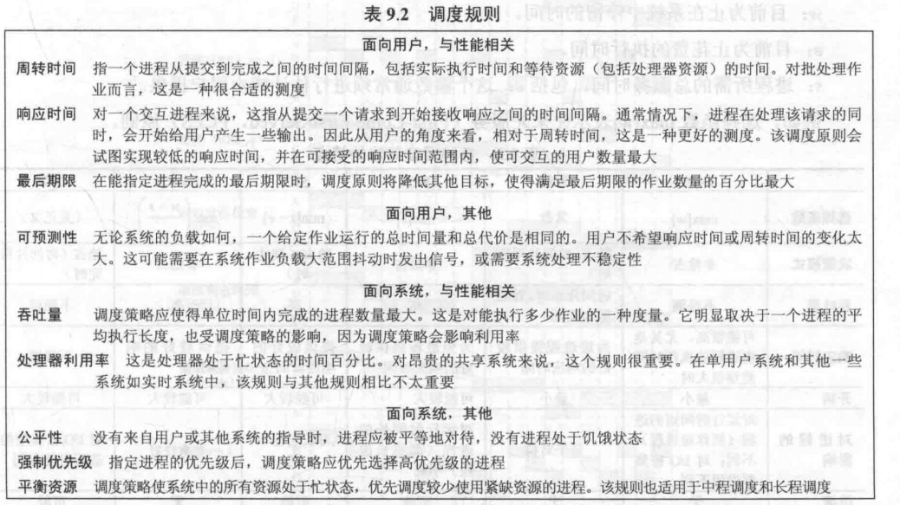

##### 优先级的使用

---

可以为每个进程指定一个优先级，调度程序总是优先选择具有较高优先级的进程，纯优先级调度方案可能导致低优先级进程可能会长期处于饥饿状态。可以让一个进程的优先级随时间或执行历史而变化，例如调度算法中的**反馈**法


##### 选择调度策略

---

有以下三个参数：

- *w*：目前为止在系统中的停留时间
- *e*：目前位置花费的执行时间
- *s*：进程所需的服务总时间

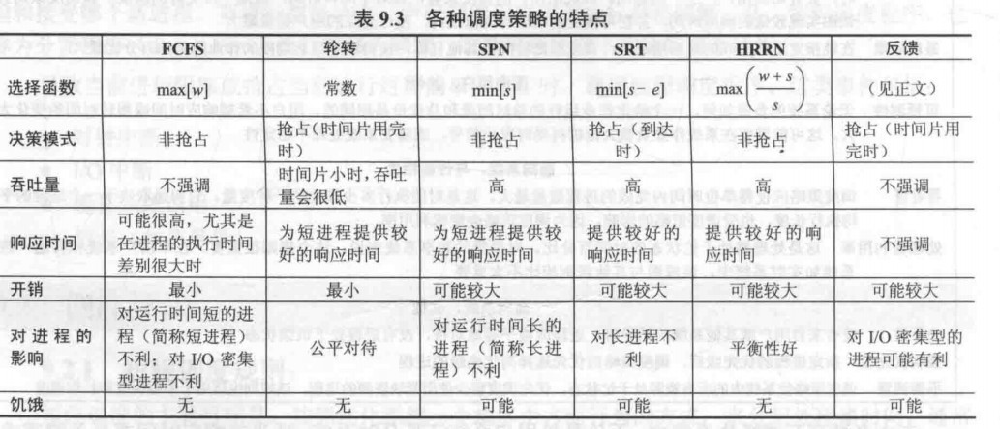

- **非抢占**：一旦进程处于运行状态，就会不断执行直到终止。进程要么因为等待I/O，要么因为请求某些操作系统服务而阻塞自己
- **抢占**：当前正运行进程可能被操作系统中断，并转换为就绪态

与非抢占策略相比，抢占策略虽然会导致较大的开销，但能为所有进程提供较好的服务，因为它们避免了任何一个进程长时间独占处理器的情形。

**周转时间（turnaround time）**：就是驻留时间 $T_r$ ，或这一项在系统中花费的总时间（等待时间+服务时间），另外有用的是归一化周转时间，为周转时间与服务时间的比值，**表示一个进程的相对延迟情况**。

下面是一个例子：

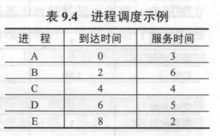

调度策略的比较如下：

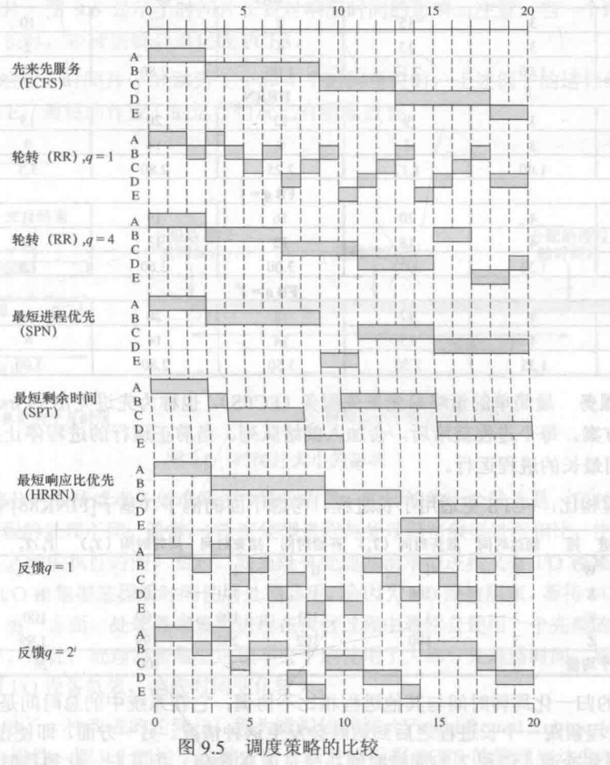

各个策略的效率的简单度量：

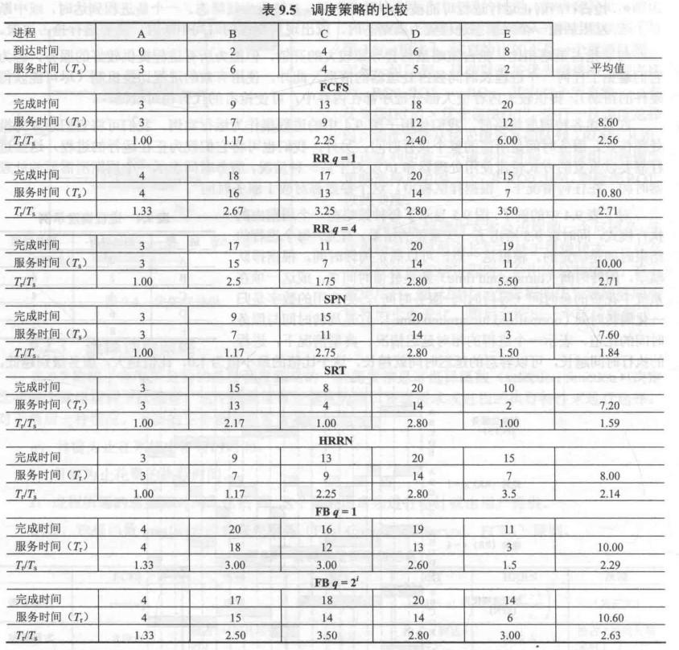


##### 先来先服务 FCFS

---

FCFS 是长进程友好的，而且相对于I/O密集进程，更有利于处理器密集型进程，其他进程，FCFS可能导致处理器和I/O设备都未得到充分利用。

FCFS 自身对于单处理器系统而言并不是很有吸引力的选择，但它与优先级策略结合后通常能提供一种更有效的调度方法，如反馈。

##### 轮转 Round Robin

---

根据**时间片（time slicing）**周期性的产生时钟中断，出现中断后将进程放置到就绪队列中，然后基于FCFS策略选择下一个就绪作业运行。

轮转法对处理器密集型进程和I/O密集进程的处理不同。处理器密集型进程在执行过程中通常会使用大部分处理器时间，导致I/O密集型进程性能降低，使用I/O设备低效，响应时间变化较大。

虚拟轮转法，这种方法可以避免上述不公平性，此方法的不同之处在于，接触了I/O阻塞的进程都会转移到一个FCFS辅助队列中。进行调度决策时，辅助队列中的决策优先于就绪队列中的进程，这种方法在公平性方面确实优于轮转法

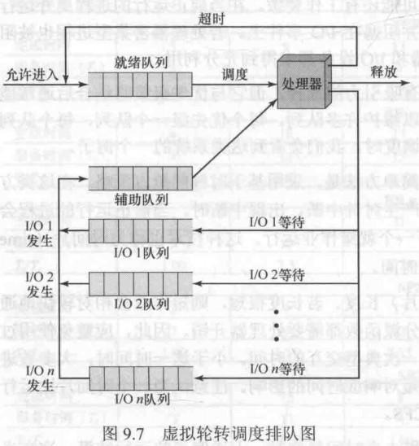

##### 最短进程优先 （Shortest Process Next， SPN）

---

SPN是非抢占的，短进程友好的，SPN的难点在于需要直到或至少需要估计每个进程所需的处理时间。对于批处理作业，系统要求程序员给出估计值，若执行时间远高于实际运行时间，系统可能终止该作业。实际中操作系统可为每个进程保留一个运行平均值，计算方法如下：
$$
S_{n+1} = \frac{1}{n}T_n+\frac{n-1}{n}S_n \\
T_i:第i个实例的处理器执行时间 \\
S_i:第i个实例的预测值
$$
这属于**指数平均法**的一种，SPN的风险在于，长进程可能饥饿。


##### 最短剩余时间（Shortest Remaining Time，SRT）

---

相当于是在SPN中增加了抢占机制的策略，和SPN一样，调度程序在执行选择函数的时候，必须具备关于处理时间的估计，并且具有长进程饥饿的风险。

SRT不像FCFS那样偏向长进程，也不像轮转法那样产生额外的中断，所以降低了开销。但是它必须记录过去的服务时间，又增加了开销，对于SPN，从周转时间上看，SRT性能更好，因为相当于一个正在运行的长作业而言，短作业可以立即选择执行。


##### 最高响应比优先 （Highest Response Ratio Next，HRRN）

---

调度规则见之前的对比图。HRRN偏向短作业（小分母产生大比值），长进程由于得不到服务等待的时间会不断增加，因此比值变大。所以是比较公平的。


##### 反馈法

----

调度基于抢占原则（按时间片）并使用动态优先级机制。一个进程首次进入系统时，会放在*RQ0*中当它首次被抢占并返回就绪态时，会放在*RQ1*中，在随后的时间内，每当它被抢占就降级一次直到最低级。因此，新到的进程和短进程会优于老进程和长进程。这种方法称为**多级反馈（Multilevel Feedback）**。

但存在一个问题，可能会造成长进程的饥饿。可以按以下办法解决：

1. 给低优先级的进程更多的时间片，一般而言，从*RQi*中调度的进程允许执行 $q=2^i$ 时间后被抢占
2. 当一个进程在其队列等待服务的时间超过一定时间后，就把它提升到优先级高的队列中

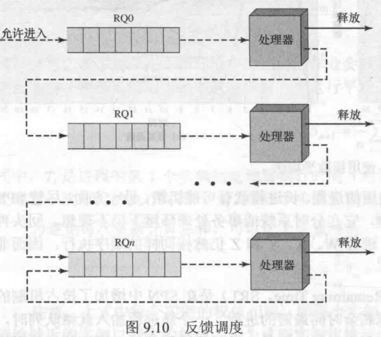

##### 性能比较

---

略

##### 公平共享调度 （Fair-Share Scheduling ）

---

公平共享调度考虑了**进程组**调度的基本原则。每个用户（进程组）被指定了某种类型的权值，此**权值定义了用户对系统资源的共享，而且是作为在所有使用资源中所占的比例来体现的，如处理器资源**。

调度是根据优先级进行的，它会考虑三方面因素：

1. 进程的基本优先级
2. 近期使用处理器的情况
3. 进程所在组近期使用处理器的情况

优先级数值越大，所表示的优先级越低，适用于组*k*中进程*j*的公式如下：

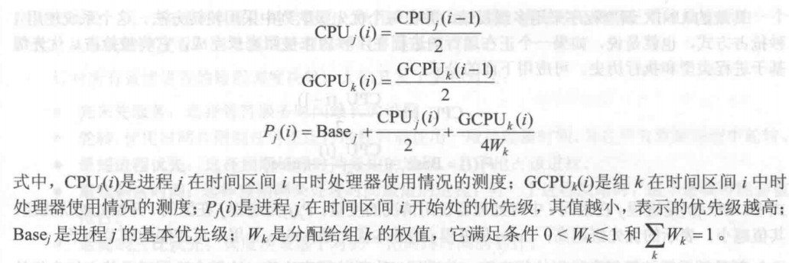

## 第五部分 输入/输出和文件


#### 第十一章 I/O 管理和磁盘调度

---


#### 11.1 I/O 设备

---

计算机系统中参与I/O的外设可以分为以下三类：

- **人可读**：适用于计算机用户间的交互，如打印机和终端
- **机器可读**：适用于电子设备通信，如磁盘驱动器
- **通信**：适用于远程设备通信，如调制解调器

其中主要差别包括：

- **数据传送速率**
- **应用**
- **控制的复杂性**
- **传送单位**：字节流或者字符流的形式传送，也可按块
- **数据表示**：不同的数据编码方式
- **错误条件**


#### 11.2 I/O 功能的组织

---

执行I/O的三种技术：

- **程序控制I/O**：无中断
- **中断驱动I/O**：中断
- **直接存储器访问**：中断，一个DMA模块控制内存和I/O模块之间的数据交换。传送一块数据，处理器给DMA模块发送请求，当整个模块传送结束后，它才被中断，**只有传送的开始和结束才会使用处理器**

可选的DMA配置如下：

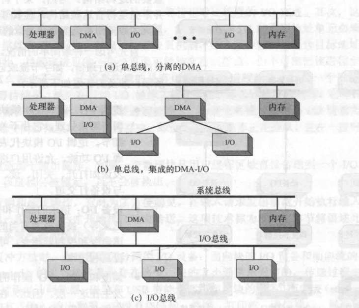


#### 11.3 操作系统设计问题

----

两个最重要的目标：

- **效率**：大多数I/O设备的速度非常低，进程交换本身就是I/O操作
- **通用性**：需要从两个方面统一：一是处理器看待I/O设备的方式，二是操作系统管理I/O设备和I/O操作的方式

##### I/O 功能的逻辑结构

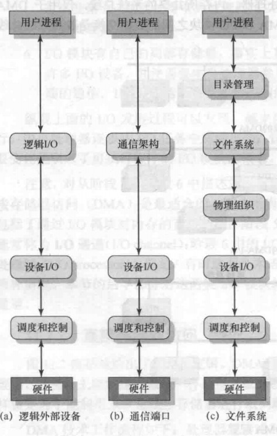

#### 11.4 I/O 缓冲

为避免多余的开销和低效操作，在输入请求发出前就开始执行输入传送，并且在输出请求发出一段时间后才开始执输出传送，这样的技术称为**缓冲**。

两类I/O设备：

- **面向块**：将信息保存在块中，块的大小通常是固定的
- **面向流**：设备以字节流的方式输入输出数据

I/O缓冲方案：

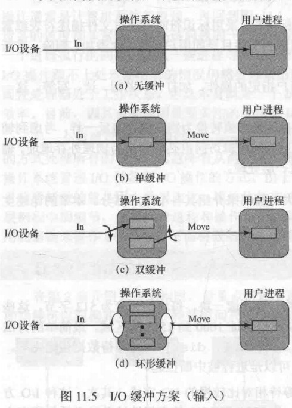

缓冲的作用：

**缓冲是用来平滑I/O需求的峰值的一种技术**，但在进程的平均需求大于I/O设备的服务能力时，再多的缓冲也无法让I/O设备与进程一直并驾齐驱。

在多道程序设计中，当存在多种I/O活动和多种进程活动时，**缓冲是提高操作系统效率和单个进程性能的一种方法**


#### 11.5 磁盘调度

##### 磁盘性能参数

---

磁盘驱动器工作时，磁盘以某个恒定的速度旋转，为了读或写，磁头必须定位于指定磁道和该磁道中指定扇区的开始处。磁头定位到磁道所需要的时间称为**寻道时间**，之后，磁盘控制器开始等待直到适当的扇区旋转到磁头处，这段时间称为**旋转延迟**，**寻道时间和旋转延迟的总和为存取时间**，这是达到读或写位置所需要的时间，之后便开始执行读操作或写操作，这段时间就是**传输时间**。

总平均存取时间包括上面的三个，可用公式表示
$$
T_a = T_s + \frac{1}{2r}+\frac{b}{rN} \\
T_s 为平均寻道时间，b表示传输的字节数，N表示一个磁道的字节数，r表示旋转速度（转/秒）
$$
时序比较的经典例子：

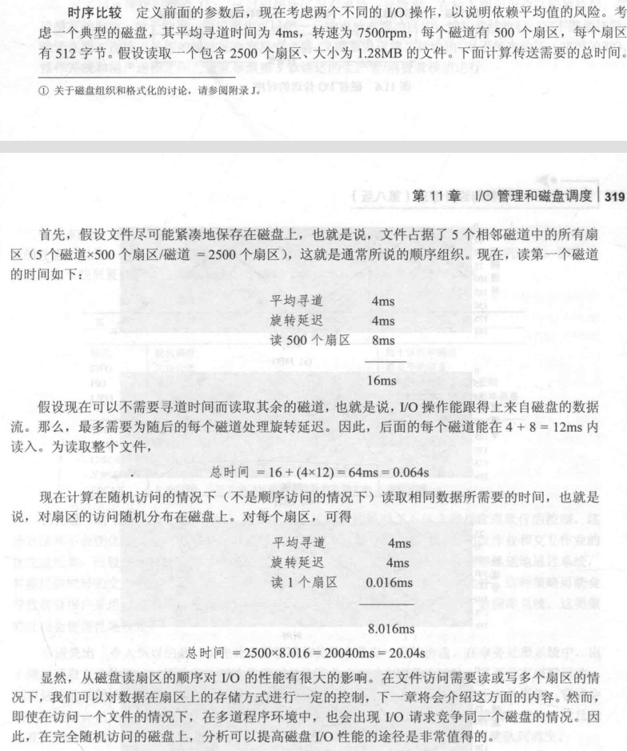


##### 磁盘调度策略

---

磁盘调度算法及其比较：

访问的磁道序列为：55、58、39、18、90、160、150、38、184

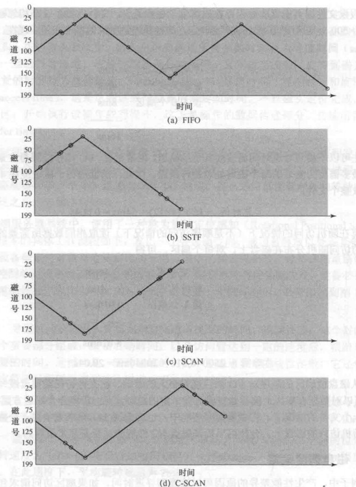

除此之外，还有**基于优先级（PRI）**和**后进先出**的算法

**基于优先级**并不会优化磁盘的利用率，但能满足操作系统的其他目标。通常较短的批作业和交互作业的优先级较高，而较长计算时间的长作业优先级较低。对于数据库系统这类策略往往使得性能较差。

**后进先出**在事务处理系统中，由于顺序读取文件，可减少磁壁的运动，可以提高吞吐量并缩短队列长度，但可能会导致饥饿。


#### 11.6 RAID

略

#### 11.7 磁盘高速缓存

磁盘高速缓存是内存中为磁盘扇区设置的一个缓冲区，包含磁盘中某些扇区的副本

进程从磁盘高速缓存中获取数据可以采取两种方式

1. 在内存中把这一块数据缓存传送到用户进程的存储空间中
2. 简单使用一个共享内存，传送指向磁盘告诉缓冲中响应的指针

后一种方法节省了内存到内存的传输时间

对于**置换策略**可以以下两种：

- **最近最少使用（LRU）**：置换在高速缓存中未被访问时间最长的块，可用一个栈完成
- **最不常使用（LFU）**：置换集合中访问次数最少的块

简单的LFU不能判断那些整体很少访问但是近期访问频繁的块，可以使用LFU的改进版

使用分区，新区老区（中间区），对不同区的对应措施不同

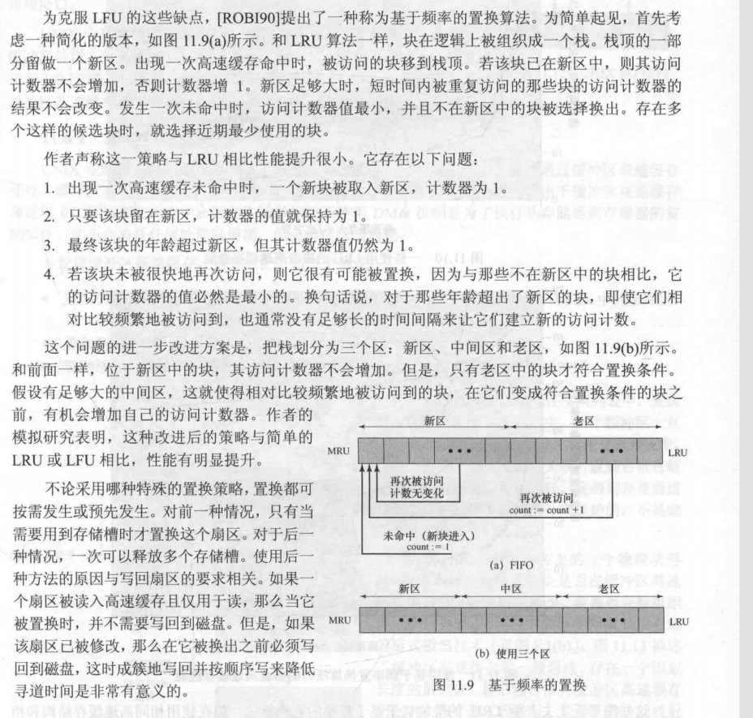


### 第十二章 文件管理

典型情况下，文件管理系统由系统实用程序组成，它们可以作为具有特权的应用程序来运行。一般来说，整个文件管理系统都被当做操作系统的一部分

#### 12.1 概述

##### 文件和文件系统

---

文件有以下理想的属性：

- 长期存在
- 可在进程间共享
- 结构

文件的操作如下：

- 创建
- 删除
- 打开
- 关闭
- 读
- 写

##### 文件结构

---

- **域**：基本的数据单元，一个域包含一个值，域的长度是定长或者变长的，取决于文件的设计
- **记录**：是一组相关域的集合，可视为应用程序的一个单元
- **文件**：一组相似记录的集合，被用户和应用程序视为一个实体，并通过文件名访问
- **数据库**：一组相关数据的集合，数据元素间存在着明确的关系，且可供不同应用程序使用，数据库管理系统独立于操作系统

文件系统架构：

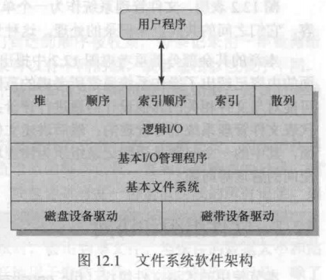

文件管理的要素：

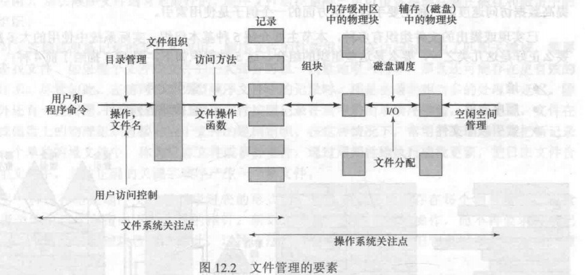

文件管理系统作为一个单独的系统实用程序和操作系统关注的是不同两方面的内容，之间的共同点是记录的处理。

#### 12.2 文件组织和访问

在选择文件组织，有以下重要原则：

- 快速修改
- 易于修改
- 节约存储空间
- 维护简单
- 可靠性

这些原则的优先级取决于将要使用这些文件的应用程序

基本文件组织：

- **堆**：**是简单的文件组织形式**，数据按它们到达的顺序被收集，每条记录由一串数据组成。堆的目的仅是积累大量的数据并保存，对文件没有结构，使用穷举查找的方式进行，当数据难以组织或在初期前采集数据时会用到。
- **顺序文件**：**是最常用的文件组织形式**，每条记录都使用固定的格式，所有记录具有相同的长度，并由相同数量、长度固定的域按特定顺序组成。每条记录的第一个域通常是**关键域**，唯一的标识这条记录，性能很差，也可组织成链表的方式。
- **索引顺序文件**：用于克服顺序文件的缺点，增加了两个特征：用于支持随机访问的文件索引和溢出文件。索引顺序文件极大的减少了访问单条记录的时间，同时保留了文件的顺序特性，多级索引可以提供更有效的访问
- **索引文件**：索引顺序文件保留了顺序文件的一个限制：基于文件的一个域进行处理。当需要基于其他属性而非关键域查找一条记录时，这两种形式的顺序文件都无法胜任。索引文件采取多索引的结构，摒弃了顺序性和关键字的概念，只能通过索引来访问记录。对记录的位置不再有限制，还可使用长度可变的记录。
- **直接或散列文件**：直接访问磁盘中任何一个地址已知块的能力。直接文件使用基于关键字的散列，直接文件常在要求快速访问时使用，且记录的长度是固定的，通常一次访问一条记录。

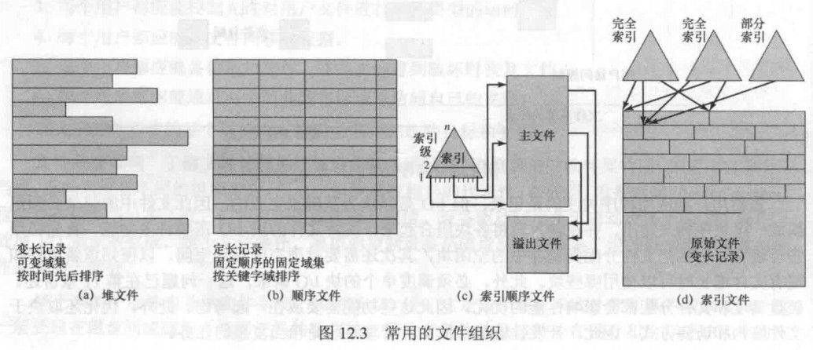


#### 12.4 文件目录

目录包含关于文件的信息，如属性、位置、所有权，都由操作系统管理。

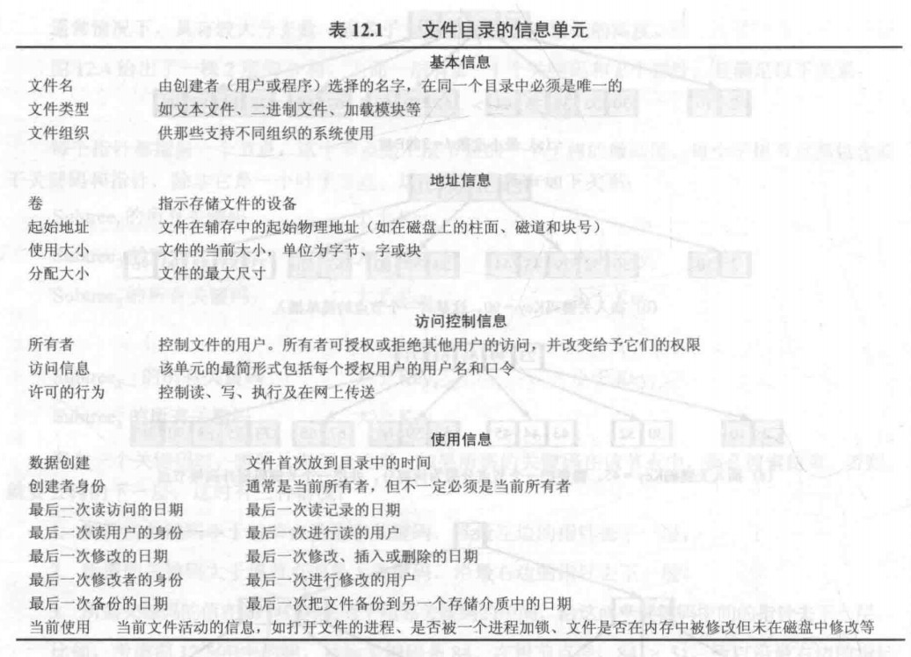

目录的结构通常是树状结构：

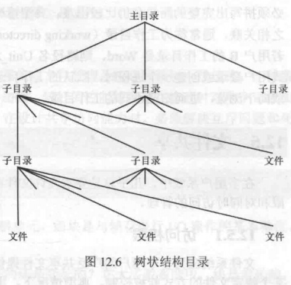

#### 12.5 文件共享

文件共享会产生两个问题：**访问权限**和**同时访问的管理**。

访问权限有如下：

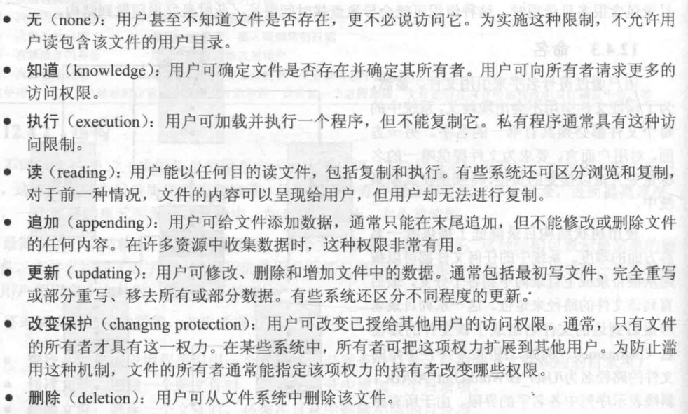

话可以按面向用户分组：特定用户，用户组，全部

对于同时访问，必须解决互斥和死锁问题

#### 12.6 记录组块

记录是访问结构化文件的逻辑单元，而块是与辅存进行I/O操作的基本单位，为执行I/O，记录必须组织成块。

对于给定的块大小，有三种组块方法：

- **定长组块**：使用定长的记录，且若干完整的记录保存在一个块中，块末尾可能会有未使用空间，称为内部碎片
- **变长跨越式组块**：使用变长的记录，并紧缩到块中，块中不存在未使用的空间，某些记录会跨越两个块，使用指针连接
- **变长非跨越式组块**：使用变长的记录，但不采用跨越方式，在大多数块中都会有未使用的空间

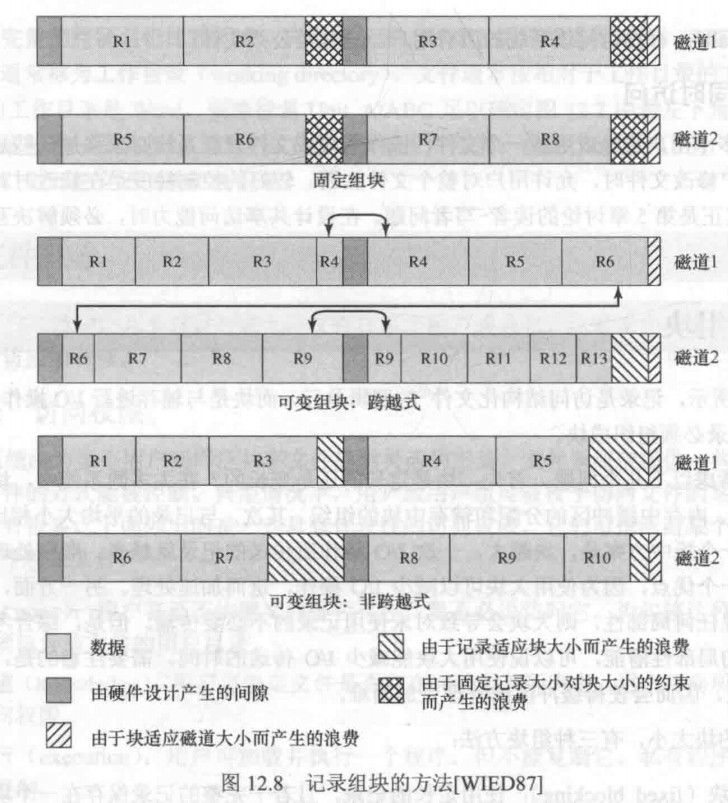

定长组块是记录定产顺序文件最常用的方式，变长跨越式存储效率高，但难以实现。跨越两个块需要两次I/O操作，文件很难修改。变长非跨越式浪费空间，且存在记录大小不能超过块大小的限制。

#### 12.7 辅存管理

在辅存中，文件是由许多块组成。操作系统负责为文件分配块。

##### 文件分配

---

- **预分配**：在发出创建文件的请求时，声明该文件的最大尺寸
- **动态分配**：只有在需要的时候才给文件分配空间

对于分配给文件的**分区大小**，我们需要考虑下面四项内容：

1. 邻近空间可以提高性能
2. 数量较多的小分区会增加
3. 使用固定大小的分区可以简化空间的再分配
4. 使用可变大小的分区或固定大小的小分区，可减少超额分配导致未使用存储空间的浪费

有以下两个选择：

- **大小可变的大规模连续分区**：大小可变避免了浪费，且会使文件分配表较小，但着会导致空间很难再次利用
- **块**：小的固定分区能提供更大的灵活性，但为了分配，它们可能需要较大的表或更复杂的结构

选择策略有：

- 首次适配
- 最佳适配
- 最近适配

##### 文件分配方法

---

**连续分配**：创建文件时，给文件分配一组连续的块。需要在创建文件时声明文件的大小，会出现外部碎片，所以需要紧缩算法

**链式分配**：链式分配基于单个块，使用指针建立联系，不必担心外部碎片的出现，但是局部性原理不再适用，为了克服这个问题，有些系统会周期性的合并文件

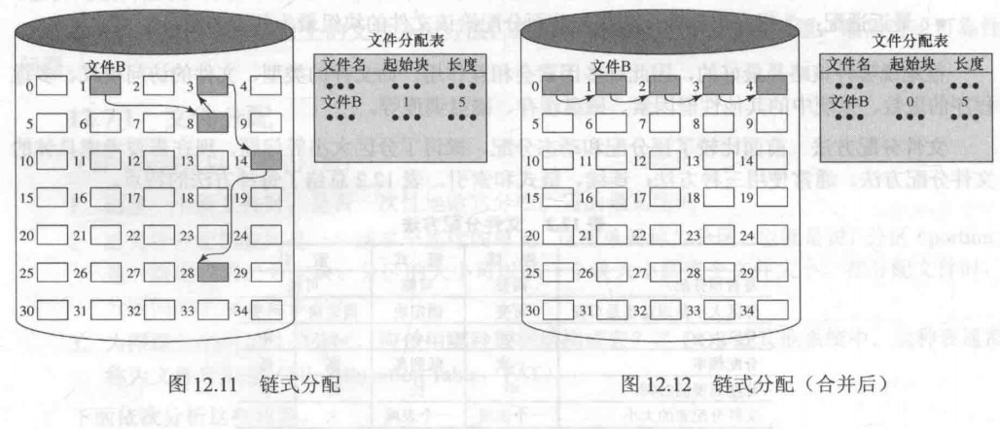

**索引分配**：解决了连续分配和链式分配中的许多问题。每个问价在文件分配表中都有一个一级的索引，分配给该文件的每个分区在索引中都有一个表项。

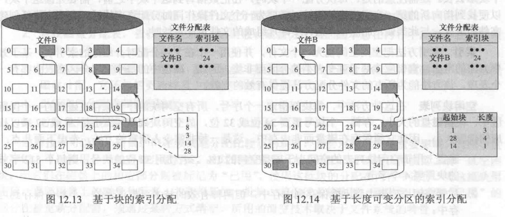

##### 空闲空间管理

除了文件分配表外，还需要**磁盘分配表（Disk Allocation Table，DAT）**

- **位表**：使用一个向量值00111000标识空闲块，通过它能相对容易的找到一个或一组连续的空闲块，而且很小，但其长度仍然很长。
- **链接空闲区**：使用指向每个空闲区的指针和它们的长度值，链接在一起，开销很小。使用一段时间后，会出现许多碎片。删除一个由许多碎片组成的文件也非常耗时
- **索引**：索引方法把空闲空间视为一个文件，并使用一个索引表，索引基于可变大小的分区而非块
- **空闲块列表**：每块都指定一个序号，所有空闲块序号保存在磁盘的一个保留区中。

**卷**：一组分配在可寻址的扇区的集合，操作系统或应用程序用卷来存储数据。卷中的扇区在物理存储设备上不需要连续，只需要对操作系统或应用程序来说连续即可。卷可能由更小的卷合并或组合而成。最简单的情况下，一个单独的磁盘就是一个卷，通常一个磁盘会分为几个分区，每个分区都作为一个单独的卷来工作。