# 软件工程 实践者的研究方法 —— 笔记

> 2019-12-15 Joke-Lin
>

## 第一章 软件的本质

### 软件的本质

现在的软件具有**产品和产品交付载体**的双重作用

### 定义软件

软件是***指令的集合、数据结构、软件描述信息***

不断的变更是**软件退化的根本原因**

## 第二章  软件工程

> 各种形式、各个应用领域的软件都需要工程化 —— 本书的主题

#### 软件工程的定义

定义：

- 将 ***系统化(systematic)、规范化(disciplined)、可量化(quantifiable)*** 的方法应用到软件的开发、运行、维护
- 对上面所述方法的研究

软件工程是一种**层次化**的技术：

- 工具：提供自动化或半自动化的支持
- 方法：解决方法
- 过程：基础
- **质量关注点 a “quality” focus**：根基（bedrock）

软件工程包括过程、管理、和构建软件的方法和工具

#### 软件过程

> 软件过程是工作产品构建时所执行的一系列**活动、动作、任务**的集合
>
> - 活动：实现宽泛的目标
> - 动作：包含了主要产品生产过程中的一系列任务
> - 任务：关注小而明确的目标，能够产生一个实际的产品

##### 过程框架

> 过程框架定义了若干个框架活动，为实现完整的软件过程建立了基础，还包含一些适用于整个软件过程的**普适性（Umbrella Activity）**活动

一个通用的软件过程框架包含下面5个活动：

- 沟通：理解利益相关者（Stakeholder）的项目目标，并收集需求以定义软件性能和功能
- 策划（Planning）指定计划，指导开发工作
- 建模（Modeling）：需求分析和设计
- 构建（Construction）：编码和测试
- 部署（Deployment）：交付用户

##### 普适性活动 （Umbrella Activities）

普适性活动是贯穿软件项目的始终，帮助团队管理和控制项目进度、质量、变更和风险，主要关注项目管理、跟踪和控制

对软件过程的适应性调整是项目成功的关键

#### 软件工程实践

##### 实践的精髓（The Essence of Practice）

- 理解问题（沟通和分析）
- 策划解解决方案（建模和软件设计）
- 实施计划（代码生成）
- 检查结果的正确性（测试和质量保证）

##### 通用原则

1. 存在价值
2. 保持简洁
3. 保持愿景（Maintain Vision）
4. 关注使用者
5. 面向未来
6. 提前计划复用
7. 认真思考

##  第三章 软件过程结构

### 通用过程模型

#### 过程流

过程流：描述在**执行顺序和执行时间**上如何组织框架中的活动、动作、任务

- 线性过程流（linear process flow)
- 并行过程流（parallel process flow）
- 迭代过程流（iterative）
- 演化过程流（evolutionary）

### 定义框架活动

沟通活动包含六个动作：**起始inception 需求获取elicitation 需求细化elaboration 协商negotiation 规格说明specifiation 确认validation**

### 过程模式

> 描述了软件工程工作中遇到的过程相关问题，明确了问题环境并针对该问题的一种或几种可证明的解决方案

#### 过程模式的描述模板

> 模式模板提供了描述模型的一般性方法

- 模式名称
- 驱动力
- 类型
  - 步骤模式
  - 任务模式
  - 阶段模式
- 启动条件
- 问题
- 解决方案
- 结果
- 相关模式
- 已知应用和实例

#### *Process Assessment and Improvement

- CMM:  Capability Maturity Model 能力成熟度模型
- CMMI: Capability Maturity Model Integration 能力成熟度模型集成

## 第四章 过程模型

> **过程模型的作用是减少开发新软件产品时出现的混乱**

### 惯用过程模型 Prescriptive Process Models

#### 瀑布模型（经典生命周期）The Waterfall Model

> 系统的、顺序的软件开发方法
>
> 在需求已经确定，而且工作采用**线性方法**完成适合瀑布模型

缺点：

- 实际项目很少遵守瀑布模型提出的顺序
- 客户通常难以清楚地描述所有的需求
- 客户必须有耐心，因为最后才有可执行结果

#### 增量过程模型（Incremental Model）

> 核 + 瀑布
>
> 该模型交付一系列称为增量的版本，随着每个版本的交付，逐渐为用户提供更多功能

综合了线行过程流和并行过程流，每个阶段运用线性序列

第一个增量往往是**核心产品**

#### 演化过程模型 Evolutionary Models

> 每个迭代产生软件的一个更完整的版本
>
> **是迭代的过程模型**

**原型开发**（Prototyping）：只有软件的基本任务，快速产生可执行的程序

环境：当用户只定义基本任务，没有详细定义功能和需求适合原型开发

**原型开发的问题：客户通常会把原型当作工作产品，没有意识到原型缺乏考虑整体质量和长期可维护性，不愿重构整个系统，从而导致软件开发管理失效。 一些凑合的技术和算法可能会遗留在最终系统中。**

**螺旋模型**：（Spiral）

> **风险驱动型**
>
> 演化+原型+瀑布
>
> **螺旋模型是开发大型系统和软件的很实际的方法**

特点：

- 采用循环的方式逐步加深系统定义和实现的深度，同时降低风险
- **确定一系列里程碑为支撑点**，确保利益相关者认可是可行的且满意的系统解决方案

#### 并发模型

> 并发开发模型（concurrent development model）也叫做并发工程
>
> 将项目计划看作是活的文档，需要经常评估修改

并发建模	定义了一系列事件，**这些事件将触发软件过程活动、动作或者任务的状态转换。**

**并发建模可用于所有类型的软件开发**，能够提供精确的项目当前状态图。定义了一个**过程网络**。

更适用于不同软件工程团队共同开发段产品过程

#### 演化模型的最终评述

1. 因为构建产品需要的周期数目不确定，原型开发有困难
2. 没有确定演化的最快速度
3. 演化软件过程侧重灵活性和可延展性，而不是高质量

### 专用过程模型（Special process model）

> 专用过程模型往往应用面较窄且较专一
>
> 包括基于构件的开发、形式化方法模型、面向方面的软件开发

#### 基于构件（Component）的开发

> 本质上是演化模型，不同的是他需要预先打包的软件构件来开发应用系统

由以下步骤组成（采用演化方法）

1. 对于该问题的应用领域研究和评估可用的基于构建的产品
2. 考虑构建集成的问题
3. 涉及软件架构以容纳这些构件
4. 将构件集成到架构中
5. 进行测试保证功能正常

**基于构件软件开发模型能够使软件复用，带来极大收益，缩短开发周期**

#### 形式化方法模型（formal methods model）

> 生成计算机软件形式化的数学规格说明，歧义性问题、不完整问题、不一致问题等都能更容易的发现和改正,能够保证软件的正确性

缺点：

- 耗时、成本高
- 需要大量的培训，起点高
- 对技术水平不高的客户，很难沟通

#### 面向方面的软件开发

为定义、说明、设计和构件方面提供了过程和方法——是对横切关注点进行局部表示的一种机制，超越了子程序和继承方法

### 统一过程（Unified Process）

> 尝试从传统的软件过程中挖掘最好的特征和性质，认识到客户沟通以及从用户角度描述系统并保持描述一致性的重要性，强调软件体系结构的重要作用

阶段：

- 起始阶段：包括客户沟通和策划
- 细化阶段：包括策划和通用过程模型的建模活动
- 构建阶段：与通用软件过程模型构建活动一致
- 转换阶段：包括通用构建活动的后期阶段以及通用部署（交付和反馈）活动的第一部分
- 生产阶段：与通用构建活动的部署活动一致

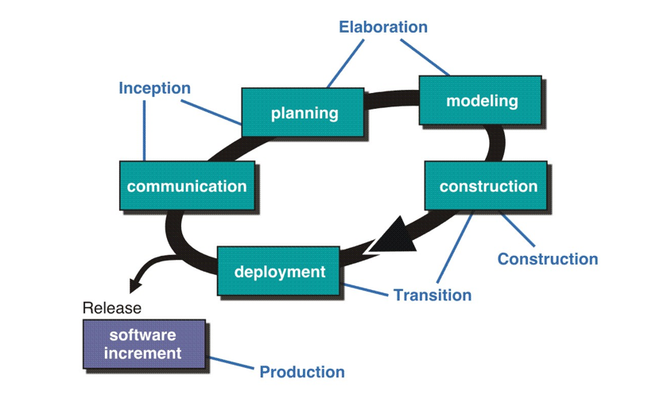

有可能在构建、转换、生产阶段的同时，下一个软件增量已经开启，者意味着5个阶段不是顺序进行，而是阶段性的并发进行

## 第五章 敏捷开发（Agile)

**敏捷宣言 manifesto**

- **个人和他们之间的交流**胜过了开发过程和工具
- **可运行的软件**胜过了宽泛的文档
- **客户合作**胜过了合同谈判
- **对变更的良好响应**胜过了按部就班的遵循计划

### 什么是敏捷

敏捷开发是一种以人为核心、迭代、循序渐进的开发方法  —— MBA

**普遍存在的变更**是敏捷的基本动力。强调可运行软件的**快速交付**而**不看重中间产品**，将**客户作为开发团队的一部分**，意识到**计划是有局限性**的，**项目计划必须是可以灵活调整的**。

敏捷可以应用于任何软件过程，过程的涉及应使团队适应于任务，并且使任务**流水线化**，保留最重要的工作产品并保持简洁，**强调这样的增量交付策略——根据具体的产品类型和运行环境，尽可能快地将可工作的软件交付给用户**

### 敏捷及变更成本

> 敏捷是**动态的**、**针对特定内容的**、**主动应对变更**的及**面向成长**的

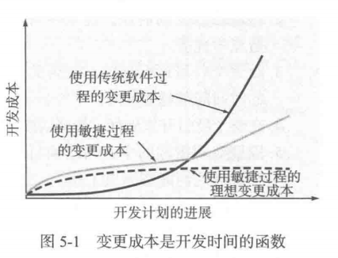

### 什么是敏捷过程

> **敏捷过程能够降低变更的成本是因为软件产品以增量的方式发布**，而且在增量内部变更能够得到较好的控制，敏捷过程必须具有可适应性，来解决不可预测性过程

#### 敏捷原则

12个敏捷原则。。

### 极限编程（eXtreme Programming ，XP）

> 是敏捷软件开发中使用最广泛的一种方法
>
> 使用**面向对象方法**作为推荐的开发范型，包含以下四个框架活动的规则和实践

- 策划：策划活动开始于倾听，这是一个需求收集活动**（用户故事）**

- 设计：**严格遵循KIS（Keep it Simple）原则、鼓励使用CRC（类-职责-协作者）、遇到困难推荐立即建立这部分设计的可执行原型**。**实现并评估设计原型被称为spike解决方案**，目的在一开始就降低风险、**鼓励重构**（构建技术也是设计技术，重构是不改变外部功能而改进设计的内部结构）

- 编码：在初步设计完成之后，**团队不是直接开始编码**，而是开发一系列用于检测本次**（软件增量）**发布的包括所有故事的**单元测试**。一旦建立起单元测试，开发者就可以集中精力于必须实现的内容以通过单元测试，**一旦编码完成就可以立即完成单元测试。**

  **结对编程**：两个人面对同一台计算机共同为一个故事开发代码，

  **完成工作进入连续集成，建立冒烟测试环境**

- 测试：所建立的单元测试应当使用一个自动实施的框架，支持每当代码修改之后及时的**回归测试策略**

#### 工业极限编程

**由XP的最低要求、以客户为中心和测试驱动精神组成**。**主要差别在于IXP 其管理具有更大的包容性，扩大了用户角色**，升级了技术实践

有如下6个新实践：

- 准备评估
- 项目社区
- 项目特许
- 测试驱动管理
- 回顾
- 持续学习

### 其他敏捷过程模型

> Scrum、动态系统开发方法（DSDM）、敏捷建模（AM）以及敏捷统一过程（AUP）

- Scrum：**强调软件过程模式**，需求、分析、演化、交付
- DSDM：**迭代**，使用增量原型开发模式以完全满足对时间有约束的系统的构建和维护
- AM：有目的的模型、使用多个模型、轻装上阵、内容重于表述形式、理解模型及工具、适应本地需要
- AUP：**在大型上连续，在小型上迭代**，建模、实现、测试、部署、配置及项目管理、环境管理

## 第七章 理解需求

需求定义：

1. **用户**为解决某一问题或为达到某个目标所需要的条件或能力
2. 系统或系统部件为满足合同、标准、规格说明或其他正式的**强制性文档所必须具有的条件或能力**
3. 对(1)和(2)中所描述的条件或能力的文档化说明

### 需求工程

> 需求工程指致力于不断理解需求的大量任务和技术
>
> 需求工程在设计和构建之间建立起联系的桥梁,为设计和构造奠定了坚实的基础

需求层次

- **Business requirements**: describe why the product is being built and identify the benefits both customers and the business will reap

- **User requirements**: 描述了要求系统必须完成的任务，即用户能使用系统来做些什么（what）

- **Functional requirements**: 

需求工程包括七项明确的任务：

- 起始 Inception
- 获取（启发） Elicitation
- 细化 Elaboration
- 协商 Negotiation
- 规格说明 Specification
- 确认 Validation
- 需求管理 Management

### 建立根基

利益相关者（stakeholder）：直接或间接地从正在开发的系统中获利的人

识别多重观点

协同合作

首次提问

### 获取需求

质量功能部署（Quality Function Deployment QFD）是一种将**客户要求转换为软件技术需求的技术**

QFD的目的是**最大限度地让客户从软件过程中感到满意**

QFD有

- 常规需求
- 期望需求：没有不满
- 兴奋需求：有了很喜欢

#### 使用场景

场景可以识别对将要构建的系统的使用线索，场景通常称为用例

用例：一组动作序列的抽象描述

### 开发用例

确定了参与者就可以开发用例

#### 构建分析模型

**分析模型的作用是为基于计算机的系统提供必要的信息、功能、行为域的说明**

分析模型的元素：

1. 基于场景的元素：用例图，活动图
2. 基于类的元素：UML类图
3. 行为元素：状态图，顺序图

## 第八章 需求建模 基于场景的方法

### 1. 需求分析

**模型类型：**

- 场景模型：出自**参与者**观点的需求
- 面向类的模型：表示**面向对象类**的模型，通过类的协作获得
- 基于行为和模式的模型：描述如何将**软件行为**看作外部事件后续的模型
- 数据模型：描述**问题信息域**的模型
- 面向流的模型：表示系统的功能元素，并且描述功能元素运行时的**数据变换**

\***需求模型的目标**

1. 描述客户需要什么
2. 为软件设计奠定基础
3. 定义 在软件完成后可以被确认的一组需求

**需求模型在系统描述和设计模型之间建立桥梁**

\***分析的经验原则**

1. 不要陷入细节
2. 需求模型的每个元素都应能增加对软件需求的整体理解
3. 关于基础结构和其他非功能的模型应该延时到设计阶段在考虑
4. 最小化整个系统的关联
5. 确认需求模型可以为所有利益相关者带去价值
6. 尽可能保持简洁

**域分析**

域分析：识别分析和详细说明**某个特定应用领域**的共同需求

**域分析的目标就是查找或创建那些广泛应用的分析类和分析模式，使其能够复用。**  

### 2. 基于场景建模

用户满意度是度量软件产品质量的最重要的标准。

需求模型的元素：

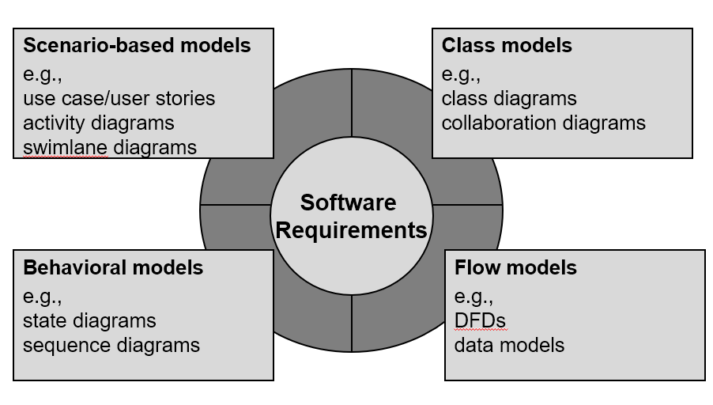

用例图：有必要描述以下用例异常

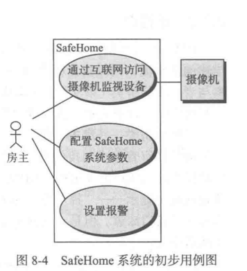

活动图：

泳道图：

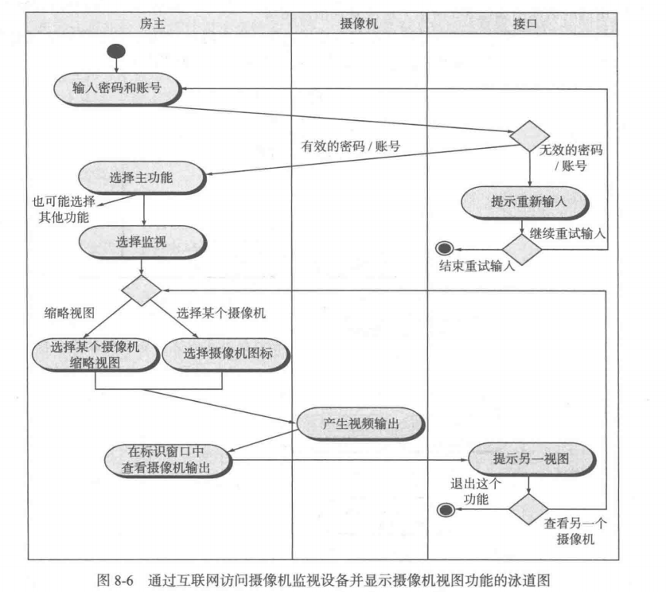

## 第九章 需求建模 基于类的方法

**Class-based modeling represents**

- objects that the system will manipulate,
- operations (also called methods or services) that will be applied to the objects to effect the manipulation,
- relationships (some hierarchical) between the objects, and
- collaborations that occur between the classes that are defined. 

**The elements of a class-based model include**

- classes and objects(attributes,operations),
- CRC models,
- collaboration diagrams, and
- packages.

步骤：

1. Identify analysis classes.
2. Specify the attributes of each class.
3. Define operations of each class.
4. Establish basic class relationships and collaborations.

### 1. 识别分析类

分析类的表现形式：

- 外部实体
- 事务
- 偶发事件或事件
- 角色
- 组织单元
- 场地
- 结构

开发经验在确定分析类的过程中非常重要

#### 确定一个潜在类是否是一个真正的分析类：

满足以下条件

1. 保留信息：只有记录潜在类的信息才能保证系统正常工作
2. 所需服务：必须具有一组可确认的操作，改变类的属性值
3. 多个属性
4. 公共属性：适用于类的所有实例
5. 公共操作
6. 必要需求

### 2. 描述属性

**属性是在问题的环境下完整定义类的数据对象集合**

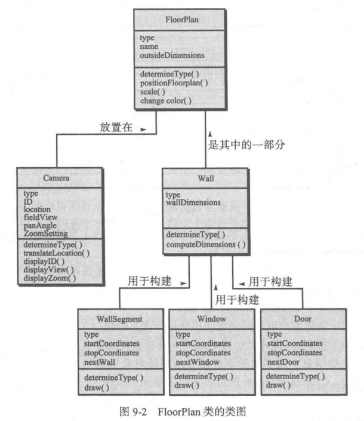

### 3. 定义操作

操作定义了某个对象的行为

**可以粗略的分为以下四种类型：**

1. 以某种方式操作数据
2. 执行计算的操作
3. 请求某个对象的状态的操作
4. 监视某个对象发生某个控制事件的操作

**操作必须理解类的属性和相关属性的性质**

### 4. 类-职责-协作者建模 Class-responsibility-collaborator (CRC) modeling 

CRC 建模提供了一个简单方法，**可以识别和组织与系统或产品需求相关的类**

CRC模型实际上是表示类的标准索引卡片的集合，这些卡片分为三部分，顶部写类名，主体左侧部分列出类的职责，右侧部分列出类的协作者。

#### 类

- **实体类**

	也叫做模型或业务类，从问题说明中直接提取出来的，这些类一般代表保存在数据库中和贯穿在应用程序中的事物

- **边界类**

	用户创建用户可见的和在使用软件时交互的接口。实体类包含信息但不显示，**边界类的职责就是管理实体对象呈现给用户的方式**

- **控制类**

	**自始至终管理工作单元**，控制类管理 1.实体类的创建或更新， 2. 边界类从实体对象获取信息后的实例化，3. 对象集合间的复杂通信，4. 对象间或用户和应用系统间交换数据的确认，通常直到设计开始才考虑控制类

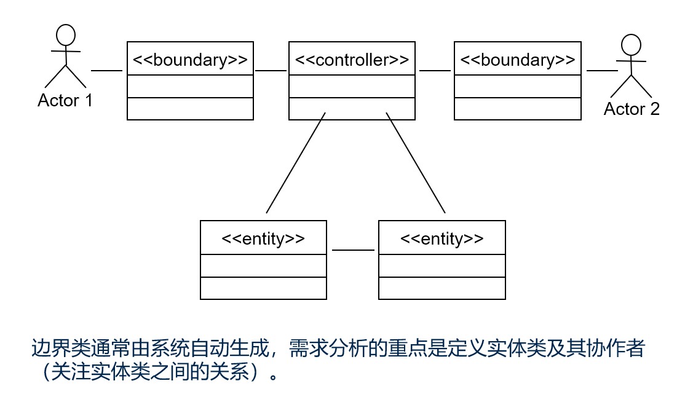

#### 职责

Responsibilities are the attributes and operations encapsulated by the class

#### 协作者

**Classes fulfill their responsibilities in one of two ways:**

- A class can use its own operations to manipulate its own attributes, thereby fulfilling a particular responsibility, or
- A class can collaborate with other 

### 5. Relationships Between Classes

不同协作类之间的关系有以下几种

UML表示：https://www.cnblogs.com/shindo/p/5579191.html 

- the has-knowledge-of relationship (Association 关联)
- the is-part-of relationship (Aggregate 聚合)
- the depends-upon relationship (Dependency 依赖)

关系有以下几种：

- 关联
- 依赖
- 泛化
- 实现

分析包：略略略

## 第十章  需求建模 行为和模式

基于场景和类的建模是静态的

使用顺序图和状态图进行行为建模

### 1. 生成行为模型

按照以下顺序生成行为模型：

1. 评估所有用例，以保证完全理解系统内的交互顺序
2. 识别驱动交互顺序的事件，并理解这些事件如何与特定的对象相互关联
3. 为每一个用例生成序列
4. 创建系统状态图
5. 评审行为模型以验证准确性和一致性

### 2. 识别用例事件

只要系统和参与者之间交换了信息就发生了事件

### 3. 状态表达

必须考虑两种不同的状态描述

1. 系统执行其功能时每个类的状态
2. 系统执行其功能时从外部观察到的系统状态

状态图：

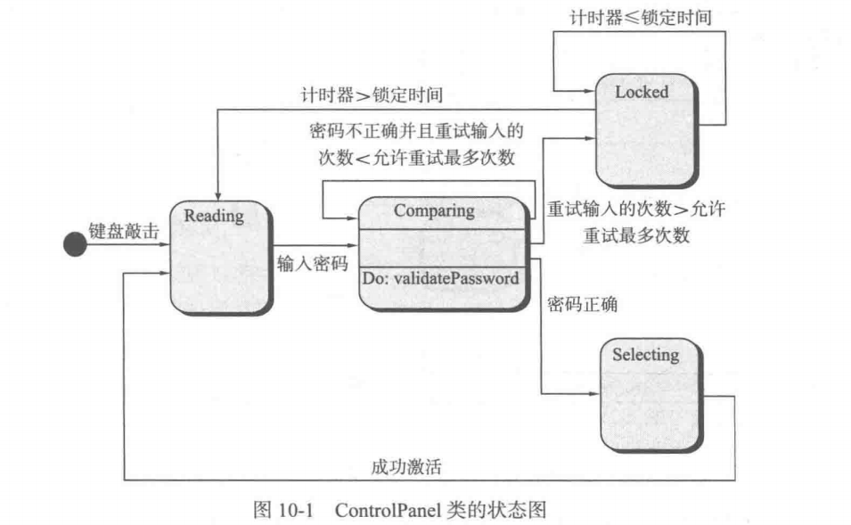

顺序图：

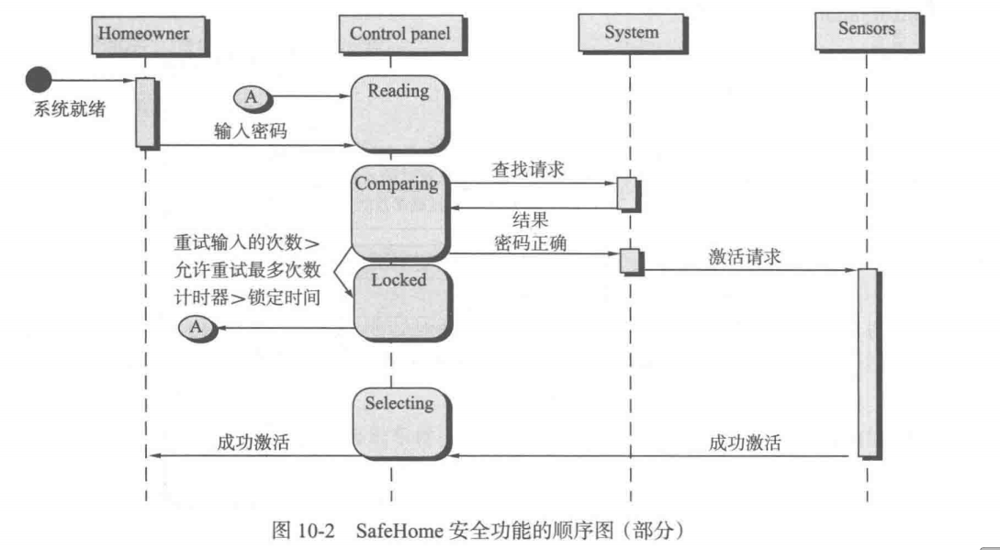

### 4. 需求建模的模式

软件模式是获取领域知识的一种机制，在遇到新问题时可以反复使用

### 5. Flow-Oriented Modeling

**Software Requirements Specification（SRS）**：

Everyone knew exactly what had to be done until someone wrote it down!

**Data Flow Diagram**：

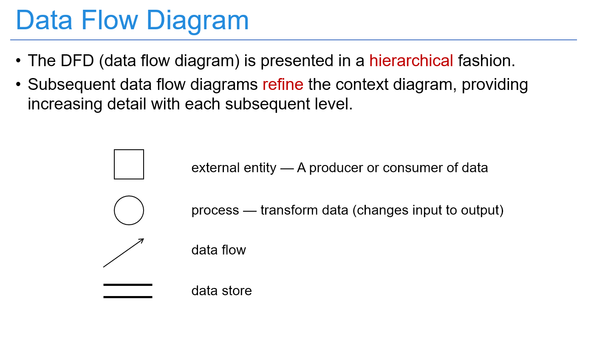

## 第11章 设计概念

设计是软件工程是否成功的关键，

设计体现了创造性，

利益相关者的需求、业务要求和技术考虑都集中体现在设计中

设计的**目标**是**创作出坚固、适用和令人愉悦（firmness, commodity, and delight）的模型或表示**

设计创建了设计模型。与需求模型不同的是，设计模型提供软件体系结构、数据结构、接口和构件的细节，这些是实现系统所必需的。

4个设计模型（图）

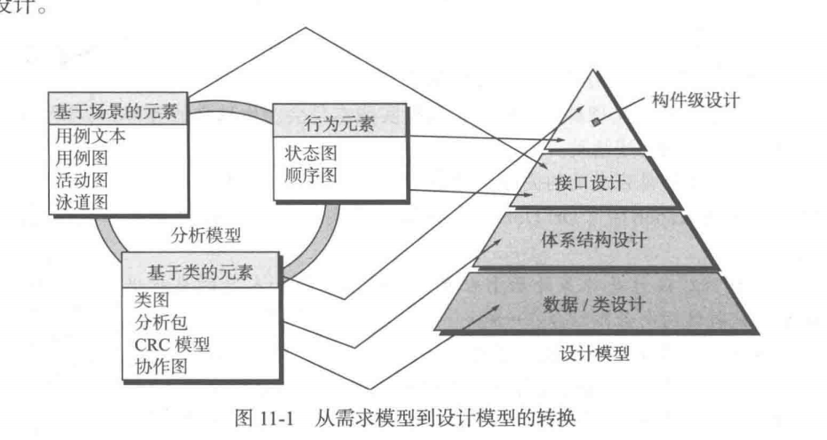

### 设计过程

1. 软件设计是一个迭代的过程
2. 需求转换为蓝图，描述软件的整体视图，设计是高抽象层次上的表达
3. 后续的细化导致更低抽象层次的设计表示

#### 软件质量指导原则和属性

**指导良好设计演化的三个特征（目标）：**

1. 设计需要实现所有包含在需求模型中的明确需求
2. 设计应当是可读的、可理解的指南
3. 设计应当提供软件的全貌

**质量指导原则：**

1. 设计应当体现一种**体系结构**
	- 已经使用可识别的体系结构风格或模式创建
	- 由能够展现良好设计特征的构件构成
	- 能够以演化的方式实现，从而便于实施和测试
2. 设计应当**模块化**
3. 设计应该包含数据、体系结构、接口和构件的**清晰表示**
4. 设计应导出**数据结构**
5. 设计应导出显示独立功能特征的**构件**
6. 设计应导出**接口**
7. 设计的导出应使用**可重复的方法进行**
8. 应使用能够有效传达其意义的表示法来**表达设计**

\***质量属性：FURPS**

- 功能性 Functionality
- 易用性 Usability
- 可靠性 Reliability
- 性能 Performance
- 可支持性（可拓展、可适应、可用 -> 可维护性等）Supportability

#### 软件设计的演化

**Design approaches**

- Structured 
- Object-oriented
- Aspect-oriented
-  Model-driven
- Test-driven

**共同特征：**

1. 将需求模型转换为设计表示的方法；
2. 表示功能性构件及他们之间结构的表示法；
3. 精化和分割的启发式方法；
4. 质量评估的指导原则。

**Generic Task Set for Design**：

1. 检查信息域模型，设计数据结构
2. 使用分析模型，选择适合的体系结构风格
3. 将分析模型分割为若干设计子系统
4. 创建一系列的设计类或构件
5. 设计外部系统或设备所需要的所有接口
6. 设计用户界面
7. 进行构件级设计
8. 开发部署模型

### 设计概念

#### 1. 抽象

- 过程抽象：具有明确和有限功能的指令序列

- 数据抽象：描述数据对象的具名数据集合

#### 2. 体系结构

软件体系结构：**软件的整体结构和这种结构为系统提供概念完整性的方式**

In its simplest form, architecture is 
-  the **structure or organization** of program components, 
-   the manner in which these components **interact**, and 
-   the **structure of data** that used by the components.

#### 3. 模式

**解决某个特定设计问题的设计结构**

模式的目的是**提供一种描述，让设计人员可以确定：**

1. 模式是否适用于当前的工作
2. 模式是否能够复用
3. 模式是否能够用于指导开发一个相似的模式

#### *4. 关注点分离

是一个设计概念，表明任何复杂问题如果被分解为多干块。该复杂问题能够更容易的得到处理

关注点是一个特征或者行为，被定义为软件需求模型的一部分

是一种分而治之的策略  Divide-and-conquer (problem-solving strategy)

#### *5. 模块化 Modularity

关注点分离最常见的表现

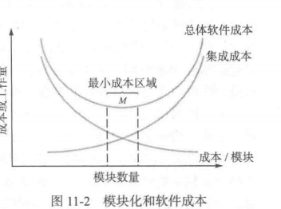

#### *6. 信息隐蔽 Information Hiding

其目的是将数据结构和处理过程的细节隐藏在模块接口之后。

每个模块对其它所有模块都隐藏自己的设计决策。

#### *7. 功能独立

**功能独立的概念是关注点分离、模块化、信息隐藏概念的直接产物。**

- 内聚（Cohesion）是模块内部各个元素彼此结合的紧密程度的度量。

- 耦合（Coupling）是模块之间的相对独立性（互相连接的紧密程度）的度量。

#### 8. 求精 

逐步求精（Stepwise Refinement）是一种**自顶向下的设计策略**

求精实际上是一个细化（elaboration）的过程

抽象和细化是互补的概念

#### 9. 方面

方面是一个横切关注点的表示

横切关注点（cross-cutting concern）是系统的某个特质，适用于许多不同的需求

#### *10. 重构 Refactoring

目的：以某种方式修改代码，而并不改变它的外部行为，但意外的副作用可能发生

#### 11. 面向对象的设计概念

类、对象、继承、消息和多态等

#### 12. 设计类

- The requirements model defines a set of analysis classes. The level of abstraction of an analysis class is relatively high.
- Design classes present more technical details as a guide for implementation. - - Design refines and extends entity classes.
-  Boundary classes and controller classes are developed and/or refined.

#### 13. 依赖倒置

依赖于抽象，而不是依赖于具体实现

高层模块不应当（直接）依赖于底层模块，两者都应当依赖于抽象。抽象不依赖于细节，细节依赖于抽象

核心思想就是面向接口编程

#### 14. 测试设计

。。。

### 3. 设计模型

#### 数据设计元素

在体系结构（应用）级，数据设计关注文件或数据库；在构件级，数据设计考虑实现实现局部数据对象所需的数据结构

#### 体系结构设计元素

软件的体系结构设计等效于房屋的平面图，提供软件的整体视图

#### 接口设计元素

三个重要元素：

1. 用户接口
2. 系统和外部应用的接口
3. 应用系统内部构件之间的接口

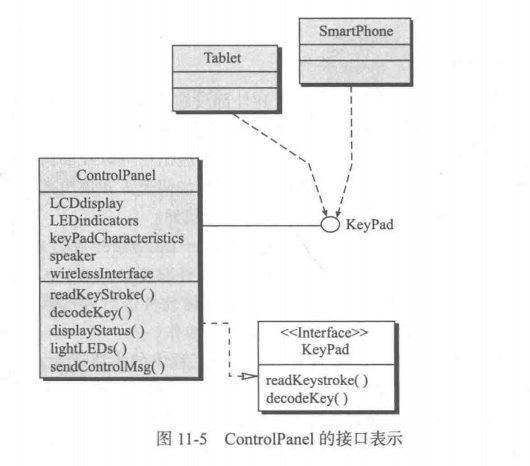

#### 构件级设计元素

定义了：

1. 数据结构
2. 算法描述
3. 接口

#### 部署级设计元素

Deployment-level design elements indicate how software functionality and subsystems will be allocated within the physical environment.

## 第12章 体系结构设计

**数据、功能和行为**这三个域是创建软件设计的指南

### 1. 软件体系结构

#### *什么是体系结构

1. 系统的一个或多个结构
2. 包括软件构件，构件的外部可见属性
3. 以及他们之间的相互关系

**体系结构并非可运行的软件**

确切的说是一种表达：

1. 对设计在满足既定需求方面的有效性进行分析
2. 在设计变更相对容易的阶段，考虑体系结构可能的选择方案
3. 降低与软件构建相关的风险

#### *体系结构为什么重要

1. 提供了一种表示，**有助于对计算机系统开发感兴趣的利益相关者开展交流**
2. **突出早期决策**，**对之后的软件工程工作有深远影响**
3. 构建了一个**相对小的，易于理解的描述构建工作的模型**

#### 体系结构描述

体系结构描述实际上是一组工作产品，这些产品反映了**不同的利益相关者从不同的角度对系统的理解。**

### 2. 体系结构类型 Architectural Genres(类型)

许多不同体系结构风格可以用于一种特定的类型（应用领域）

体系结构类型经常会规定特定的体系结构方法

### 3. 体系结构风格

**体系结构风格就是施加在整个系统设计上的一种变换，目的为系统所有构件建立一个结构。**

\***每种风格描述一种系统类别：**

1. 完成功能的组件
2. 构件间合作的连接件
3. 定义构件集成为系统的约束
4. 语义模型，使设计者通过分析系统组成成分理解整体性质

#### *风格分类

- 以**数据为中心**的体系结构：数据存储位于这种体系结构的中心

- **数据流**体系结构：

	适用于输入数据经过一系列计算构件和操作构件的变换形成输出数据。管道-过滤器模式（Pipe and filter architecture）

	数据流退化成单线变换，则称为批处理序列

- **调用和返回**体系结构

	一共相对易于修改和拓展的程序结构

	- Main program/subprogram architectures
	- Remote procedure call architectures

- **面向对象**体系结构

	封装操作

- **层次**体系结构

	MVC（模型，视图，控制器）

#### 体系结构设计

原型：表示核心抽象的类或模式，是体系结构设计的抽象构造块

**体系结构设计任务**：

- Representing the system in context 系统环境表示

	Architectural Context Diagram ACD

	Architectural description language (ADL)

- Defining a set of architectural archetypes 定义原型集

- Refining the architecture into components 精化为构件

- Describing Instantiations of the System 描述系统实例

## 第13章 构件级设计

### 什么是构件

\***构件是模块化的，可部署的 ，可替换的部件，封装了操作实现和接口**

三个重要观点：

1. 面向对象观点

	**以面向对象的观点来看，构件是协作类的集合**

2. **传统观点**

	传统组件包含

	- 处理逻辑
	- 内部数据结构
	- 接口

	传统构件也称为模块，扮演以下三个角色之一

	- 控制构件，构件间协调
	- 问题域构件，完成主要功能
	- 基础设施构件，负责完成问题域中的支持处理的功能

3. **过程相关的观点**

	从已有构件或设计模式中来构造系统

### 设计基于类的构件

面向对象设计的目标之一在于**支持可维护性和可复用性。**

#### *基本设计原则

在设计原则（非构件）还有一个单一职责原则Single Reposibility Principle（SRP）

每一个引起类变化的原因就是一个职责，当类具有多职责时，应把多余职责分离出去，分别创建一些类来完成每一个职责。

- 开闭原则 The Open-Closed Principle (OCP)

	1. 对扩展开放（Open for extension）模块的功能可以扩展，以满足需求发生的变化。
	2. 对修改封闭（Closed for modification）对模块行为进行扩展时，不改动模块的源代码。

- 里氏替换原则 The Liskov Substitution Principle (LSP)

	子类可以替换它们的基类。

	LSP本质：在同一个继承体系中的对象应该具有共同的行为特征。

	**LSP是使OCP成为可能的主要原则之一**。正是由于子类的可替换性
	才使得使用基类的模块在无需修改的情况下就可以扩展。

- 依赖倒置原则 Dependency Inversion Principle (DIP)

	依赖于抽象，而不是依赖于具体实现。

	**程序中所有的依赖关系都应该终止于抽象类或接口**
	
- 接口分离原则 The Interface Segregation Principle (ISP)

	接口应该是内聚的，应该避免“胖”接口。

	多个客户专用接口比一个通用接口要好

打包规则

- The Release Reuse Equivalency Principle (REP) 发布复用等价性原则
- The Common Closure Principle (CCP) 共同封装原则
- The Common Reuse Principle (CRP) 共同复用原则

#### Cohesion and Coupling

内聚是模块（构件）内部各个元素彼此结合的紧密程度的度量。

耦合是模块（构件）之间的相对独立性（互相连接的紧密程度）的度量。

### 实施构件级设计

1. 标识出所有**问题域**相对应的设计类
2. 确定所有与**基础设施**相对应的设计类

3. 细化所有不需要作为复用构件的设计类
	- 类、构件协作时说明消息的细节
	- 为每个构件确定适当的接口
	- 细化属性，定义数据类型和数据结构
	- 详细描述每个操作的处理流

4. 说明持久数据源并确定管理数据所需要的类
5. 开发并且细化类或构件的行为表示
6. 细化部署图以提供额外的实现细节
7. 考虑每个构件级设计表示，并时刻考虑其他可选方案

### 设计传统构件

A traditional software component is often called module, procedure, or subroutine.

将逻辑流程限制为以下三种结构：

- 顺序型
- 条件型
- 重复型

### 基于构件的开发

基于构件的软件工程CBSE， **是一种强调使用可复用软件构件来设计与构造计算机系统的过程。**

Standards for component software

- OMG/CORBA
- Microsoft COM and .NET,
- JavaBeans
- and OSGI (Open Services Gateway Initiative. 

Traditional component-level design requires the representation of data structures, interfaces, and algorithms for a program module in sufficient detail.

## 第14章 用户界面设计

可用性是指用户在使用高科技产品时，对使用的容易程度和有效程度的定量测量。

### *黄金规则

1. **把控制权交给用户**
	- 以不强迫用户进入不必要或不希望的动作的方式来定义交互模式
	- 提供灵活的交互
	- 允许用户交互被中断和撤销
	- 交互流水线化，允许定制交互
	- 用户与内部技术细节隔离开来
	- 允许用户与出现在屏幕上的对象直接交互
2. **减轻用户的记忆负担**
	- 减少对短期记忆的要求
	- 建立有意义的默认设置
	- 定义直观的快捷方式
	- 界面布局应该基于真实世界的象征
	- 以一种渐进的方式揭示信息
3. **保持界面一致**
	- 允许用户将当前任务放入有意义的环境中
	- 在完整的产品线内保持一致性
	- 对已经建立起的用户期望，不要轻易改变

黄金规则实际上构成了一系列用户界面设计原则的基础

### 用户界面的分析和设计

**用户模型确立了最终用户的轮廓（profile）**

**用户模型：工程师**

**设计模型：软件工程师 用户模型的实现**

**心理模型：用户**

**实现模型：系统实现者**

当系统实现模型和用户心理模型一致的时候，用户通常会对软件感到满意，使用起来很有效。如果这4种模型相差甚远，会导致用户不满意。界面设计人员的任务就是消解这些差异，导出一致的界面表示。

#### *过程

用户界面的分析和设计过程是迭代的

### *界面分析

界面分析意味着了解：

1. 通过界面和系统交互的人
2. 最终用户为完成工作要执行的任务
3. 作为界面一部分而显示的内容
4. 任务处理的环境

#### 1. 用户分析

设计师能够将用户心理模型与设计模型聚合在一起的唯一办法就是努力了解用户，以及了解用户是如何使用系统的。

#### 2. 任务分析和建模

任务分析的目标就是给出下列问题的答案 …（完成什么工作，流程，任务层次…）

为了回答这些问题，必须利用前面讨论的分析技术，把这些技术应用到用户界面。

- 用例
- 任务细化
- 对象细化
- 工作流分析
- 层次表示

#### 3. 显示内容分析

显示内容包括：
文字报告如电子表格，图形化显示如柱状图、三维模型、个人图片，或者特殊形式的信息如语音和视频文件等等。

#### 4. 工作环境分析

略略略

### *界面设计步骤

1. 定义界面对象和操作（操作）
2. 确定事件（用户动作）
3. 描述每个状态的表示形式
4. 说明用户如何利用界面的信息解释每个状态

#### 设计问题

- 响应时间
- 帮助设施
- 错误处理
- 菜单和命令标记
- 应用的可访问性
- 国际化

#### 设计评估

- 反映用户学习掌握系统的难度
- 反映系统交互时间和效率
- 反映用户学习系统所要记忆的内容
- 反映界面复杂度和用户接受程度

## 第17章 软件测试策略

### 软件测试的策略性方法

\***测试策略的测试模板**

1. 进行有效的 、正式的评审
2. 测试开始于构建层，然后向外延伸到整个系统的集成
3. 不同的测试技术适用不同的软件工程方法和时间点
4. 测试由软件开发人员和独立的测试组执行
5. 测试和调试是不同的活动，但任何测试策略包含调试

#### 验证和确认 Verification & Validation

- 验证：确保软件正确地实现某一特定功能的一系列任务

- 确认：确保开发的软件可追溯到客户需求的另外一系列任务

#### 测试策略 宏观

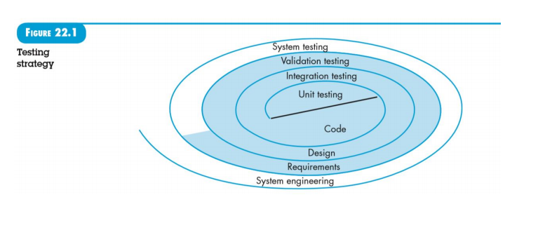

**测试步骤**：

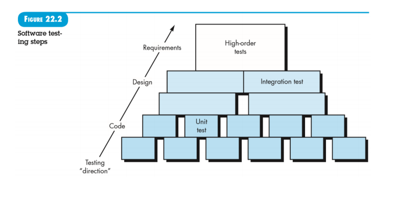

### 传统软件的测试策略 Test Strategies forConventional Software

#### 1. 单元测试 Unit Testing

- Focuses verification effort on the smallest unit of software design – the software component or module.
- Focuses on the internal **processing logic** and **data structures** within the boundaries of a component.
- Can be conducted in parallel for multiple components.

#### 2. 集成测试 Integration Testing

集成测试是构件软件体系结构的系统化技术，同时也是进行一些旨在发现与接口相关的错误的测试

**目标**是利用已通过单元测试的构件建立设计中描述的程序结构

- 一步到位集成方法

- 增量集成方法

	1. Top-Down Integration

		从主控模块开始，沿着控制层次逐步向下，以深度优先或者广度优先的方式将从属于主控模块的模块集成到结构中去

	2. Bottom-Up Integration

		从原子模块开始进行构建和测试

#### 3. 回归测试 Regression Testing 

回归测试是重新测试已测试过的某些子集，已确保变更没有传播不期望的副作用

回归测试是减少“副效应”的重要方法***，每次对软件做重要变更时***（包括构建的集成）都要进行回归测试

#### 4. 冒烟测试 Smoke Testing

冒烟测试是一种常用的集成测试方法。

频繁测试，简单，快速

冒烟测试的名称可以理解为这种测试耗时短，仅用一袋烟功夫足够了。

冒烟测试包括以下活动：

- 把一个新的软件构件集成到测试环境中
- 设计一组测试（冒烟测试），暴露其可能的错误
- 每天将该构建与其他构建及整个软件产品集成起来进行冒烟测试

**冒烟测试的好处：**

- 降低了集成风险
- 提高产品质量
- 简化错误的诊断和修正
- 易于评估进展状况

### 面向对象的软件测试策略

#### OO单元测试

不同在于：

- 传统软件单元测试侧重于模块的算法细节和模块接口数据
- 面向对象类的测试侧重于封装在该类中的操作和类的状态行为

封装的类是单元测试的重点，但不再孤立地对单个操作进行测试，而是将其作为类的一部分。

#### OO集成测试

- 基于线程的测试：事件
- 基于使用的测试：类

簇测试（Cluster testing ）：

把一簇协作的类集成在一起（通过检查CRC和对象-关系模型来确定）进行测试。

 ### *确认测试

α测试：由有代表性的最终用户在开发者的场所进行

β测试：在最终用户场所进行，通常没有开发者在场

 ### *系统测试

1. 恢复测试
2. 安全测试
3. 压力测试
4. 性能测试
5. 部署测试

### *调试技巧

蛮干brute force 在程序中插入大量输出语句

回溯backtracking 从发现错误的地方开始，向后（手工）跟踪代码，适合小程序

原因排除法cause elimination: induction, deduction, and introduces the concept of binary partitioning

## 第18章 测试传统的应用软件

### 软件测试基础

可测试性：程序能够被测试的容易程度

测试本身必须展示一系列特征，达到以最少工作量发现最多错误的目标。

**好的测试特征：**

- 较高发现错误的可能性
- 不冗余的
- 是“最佳品种”（时间和资源）
- 不太简单也不太复杂

### 测试的内部外部视角

- 黑盒测试：在软件接口处执行测试
- 白盒测试：基于过程细节的封闭检查
	- 保证模块所有独立路径至少被执行一次（基本路径测试）
	- 所有逻辑判定取真假两个方面
	- 上下边界及可操作的范围执行所有循环
	- 检验内部数据结构确保其有效性

### 基本路径测试

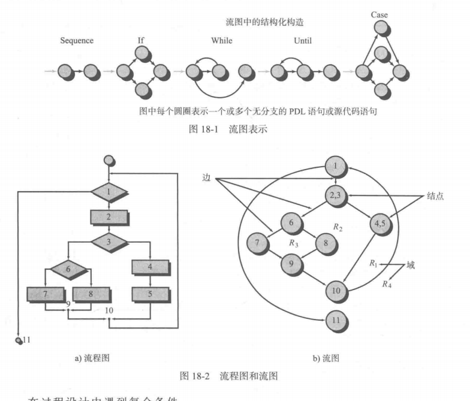

#### 独立程序路径

独立路径：任何贯穿程序的、至少引入一组新处理语句或一个新条件的路径

环复杂性Cyclomatic Complexity ：程序基本集合中的独立路径数

E 边数； N 结点数；P为判定结点数

- 域的数量和换复杂性对应
- E - N + 2
- P + 1

#### 生成测试用例

1. 以设计或源代码为基础，画出相应流图
2. 确定环复杂性
3. 确定线行独立路径基本集合
4. 准备测试用例，强制执行基本集合中的每条路径

### 控制结构测试

- 条件测试：检查逻辑条件选择

- 数据流测试：根据程序中变量的定义和使用位置来选择程序的测试路径

- 循环测试

	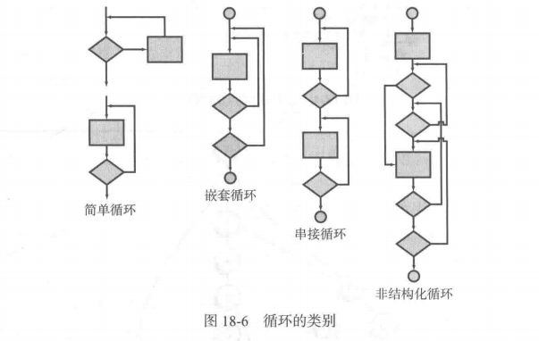

### 黑盒测试（行为测试，功能测试）

黑盒测试视图发现以下错误：

1. 不正确或遗漏的功能
2. 接口错误
3. 数据结构或数据库访问错误
4. 行为或性能错误
5. 初始化和终止错误

测试方法：

- Graph-based testing methods 基于图的测试方法
- Equivalence partitioning 等价类划分
- Boundary value analysis 边界值分析
- Orthogonal array testing 正交数组测试

#### 等价类划分

把所有的输入数据划分为若干等价类，并假定：每个类中的一个典型值在测试中的作用与这一类中所有其他值的作用相同，从中生成测试用例。

理想的测试用例可以单独发现一类错误，基于输入条件的等价类进行评估

#### 边界值分析（BVA）

略略略

