# 简明微积分 龚昇 第四版

> 主要为按照《简明微积分》的章节顺序，对“微积分”的总结以便后续复习用
>
> 会加入一些额外的补充（四川大学教材或相关没有的考研知识点）

## 第一章 微积分的概念

### 1.1 函数与极限

#### 数列极限和函数极限

数列极限：对于无穷序列$a_1,a_2,\dots,a_n$，极限表示为：$\lim_{n\to \infty} a_n = A$，首先要A存在

如果两个数列有极限，它们对应的和、差、积、商组成的数列的极限，分别位对应的和、差、积、商

函数极限：对于函数$y=f(x)$，当自变量x无限接近a时，f(x)趋向于一个固定的常数A，A即为极限，即$\lim_{n\to \infty}f(x) = A$

#### 连续函数

函数$f(t)$在$t=t_0$连续，即$\lim_{t\to t_0} = f(t_0)$成立

**闭区间**$[a,b]$上的**连续函数**一定存在两点$\xi,\eta$，使$f(\xi)=M,f(\eta)=m$，M，m分别为最大最小值

### 1.2 定积分

#### 定义

函数$f(x)$在区间$[a,b]$上的定积分记作：$I = \int_a^bf(x)dx$，更实质的表示形式：$\sigma = \Sigma_{i=1}^nf(\xi_i)\Delta x_i$，其中$\Delta x_i = x_i - x_{i-1}$，$\xi_i$就是区间$[x_{i-1},x_i]$中任一点。对切分法T，令$\lambda(T) = \max_{1\leq i \leq n}\Delta x_i$，当$\lambda(T)\to 0$时取得的极限就是定积分

#### 性质

定积分对应了函数在对应区间内图像和x轴形成的面积

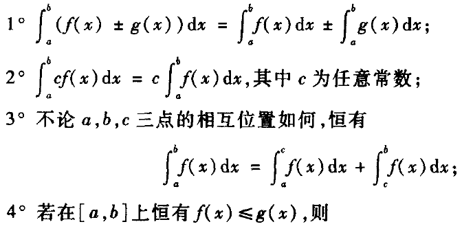

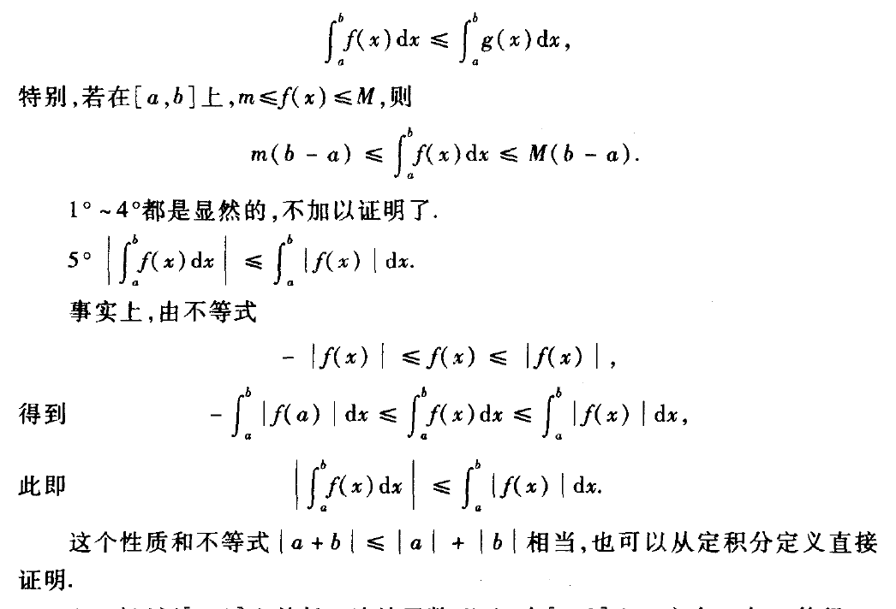

#### 积分中值定理

对于在$[a,b]$连续的函数$f(x)$，在此闭区间上存在一点$\xi$使得：
$$
\int_a^bf(x)dx=f(\xi)(b-a)
$$
证明如下：**使用最值证明**

设此区间上最大最小值分别为：M，m可得：
$$
m(b-a)\le \int_a^bf(x)dx \le M(b-a) \\
即：m \le \frac{\int_a^bf(x)dx}{b-a} \le M \\
令，\mu = \frac{\int_a^bf(x)dx}{b-a}
$$
因为$f(x)$是闭区间上的连续函数，且m，M为两个最值，所以存在点$\xi$满足$f(\xi) = \mu$，即：
$$
\int_a^bf(x)dx=f(\xi)(b-a)
$$

书本补充：

积分第二中值定理：

函数$f(x),\varphi(x)$都在闭区间连续，且$\varphi(x)$在闭区间内不变号，则有以下式子成立
$$
\int_a^b f(x)\varphi(x)dx = \varphi(\xi)\int_a^b f(x)dx
$$

### 1.3 微商与微分

#### 微商

微商的定义：$\lim_{\Delta x \to o} \frac{f(x_0+\Delta x)-f(x_0)}{\Delta x}$

$y=f(x)$是定义在$[a,b]$上的函数，$x_0$是区间内一点，上式的极限存在说明函数在点$x_0$处可微，称为微商或者导数

记作：$f'(x_0)或\frac{d_y}{d_x}\bigg{|}_{x=x_0}$

如果$f(x)$在区间内处处可微，那么$f'(x)$则为函数的导函数

从微商的定义出发，可以得出：**如果函数$y=f(x)$在一点$x_0$可微，则在这点一定连续**，证明如下：
$$
f(x+\Delta x)-f(x)=\frac{f(x+\Delta x)-f(x)}{\Delta x} \times \Delta x
$$
令$\Delta x \to 0$，因为可微，所以$\lim_{\Delta x \to o} \frac{f(x+\Delta x)-f(x)}{\Delta x}$存在，所以可得$\lim_{\Delta x \to 0}[f(x+\Delta x)-f(x)]=0$，即$f(x)$在点$x_0$处连续

常数的微商为0

#### 微分

微分和微商密不可分，设函数$y=f(x)$在点x处有微商$f'(x)$，则在点x的微分为：$dy = f'(x)\Delta x$，==单元函数==的微商和微分是一致的

对于$\Delta y = f(x_0+\Delta x) - f(x_0)$，根据微商定义有下式成立：
$$
\lim_{\Delta x \to 0}\frac{\Delta y}{\Delta x}=\lim_{\Delta x \to 0}\frac{f(x_0+\Delta x) - f(x_0)}{\Delta x} = f'(x_0) \\
若令，\frac{\Delta y}{\Delta x} - f'(x_0) = \alpha \\
即，\Delta y = f'(x_0)\Delta x + \alpha \Delta x
$$
因为当$\Delta x \to 0$，$\alpha \to 0$，所以$\alpha \Delta x$比$f'(x_0)\Delta x$更快趋于0，也就是说**可以使用微分近似代替函数的改变量**

函数$y=x$的微分为$dx = \Delta x$，即自变量的微分就是自变量的该变量，所以，微分也可表示为：$dy = f'(x) dx$

所以微商的另一种表示法：$\frac{dy}{dx} = f'(x)$，即因变量和自变量的微分商

#### 微分中值定理

##### 拉格朗日中值定理（微分中值定理）

若函数$f(x)$在$[a,b]$上连续，在开区间可微，则在$(a,b)$中存在一点$\xi$，使得：$\frac{f(b)-f(a)}{b-a}=f'(\xi)$

证明上述定理需要引入**极值概念，费马定理，罗尔定理**

1. **极值概念**

	存在正数$\xi$使得对区间$(x_0-\xi,x_0+\xi)$内的任意点x，都有$f(x) \le f(x_o)$，则说明$f(x)$在$x_0$取到极大值，极小值定义相似

2. **费马定理**

	**如果函数在$x_0$可微，并在此处取得极值，那么必有$f'(x_0)=0$**

	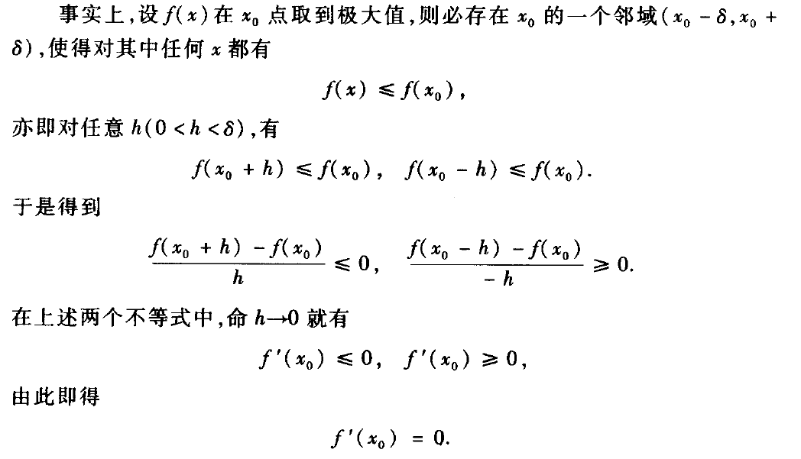

3. **罗尔定理**

	**若函数在$[a,b]$连续，开区间可微，且$f(a) = f(b)$，则存在点$\xi$，满足$f'(\xi) = 0$**

	连续推导出存在最大最小值，然后讨论相等不相等的情况即可证明

证明拉格朗日中值定理：

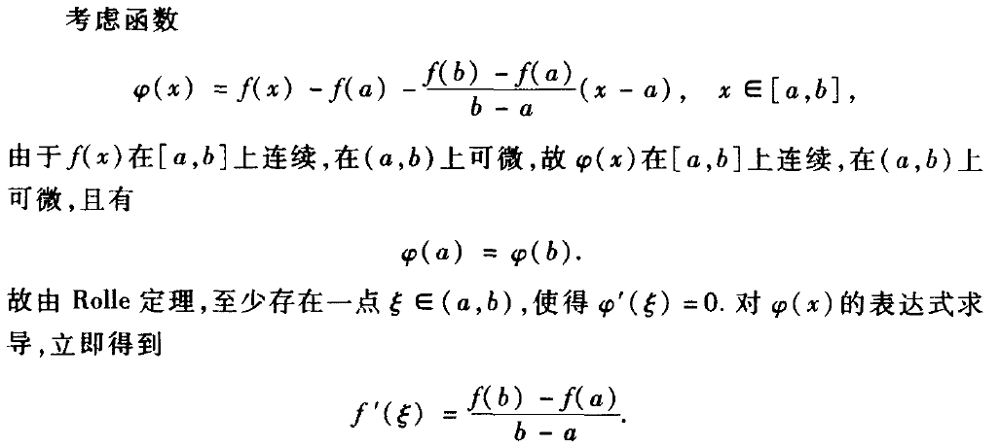

对于微分中值定理只需要，取$F(x) = \int_a^xf(t)dt$，带入微分中值定理，便可导出积分中值定理，**说明微分的一条定理和公式，在积分中应有相应的定理或公式，反之亦然，对立统一**。

##### 柯西中值定理

设$f(x)$和$g(x)$都是$[a,b]$上连续，开区间可微，并且对任一点$x\in(a,b),g'(x) \ne 0$，使得：
$$
\frac{f(b)-f(a)}{g(b)-g(a)} = \frac{f'(\xi)}{g'(\xi)}
$$
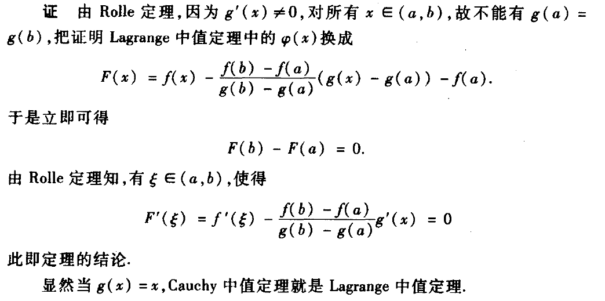

### 1.4 微积分基本定理

#### 微分形式

函数$f(t)$在区间$[a,b]$连续，x是区间内一固定点，令:
$$
\Phi(x) = \int_a^xf(t)dt(a\le x \le b)
$$
则$\Phi(x)$在区间内可微，并且
$$
\Phi '(x) = f(x) (a \le x \le b) \\
即, d\Phi(x) = f(x)dx
$$
证明如下：

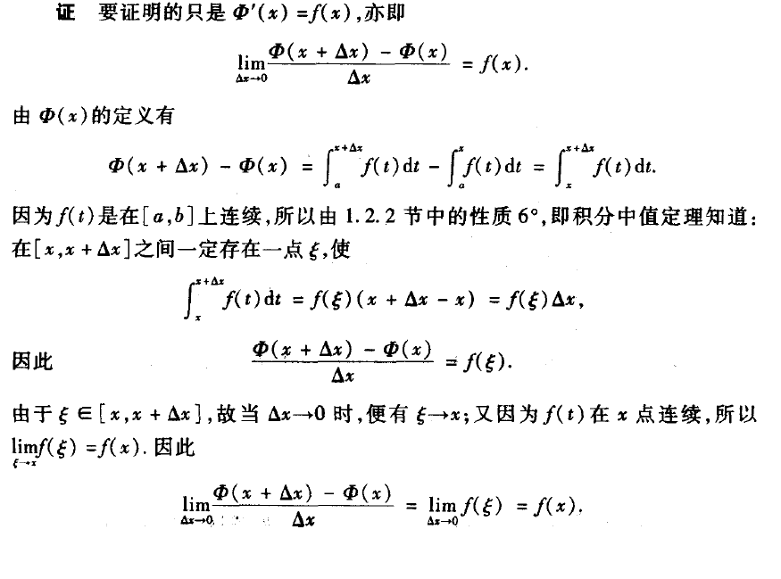

####　积分形式

设$\Phi(x)$在区间$[a,b]$可微，且$\frac{d\Phi(x)}{dx}$等于连续函数$f(x)$，那么成立着：
$$
\int_a^xf(t)dt=\Phi(x)-\Phi(a)(a\le x\le b)
$$
证明如下：

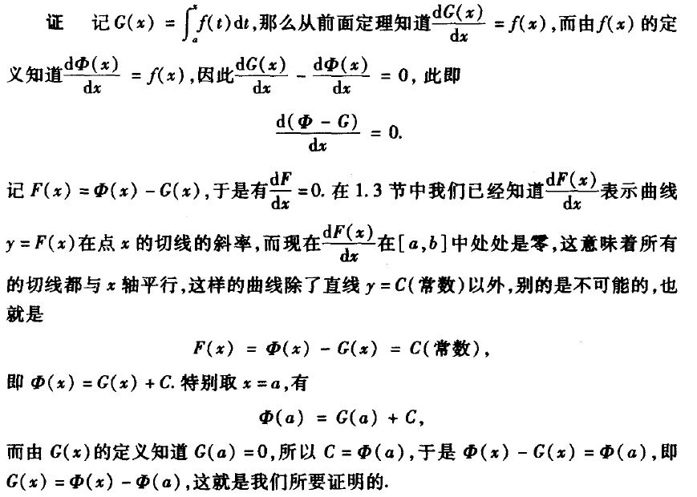

## 第二章 微积分的运算

### 2.1 微分法

#### 微商与微分的计算

假设$u(x)，v(x)$都是可微函数，那么它们的和、差、积、商都是可微的，有以下式子成立：

1. $[u(x)\pm v(x)]' = u'(x) \pm v'(x)$

2. $[u(x)v(x)]'=u'(x)v(x)+u(x)v'(x)$

3. $[\frac{u(x)}{v(x)}]'=\frac{u'(x)v(x)-u(x)v'(x)}{[v(x)]^2}$

4. $[Cv(x)]'=Cv'(x)$

5. $y=f(u),u=\varphi(x)$，有$\frac{dy}{dx}=f'(u)\varphi'(x)$，可以由定义证明

6. 若$x=g(y)是y=f(x)的反函数，且f'(x)\neq 0$，有$g'(y) = \frac{1}{f'(x)}$，==注意这里的变量==

	可以由复合函数求导推，这有一个数学上的解释：

	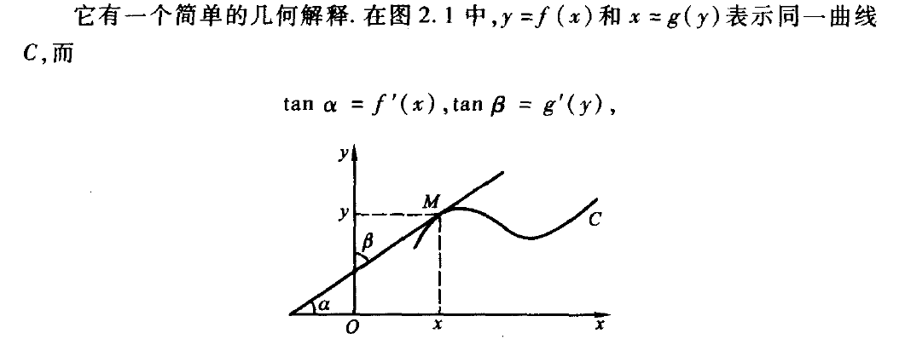

常用初等函数微商表：

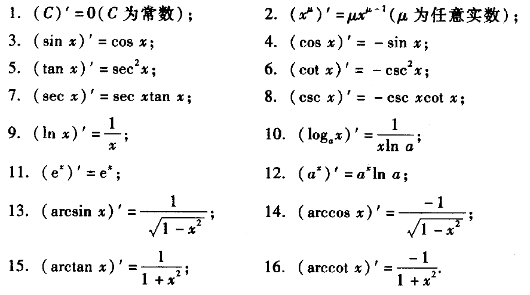

其他一些必要的：

- $\ln(x+\sqrt{1+x^2})' = \frac{1}{\sqrt{1+x^2}}$

	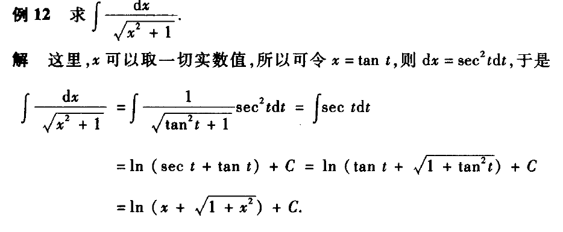

- 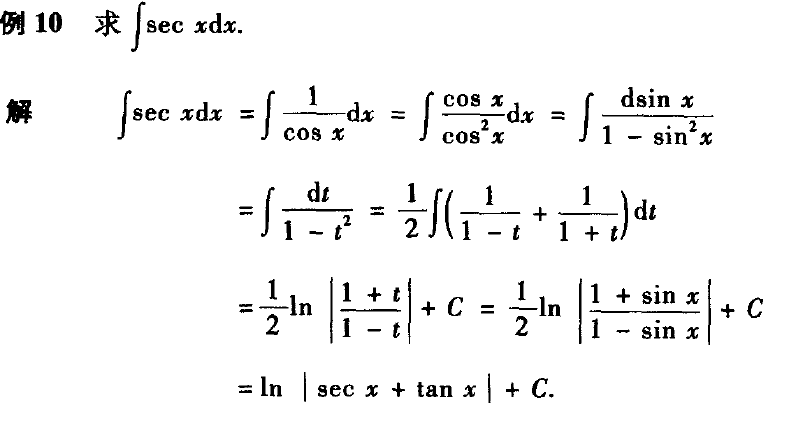

对应微商的运算法则，也有对应的微分运算法则，差不多是一致的，但是复合函数的微分有区别：

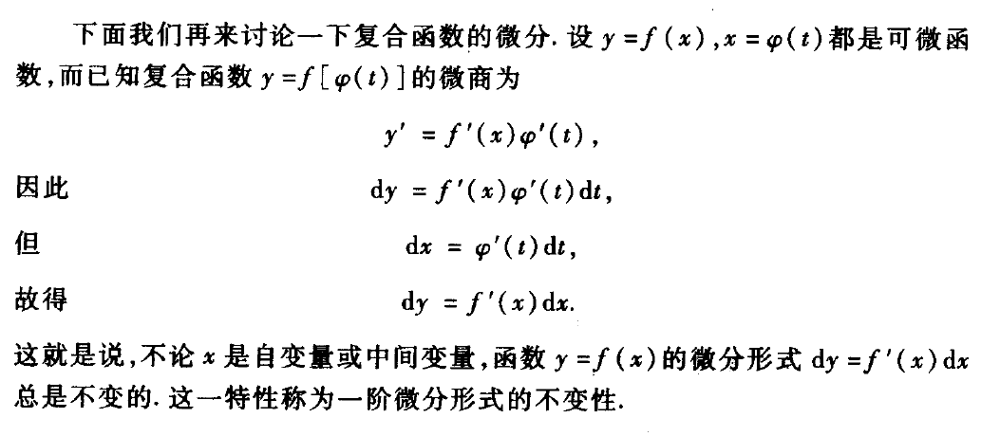

即为**微分的形式不变性**

#### 高阶微商与高阶微分

如果函数$f'(x)$的微商存在，就把他称为函数$f(x)$的二阶微商，记作$f''(x)$或者$\frac{d^2f(x)}{dx^2}$，二阶微商的定义和微商的定义并无区别，同样的微分也有类似的定义：

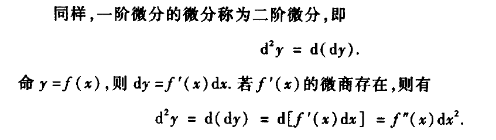

几种特别的高阶微分：

1. **三角函数**

	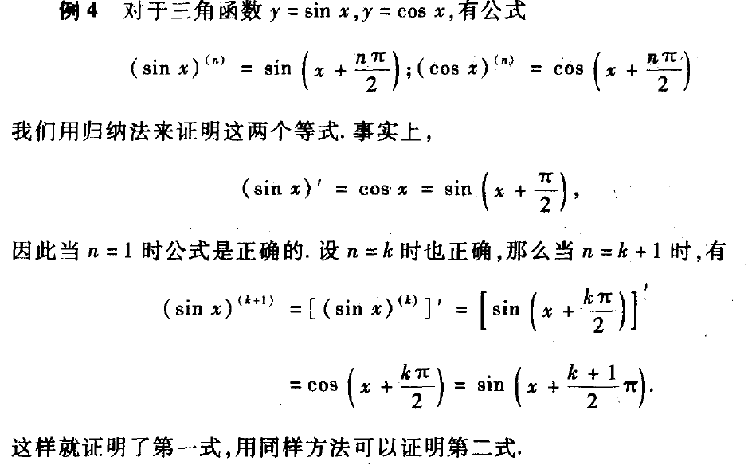

2. 莱布尼兹公式（函数乘积的高阶微分）

	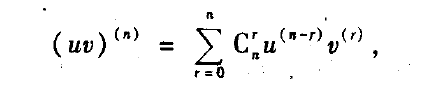

**参数方程所确定**的函数的微分法：

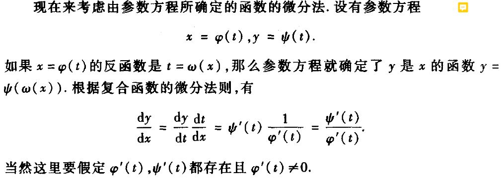

#### 微分的近似计算

函数$y=f(x)$的改变量$\Delta y$可以用微分$dy$来近似的表达，所以可得：
$$
f(x_0+\Delta x) \approx f(x_0)+f'(x_0)\Delta x
$$
利用这个还可以求近似方程的根

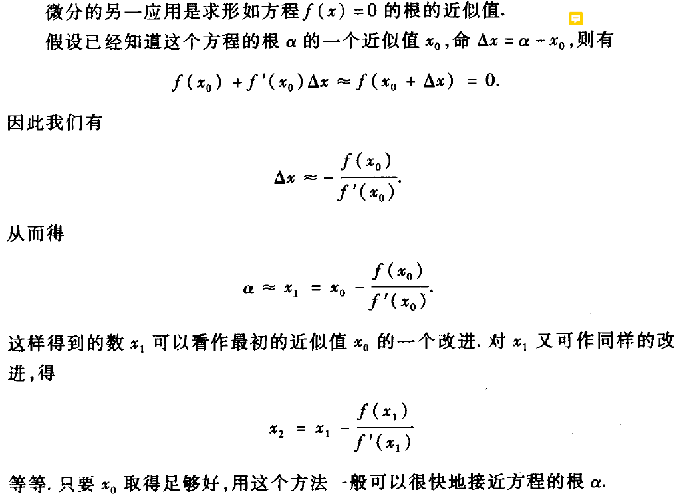

$x_1$就是函数$y=f(x)$在点$(x_0,f(x_0)$的切线和x轴交点的坐标，所以这也叫**切线法**

### 2.2 积分法

#### 不定积分的计算

1. 换元法：对应与复合函数微分

	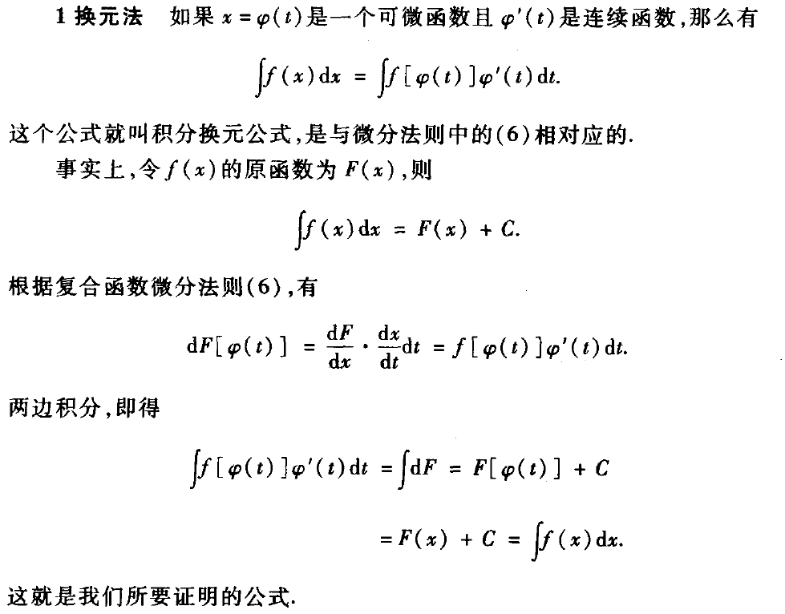

	即将代求函数转换为另外一个容易求的函数

	有时候换元法可以反过来用，令$x=\varphi(t),dx=\varphi'(t)$，然后将待求函数转换为t的函数

2. 分部积分：对应微分乘法法则

	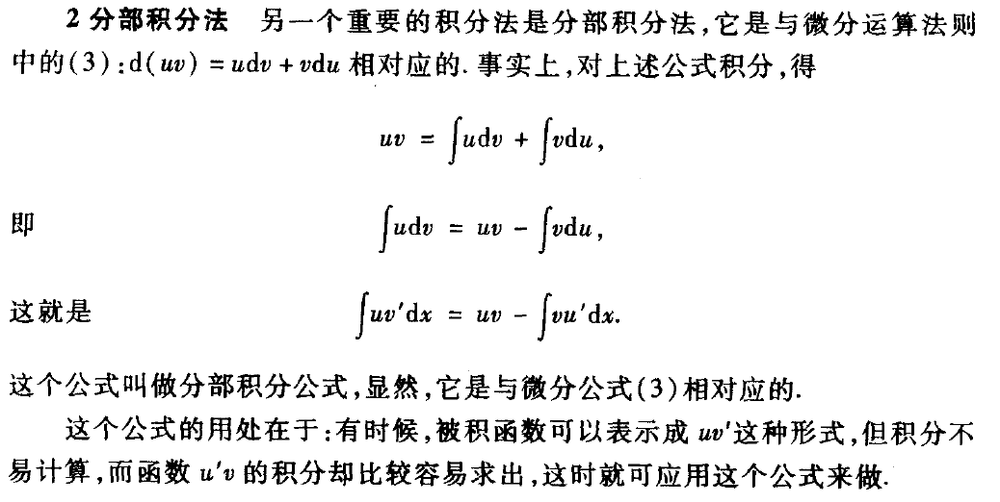

**特别函数的不定积分**：

积分$J_n = \int\frac{dx}{(x^2+a^2)^n},a\neq0$，**主要是使用分部积分求出通项公式**

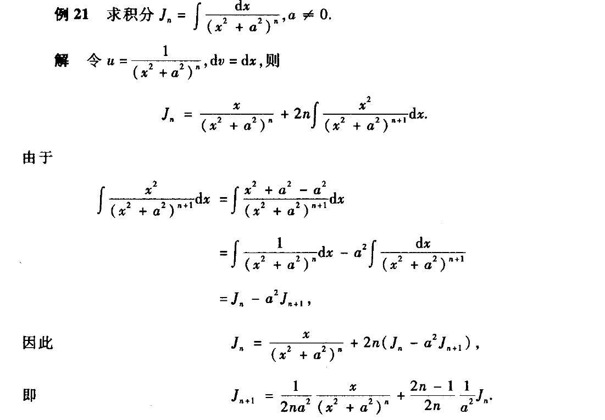

特别的，当$n=1$时，有$J_1 = \int\frac{dx}{x^2+a^2}$，可得$J_1 = \frac{1}{a}arctan(\frac{x}{a})+C$

##### 有理函数的不定积分

将被积函数化为一个多项式和一个真分式之和，主要为求解真分式的积分：

对一般积分$\int\frac{mx+n}{x^2+px+q}dx$，可以将分母配方后，进行换元解决，有时候还可以对分母进行因式分解，然后化为多个低次项之和的形式。

##### 三角函数有理式的积分

> 三角函数以及无理数部分摘自 《四川大学高等数学第一册第四版物理类专用》

**基本三角函数公式：**

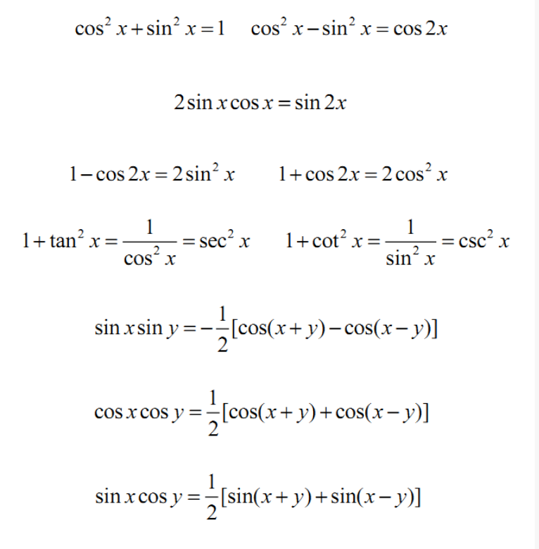

- 辅助角公式：$a\sin x + b \cos x = \sqrt{a^2+b^2} \sin(a+\phi), \phi = \arctan \frac{b}{a}$

- $\tan \frac{x}{2} = \frac{\sin x}{1 + \cos x} =\frac{1-\cos x}{ \sin x}$

- $d \tan \frac{x}{2} = \frac{1}{1+\cos x}$

- $1+\tan^2 = \sec^2$

- $$
	\begin{align*}
	\int \frac{1}{\sin x} dx &= \int \csc dx = \int \frac{\csc x(\csc x - \cot x)}{\csc x - \cot x} \\ &= \ln \vert \csc x - \cot x \vert \\
	 &= \ln \vert \tan \frac{x}{2} \vert
	\end{align*}
	$$

特别的三角积分

万能代换：积分$\int R(\sin x,\cos x)dx$可以通过变量代换化为有理函数积分
$$
令\tan \frac{x}{2} = t,则x = 2\arctan t,dx = \frac{2dt}{1+t^2} \\
因为：\sin x = 2\sin \frac{x}{2} \cos \frac{x}{2} = \frac{2t}{1+t^2} \\
\cos x = \cos^2\frac{x}{2} - \sin ^2\frac{x}{2} = \frac{1-t^2}{1+t^2} \\
即\int R(\sin x, \cos x)dx = \int R(\frac{2t}{1+t^2},\frac{1-t^2}{1+t^2})\frac{2}{1+t^2}dt
$$
其他情况：

1. $\int R(\sin x)\cos x dx$或$\int R(\sin x,\cos^2 x)\cos x dx$ $\Rightarrow$ 做代换$\sin x = t$

2. $\int R(\cos x)\sin xdx$或$\int R(\cos x, \sin^2 x)\sin x dx$$\Rightarrow$做代换$\cos x = t$

3. $\int R(\tan x)dx$或$\int R([\sin^2 x], [\cos^2 x],[\tan x])dx \Rightarrow$做代换$\tan x = t$，

	可得：$\sin^2 x = \frac{\tan^2 x}{1+\tan^2 x} = \frac{t^2}{1+t^2}$和$\cos^2 x = \frac{1}{1+\tan^2 x} = \frac{1}{1+t^2}$

	有$x = \arctan t,dx = \frac{1}{1+t^2}dt$

4. $\int \sin^n x \cos^m x dx$

	- n或者m为奇数就可以直接化为单一的$\cos$或者$\sin$了
	- 如果n和m是偶数则使用积化和差等方式解决，或者化为$\int f(sin^2x)dx$看定积分计算中的推导式子

5. $\int \sec^n x \tan^m x dx$

	- 利用公式$1+\tan ^2 = \sec^2$
	- 如果n是偶数则很容易使用$d\tan x = \sec^2 xdx$代换为$f(\tan x)$
	- m是奇数则可以利用$d\sec x = \sec x \tan x dx$代换为$f(\sec x)$
	- 都为偶数直接化为$\int \sec^n x dx$或$\int \tan^n x dx$的形式求

6. $\int tan^n xdx$

	- n 为1或2时，自己求一下
	- 对于更高次可以转换为*5的格式*的积分

7. $\int sec^n xdx$

	- 类似*6*，这里转换为*5格式*的时候需要分部积分一下

	- *5、6、7格式*参见

		[https://tutorial.math.lamar.edu/Classes/CalcII/IntegralsWithTrig.aspx](https://tutorial.math.lamar.edu/Classes/CalcII/IntegralsWithTrig.aspx )

		[https://www.stewartcalculus.com/data/CALCULUS%20Concepts%20and%20Contexts/upfiles/3c3-TrigonometIntegrals_Stu.pdf](https://www.stewartcalculus.com/data/CALCULUS Concepts and Contexts/upfiles/3c3-TrigonometIntegrals_Stu.pdf)

##### 简单无理数的积分

以下代换称之为欧拉代换：

1. $\int R(x,\sqrt[n]{\frac{ax+b}{cx+e}})dx$令$\frac{ax+b}{cx+e} = t^n$
2. $\int R(x, \sqrt{ax^2+bx+c}dx)$
	- 如果$b^2-4ac > 0$，则可因式分解（存在两个根）可以设$\sqrt{a(x-\alpha)(x-\beta)}=t(x-\alpha)$
	- 如果$b^2-4ac < 0$，有以下两种策略
		1. $\sqrt{ax^2+bx+c} = \sqrt{a}x\pm t$
		2. $\sqrt{ax^2+bx+c} = xt \pm \sqrt{c}$
3. $\sqrt{x^2+a^2}$，令$x = a\tan t$
4. $\sqrt{x^2-a^2}$，令$x = a\sec t$
5. $\sqrt{a^2-x^2}$，令$x = a\sin t$
6. $\int \sqrt{x^2-1} dx=\frac{1}{2}(x\sqrt{x^2-1}-\ln (|x+\sqrt{x^2-1}|))$
7. $\int \frac{1}{\sqrt{x^2+1}} dx=\ln (|x+\sqrt{x^2+1}|)$

#### 定积分的计算

根据牛顿-莱布尼兹公式（微积分基本定理的积分形式）：

设$\Phi(x)$在区间$[a,b]$可微，且$\frac{d\Phi(x)}{dx}$等于连续函数$f(x)$，那么成立着：
$$
\int_a^xf(t)dt=\Phi(x)-\Phi(a)(a\le x\le b)\int_a^xf(t)dt=\Phi(x)-\Phi(a)(a\le x\le b)
$$
根据此公式，可得定积分和不定积分并无特别大的区别，只不过都加上了定限而已，**在换元的时候注意积分上下限对应的更改**

几种特别注意的例子：

1. 奇偶函数

	- 奇函数：$\int_{-l}^{l}f(x)dx = 0$
	- 偶函数：$\int_{-l}^{l}f(x)dx = 2\int_{0}^{l}f(X)dx$

2. 积分$J_m = \int_0^{\frac{\pi}{2}}\sin^m xdx和J'_m = \int_0^{\frac{\pi}{2}}\cos^m xdx$

  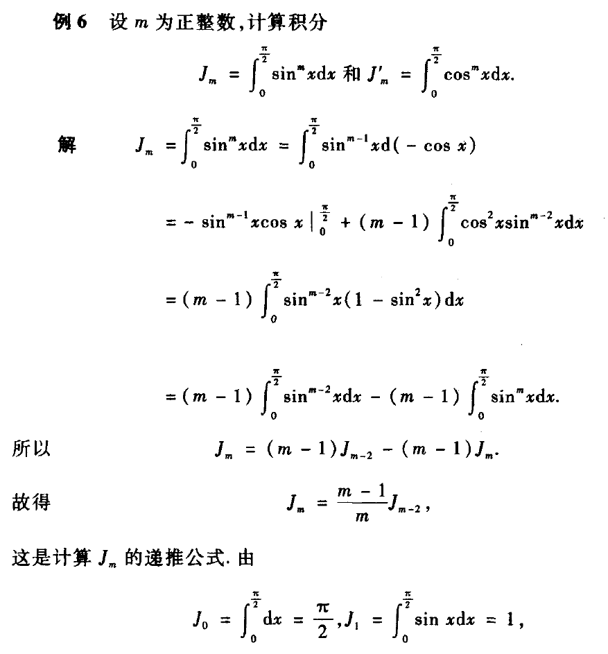

  有以下结论：（双阶乘符号为不大于N且奇偶相同==正整数==的乘积）

  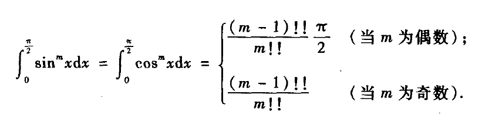

  根据上述公式可以推导出对于$[\frac{k\pi}{2},\frac{t\pi}{2}]$有：
$$
  \int_\frac{k\pi}{2}^\frac{t\pi}{2} sin^m dx = \int_\frac{k\pi}{2}^\frac{t\pi}{2} cos^m dx = \frac{(m-1)!!}{m!!} \left\{ 
  \begin{array}{cl}
  J_0 & (当m为偶数)\\
  J_1 &(当m为奇数)\\
  \end{array}
  \right. \\
  J_0 = \int_\frac{k\pi}{2}^\frac{t\pi}{2} = \frac{t-k}{2}\pi \\
  J_1 = \int_\frac{k\pi}{2}^\frac{t\pi}{2} \sin x dx
$$

3. 几种三角积分的恒等式

  - $\int_0^{\frac{\pi}{2}}f(\sin x)dx = \int_0^{\frac{\pi}{2}}f(\cos x)dx$ 令 $x = \frac{\pi}{2} - t$可证
  - $\int_0^\pi xf(\sin x)dx = \frac{\pi}{2}\int_0^\pi f(\sin x)dx$令$x = \pi - t$可证

4. 其他值得注意的例子

	- 一元积分转换为二元积分，这里就是计算$I^2$的

	$$
	\begin{align}
	I_1 =\int_{-\infty}^{\infty} e^{-x^2}dx =& \sqrt{2\pi} \\
	I_2 = \int_{0}^{\infty} e^{-x^2}dx =& \frac{1}{2} \sqrt{\pi} \\
	\end{align}
	$$

	

#### 定积分的近似计算

有梯形法和抛物线法两种，梯形法即为定义，而抛物线法则是取连续的三点，构造连接三点的多项式函数，用此函数替代原来的函数做积分

## 第三章 微积分的一些应用

### 3.1 面积、体积、弧长

#### 面积

1. 单条函数$y=f(x)$，与直线$x = a, x = b, y = 0$围成的面积为：$S = \int_a^b \vert f(x) \vert dx$
2. 封闭曲线围成$S = \int_a^b \vert f_1(x) - f_2(x)\vert dx$
3. 极坐标下$\rho = f(\theta),\alpha \le \theta \le \beta$，有 $S = \frac{1}{2}\int_\alpha^\beta f^2(\theta)d\theta$

#### 体积

底面积乘高即可

#### 弧长

见书本P90

基本思路为：

1. 将X轴划分成T个点
2. 弧长微元可以看作是两点距离，转换为微分形式
3. 即可得出解

设曲线为参数方程：$x = \phi(t),y=\psi(t),(\alpha \le t \le \beta)$

可得：
$$
s = \int_\alpha^\beta \sqrt{[\phi'(t)]^2 + [\psi'(t)]^2}dt\\
\frac{ds}{dt} = \sqrt{[\phi'(t)]^2 + [\psi'(t)]^2}dt \\
或 \\
ds^2 = dx^2 + dy^2
$$

### 3.2 曲线的描绘

#### 增减性

在区间$(a,b)$内$f'(x) > 0 (或f'(x) < 0)$说明在此区间内，函数是递增的（递减的）

可用微分中值定理证明（也就是微商的定义）

#### 凹凸性

- 凸：切线在曲线上方，且对应的导数递减$\rightarrow f''(x) < 0$
- 凹：切线在曲线下方，且对应的导数递增$\rightarrow f''(x) > 0$
- 拐点：由凹转凸的点，$\rightarrow f''(x) = 0$，此条件不是充分的，具体需要看其二阶导左极限和右极限是否变号，某些二阶导不存在的函数，依然存在拐点，这种需要判断拐点左右近旁的极限是否是变号，即==二阶导为0三阶导数不为0的点==
- 驻点：一阶导数为0的点

#### 渐近线

- 垂直渐近线：若$\lim_{x\rightarrow a} f(x) = \infty$ 则$x = a$为垂直渐近线

- 水平渐近线：若$\lim_{x\rightarrow \infty} f(x) = a$ ，则$y = a$是水平渐近线

- 斜渐近线：若存在渐近线$y=ax+b$，可得
	$$
	\lim_{x\rightarrow \infty}(f(x) - ax - b) = 0 \\
	\lim_{x\rightarrow \infty} \frac{f(x) - ax - b}{x} = 0 \\
	\lim_{x\rightarrow \infty} \frac{f(x)}{x} = a \\
	\lim_{x\rightarrow \infty} (f(x) - ax) = b
	$$

==注意这里的$\infty$可以是正也可以是负无穷==

#### 曲率

- 定义：对应弧的角度和长度的比值为平均曲率，当弧很小时的极限为曲率，$k = \lim_{\Delta s \rightarrow 0 } \frac{\Delta \phi}{\Delta s}$

- 推导：

	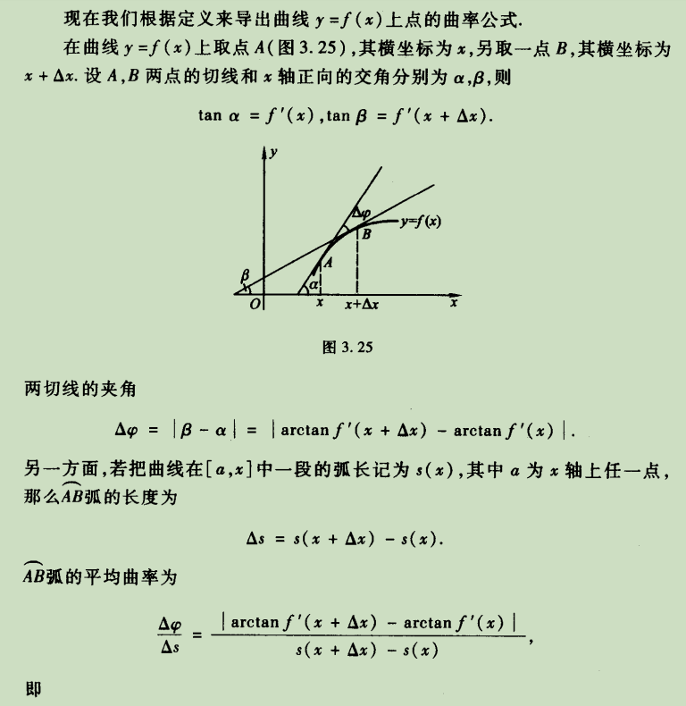

	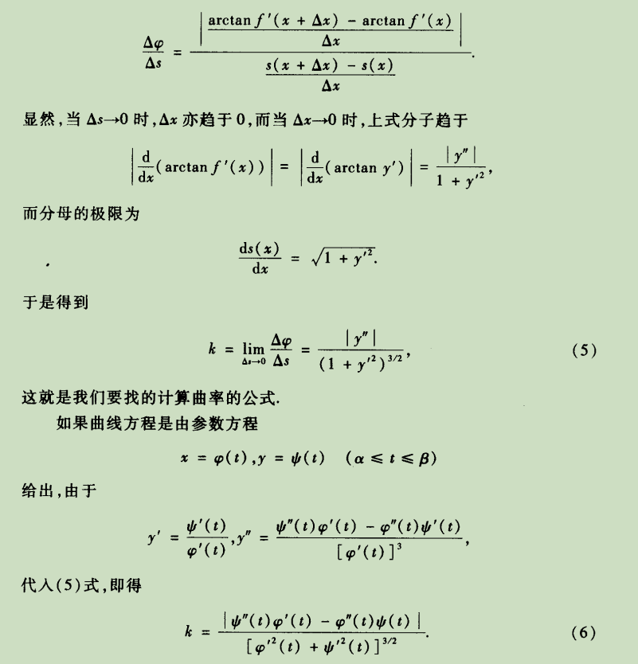

### 3.3 Taylor（泰勒）展开式与极值

#### 泰勒展开式

即使用多项式（初等函数）描述一般函数的局部性质的方式。此n次多项式$P_n(x)$满足在$x = x_0$处与$f(x)$具有相同的值，且他们的一阶、二阶、……、n阶微商也相同，即要求：

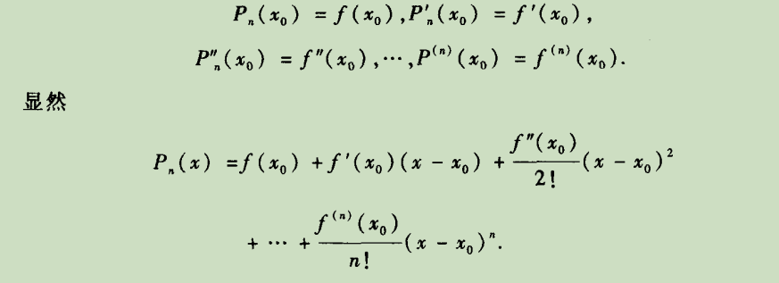

余项的解释：

此余项也称为拉格朗日余项，可以得出其为$(x-x_0)^n$的高阶无穷小，$(x-x_0)^{n+1}$的等价无穷小

所以余项也有此种表示法：$o((x-x_0)^n)$(皮亚诺余项)或$O((x-x_0)^{n+1})$

在$x = 0$处的泰勒展开为麦克劳林式

#### 洛必达 （L’Hospital 法则）

若f(x),g(x)在$x = x_0$处有二阶微商，$g’(x_0) \neq 0$，且$\lim_{x\rightarrow x_0}f(x) = 0, \lim_{x\rightarrow x_0}g(x) = 0$

则，$\lim_{x \rightarrow x_0}\frac{f(x)}{g(x)} = \frac{f'(x_0)}{g'(x_0)}$

用泰勒展开即可证明，此法则也适用于$\frac{\infty}{\infty}$形式

对于其他形式的可以转变为$\frac{0}0,\frac{\infty}{\infty}$的形式，如：

1. $f\cdot g = 0\cdot \infty$ 可以转变为$\frac{f}{\frac{1}{g}}$或者$\frac{g}{\frac{1}{f}}$
2. $f-g = \infty - \infty$可以变为$\frac{\frac{1}{g} - \frac{1}{f}}{\frac{1}{g}\cdot \frac{1}{f}}$
3. $f^g = 0^0,1^\infty,\infty^0$两边取对数即可

#### 极值

简单来说极值点为满足$f'(x) = 0$的点，**此条件为必要条件而非充分条件**，==充分条件==为检查此点的左近旁和右近旁是否变号，且根据变号确定是极大值和极小值		

在$f'(x) = 0$下有以下简单的结论：

1. $f''(x) > 0$，则取到极小值
2. $f''(x)<0$，则取到极大值
3. $f''(x) = 0$，讨论$f''(x)$领域内的符号变化

## 第四章 常微分方程

从函数的微商、微分及其高阶的一些关系求出原函数的过程。	

如果微分方程中变量y及其各阶微商都是一次的，而且也不包含有其乘积如$yy',y'y'',sin y, e^{y'} \dots$，则称方程是线性的，否则为非线性的。线性微分方程的一般表达如下：

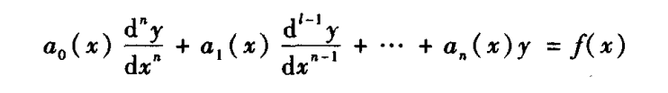

常微分方程：微分方程中的未知函数仅含有一个自变量的微分方程，否则称为偏微分方程

### 4.1 一阶微分方程

一阶微分方程的一般表达式：$a_0(x) \frac{dy}{dx} + a_1(x)y = f(x)$

#### 分离变量

对于形如：$g(y)dy = f(x)dx$形式的微分方程，只需要两边积分便可以得到$\int g(y)dy = \int f(x)dx + C$，这种可以将自变量和变量分开的方法称为**分离变量**。

对于微分方程中存在$\frac{y}{x}$的情况可以使用$y = ux$代换u是关于x的函数，最后使用$u = y/x$代换回去即可

#### 线性方程

一阶微分方程的全部解如下：

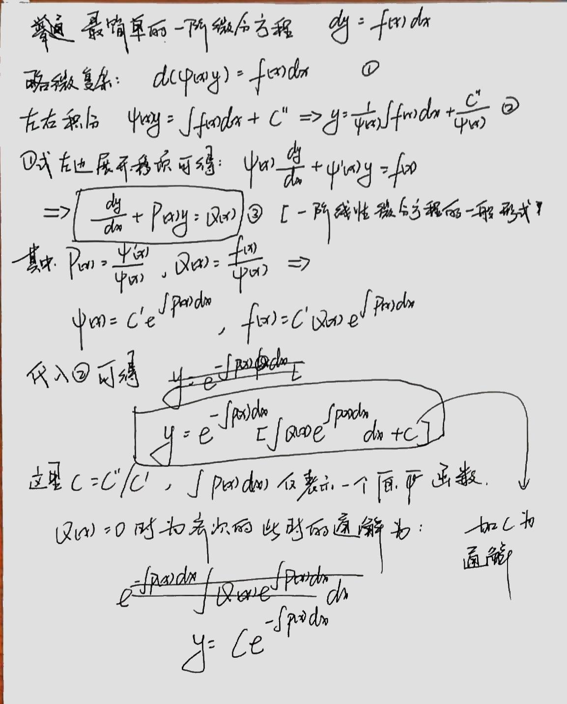

#### 常数变易法

> [常数变易法的本质-知乎](https://www.zhihu.com/question/31329122/answer/134977454)
>
> 二阶的变易法也可以设 $y = u(x) \cdot v(x)$ 解决

上面给出的推到方式是从一个稍微复杂的线性方程推导的

对于一般式子：

$$
\frac{dy}{dx} + P(x)y = Q(x) \tag{1}
$$
对其齐次方程$\frac{dy}{dx} + P(x)y = 0$，可以很快的分离变量并获得其通解如下：
$$
y = C e^{-\int P(x)dx}
$$
然后将齐次方程中的通解中的常数C，变易为x的函数C(x)，然后将$y = C(x) e^{-\int P(x)dx}$带入(1)式中可得：
$$
\begin{align*}
C'(x) &= Q(x) e^{\int P(x)dx} \\
C(x) &= \int Q(x)e^{\int P(x)dx}dx \\
特解：y &=  e^{-\int P(x)dx} \int Q(x)e^{\int P(x)dx}dx \\
与齐次通解相加，得通解：y &= e^{-\int P(x)dx} [\int Q(x)e^{\int P(x)dx}dx + C]
\end{align*}
$$

### 4.2 二阶微分方程

#### 可降阶的方程

即有些二阶微分方程可以化成一阶微分方程来处理，称之为可降阶的方程，这种解法叫做降阶法

1. **不显含未知函数**的二阶方程：$y'' = f(x, y')$

	只需要令$p = y'$即可

2. **不显含自变量**的二阶方程：$y'' = f(y, y')$

	任做$p = y'$，由于
	$$
	\frac{d^2y}{dx^2} = \frac{dp}{dx} = \frac{dp}{dy}.\frac{dy}{dx} = p \frac{dp}{dy} \\
	所以方程化为：\frac{dp}{dy} = \phi(y, p)
	$$
	解出这个一阶微分方程后，在对x积分即可

#### 二阶线性方程

二阶非齐次线性方程：$y'' + p(x)y' + q(x)y = f(x)$

二阶齐次线性方程：$y'' + p(x)y' + q(x)y = 0$

- 二阶线性常微分的解的结构性定理

	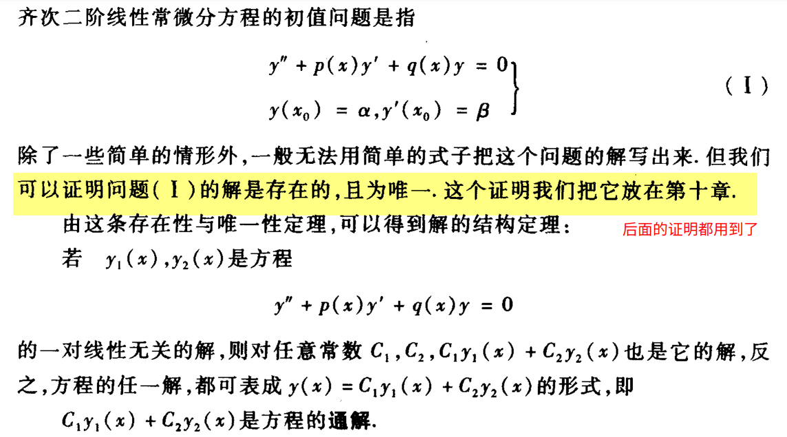

- 二阶齐次常微分方程

	一般的二阶常微分方程**可以先找到一个不等于0的解**，然后借助**刘维尔公式**得出另外一个解，这两个解构成一对线性无关解

	刘维尔公式如下：
	$$
	W(x) = W(y_1(x), y_2(x)) = C e^{-\int p(x)dx}
	$$
	给出了齐次方程的系数p(x)和它的两个解$y_1, y_2$的Wronsky行列式的关系，这里也看出W(x)在某点为0与处处为0的等价。

	**Wronsky行列式**(即W(x))为:
	$$
	\left|\begin{array}{ccc} 
	    y_1 & y_2 \\ 
	    y_1' & y_2' \\ 
	\end{array}\right|  = y1y_2' - y_2y_1'
	$$
	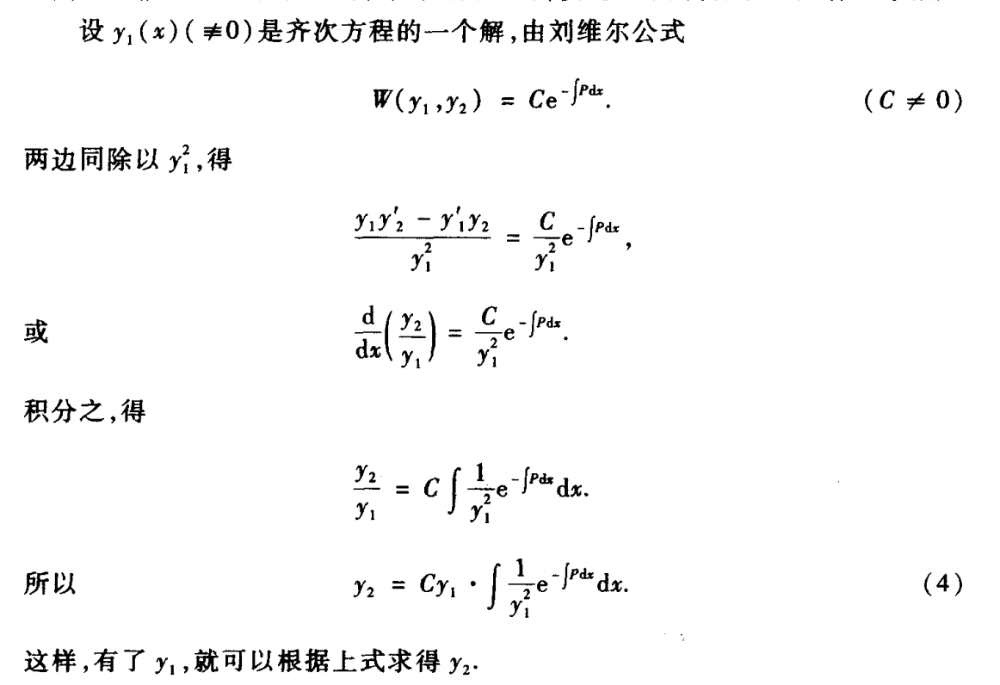

	*具体推导见P149*

- 二阶非齐次常微分方程

	如果有非齐次方程的特解y，和对应齐次方程的通解u，那么 $y+u$，就说非齐次方程的通解

	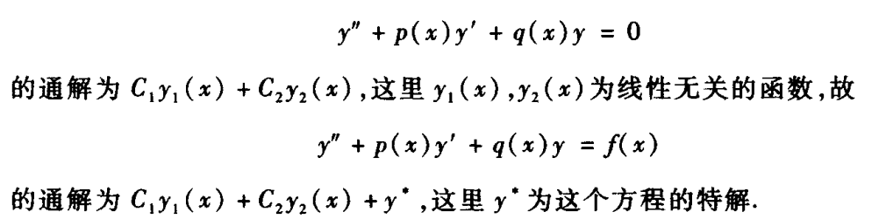

	$y*$可以通过常数变易法从二阶齐次微分方程的通解得出，所以只需要知道对应齐次方程的一个特解就可以得出二阶非齐次常微分方程的通解了,*推导见P150*

	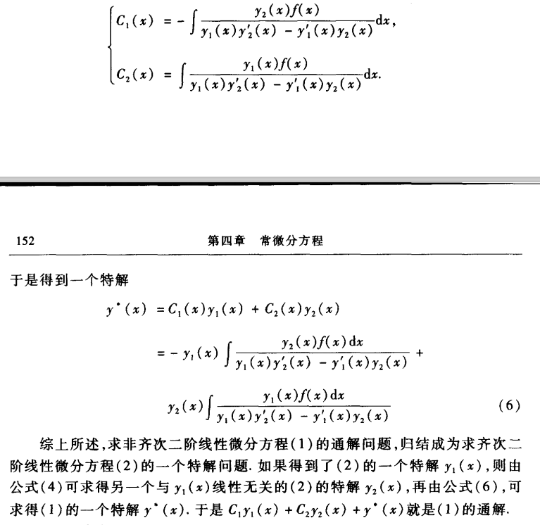

### 4.3 常系数线性方程

二阶常系数线性方程即二阶线性方程的系数p(x), q(x)为常数的情况
$$
y'' + ay' + by = f(x)
$$

#### 二阶齐次常系数微分方程

对形如$y'' + ay' + by = 0$的齐次方程，不难看出，有形如$y = e^{sx}$的解，带入得：
$$
(s^2 + as + b) e^{sx} = 0 \Rightarrow s^2 + as + b = 0
$$
上式称为微分方程的**特征方程**，对应的根称为**特征根**，$\lambda^2 + a\lambda + b$为**特征多项式**，针对根的解的不同情况，两个相异实根，一个重根，一对共轭复根，进行不同的讨论

1. **两个相异实根**$\lambda_1 = \frac{1}{2}(-a+\sqrt{a^2-4b}),\lambda_2 = \frac{1}{2}(-a-\sqrt{a^2-4b}),a^2 - 4b > 0$：

	此时齐次方程有两个解$e^{\lambda_1x}, e^{\lambda_2x}$，对应的*Wronsky*行列式不等于0，所以线性无关，所以可以得出其通解为:
	$$
	y = C_1e^{\lambda_1x} + C_2 e^{\lambda_2x}
	$$
	
2. **一个重根**$\lambda = -\frac{a}{2}, a^2 - 4b = 0$：

	此时仅可以得到一个解$y_1 = e^{-\frac{a}{2}x}$，使用刘维尔公式可以得到第二个线性无关的解：$y_2 = xe^{-\frac{a}{2}x}$，所以通解如下：
	$$
	y = e^{-\frac{a}{2}x}(C_1+C_2x)
	$$
	
3. **一对共轭复根**：$\lambda_1 = \alpha + i\beta, \lambda_2 = \alpha - i\beta$，此时$a^2 - 4b < 0$，且$\alpha = -\frac{a}{2}, \beta = \frac{1}{2} \sqrt{4b - a^2}$

	于是有两个复值解：
	$$
	\overset{\sim}{y_1} = e^{(\alpha + i\beta)x} = e^{\alpha x}(\cos \beta x + i\sin \beta x) \\
	\overset{\sim}{y_2} = e^{(\alpha - i\beta)x} = e^{\alpha x}(\cos \beta x - i\sin \beta x) \\
	y_1 = \frac{1}{2}(\overset{\sim}{y_1} + \overset{\sim}{y_2}) = e^{\alpha x}\cos \beta x \\
	y_2 = \frac{1}{2i}(\overset{\sim}{y_1} - \overset{\sim}{y_2}) = e^{\alpha x}\sin \beta x \\
	$$
	这里使用了欧拉公式 $e^{ix} = \cos x + i \sin x$，可以得到上式同样是线性无关的（Wronsky行列式），所以通解如下：
	$$
	y = e^{\alpha x}(C_1 \cos \beta x + C_2 \sin \beta x)
	$$
	

#### 二阶非齐次常系数微分方程

知道了二阶齐次常系数微分方程的通解之后，我们只需要达到非齐次的一个特解，相加便是非齐次的通解了。根据*4.2*，中对非齐次微分方程特解的公式就可以得到此特解。

同样的，需要对特征方程解的情况做三种讨论，如下：

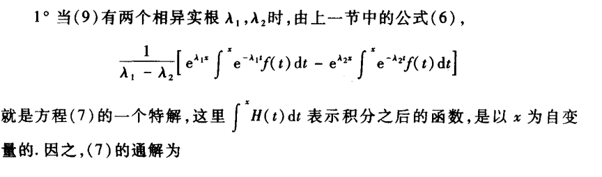

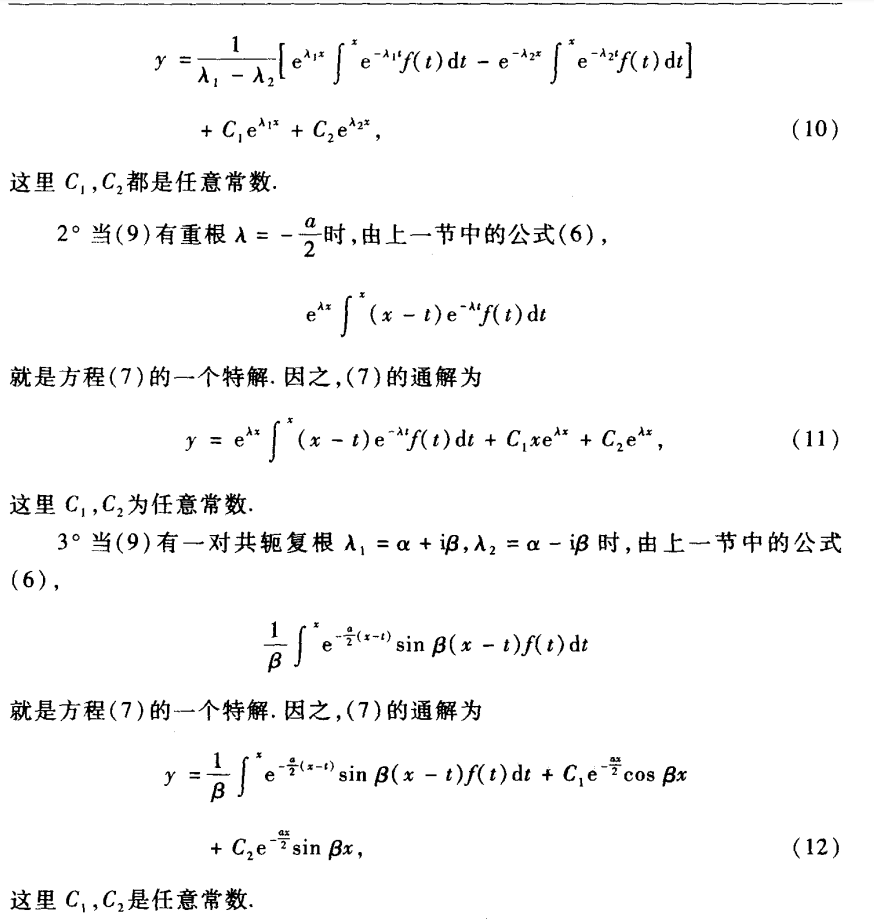

#### 特殊的二阶非齐次常系数微分方程

二阶非齐次常系数微分方程如下：
$$
y'' + ay' + by = f(x)
$$
当其$f(x)$有以下几种格式时：

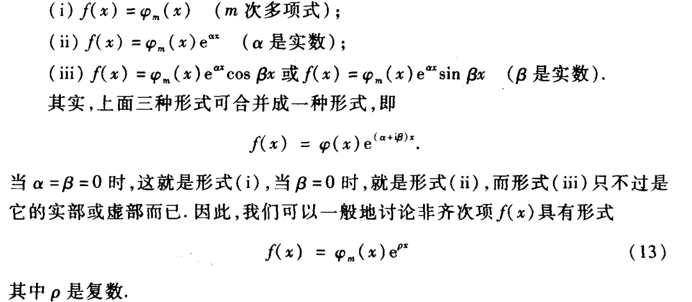

*其中对三种根的讨论见书本P159*

这里仅阐述结论：

如果$f(x) = \phi_m(x)e^{\rho x}$，则可假设微分方程的特解形式为：

$$
y^* = x^k Q_m(x)e^{\rho x}
$$

**其中$Q_m(x)$ 是与 $\phi_m(x)$同次的多项式，而k视p是特征方程的二重根，单根或不是它的根分别取2, 1, 0**

注意对需要将方程右部转换为复数的情况，看原$f(x)$对应转换为复数形式后对应的实部还是虚部取最后特解的对应的实部或虚部即可

#### n阶线性微分方程与常微分方程组

暂略……

## 第五章 矢量代数与空间几何

### 5.1 空间直角坐标系与矢量

#### 直角坐标系

直角坐标系注意右手法则：握拳大拇指伸开的手势，四指代表x->y轴，拇指则表示z轴的方向

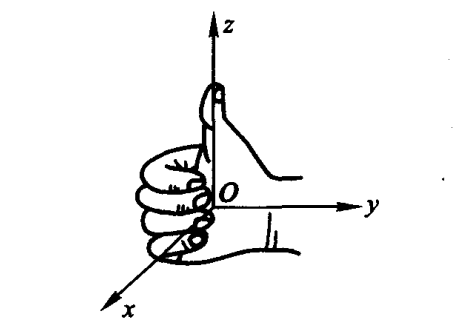

#### 矢量

方向余弦：$\alpha,\beta,\gamma$是矢量*a*与x,y,z轴所成的角度，则$(\cos \alpha,\cos \beta,\cos \gamma)$为矢量*a*的方向余弦，且
$$
\cos^2 \alpha+\cos^2 \beta+\cos^2 \gamma = 1
$$
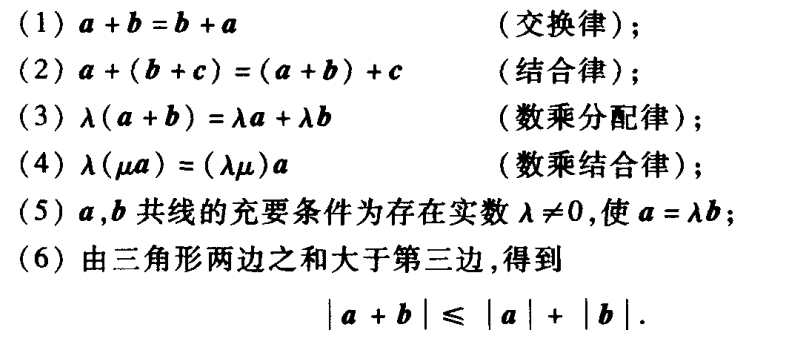

### 5.2 矢量的乘积

#### 内积（点乘）

矢量乘积也称为内积
$$
\overset{\rightarrow}{a} \cdot \overset{\rightarrow}{b} = |a|*|b|*\cos \theta \\
\overset{\rightarrow}{a} \cdot \overset{\rightarrow}{b} = (a_1*b_1 + a_2*b_2 + a_3*b_3)
$$
证明：(下面的符号均代表矢量)
$$
余弦定理可得: \\
|a - b|^2 = |a|^2 + |b|^2 - 2|a||b|\cos \theta \\
另一方面:\\
|a - b|^2 = (a-b)(a-b) = |a|^2 + |b|^2 - 2ab \\
联立即可证明
$$
有以下公式成立：

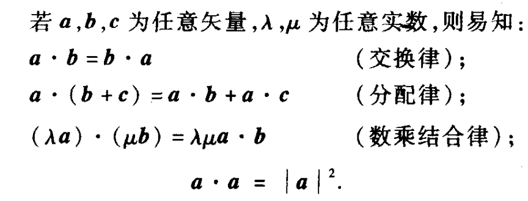

内积的意义为一个矢量和另一个矢量在其上的投影的积，一个矢量对另外一个矢量方向的影响

#### 矢量的外积（叉乘）

外积也就是叉积

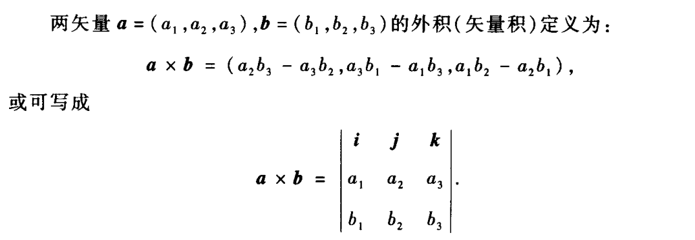

有以下定律存在：

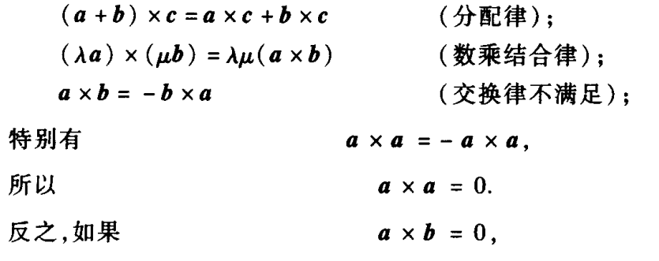

矢量积的几何意义：

1. $a\times b$垂直于a和b，即垂直于a,b所在的平面

2. $a\times b$的长度等于以a,b为边的四边形的面积，且有以下等式存在
	$$
	|a\times b|^2 = |a|^2|b|^2 - (a\cdot b)^2, 将式子用坐标展开即可得到 \\
	|a\times b| = |a| |b| \sin \theta,可由上式得到
	$$
	
3. a,b和$a\times b$组成一个右手系统

### 矢量的混合积

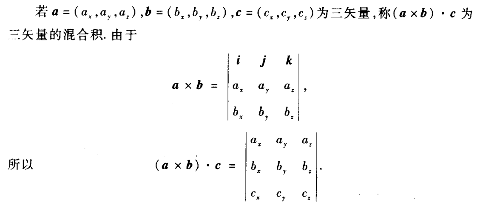

上式可根据点乘是对应坐标相乘的特性推导

混合积的几何意义为三个矢量组成的平行六面体的体积
$$
(a\times b)\cdot c = |a\times b|\cdot |c| \cdot \cos \phi = |a\times b|\cdot h = V
$$
混合积更换顺序规则如下：

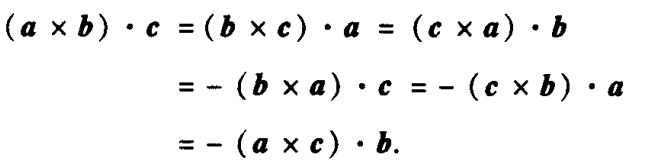

根据混合积的行列式定义和“行列式更换两行符号取反”很容易便可以推导出来

混合积还可用于三个矢量共面的判断，当混合积为0时，矢量共面，此时体积为0

对于连续叉乘还有：

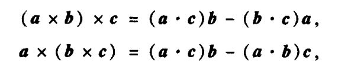

下面那个式子可以化为$-(b\times c)\times a$，然后就和1式一样了，叉乘是满足**负交换律**的，即$a\times b = - b\times a$

### 5.3 平面与直线

#### 平面方程

1. 已知平面一点和平面法向量

	假设已知平面一点$M_0(x_0, y_0,z_0)$，和改平面法向量$\overset{\rightarrow}n = (A, B, C)$，则对平面一点$M(x, y, z)$有
	$$
	\overset{\rightarrow}{MM_0}\cdot \overset{\rightarrow}{n} = 0 \\
	即,A(x-x_0)+B(y-y_0)+C(z-z_0) = 0 \\
	简写为:Ax + By+Cz +D=0
	$$
	
2. 已知三点

	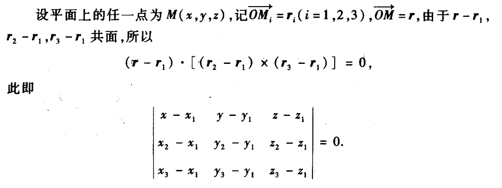

	当三个点是坐标轴上的三个点，且在x,y,z上的坐标为a,b,c，带入上式可得:
	$$
	\frac{x}{a} + \frac{y}{b} + \frac{z}{c} = 1
	$$
	也就是平面的截距式方程

#### 直线方程

1. 已知一点和其方向（平行的自由矢量），点向式方程

	已知一点$M_0(x_0, y_0,z_0)$和与直线平行的矢量$\overset{\rightarrow}{s} = (l,m,n)$，则对直线一点$M(x, y, z)$有:
	$$
	\overset{\rightarrow}{MM_0} = \lambda \overset{\rightarrow}{s} \\
	\frac{x-x_0}{l} = \frac{y-y_0}{m} = \frac{z-z_0}{n} (= \lambda)
	$$
	
2. 两平面表示的直线，交面式方程
	$$
	\left \{
	\begin{align*}
	A_1x+B_1y+C_1z+D_1 = 0 \\
	A_2x+B_2y+C_2z+D_2 = 0
	\end{align*}
	\right .
	$$
	所以直线的方向矢量为$s = n_1\times n_2 = (A_1,B_1,C_1) \times (A_2,B_2,C_2)$

> 以下几部分均为本章的补充

#### 点到平面于点到直线的距离

- 点$M_0(x_0,y_0,z_0)$到平面$Ax+By+Cz+D = 0$的距离为:

$$
d = \frac{|Ax_0 + By_0+CZ_0+D|}{\sqrt{A^2+B^2+C^2}}
$$

推导如下：

设平面上一点$M_1(x_1,y_1,z_1)$,n为平面的法向量
$$
h = Prj_n \overset{\rightarrow}{M_1M_0} = \frac{\overset{\rightarrow}{M_1M_0}\cdot n}{|n|} ，展开即可得
$$

- 点$M_0(x_0,y_0,z_0)$到方向矢量$l(m,n,p)$直线的距离：

设直线上一点$M_1(x_1,y_1,z_1)$，点到直线距离可以用$\overset{\rightarrow}{M_1M_0}$和方向矢量组成的平行四边行面积除以底边得到即：
$$
d = \frac{|l\times \overset{\rightarrow}{M_1M_0}|}{|l|}
$$
叉乘的模可以用叉乘的行列式表达来计算

#### 平面间、直线间、平面和直线间的位置关系

1. 平面间

	平面间的关系可以转换为两个平面的法向量的关系（平行、相交、垂直）

	平面的夹角（默认小的那个锐角）为：
	$$
	\cos \theta = \frac{|\overset{\rightarrow}{n_1} \cdot \overset{\rightarrow}{n_2}|}{|\overset{\rightarrow}{n_1}||\overset{\rightarrow}{n_2}|} ,(n_1, n_2为平面的法向量)
	$$
	
2. 直线间

	直线间的关系可以通过直线的方向向量和连接两条直线的一条线（矢量）确定

	通过矢量之间的关系和**混合积判断是否共面**就可以判断直线间的关系

3. 直线和平面

	类似的也是法向量直线的运算和关系判断，直线和平面的夹角（取锐角）为
	$$
	\sin \theta = \frac{|\overset{\rightarrow}{n} \cdot \overset{\rightarrow}{l}|}{|\overset{\rightarrow}{n}||\overset{\rightarrow}{l}|} ,(n, l为平面的法向量和直线的方向向量)
	$$
	
4. 平面束方程

	对于交面式定义的直线：
	$$
	\left \{
	\begin{align*}
	A_1x+B_1y+C_1z+D_1 = 0 \\
	A_2x+B_2y+C_2z+D_2 = 0
	\end{align*}
	\right .
	$$

	$$
	A_1x+B_1y+C_1z+D_1 + \lambda(A_2x+B_2y+C_2z+D_2) = 0
	$$

	表示通过直线l的不同平面

### 5.4 二次曲面

#### 柱面

平行于定直线L且与定曲线C相交的直线移动时产生的曲面称为柱面，定曲线C称为柱面的准线，动直线称为它的母线

当柱面的母线平行z轴时有一般表达式$f(x,y) = 0$

#### 旋转曲面

平面上的曲线绕这平面上一条定直线旋转而成的曲面，称为旋转曲面，定直线称为旋转曲面的轴

设一旋转曲面是以xy平面上的曲线C：f(x,y) = 0旋转得来，旋转轴为x轴，在此旋转曲面上任取一点$P_0(x_0, y_0, z_0)$过$P_0$作平面$x=x_0$，它和此旋转面的交线为一个圆，圆的半径为$r = \sqrt{y_0^2+z_0^2}$，圆是平面曲线上的点$x_0, r$绕x轴旋转产生的曲线，所以$f(x_0, r) = 0$，因此$P_0$满足$f(x_0, \sqrt{y_0^2+z_0^2})=0$ ，所以旋转曲面的方程为：
$$
f(x, \sqrt{y^2+z^2})=0
$$
从曲线f(x, y)推导曲面方程过程可得：

主要是根据曲线方程中的x,y，曲面一点旋转半径和旋转轴对应坐标的关系带入曲线方程即可

小技巧：

f(x,y)沿哪个轴旋转，哪个轴对应的变量就不变，另外一个变量就化成轴外两个坐标的和开根号

**一些常见的旋转曲面方程：**

#### 锥面

移动直线L，使它始终通过定点Q，且始终与定曲线C相交，这样由L所产生的曲面称为锥面。直线L为母线，Q为顶点，C为准线。

锥面的特征为：顶点与曲面上任意点的连线都在曲面上

如果顶点在原点，那么顶点与一点$(x,y,z)$，的连线上的点为$(tx,ty,tz)$，顶点为原点的锥面，方程为：
$$
\frac{x^2}{a^2} + \frac{y^2}{b^2} - \frac{z^2}{c^2} = 0, (a\neq 0, b\neq 0,c\neq 0)
$$

#### 椭球面

标准方程为：
$$
\frac{x^2}{a^2} + \frac{y^2}{b^2} + \frac{z^2}{c^2} = 1, (a> 0, b> 0,c> 0)
$$

#### 双曲抛物面

标准方程为：
$$
\frac{x^2}{a^2} - \frac{y^2}{b^2} =2z
$$

也成为马鞍面

#### 单叶双曲面

$$
\frac{x^2}{a^2} + \frac{y^2}{b^2} - \frac{z^2}{c^2} = 1
$$

#### 双叶双曲面

$$
\frac{x^2}{a^2} + \frac{y^2}{b^2} - \frac{z^2}{c^2} = -1
$$

#### 椭圆抛物面

$$
\frac{x^2}{a^2} + \frac{y^2}{b^2} =2z
$$

### 5.5 坐标变换

#### 坐标系平移

#### 坐标系旋转

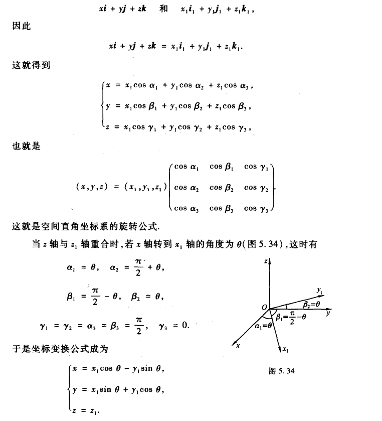

## 第六章 重积分与偏微商

### 6.1 重积分

#### 多变量函数的极限与连续性

多变量函数的形式：$z = f(x_1, x_2, \dots,x_n)$

多变量函数的连续：

对于函数$z = f(x,y)$，当点$P(x,y)$在定义域内**不论沿着哪一条途径**趋于点$A(a,b)$时,$f(x,y)$总是**趋向同一个数值**$l$则,$l$为函数$f(x,y)$当点P趋于点A时的极限,记作:
$$
\lim_{x\rightarrow a, y\rightarrow b} = l
$$
多变量函数的连续：

若当P趋于A时，函数$f(x,y)$不但极限存在且极限等于函数值，即:
$$
\lim_{x\rightarrow a, y\rightarrow b} = f(a,b)
$$
则称$f(x,y)$在点A处连续。如果函数在区域内每一点都连续，则$f(x,y)$，为区域内的连续函数

根据以上性质有：即使对每个变量来讲函数在一点是连续的，但作为多元函数在这一点未必连续

#### 重积分的概念

二重积分：

设函数$f(x,y)$在区域D上定义，若对满足$\lambda(T) \rightarrow 0$，的**任意分割T**，且对$D_i$中任意一点$(x_i,y_i)$，极限：
$$
\lim_{\lambda(T)\rightarrow 0} \sum_{i=1}^n{f(x_i,y_i)}\Delta A_i
$$
**存在且相同**，则称$f(x,y)$在D上是可积的，这个极限即为二重积分，记作：
$$
\underset{D}{\iint}f(x,y)dA = \lim_{\lambda(T)\rightarrow 0} \sum_{i=1}^n{f(x_i,y_i)}\Delta A_i
$$
$f(x,y)$为被积函数，D为积分区域，**dA为面积元素**（可拓展到非直角坐标系），$\lambda(T) \rightarrow 0$表示对于分割法T（将区域切分成微元）所有区域的最大直径趋于0，$\lambda(T)$表示所有区域的直径（直径即为区域内最远两点的距离）

可积的简单判断：

1. 如果函数在有界闭区域D上是连续的，那么D是可积的
2. 如果函数在有界闭区域D上是有界的，在这区域中，除去有限个点或有限多条简单曲线之外，f(x,y)是连续的，那么在D上也是可积的（简单曲线指曲线有参数表示形式，且参数表达式都是连续可微函数）

类似的三重积分的定义为：

设函数$f(x,y,z)$在区域V上定义，若对满足$\lambda(T) \rightarrow 0$，的**任意分割T**，且对$V_i$中任意一点$(x_i,y_i,z_i)$，极限：
$$
\lim_{\lambda(T)\rightarrow 0} \sum_{i=1}^n{f(x_i,y_i,z_i)}\Delta V_i
$$
**存在且相同**，则称$f(x,y,z)$在V上是可积的，这个极限即为三重积分，记作：
$$
\underset{V}{\iiint}f(x,y,z)dA = \lim_{\lambda(T)\rightarrow 0} \sum_{i=1}^n{f(x_i,y_i,z_i)}\Delta V_i
$$
$f(x,y)$为被积函数，V为积分区域，**dV为体积元素**

二重积分的一些性质：

1. 如果$f(x,y)$和$g(x,y)$都是区域D上的可积函数，而$\alpha,\beta$是任意函数则$\alpha f(x,y)+\beta g(x,y)$也在D上可积且：
	$$
	\iint_D(\alpha f(x,y)+\beta g(x,y))dA = \alpha \iint_D f(x,y)dA+\beta \iint_D g(x,y)dA
	$$

2. $\iint_D 1\cdot dA = A$，即面积

3. D可以分解为两个不重叠的区域有$D_1,D_2$，则：
	$$
	\iint_D f(x,y)dA = \iint_{D_1} f(x,y)dA + \iint_{D_2} f(x,y)dA
	$$

4. 如果在D上有$f(x,y)\le g(x,y)$ 有
	$$
	\iint_{D} f(x,y)dA \le \iint_{D} g(x,y)dA
	$$
	特别的如果有$m \le f(x,y) \le M$，则
	$$
	mA \le \iint_D f(x,y)dA \le MA
	$$
	可以推导出以下的二重积分中值定理

5. 如果$f(x,y)$在有界闭区域D上连续，那么在区域D可以找到一点$(\xi,\eta)$，有：
	$$
	\iint_D f(x,y)dA = f(\xi, \eta)A
	$$
	还存在如果$\phi(x,y)$可积且不变号，则存在一点D使得：
	$$
	\iint_D f(x,y)\phi(x,y) dA = f(\xi, \eta) \iint_D \phi(x,y)dA 
	$$

6. 绝对值可积
	$$
	|\iint_D f(x,y)dA|  \le \iint_D |f(x,y)|dA 
	$$

三重积分和其他多重积分，也存在一样的性质

#### 重积分的计算

重积分的计算即将原来的高重积分转换成低重积分

对于二重积分，可以将平面区域看作无数条平行于x,y轴的线，这样就可以先对x，在对y积分，转换为两个1重积分，如：
$$
\iint_D f(x,y)dA = \int_a^b dx \int_{\phi_1(x)}^{\phi_2 (x)}f(x,y)dy = \int_c^d dy \int_{\phi_1(y)}^{\phi_2 (y)}f(x,y) dx
$$

三重积分也可以化成一个一重积分以及一个二重积分，或者先二重积分然后在一重积分
$$
\iiint_D f(x,y,z) dV = \iint_D dxdy \int_{\phi_2(x,y)}^{\phi_2(x,y)} f(x,y,z) dz = \int_g^h dz\iint_{D_z} f(x,y,z) dxdy
$$

**对称性**：积分区域关于某条线对称，且其被积函数关于此线也有某种对称性的运用

**轮换对称性**：[百度百科-轮换对称性](https://baike.baidu.com/item/%E7%A7%AF%E5%88%86%E8%BD%AE%E6%8D%A2%E5%AF%B9%E7%A7%B0%E6%80%A7#2)

### 6.2 偏微商

#### 偏微商与全微分

f(x,y)对x的偏微商有以下定义：
$$
f'(x,y) = \frac{\partial f}{\partial x} = \lim_{\Delta x\rightarrow 0} \frac{f(x+\Delta x, y) - f(x,y)}{\Delta x}
$$
这就是函数f(x,y)沿着与x轴平行的方向的变化率，对y的定义也是类似的

全微分：
$$
df = \frac{\partial f}{\partial x}dx + \frac{\partial f}{\partial y}dy
$$
对于多元函数全微分的尾项为$o(\rho)$，即有差分：
$$
\Delta f = \frac{\partial f}{\partial x}dx + \frac{\partial f}{\partial y}dy + o(\rho) \\
其中,\rho = \sqrt{(\Delta x)^2 + (\Delta y)^2}
$$
对于尾项的为什么是这个的个人理解：

最重要的一点是理解==全微分的几何意义==：

在某点领域充分小表示的曲面中，可用切平面代替原曲面。此时全微分可以代表函数竖坐标的增量。

偏微商和全微分都是函数的**局部性质**。

对于非复合函数的微分法则，和单元函数一致

对于复合函数:
$$
z = f(\phi(u,v), \psi(u,v)) \\
x = \phi(u,v) \\
y = \psi(u,v)
$$
则对u,v的偏微商等于：
$$
\frac{\partial f}{\partial u} = \frac{\partial f}{\partial x} \frac{\partial x}{\partial u} + \frac{\partial f}{\partial y} \frac{\partial y}{\partial u} \\
\frac{\partial f}{\partial v} = \frac{\partial f}{\partial x} \frac{\partial x}{\partial v} + \frac{\partial f}{\partial y} \frac{\partial y}{\partial v} \\
即：(\frac{\partial f}{\partial u},\frac{\partial f}{\partial v}) = (\frac{\partial f}{\partial x},\frac{\partial f}{\partial y}) 
\left[
\begin{matrix}
\frac{\partial x}{\partial u} &\frac{\partial x}{\partial v} \\
\frac{\partial y}{\partial u} &\frac{\partial y}{\partial v}
\end{matrix}
\right]
$$

后面的矩阵为**雅可比矩阵**（它的作用可以和坐标系的转换相联系）,雅可比行列式写作：
$$
\frac{\partial(x,y)}{\partial(u,v)} = \left\vert
\begin{matrix}
\frac{\partial x}{\partial u} &\frac{\partial x}{\partial v} \\
\frac{\partial y}{\partial u} &\frac{\partial y}{\partial v}
\end{matrix}
\right\vert
$$
多元函数的**微分不变性**：
$$
df = \frac{\partial f}{\partial u}du + \frac{\partial f}{\partial v}dv = \frac{\partial f}{\partial x}dx + \frac{\partial f}{\partial y}dy
$$
对于雅可比的更多应用参考：

1. [雅可比矩阵和雅可比行列式](https://zhuanlan.zhihu.com/p/39762178)
2. [雅可比矩阵 - 维基百科，自由的百科全书](https://zh.wikipedia.org/wiki/%E9%9B%85%E5%8F%AF%E6%AF%94%E7%9F%A9%E9%98%B5)
3. [【快速学懂】雅可比行列式意义以及应用推导_哔哩哔哩 (゜-゜)つロ 干杯~-bilibili](https://www.bilibili.com/video/av200563275/)
4. [雅可比行列式在积分坐标变换中的应用?- 百度文库](https://wenku.baidu.com/view/4707bfd176a20029bd642d8c.html)
5. [对雅可比矩阵的理解 - 知乎](https://zhuanlan.zhihu.com/p/123934469)

#### 隐函数的微商

若自变量x,y的函数z 由一个方程$F(x,y,z) = 0$所规定，则称z是x,y的隐函数。对于隐函数和单元函数类似，这里只需要分别对x,y做偏微商即可，因为$z = f(x,y)$所以可以使用复合函数微分法可以得到：
$$
\left\{
\begin{array}{l}
F'_x + F'_z\frac{\partial z}{\partial x} \equiv  0 \\
F'_y + F'_z\frac{\partial z}{\partial y} \equiv  0
\end{array}
\right.
$$
若$F'_z \neq 0$则有，则有：
$$
\frac{\partial z}{\partial x} = - \frac{F'_x}{F'_z} \\
\frac{\partial y}{\partial x} = - \frac{F'_y}{F'_z}
$$
对于更一般的情况，给定一个方程组确定的隐函数如：
$$
\left\{
\begin{array}{l}
F(x,y,\dots,u,v) =  0 \\
G(x,y,\dots,u,v) =  0 
\end{array}
\right.
$$
其中$u,v是x,y的函数$，类似的对每个方程组求偏微商，例如对x求偏微商有：
$$
\frac{\partial F}{\partial x} + \frac{\partial F}{\partial u} \frac{\partial u}{\partial x} + \frac{\partial F}{\partial v} \frac{\partial v}{\partial x} = 0 \\
\frac{\partial G}{\partial x} + \frac{\partial G}{\partial u} \frac{\partial u}{\partial x} + \frac{\partial G}{\partial v} \frac{\partial v}{\partial x} = 0
$$
同样的若$\frac{\partial(F,G)}{\partial(u,v)} \neq 0$，则可解出：
$$
\left\{
\begin{array}{l}
\frac{\partial u}{\partial x} = -\frac{\partial(F,G)}{\partial(x,v)}/\frac{\partial(F,G)}{\partial(u,v)} \\
\frac{\partial v}{\partial x} = -\frac{\partial(F,G)}{\partial(u,x)}/\frac{\partial(F,G)}{\partial(u,v)}
\end{array}
\right.
$$
记忆的话，分母都是一样的，分子的分母中的u,v都是对于偏导的另一个，且位置和分母中的u，v位置一致

#### 曲线的切线

**对于平面上曲线**，一般表达式为$F(x,y) = 0$，可以得到：
$$
\frac{dy}{dx} = - \frac{F'_x(x,y)}{F'_y(x,y)}
$$
这是在某点的切线斜率，令此点为$(x_0,y_0)$所以可以得到切线方程为：
$$
(x-x_0)F'_x(x_0,y_0) + (\eta - y)F'_y(x_0,y_0) = 0
$$
法线则为：
$$
(x-x_0)F'_y(x_0,y_0) - (\eta - y)F'_x(x_0,y_0) = 0
$$
如果曲线上某点使得$F'_x,F'_y$同时为0，则这种点叫曲线的**奇点**，奇点是不能用上述方法讨论切线的（分母不能为0），如果曲线无奇点，且偏导都是连续的，则称曲线是光滑的，光滑曲线有连续转动的切线。

对于空间的切线也可以用相似的方法讨论：

1. 参数方程确定的空间曲线L

	曲线可以表示为$x = x(t),y = y(t),z = z(t)$，记$\overset{\rightarrow}{r} = (x(t),y(t),z(t))$，则$\frac{dr(t)}{dt}$是曲线在点$(x,y,z)$处的切线方向的矢量，可以根据此微商的意义推导（割线），可以得到切线方程为：
	$$
	\frac{x-x_0}{x'_{t_0}} = \frac{y-y_0}{y'_{t_0}} = \frac{z-z_0}{z'_{t_0}}
	$$

2. 由隐函数确定的曲线

	曲线：
	$$
	\left\{
	\begin{array}{l}
	F(x,y,z) =  0 \\
	G(x,y,z) =  0 
	\end{array}
	\right.
	$$
	可以知道$f = (F'_x,F'_y,F'_z)$是$F(x,y,z)$面在$(x,y,z)$处的**法向量**（做**全微分**即可推导）,类似的$g = (G'_x,G'_y,G'_z)$也是法向量，则可以得到L的切矢量和$f,g$都是垂直的，即与$f \times g$是平行的，而
	$$
	f\times g = 
	\left\vert
	\begin{matrix}
	i & j & k \\
	F'_x & F'_y & F'_z \\
	G'_x & G'_y & G'_z
	\end{matrix}
	\right\vert
	=
	\frac{\partial(F,G)}{\partial(y,z)}i +
	\frac{\partial(F,G)}{\partial(z,x)}j +
	\frac{\partial(F,G)}{\partial(x,y)}k
	$$
	记忆的时候别把k的分母记反了，根据行列式知道这里原来是$-\frac{\partial(F,G)}{\partial(x,z)}$

	有了切线的方向向量和该点通过**点向式**就可以把切线方程写出来了，通过混合积表达式也可以很快把的**法平面**（过切点且与切线相垂直的平面）表达式给出：
	$$
	\left\vert
	\begin{matrix}
	x-x_0 & y-y_0 & z-z_0 \\
	F'_x & F'_y & F'_z \\
	G'_x & G'_y & G'_z
	\end{matrix}
	\right\vert
	= 0
	$$
	即，
	$$
	\frac{\partial(F,G)}{\partial(y,z)}(x-x_0) +
	\frac{\partial(F,G)}{\partial(z,x)}(y-y_0) +
	\frac{\partial(F,G)}{\partial(x,y)}(z-z_0) = 0
	$$

#### 曲面的切平面和法向量

曲线方程为$F(x,y,z) = 0$，曲面在点$(x,y,z)$处的法方向量为$(F'_x, F'_y,F'_z)$(因为切向量是$(dx,dy,dz)$根据全微分就可推导），因此切平面的方程为:
$$
F'x(x_0,y_0,z_0)(x-x_0) +
F'y(x_0,y_0,z_0)(y-y_0) +
F'z(x_0,y_0,z_0)(z-z_0) = 0
$$
对于由参数表达的曲面,可以表示为$x = x(u,v),y = y(u,v),z = z(u,v)$，记$\overset{\rightarrow}{r} = (x(u,v),y(u,v),z(u,v))$,可以得到在某点的法向量为：
$$
r_u \times r_v =
\left\vert
\begin{matrix}
i & j & k \\
x'_u & y'_u & z'_u \\
x'_v & y'_v & z'_v
\end{matrix}
\right\vert
$$
同样的过点$(x_0,y_0,z_0)$的切平面为：
$$
\left\vert
\begin{matrix}
x-x_0 & y-y_0 & z-z_0 \\
x'_u & y'_u & z'_u \\
x'_v & y'_v & z'_v
\end{matrix}
\right\vert = 0
$$
当$r_u \times r_v = 0$，满足这个的点为曲面的在改域奇点，若曲面在某个域上没有这个点，且x,y,z具有连续偏导，则曲面在该域是光滑的，具有连续转动的法矢量

### 6.3 雅可比行列式、面积元素与体积元素

#### 雅可比行列式的性质

既然是行列式，就应该把它和空间的线性变换相联系，行列式的意义是线性变换后的面积比

对于n元函数$F(x,y,\cdots,z),G(x,y,\cdots,z),\cdots,P(x,y,\cdots,z),$的雅可比行列式为：
$$
\frac{\partial(F,G,\dots,P)}{\partial(x,y,\dots,z)} = 
\left\vert
\begin{matrix}
\frac{\partial F}{\partial x} &\frac{\partial F}{\partial y} &\dots &\frac{\partial F}{\partial z}  \\
\frac{\partial G}{\partial x} &\frac{\partial G}{\partial y} &\dots &\frac{\partial G}{\partial z}  \\
\vdots &\vdots & &\vdots \\
\frac{\partial P}{\partial x} &\frac{\partial P}{\partial y} &\dots &\frac{\partial P}{\partial z}  \\
\end{matrix}
\right\vert
$$
雅可比行列式的性质（具体证明见书本P247）

1. 雅可比行列式的复合函数形式

	设$u = u(x,y),v=v(x,y),x = x(s,t),y = y(s,t)$，由复合函数微商法则有：
	$$
	\frac{\partial(u,v)}{\partial(s,t)} = \frac{\partial(u,v)}{\partial(x,y)}\cdot \frac{\partial(x,y)}{\partial(s,t)}
	$$
	这里使用雅可比矩阵代替雅可比行列式，也可以得到一样的结果

	这里也可以推出：
	$$
	\frac{\partial(u,v)}{\partial(x,y)}\cdot \frac{\partial(x,y)}{\partial(u,v)} = \frac{\partial(u,v)}{\partial(u,v)} = 1
	$$

2. $$
	\frac{\partial(u,v)}{\partial(x,y)} = - \frac{\partial(v,u)}{\partial(x,y)}
	$$

	使用行列式展开很容易证明，更改两行（列）变号

3. $$
	\frac{\partial(u,u)}{\partial(x,y)} = 0
	$$

#### 面积元素与体积元素

一般的坐标系有直角坐标系、柱坐标系、球坐标系，平面还有极坐标系，雅可比行列式可以代表这线性变换中的面积/体积比，所以有：

1. 平面坐标系

	有$x=x(u,v), y = y(u,v)$所以：
	$$
	dA = dxdy =
	\vert
	\frac{\partial(x,y)}{\partial(u,v)}
	\vert dudv \\
	可得，\iint_D f(x,y)dA = \iint_{\phi}F(u,v)\vert
	\frac{\partial(x,y)}{\partial(u,v)}
	\vert dudv \\
	其中，F(u,v) = f(x(u,v), y(u,v))
	$$

2. 空间坐标系

	空间坐标系也是类似的不过是换成三阶的雅可比行列式

当然也可以通过从空间几何的角度重新估计转换后的坐标系的面积/体积微元的表达，这在当前这几种规则的坐标系中很容易看出

一些常用坐标系的转换（推导见书本P248）：

1. 极坐标

	坐标表示为$x = \rho \cos \theta, y = \rho \sin \theta$,其中$\rho$代表点P(x,y)到原点的距离，$\theta$为OP与x轴的夹角，存在：

	
	$$
	dA = dxdy = \rho d\rho d\theta
	$$
	
2. 柱坐标

	柱坐标就是极坐标拓展了z轴的结果，表示为：
	$$
	x = r\cos \theta \\
	y = r\sin \theta \\
	z = z
	$$
	$r,\theta$和极坐标的意义相同，这里的转换为：
	$$
	dV = dxdydz = rdrd\theta dz
	$$
	
3. 球坐标

	球坐标表示为:
	$$
	\begin{align*}
	x &= \rho \sin \theta\cos \phi \\
	y &= \rho \sin \theta\sin \phi \\
	z &= \rho \cos \theta
	\end{align*}
	$$
	

	其中坐标曲面形成三族：

	- $\rho$，表示中心在原点的同心球面（和原点的长度）
	- $\theta$，表示以z轴为中心轴线的锥面（和z轴的夹角）
	- $\phi$，表示通过z轴的半平面（在xy平面与x轴的夹角）

	转换为：
	$$
	dV = dxdydz = \rho^2 \sin \theta d\rho d\theta d \phi
	$$

空间曲面的面积元素:

空间曲面的参数表达式:
$$
x = x(u,v), y = y(u,v), z=z(u,v) \\
矢量形式 \overset{\rightarrow}r = \overset{\rightarrow}r(u,v)
$$
存在：
$$
dS = |\overset{\rightarrow}{r'_u} \times \overset{\rightarrow}{r'_v}| dudv
$$
叉乘代表面积，又因为
$$
|\overset{\rightarrow}{r'_u} \times \overset{\rightarrow}{r'_v}|^2 = 
\overset{\rightarrow}{r'_u}^2 
\overset{\rightarrow}{r'_v}^2 - 
(\overset{\rightarrow}{r'_u} \cdot \overset{\rightarrow}{r'_v})^2
$$
所以，令
$$
E = {r'}_u^2 = {x'}_u^2 + {y'}_u^2 + {z'}_u^2 \\
G = {r'}_v^2 = {x'}_v^2 + {v'}_u^2 + {v'}_u^2 \\
F = {r'}_v\cdot {r'}_u = {x'}_u {r'}_v + {y'}_u {y'}_v + {z'}_u {z'}_v
$$
所以最终有：
$$
dS = \sqrt{EG-F^2} dudv
$$
特别的当$z = (x,y)$时，有
$$
dS = \sqrt{1+{z'}_x^2 + {z'}_y^2} dxdy
$$

## 第七章 线、面积分与外微分形式

### 7.1 数量场与矢量场

如果在一个空间区域V按某方式分布着一种量（数量或矢量），则说在V中有一个场，若分布的是数量，则场是**数量场**，若是矢量，则是矢量场。

#### 数量场的等值面与梯度

量场有两个基本概念：等值面和梯度

等值面：空间区域V中的一个数量场$u=u(M)$，则V中任一曲面$u(M) = C$，C为常数，此曲面为数量场的一张等值面。

数量场在其等值面上保持相等。

方向导数的定义为：在V中取一点$M_0$，且设l是由$M_0$出发的任一半直线（射线），则$u = u(M)$对l的方向导数定义为：
$$
{(\frac{\partial u}{\partial l})}_{M_0} = \lim_{M\rightarrow M_0,M \in l} \frac{u(M)-u(M_0)}{|MM_0|}
$$
令l的方向余弦为$(\cos \alpha, \cos \beta,\cos \gamma)$，则l上的M即为$(x_0+t\cos \alpha, y_0+t\cos \beta,z_0+t\cos \gamma)$，于是方向导数可以写为：
$$
\begin{align*}
{(\frac{\partial u}{\partial l})}_{M_0} &= \lim_{t\rightarrow 0} \frac{u(x_0+t\cos \alpha, y_0+t\cos \beta,z_0+t\cos \gamma)-u(x_0,y_0,z_0)}{t} \\
&= \frac{\partial u}{\partial x}\cos \alpha + \frac{\partial u}{\partial y}\cos\beta + \frac{\partial u}{\partial z}\cos
\gamma
\end{align*}
$$
也可以写为向量形式：
$$
{(\frac{\partial u}{\partial l})}_{M_0} = (\frac{\partial u}{\partial x}i+\frac{\partial u}{\partial x}j+\frac{\partial u}{\partial x}k)\cdot (\cos\alpha i+\cos\beta j+\cos\gamma k) = n \cdot l^0 = |n|\cos \theta
$$

梯度的定义：

当$\theta = 0$时，方向导数具有最大值$|n|$，此时$l^0$，与n同向，此时的$\overset{\rightarrow}{n}$即为场在$M_0$处的**梯度**，表示为$({\bf grad}(u)_{M_0})$可以有以下结论：

1. 梯度的方向就是法线方向
2. 场在某一点的一切方向导数中，沿着梯度方向所得的导数是最大的
3. 梯度即为$({\bf grad}(u)_{M_0}) = n = (\frac{\partial u}{\partial x}i+\frac{\partial u}{\partial x}j+\frac{\partial u}{\partial x}k)_{M_0}$
4. 方向导数和梯度的关系：$\frac{\partial u}{\partial l} = ({\bf grad} u)\cdot l^0$
5. 在梯度方向的等值面分布最密，数量场变化最快

梯度有以下运算法则：

梯度其实就是偏导的组合，所以可以用偏导求解推导

梯度是场论“三度”之一（另外是散度和旋度），使用$Nabla 即\nabla算子可以统一表示$
$$
\nabla = i\frac{\partial}{\partial x}+j\frac{\partial}{\partial y}+k\frac{\partial}{\partial z}
$$
运算过程如下：
$$
\nabla u = 
i\frac{\partial u}{\partial x}+j\frac{\partial u}{\partial y}+k\frac{\partial u}{\partial z}
$$
所以：$\nabla u = {\bf grad}　u$

#### 矢量场的流线

定义：区域V中的矢量场$v = v(M)$，V中若存在一条曲线使得，其在个点皆与场中的矢量相切，则为矢量场的一条流线：

对于矢量场$v = P(x,y,z)i + Q(x,y,z) j + R(x,y,z)k$

对于参数定义的曲线$(dx/dt,dy/dt,dz/dt)$为该曲线的切矢，因为流线处处与场矢为切矢，所以$\frac{dx}{dt} = kP(x,y,z)$对y,z有同样的等式，所以流线为：
$$
\frac{dx}{P} = \frac{dx}{Q}=\frac{dx}{R}
$$
所以获取曲线的表达式，即求解上述的微分方程

### 7.2 曲线积分

#### 第一种曲线积分（关于弧长的曲线积分）

对于直角坐标系曲线L具有参数方程$x = x(t), y = y(t),z = z(t)$，有弧长微元如下：
$$
\Delta s = \sqrt{dx^2 + dy^2 + dz^2} = 
\sqrt{(x')^2 + (y')^2 + (z')^2} dt
$$
于是对于曲线L的第一类曲线积分如下：
$$
\int_L f(M)ds = \int_{\alpha}^{\beta} f(x(t),y(t),z(t)) \sqrt{(x')^2 + (y')^2 + (z')^2} dt
$$

#### 第一种曲线积分的应用（旋转曲面的面积/体积）

例如将一条在XY平面的曲线绕OX轴旋转形成的曲面面积，其微元可以看作一个圆台，此圆台的面积为$S = \pi (y_{i+1} + y_{i}) \Delta s_i$，在微元下$y_i = y_{i+1}$所以容易得到此曲面的面积为：
$$
S_{ox} = 2\pi \int_L |y| ds
$$

旋转曲面的体积公式如下：

#### 第二种曲线积分（关于弧长投影的积分）

第二种积分是直角坐标系内关于曲线在坐标轴上投影的积分，如：
$$
\int_{L_{AB}} f(x,y)dx\\
\int_{L_{AB}} f(x,t,z)dz
$$
对其他轴也是一样的，第二类曲线积分有以下性质

1. $\int_{L_{AB}}f(M)dx = -\int_{L_{BA}}f(M)dx$，即第二类曲线积分具有方向性
2. $\int_{L_{AB}}dx = x_B - x_A$
3. $\int_{L_{AB}}(af+bg)dx = a\int_{L_{AB}}fdx + b\int_{L_{AB}}gdx$，这里的ab是常数
4. $\int_{L_{AB}}fdx + \int_{L_{BC}}fdx = \int_{L_{AC}}fdx$
5. 注意曲线对若在某个坐标轴的投影为0则积分为0
6. $\vert \int_{L_{AB}}f(M)dx \vert \le \int_{L_{AB}}\vert f(M)\vert dx$

#### 第二种曲线积分的计算

在空间曲线的参数表达下第二类曲线积分可以化为：
$$
\int_{L_{AB}}f(M)dx = 
\int_{\alpha}^{\beta} f(x(t),y(t),z(t))x'(t)dt
$$
一般取参数增加时曲线运行的方相叫做曲线的正向，对于闭合曲线使用$\oint$表示，圆圈还可以代表方向，表示正方向（顺时针）和负方向（逆时针）

#### 两种曲线积分的关系

从第二类曲线积分，关于弧长投影的积分就可以得出它们之间的关系了，投影的关系，也就是$\cos角度$的关系了。

#### 矢量场的环流量，矢量的曲线积分

空间区域V中的矢量场$v = v(M)$，L是V中的一条曲线两端为AB，令$t=t(M)$是L上指向B端的单位切矢量，则有：
$$
\int_L \overset{\rightarrow}v\cdot \overset{\rightarrow}t ds
$$
这个就是矢量场沿曲线L从A到B的的==环流量==，$v\cdot t$其实就是矢量场在改曲线某点单位切矢量上的投影，所以环流量在力场/电场中就代表做的功

假设矢量场为$v = P(M)i + Q(M)j + R(M)k$，单位切矢量$t = \cos \alpha_M i + \cos \beta_M j + \cos \gamma_M k$，所以有：
$$
\begin{align*}
\int_L \overset{\rightarrow}v\cdot \overset{\rightarrow}t ds &= 
\int_L(P\cos \alpha  + Q\cos \beta + R\cos \gamma)ds \\
&= \int_{L_{AB}} Pdx + Qdy+Rdz
\end{align*}
$$
环流量即三个轴上的第二类曲线积分

### 7.3 曲面积分

#### 第一种曲面积分（关于面积元素的曲面积分）

在6.3中已经讨论了参数表达式曲面中的面积元素的表示$dS = \sqrt{EG-F^2} dudv$

所以可以得到第一类曲面积分为:
$$
\iint_{\sum}f(M)dS = \iint_{\Delta}f(x(u,v),y(u,v),z(u,v))\sqrt{EG-F^2}dudv
$$
同样的当曲面为$z = z(x,y)$有，
$$
\iint_{\sum}f(M)dS = \iint_{\Delta}f(x,y,z(x,y))\sqrt{1+{z'_x}^2+{z'_y}^2}dxdy
$$

#### 第二种曲面积分（关于面积元素投影的积分，即矢量场的通量）

和第二类曲线积分类似，既然是投影所以，第二类曲面积分表达如下：
$$
\iint_{\sum} v\cdot n dS =
\iint_\sum{}(P\cos \alpha  + Q\cos \beta + R\cos \gamma)dS
$$
这里$v = P(M)i + Q(M)j + R(M)k$，单位法矢量$n = \cos \alpha_M i + \cos \beta_M j + \cos \gamma_M k$，因为这里的三个角分别是与x,y,轴的夹角，所以就是dS在三个坐标平面$Oyz,Ozx,Oxy$上的投影即$\cos \alpha dS = \pm dydz$其他轴也有类似的等式。

因此，有

第二类曲面积分也具有方向性，注意和第二类曲线积分一样，注意若在某个坐标平面上的投影为0，那么这个积分也为0

#### 第二类曲面积分的计算方法

1. 显表示曲面的第二类曲面积分的计算

	

2. 参数曲面第二种曲面积分计算

	

	这里$r'_u = (x'_u,y'_u,z'_u)$，$r'_v$类似

### 7.4 Stokes公式

#### 格林公式 Green

格林公式联系了**曲线积分和二重积分**之间的关系

设D是xy平面上的封闭曲线L围成的闭区域，且函数P(x,y)和Q(x,y)在D上有一阶连续偏微商，则:
$$
\oint_LPdx+Qdy = \iint_D(\frac{\partial Q}{\partial x} - \frac{\partial P}{\partial y})dxdy
$$
这里可以和后面的高斯做对比，这里的$\frac{\partial P}{\partial y}$为什么是有个负号，也可以根据书本的推导思考，假设曲线是逆时针的，通过计算和作图会发现这和曲线积分的方向性是相关的。

==这里L的方向取**正向**，指当一个人沿着L的方向前进时，左手始终在L所围成的区域内==

**对任意的封闭曲线L围成的闭区域，格林公式都是成立的**

格林公式的 **一般形式**：

D是xy平面上n+1条封闭曲线$L,l_1,\cdots,l_n$围成的区域中，其中$l_1,\cdots,l_n$在L内，且曲线==方向和L相反==，若函数P(x,y)和Q(x,y)在D上有一阶连续偏微商，则：
$$
\iint_D(\frac{\partial Q}{\partial x} - \frac{\partial P}{\partial y})dxdy = \oint_L + \oint_{l_1},\cdots,\oint_{l_n} Pdx + Qdy
$$
其实这是由`对任意的封闭曲线L围成的闭区域，格林公式都是成立的`推导出的，之所以要求内外曲线方向相反，是因为，相同的话就不能做辅助线将这些曲线变为连通了。

格林公式与平面的面积：

设在xy平面上有一条封闭曲线L，内部面积为A，则
$$
A = \oint_L xdy = -\oint ydx = \frac{1}{2}\oint_L xdy-ydx
$$
只要让格林公式凑出$\iint 1dxdy$即可

#### 高斯公式 Gauss 与散度

高斯公式是格林公式在三维空间的体现，即**曲面积分和三重积分**的关系。

高斯公式如下：

设V是空间封闭曲面$\sum$所围成的闭区域，函数$P(x,y,z),Q(x,y,z),R(x,y,z)$在V上有一阶连续偏微商，则：
$$
\oiint_{\sum_外} Pdydz + Qdzdx + Rdxdy = 
\iiint_V(\frac{\partial P}{\partial x} + 
\frac{\partial Q}{\partial y} +
\frac{\partial R}{\partial z})dV
$$
和格林公式一样对内外包含曲面有以下等式：

同样内外曲面方向是相反的，否则不能添加辅助面成为闭合曲面，其实此时的三重积分对应的是大空间扣掉内部闭合曲面组成的小空间

类似的高斯公式也可以用于计算体积：
$$
\begin{align*}
V &= \oiint_{\sum_外}xdydz = \oiint_{\sum_外}ydzdx =\oiint_{\sum_外}zdxdy \\
& = \frac{1}{3} \oiint_{\sum_外}xdydz + ydzdx + zdxdy

\end{align*}
$$
高斯公式的物理意义——==散度==

高斯公式左边的物理意义就是第二类曲线积分也就是通量，高斯公式右边的物理意义代表着散度，M点的散度定义如下：
$$
(div V)_M = \lim_{\sum \rightarrow M}
\frac{\oiint_{\sum} \overset{\rightarrow}{v}\cdot \overset{\rightarrow}{n} dS}{V}
$$
即单位体积上的通量，散度描写了矢量场的流源分布情况，是流源发布的强度，矢量场v的散度即为：
$$
{\bf div} v = 
\frac{\partial P}{\partial x} + 
\frac{\partial Q}{\partial y} +
\frac{\partial R}{\partial z}
$$
所以高斯公式也可以写作：
$$
\oiint_{\sum} \overset{\rightarrow}{v}\cdot \overset{\rightarrow}{n} \,dS = \iiint_V div \,{\bf v} dV
$$

此处定义新算子，Laplace 算子$\Delta$在直角坐标系下为：
$$
\Delta = \frac{\partial ^2}{\partial x^2} +
\frac{\partial ^2}{\partial y^2} +
\frac{\partial ^2}{\partial z^2} \\
可得，\Delta = \nabla^2 = \nabla \cdot \nabla \\
所以 {\rm div} \,{\bf  grad} u = \Delta u
$$

#### 斯托克斯公式 Stokes，旋度

斯托克斯公式是说明空间曲线和空间的曲面之间的关系

斯托公式如下：

如图，在空间曲面$\sum$，边界是封闭曲线L，若函数$P,Q,R$具有一阶连续偏微商，则：
$$
\begin{align*}
\oint_{图示方向} Pdx + Qdy+Rdz = 
\iint_{\small \sum_B} &(\frac{\partial R}{\partial y}
- \frac{\partial Q}{\partial z})dydz \\ 
&+
(\frac{\partial R}{\partial z}
- \frac{\partial Q}{\partial x})dzdx \\
&+
(\frac{\partial R}{\partial x}
- \frac{\partial Q}{\partial y})dxdy
\end{align*}
$$

此公式的方向可以用右手法则，拇指的方向就是曲面的那一侧

斯托克斯公式还有便于记忆的方式：
$$
\begin{align*}
\oint_{图示方向} Pdx + Qdy+Rdz &= 
\iint_{\small \sum_{正}}
\left \vert
\begin{matrix}
dydz & dzdx &dxdy \\
\frac{\partial}{\partial x} & \frac{\partial}{\partial y} & \frac{\partial}{\partial z} \\
P & Q & R
\end{matrix} 
\right \vert\\
&=
\iint_{\small \sum_{正}}
\left \vert
\begin{matrix}
\cos \alpha & \cos \beta & \cos \gamma \\
\frac{\partial}{\partial x} & \frac{\partial}{\partial y} & \frac{\partial}{\partial z} \\
P & Q & R
\end{matrix} 
\right \vert {\rm d}S\\
\end{align*}
$$
其中的余弦是曲面正方向法矢量的方向余弦

斯托克斯公式的==物理意义==，环流量和旋度

公式左边代表的就是环流量（之前就提到过 矢量的第二类曲线积分），公式右边代表的是旋度，所以旋度的大小（模）也可以称为环流量面密度

旋度是用来表示一个矢量场在各处各方向的的涡旋程度，旋度的定义为：
$$
({\bf rot \,v})_M \cdot {\bf n} = \lim_{L\rightarrow M}
\frac{\oint_{\small L}{\bf v\cdot t}ds}{A}
$$
L是包含M点的闭曲线，且曲线L在M点的切平面上，直角坐标下矢量场$Pi+Qj+Rk$的旋度为:
$$
{\bf rot \, v} = 
\left\vert
\begin{matrix}
{\bf i} & {\bf j} &{\bf k} \\
\frac{\partial}{\partial x} & \frac{\partial}{\partial y} & \frac{\partial}{\partial z} \\
P & Q & R
\end{matrix}
\right\vert
$$
所以斯托克斯公式也可以写为：
$$
\oint_L {\bf v\cdot t}ds = \iint_{\small \sum}({\bf rot \,v}) \cdot {\bf n} ds
$$
t是L的单位切矢量，n是$\sum$的单位法矢量，有以下等式成立：

### 7.5 全微分与线积分

#### 与途径无关的曲线积分

积分$\int_A^B P(x,y)dx + Q(x,y)dy$与途径无关的冲要条件是在区域内部任意作曲线==封闭== l 都有$\oint_l Pdx + Qdy = 0$，所以有，

积分$\int_A^B P(x,y)dx + Q(x,y)dy$与途径无关的充要条件为$\frac{\partial P}{\partial y} = \frac{\partial Q}{\partial x}$

还有涉及到**全微分**的一个性质：

微分形式$Pdx + Qdy$是某一个函数U的全微分的充要条件是$\frac{\partial P}{\partial y} = \frac{\partial Q}{\partial x}$，此时的U为：
$$
U(x,y) = \int_{(x_0,y_0)}^{x,y} Pdx + Qdy + C
$$
所以可以选择一个和坐标轴平行的路径计算函数U

注意斯托克斯的一个大前提区域必须是==单连通性的==，即在区域内作任意一个闭合曲线都可以收缩为一点

#### 有势场

#### 管形场

其他性质略

## 第八章 多变量微积分的一些应用

### 8.1 Tayler 泰勒展开与极值问题

#### 多变量函数的泰勒展开

#### 多变量函数的极值问题

多变量函数的极值定义如下:

若函数$f(x,y)$在域D内定义,并且$(a,b)$是D内部的点,如果$(a,b)$的某个领域，有$f(a,b) \geq f(x,y)$恒成立则点$ f(a,b)$为该领域的极大值，反之也可以定义极小值，极大极小都是局部性质

多变含函数的极值确定：

假定函数$f(x,y)$有连续偏微商，对函数$\phi(t) = f(a+\lambda t, b + \mu t)$，只要$\lambda,\mu $不同时为0，它就是t的函数，可得：

如果$f(x,y)$在$(a,b)$取极大值，则$\phi(t)$在$t = 0$取到极大值，因此有$\phi'(0) = 0$，即：
$$
\phi'(0) = [\lambda \frac{\partial f}{\partial x} + \mu \frac{\partial f}{\partial y}]_{x = a\\y = b} = 0 \\
特别的取\lambda = 1, \mu = 0和\lambda = 0,\mu = 1，有\\
\frac{\partial f}{\partial x} \big \vert _{x = a\\y=b} = \frac{\partial f}{\partial y}\big \vert_{x = a\\y=b} = 0
$$
在单变量极值的讨论中，为了确定是极大还是极小还需要讨论二阶导数，这里也是类似的，$\phi''(0)$为：
$$
\phi''(0)= (\lambda^2 \frac{\partial^2f}{\partial x^2} +
2\lambda \mu \frac{\partial^2f}{\partial x \partial y} + 
\mu^2 \frac{\partial^2f}{\partial y^2})\big \vert _{x =a\\
y=b}
$$
若对任意的（不同时为0）$\lambda,\mu$都有$\phi''(0) < 0$则取到极大值，相反的取到极小值，所以二元函数的极值变成了讨论:
$$
A\lambda^2 + 2B\lambda\mu + C\mu^2 = C \\
其中 A = \frac{\partial^2f}{\partial x^2}, B = \frac{\partial^2f}{\partial x \partial y},
C = \frac{\partial^2f}{\partial y^2},均在(a,b)取到的值
$$
所以可以转换为讨论A的符号以及$B^2-AC$的符号的问题，总结如下：

**最小二乘法**也用到了这里的对多元函数的极值的讨论：

上式的线性方程组行列式不为0，所以有解。

#### 条件极值问题

条件极值问题是指：

函数$u = (x,y,z)$在满足条件$g(x,y,z) = 0$条件下，u的极值

拉格朗日Lagrange乘子法：

考虑函数$w = f(x,y,z) + \lambda g(x,y,z)$，此函数取到极值和上式的一样的，而w的极值点满足：
$$
\begin{align*}
\frac{\partial w}{\partial \lambda} &= g(x,y,z) = 0 \\
\frac{\partial w}{\partial x} &= \frac{\partial f}{\partial x} + \lambda \frac{\partial g}{\partial x} = 0 \\
\frac{\partial w}{\partial y} &= \frac{\partial f}{\partial y} + \lambda \frac{\partial g}{\partial y} = 0 \\
\frac{\partial w}{\partial z} &= \frac{\partial f}{\partial z} + \lambda \frac{\partial g}{\partial z} = 0
\end{align*}
$$
根据上述方程组，就可以得到极值点的坐标

对于n元函数m个条件，拉格朗日乘子法也是成立的，即对函数$y=(x_1,x_2,\dots,x_n)$有，m个条件如下：

### 8.2 物理上的应用举例

#### 重心

**这里讨论的重心其实就是质心**，因为这里的重力场认为是不变的，重心和质心有区别发生在变化的重力场中

这里的$\rho$为密度函数

密度恒定的状态下的重心也就是==形心==

#### 转动惯量

转动惯量的物理表示方式为$I = m\,r^2$

所以转动惯量的积分表达为：

#### 引力

引力的物理表达式为$F = \frac{mM}{r^2}$，所以某物体V对质量为m坐标为$(\xi,\eta,\zeta)$，引力的微分表达如下：

#### 流量

## 第九章 $\epsilon-\delta$语言

### 9.1 数列极限的$\epsilon-N$语言

#### 数列极限的定义

设有数列$a_n$，如果有一定数a，对于不管怎样小的一个正数$\epsilon$，都存在一个正整数$N = N(\epsilon)$使得对所有$n > N$满足$\vert a_n - a \vert < \epsilon$，则说a为数列$a_n$的极限，记为$\lim_{n\rightarrow \infty} a_n = a$，或$\lim a_n = a,a_n\rightarrow a(n\rightarrow \infty)$

由此可以推出在$(a-\epsilon,a+\epsilon)$之外只能有有限个$a_n$

若数列$a_n$以一数a为其极限，则说数列$a_n$是收敛的，收敛于a，反之此数列是发散的

#### 数列极限的一些性质

如果**两个数列有极限**，那么这两个数列各对应项的和、差、积、商组成的数列的极限，分别等于这两个数列的极限的和、差、积、商

极限的性质：

1. 若数列有极限，则只有一个极限
2. 收敛数列必有界
3. 若$\lim a_n = a, \lim b_n = b$，且$a_n \le b_n$，则$a < b$
4. 夹逼定理：若$b_n \le a_n \le c_n$，且$\lim b_n = \lim c_n = a$，则$\lim a_n =a$

#### 极限存在的判别准则

1. 单调增加（减少）数列如有上（下）届必有极限

2. 如果数列有一个子数列不收敛，或者两个子数列不收敛于同一个极限，则原数列不收敛

3. Bolzano-Weierstrass准则：有界数列中，一定可以选出一个有极限的子数列

4. 柯西判别准则：

	设有数列$a_n$，如果对于不管怎样小的一个正数$\epsilon$，都相应的存在一个自然数$N = N(\epsilon)$，只要$n,m$都大于N，就有$\vert a_n-a_m \vert < \epsilon$，那么数列一定有极限

#### 特别的极限

1. $\lim \sqrt[n]{n} = 1$，化为$e^{\frac{\ln x}{x}}$很好求
2. $\lim (1+\frac{1}{n})^n = e$

### 9.2 函数连续性的$\epsilon-\delta$语言

#### 函数极限

> 书上写的“连续趋限”可能有点老

函数在某点有定义：存在一个$d>0$，使$f(x)$在满足$0<\vert x - a \vert < d$的每一点上有定值

函数在某点的极限：

如果对于任意的$\epsilon > 0$，都存在$\delta > 0$，使得当$0<\vert x -a\vert < \delta$时，$\vert f(x)-A \vert < \epsilon$成立，则称当$x\rightarrow a$，$f(x)\rightarrow A$，A称为f(x)在$x\rightarrow a$的极限，记作$\lim_{x\rightarrow a}$

左极限、右极限改变的是x的领域，比如:

- 右极限：$0<x -a < \delta$
- 左极限：$-\delta<x -a < 0$

无穷极限的定义：

若对任一$E>0$，如果有$\delta > 0$存在，使当$0 < \vert x - a\vert < \delta$时，$\vert f(x) \vert > E$，则称为当$x\rightarrow a$，时$f(X)$趋于无穷，即$\lim_{x\rightarrow a} f(x) = \infty$

数列极限和函数极限的关系：

函数极限的柯西判定准则：

#### 无穷小量和无穷大量

常用等价无穷小：

求极限时等价无穷小乘除可以直接替换，加减看具体情况

等价无穷小替换的本质是==泰勒公式==，上面都是泰勒展开的第一项，如果不会抵消就可以替换

#### 二元函数的极限

#### 连续函数的定义

函数在某点连续即该点的==极限值等于函数值==，左连续即左极限等于函数值，右极限类似

连续函数的性质：

1. 若函数$f(x),g(x)$在$x_0$点处连续，则它们的加减，积，商都在那点连续

2. 若$f(x)$在$x=x_0$处连续，且$f(x_0) = y_0$，也有$\phi(y)$在$y = y_0$处连续，则$\phi(f(x))$在$x = x_0$处也连续

3. 若函数$y = y(x)$在区间I上严格单调，并且连续，其值域为J，则反函数$x = f^{-1}(y)$在J上连续

4. ==由幂函数、指数函数、三角函数以及它们的反函数，对数函数，以及反三角函数经过有限次加减乘除，乘方、开方等运算以及有限次复合而成的函数称为初等函数==

	**一切初等函数在它们的定义域内都是连续的**

#### 连续函数的一些基本性质

1. 函数$f(x)$在闭区间$[a,b]$上连续，并且在$a,b$两点的值异号，则a,b间必有一点c使得$f(c) = 0 (a < c<b)$
2. 同1说明，如果$f(a)=A,f(b)=B$，则对AB间的任一数C，一定有$x = c$使得$f(c)=C$
3. 函数在闭区间上连续，则它必定有界，即一定取得上确界和下确界

#### 间断点

不连续即间断，连续有左极限右极限，对间断点也可以分类讨论：

1. 左右极限均存在，则为第一类间断点
	- 左极限不等于右极限：跳跃间断点
	- 左极限等于右极限：可去间断点
2. 左极限或者右极限至少有一个不存在，如果左右极限有个无穷大量，则为无穷间断点

#### 函数的一致连续性

可参考：[知乎：函数的连续与一致连续有何不同？](https://zhuanlan.zhihu.com/p/87720274)

若函数在闭区间上连续，则必定在该区间上一致连续

### 9.3 定积分的存在性

#### 达布和

达布和定义如下：

这种形式的积分称为黎曼积分，如果在某区间函数的黎曼积分存在，则称为黎曼可积

定积分的存在性问题指的是：

黎曼和有以下定义：

#### 连续函数的可积性

> 很多性质和中间结论见书本P387

1. 有限区间上连续函数是黎曼可积的
2. 在有限区间上有界，只有有限个不连续点的函数也是黎曼可积的
3. 有限区间上单调函数是黎曼可积的

黎曼可积的充要条件为：Lebesgue定理

零测度集的定义如下：

#### 定积分概念的推广（反常积分、瑕积分）

反常积分其实就是积分限含有无穷值的积分，可以将其转换为极限计算其积分，若极限存在则收敛，否则积分发散，例如：

函数$f(x)$在无限区间$[a,+\infty)$连续，当$b\rightarrow +\infty$积分$I(b) = \int_a^b f(x)dx$的极限
$$
\lim_{b\rightarrow +\infty} I(b) = \lim_{b\rightarrow +\infty} \int_a^b f(x)dx
$$
存在，则积分收敛，否则发散

此时微积分基本定理依然成立：

瑕积分即积分限含有为瑕点的积分，瑕点指的是在该点为无界间断点

瑕点为积分边界：

瑕点在积分区间内：

微积分基本定理依然存在：

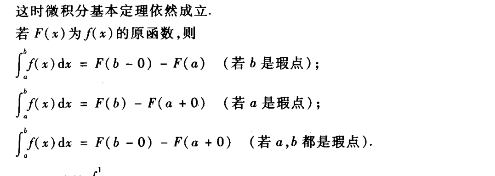

## 第十章 无穷级数和无穷积分

### 10.1 数项级数

#### 基本概念

<u>初等函数的微商还是仍然是初等函数，但是初等函数的积分不一定是初等函数</u>。所谓积分就是和的极限，即无限项**连续**相加，而级数为函数无限项**离散**相加，所以从本质上看，这两者有共同点，而且连续和离散之间是可以相互转换的

数项级数即无穷个数 $a_n，n=1,2,\dots$相加，表示为$a_1+a_2+\cdots +a_n + \cdots$，$a_n$ 是实数也可以是复数，这里只讨论实数，令 $S_n = a_1+a_2+\cdots +a_n$ 为级数的部分和，如果 $S_n \rightarrow S(n\rightarrow \infty)$，则称级数为收敛级数，且收敛于 S ，否则则称级数是发散的。

####  一些收敛判别法

> 无穷数列收敛与否，决定于无穷级数收敛与否，从收敛性看，无穷级数和无穷数列本质上是一致的

绝对收敛：

如果级数 $\vert a_1 \vert +\vert a_2\vert + \cdots +\vert a_n\vert$ 收敛，则称级数 $a_n$ 绝对收敛，凡是 **绝对收敛的级数一定收敛** ，有绝对值不等式就可以证明。

还可证明：如果 $b_n \ge 0$ 且$b_n$收敛，若 $\vert a_n\vert \le b_n$ ，则 $a_n$ 绝对收敛

1. 柯西判别准则 Cauchy

	无穷级数$a_1+a_2 + \cdots + a_n$收敛的充分必要条件为：

	对任一$\epsilon > 0$，存在正整数$N(\epsilon)$，当$n > m > N$时，$\vert S_n - S_m \vert < \epsilon$成立，即$\vert a_{m+1} + a_{m+1} +\cdots + a_n \vert<\epsilon$成立

2. <u>正项级数</u>的收敛判别法

	这是由单调有界数列必有极限得出

	如果$a_n \ge 0, \vert S_n \vert \le M$当n充分大时成立，则级数收敛

3. 级数收敛的<u>必要条件</u>

	在柯西判别准则中使$m = n-1$由$S_n - S_{n-1} = a_n$，所以有若级数收敛，则必须要有$\lim_{n\rightarrow \infty} a_n = 0$

4. 两个收敛级数

  则它们的和与差也收敛

5. 比较判别法

  两个<u>正项级数</u>$\sum_{n=1}^\infty a_n, \sum_{n=1}^\infty b_n$，且$a_n \le b_n，(n=1,2,\cdots)$，那么

  - 若$\sum_{n=1}^\infty b_n$收敛，则$\sum_{n=1}^\infty a_n$收敛
  - 若$\sum_{n=1}^\infty a_n$发散，则$\sum_{n=1}^\infty b_n$发散

6. 根植判别法

  如果级数$\sum_{n=1}^\infty a_n$有$\lim_{n\rightarrow \infty} \vert a_n \vert^{\frac{1}{n}} = r$，则：

  - r < 1，级数绝对收敛
  - r > 1，级数发散
  - r = 1，不能做出结论

7. 比值判别法

  若级数$\sum_{n=1}^\infty a_n$有$\lim_{n\rightarrow \infty} \vert \frac{a_{n+1}}{a_n} \vert = r$，则

  - r < 1，级数绝对收敛
  - r > 1，级数发散
  - r = 1，不能做出结论

8. 对于==正项级数==还可以用==无穷积分==判断其收敛与否

  设$f(x)$是确定在$x\ge 1$中的==非负、不增==的连续函数，则无穷级数$\sum_{k=1}^\infty f(k)$与无穷积分$\int_1^\infty f(x)dx$同时收敛或同时发散

#### 条件收敛级数

不绝对收敛的收敛级数称为条件收敛级数

1. 莱布尼兹判别法（==交错级数判别法==）

	如果$ 0<a_{n+1} \le a_n$以及$\lim_{n\rightarrow \infty}a_n =0$，则级数$\sum_{n=1}^\infty (-1)^na_n$收敛

2. 狄利克雷判别法

	若$b_k$==单调下降趋于0==，且$S_k = a_1 + a_2 + \cdots a_k$有界，即$\vert S_k \vert \le M, (k = 1, 2,3,\dots)$ ，则级数$\sum_{k=1}^\infty a_k b_k$收敛

3. 阿贝尔判别法

	如果$b_k$单调有界，$\sum_{k=1}^\infty a_k$收敛，则级数$\sum_{k=1}^\infty a_k b_k$收敛

绝对收敛的级数各项可以任意交换次序而不改变它的和

条件收敛级数，适当改变它各项的次序，可以作成发散的级数，也可以作成收敛于任一事先指定的数S的级数

参见:

[如何理解黎曼级数定理，为什么条件收敛级数仅通过改变次序就可以收敛于任意数？ - 知乎](https://www.zhihu.com/question/24880782/answer/29440397)

### 10.2 函数项级数

#### 无穷次相加产生的问题（概念）

设$u_1(x),u_2(x),\cdots,u_n(x)$，是定义在区间$[a,b]$上一列函数，称：
$$
\sum_{n=1}^{\infty} u_n(x)= u_1(x) + u_2(x)+\cdots + u_n(x)
$$
是区间$[a,b]$上的一个函数项级数，在$[a,b]$中取一点$x_0$，则$\sum_{n=1}^{\infty} u_n(x_0)$是一个数项级数，若$\sum_{n=1}^{\infty} u_n(x_0)$收敛则称函数项级数在这个点收敛，若对区间内每点收敛，就说$\sum_{n=1}^{\infty} u_n(x)$在区间上收敛

一般来说函数项级数在一些点上收敛，在一些点上发散，收敛点的全体称为收敛区域

函数项级数的问题为：

- 有限个连续函数之和是否仍为连续函数
- 有限个函数和的微商是否等于函数分别微商后求和
- 有限个函数和的积分是否等于这些函数分别积分之和

#### 一致收敛函数列

无穷函数列：$a_1(x), a_2(x),\cdots,a_n(x)$在$[a,b]$上定义，对$[a,b]$上任一点，就对应一个数列，如此数列收敛，则称函数列在这点收敛。如在$[a,b]$上每一点都收敛，则称函数列在$[a,b]$上收敛，此时对于$[a,b]$中的一点x，给了$\epsilon > 0$，有自然数N存在，使当$n > N$时，$\vert a_n(x)-a(x) \vert < \epsilon$，N不但与$\epsilon$有关，且与x有关。

如果在区间$[a,b]$中任何点x，对任给的$\epsilon > 0$，可选得N仅与$\epsilon$而与x无关，使得当$n > N$时，有$\vert a_n(x)-a(x) \vert < \epsilon$成立，则称$a_n(x)$在$[a,b]$上一致收敛于$a(x)$

1. 一致收敛函数列的柯西判别准则

	函数列：$a_1(x),a_2(x),\cdots,a_n(x)$，一致收敛的充要条件是：任给$\epsilon > 0$，可找到仅依赖于$\epsilon$，而不依赖于x的N使得当$m,n > N$有$\vert a_n(x)-a_m(x) \vert < \epsilon$

2. 连续函数的一致收敛数列的极限也是连续函数

3. 如果$a_n(x)$在$[a,b]$上连续，且一致收敛于$a(x)$，则
	$$
	\int_a^b a(x)dx = \lim_{n\rightarrow \infty} \int_a^b a_n(x)dx \\
	即，\int_a^b \lim_{n\rightarrow \infty} a_n(x)dx = \lim_{n\rightarrow \infty} \int_a^b a_n(x)dx
	$$
	极限运算与积分运算可以交换顺序

4. 若$a_n(x)$在$[a,b]$上可导且收敛，而微商列$a'_n(x)$在$[a,b]$上连续且一致收敛，则$a_n(x)$的极限$a(x)$是可导的，且
	$$
	a'(x) = \lim_{n\rightarrow \infty} a'_n(x) \\
	即，\frac{d}{dx} \lim_{n\rightarrow \infty} a_n(x) = \lim_{n\rightarrow \infty} \frac{d}{dx} a_n(x)
	$$
	也就是微商运算与极限运算可以交换顺序

#### 一致收敛函数项级数

如果函数项级数$u_1(x) + u_2(x) + \cdots + u_n(x)$，在$[a,b]$上收敛，也就是部分和$S_n(x) = \sum_{k=1}^n u_k(x)$，收敛到和函数$S(x)$，如果$S_n(x)$一致收敛到$S(x)$，则称函数项级数$\sum_{k=1}^n u_k(x)$在$[a,b]$上一致收敛

1. 柯西判别准则

	

2. 一致收敛的连续函数项级数之和函数也是连续函数

3. 一致收敛的连续函数项级数可以逐项积分，即
	$$
	\int_a^b(\sum_{n=1}^\infty u_n(x)) dx = \sum_{n=1}^\infty \int_a^bu_n(x)dx
	$$
	
4. 如级数收敛，每项可微，且微商后的级数一致收敛，则级数可以逐项微商，即如果$\sum_{n=1}^\infty u_n(x)$收敛，$u'_n(x)$连续，$\sum_{n=1}^\infty u'_n(x)$一致收敛，则
	$$
	\frac{d}{dx}(\sum_{n=1}^\infty u_n(x)) = \sum_{n=1}^\infty u'_n(x)
	$$
	
5. Weierstrass 维尔斯特拉斯判别法

	若$\sum_{n=1}^{\infty}a_n$是一正项收敛级数，如果对充分大的n，当$a \le x \le b$时，有$\vert u_n(x) \vert \le a_n$，则级数$\sum_{n=1}^{\infty}u_n$在$[a,b]$上一致收敛

6. 比较判别

	如果$\sum_{n=1}^{\infty}v_n$在$[a,b]$上一致收敛，且$v_n(x) \ge 0$，以及在$[a,b]$上$\vert u_n(x)\vert \le v_n(x)$，于是，$\sum_{n=1}^{\infty} u_n(x)$在$[a,b]$上也一致收敛

7. 根植判别

	如果有一与x无关的常数$r<1$使对充分大的n，$\vert u_n(x) \vert^{\frac{1}{n}} < r$在$[a,b]$成立，则$\sum_{n=1}^{\infty}u_n$在$[a,b]$上一致收敛

8. 比值判别

	

9. 狄利克雷

	

10. 阿贝尔

	

#### 隐函数存在定理

### 10.3 幂级数与泰勒级数

#### 幂级数的收敛半径

考虑幂级数$\sum_{n=0}^\infty a_n x^n = a_0 + a_1 x + \cdots + a_nx^n$，的收敛，有以下性质：

阿贝尔定理

如果幂级数$\sum_{n=0}^\infty a_n x^n$在点$x = x_0(x_0 \neq 0)$收敛，那么它在区间$\vert x \vert < \vert x_0\vert$中绝对收敛，相反的如果在$x = x'_0, x'_0 \neq 0$发散，那么它在$\vert x \vert > \vert x_0\vert$的点上发散，所以幂级数存在一个收敛半径使得$\vert x \vert < R$时收敛，当$\vert x \vert > R$级数发散

所以可以根据之前的收敛判别法计算收敛半径

对于端点的收敛和发散没有一般的判定，要看具体级数

#### 幂级数的性质

1. 设$\sum_{n=0}^\infty a_n x^n$的收敛半径是R，则对任意$0 < r < R$的r，级数在$[-r,r]$上一致收敛

2. 设$\sum_{n=0}^\infty a_n x^n$的收敛区间为$(-R,R)$，则和函数$S(x)$在$(-R,R)$上连续

3. 设$\sum_{n=0}^\infty a_n x^n$的收敛半径为R，则其和函数$S(x)$在区间$(-R,R)$可微，且其导函数可通过逐项求导得到即$S'(x) = \sum_{n=1}^\infty n x^{n-1}$，可用于和函数的推导（微商之后解微分方程）

4. 设幂级数$\sum_{n=0}^\infty a_n x^n$的收敛半径是R，和函数为$S(x)$，则对$(-R,R)$中的任意点x有
	$$
	\int_0^x S(x)dx = \int_0^x[\sum_{n=0}^\infty a_n x^n]dx = \sum_{n=0}^\infty \frac{a_n}{n+1} x^{n+1}
	$$
	
5. 阿贝尔定理

	
	还可以推导出如果在$\sum_{n=1}^\infty a_n$条件收敛，则幂级数$a_n x^n$收敛半径为1

==幂级数乘法定理==：
$$
\sum_{n=0}^\infty a_n x^n\times\sum_{n=0}^\infty b_n x^n = \sum_{n=0}^\infty (\sum_{i=0}^n a_ib_{n-i})x^n
$$

[**两个幂级数收敛半径的问题**：](https://wenku.baidu.com/view/de3ee51e964bcf84b9d57b7c.html)

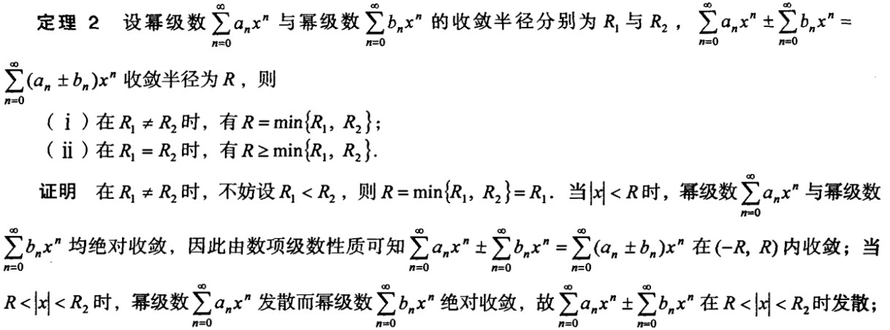

#### 泰勒级数

泰勒级数的定义：

可以展开为泰勒级数的充分必要条件为：

展开为泰勒级数的充分条件为：

麦克劳林级数：

f(x)的麦克劳林级数在$x =0$的某个领域收敛，但不一定收敛于$f(x)$

一些初等函数的麦克劳林级数：

这里的 `arctan x` 的推导很有技巧，使用了从和函数到级数的反向思维
$$
f(x) = \arctan x\\
f'(x) = \frac{1}{1+x^2} =\sum_{n=0}^{\infty} (-1)^n x^{2n} \\
\therefore f(x) - f(0) = \int_0^x f'(x) dx = \int_0^x \sum_{n=0}^{\infty} (-1)^n x^{2n} dx =  \\
= \sum_{n=0}^{\infty} (-1)^n \int_0^x x^{2n} dx = \sum_{n=0}^{\infty} (-1)^n \frac{x^{2n+1}}{2n+1}
$$

### 10.4 无穷积分与含参变量积分

> 随便看看吧。。。

#### 无穷积分的收敛判别法

> 下面的结论对瑕积分同样适用

无穷积分的收敛即无穷积分
$$
\int_a^\infty f(x)dx = \lim_{A\rightarrow +\infty} \int_a^A dx
$$
存在**有限**的极限

无穷积分和无穷级数的部分和是一致的，记$F(A) = \int_a^A f(x)dx$，有

当$x\rightarrow +\infty$时，函数$F(x)$有一有限极限的充分必要条件是，对任给的$\epsilon > 0$，存在$X > 0$，当$x,x' > X$时，有$\vert F(x) - F'(x) \vert < \epsilon$

几种判别法：

比值判别：

#### 含参变量的积分

含参变量的积分的积分运算和极限运算可以交换顺序
$$
\lim_{u\rightarrow u_0}\int_a^b f(x,u)dx = \int_a^b \lim_{u\rightarrow u_0}f(x,u)dx
$$
积分号也可以交换顺序：
$$
\int_{\alpha}^\beta \phi(u)du = \int_{\alpha}^\beta \int_{a}^b f(x,u)dxdu =   \int_{a}^b\int_{\alpha}^\beta f(x,u)dudx
$$

#### 含参变量的无穷积分

> 很多都是和之前一样的结论。。

## 第十一章 傅里叶级数

> 选自川大教材

#### 三角函数系的正交性以及函数f(x)的傅里叶级数

正余弦是最简单的周期函数，对于复杂的周期函数（非周期也可化为周期），可以使用简单的三角级数来表示（收敛到此函数），一般三角级数有以下形式：
$$
\frac{a_0}{2} + \sum_{n=1}^\infty (a_n \cos nx + b_n \sin nx)
$$
其中$a_0,a_n, b_n$均为常数，该级数的正交性表现如下：

三角函数系$1,\cos x,\sin x,\cos 2x, \sin 2x,\cdots ,\cos nx, \sin nx$，具有以下性质：

在$[-\pi, \pi]$，上任两个不同函数之积的积分为0，而任意两个相同函数之积的积分一定是非0，证明如下：

函数$f(x)$傅叶级数的形式为：
$$
f(x) = \frac{a_0}{2} + \sum_{n=1}^\infty (a_n \cos nx + b_n \sin nx)
$$
对$a_0,a_n, b_n$的推导也十分容易：

1. 两边积分可得
	$$
	\int_{-\pi}^\pi f(x)dx = \int_{-\pi}^\pi\frac{a_0}{2}dx + \sum_{n=1}^\infty (a_n \int_{-\pi}^\pi \cos nx dx+ b_n \int_{-\pi}^\pi\sin nxdx) = a_0 \pi \\
	a_0 = \frac{1}{\pi} \int_{-\pi}^\pi f(x)dx
	$$
	
2. 两边乘以$\cos mx(m = 1,2,\cdots)$乘以展开式两端并积分有
	$$
	\int_{-\pi}^\pi f(x)\cos mx dx = \frac{a_0}{2}\int_{-\pi}^\pi \cos mxdx + \sum_{n=1}^\infty (a_n \int_{-\pi}^\pi \cos nx \cos mxdx+ b_n \int_{-\pi}^\pi\sin \cos mxnxdx) = a_n \pi \\
	$$
	这里根据正交性可以得到：
	$$
	\int_{-\pi}^\pi f(x)\cos mx dx = \sum_{n=1}^\infty (a_n \int_{-\pi}^\pi \cos nx \cos mxdx)
	$$
	因为当$n \neq m$时，积分为0，所以上式就等于$n = m$时候的展开，即
	$$
	\int_{-\pi}^\pi f(x)\cos mx dx = a_m\int_{-\pi}^\pi (\cos mx)^2 dx =a_m\pi\\
	a_m = \frac{1}{\pi} \int_{-\pi}^\pi f(x)\cos mx dx \\
	\because n = m \\
	\therefore a_n = \frac{1}{\pi} \int_{-\pi}^\pi f(x)\cos nx dx ,这里n = 1,2,\cdots
	$$

3. 同理用$\sin mx$同乘两边并积分可得：
	$$
	b_n = \frac{1}{\pi} \int_{-\pi}^\pi f(x)\sin nx dx, 这里n = 1,2,\cdots
	$$

$a_0和a_n,n=1,2,\cdots$可以合并，所以有：
$$
\begin{align*}
a_n &= \frac{1}{\pi} \int_{-\pi}^\pi f(x)\cos nx dx  &(&n = 0,1,2,\cdots) \\
b_n &= \frac{1}{\pi} \int_{-\pi}^\pi f(x)\sin nx dx &(&n = 1,2,3,\cdots)

\end{align*}
$$

#### 以$2\pi$为周期的函数$f(x)$的傅里叶级数展开问题

收敛定理（狄利克雷定理）

设$f(x)$是周期为$2\pi$的周期函数，满足：

1. 在一个周期内连续或只有有限个第一类间断点
2. 在一个周期内至多只有有限个极值点

则$f(x)$的傅里叶级数是收敛的，并且其和函数为：
$$
s(x) = 
\begin{cases}
f(x) & \text{当x为连续点}\\
\frac{f(x-0) + f(x+0)}{2} & \text{当x为间断点时}
\end{cases}
$$
由函数的周期性，为便于计算总有
$$
s(\pm \pi) = 
\frac{f(-\pi + 0) + f(\pi-0)}{2}
$$

所以若函数以$2\pi$为周期，且满足收敛定理，则可按定理在$(-\infty, +\infty)$上将$f(x)$展开称傅里叶级数，并确定其收敛性

若函数仅定义在$(-\pi,\pi)$（或半开半闭、闭区间）上，且在该区间满足收敛定理，则可以将此函数拓展为以$2\pi$为周期的函数$F(x)$，有
$$
\begin{align*}
F(x) &= f(x)&, &x\in (-\pi, \pi)\\
F(x) &= F(x+2\pi)&,&x\in(-\infty,+\infty)
\end{align*}
$$
在$x = (2k+1)\pi$处可根据情况适当定义，此时的傅里叶级数为：
$$
\begin{align*}
a_n &= \frac{1}{\pi} \int_{-\pi}^\pi f(x)\cos nx dx  &(&n = 0,1,2,\cdots) \\
b_n &= \frac{1}{\pi} \int_{-\pi}^\pi f(x)\sin nx dx &(&n = 1,2,3,\cdots)

\end{align*}
$$
特别的当函数在$(-\pi,\pi)$上为奇函数，此时的傅里叶级数可简化为==正弦级数==：

因为此时的$a_n = 0$，所以级数为
$$
\sum_{n=1}^\infty b_n \sin nx
$$
类似的当在$(-\pi,\pi)$上为偶函数，此时的傅里叶级数可简化为==余弦级数==：
$$
\frac{a_0}{2} + \sum_{n=1}^{\infty} a_n \cos nx
$$
若函数定义在$(0,\pi)$（或半开半闭，闭区间），可以将函数拓展为$(-\pi,\pi)$上的奇函数/偶函数，然后拓展为周期函数，最后展开为正弦级数/余弦级数

#### 以$2l$为周期的函数的傅里叶函数展开问题

实际的问题中所遇到的周期函数，它的周期不一定是$2\pi$，一般可记周期为$2l$，（非周期可拓展为周期）

设周期为$2l$的函数$f(x)$，满足收敛定理条件，则它的傅里叶级数为:
$$
\frac{a_0}{2} + \sum_{n=1}^\infty (a_n \cos n\frac{\pi}{l}x + b_n \sin n\frac{\pi}{l}x)
$$
其和函数为：
$$
s(x) = 
\begin{cases}
f(x) & \text{当x为连续点}\\
\frac{f(x-0) + f(x+0)}{2} & \text{当x为间断点时}
\end{cases}
$$

其中：
$$
\begin{align*}
a_n &= \frac{1}{l} \int_{-\pi}^\pi f(x)\cos n\frac{\pi}{l}x dx  &(&n = 0,1,2,\cdots) \\
b_n &= \frac{1}{l} \int_{-\pi}^\pi f(x)\sin n\frac{\pi}{l}x dx &(&n = 1,2,3,\cdots)

\end{align*}
$$
其实做代换$t = \frac{\pi}{l} x$就可以将区间$(-l,l)$转换为$(-\pi, \pi)$，然后带入原傅里叶级数即可

这里的结论和$2\pi$周期是一致的