# 计算机系统结构整理

>Weijun-Lin@foxmail.com 2020-05-20

## 第一章 计算机系统结构的基本	概念

第一台通用电子计算机诞生于1946年

计算机技术的飞速发展得益于两个方面

1. 计算机制造技术的发展
2. 计算机系统结构的创新

系统结构的重大转折：

1. 从单纯依靠指令级并行转向开发线程级并行和数据级并行
2. 计算机系统结构在计算机的发展中有着极其重要的作用

### 1.2 计算机系统结构的概念

#### 计算机系统的层次结构

1. 计算机系统＝硬件/固件＋软件
2. 计算机语言从低级向高级发展
3. 从计算机语言的角度，把计算机系统按功能划分成多层次结构

#### 计算机系统结构的定义

1. 计算机系统结构的经典定义：程序员所看到的计算机属性，即概念性结构与功能特性

2. 按照计算机系统的多级层次结构，不同级程序员所看到的计算机具有不同的属性

3. Amdahl提出的系统结构：传统机器语言级程序员所看到的计算机属性

	属性主要为：

	- 指令系统
	- 数据表示
	- 寻址规则
	- 寄存器定义
	- 中断系统
	- 机器工作状态的定义和切换
	- 存储系统
	- 信息保护
	- I/O结构

4. **广义的系统结构定义：指令集结构、组成、硬件**

5. 计算机系统结构概念的**实质**：确定计算机系统中软、硬件的界面，界面之上是软件实现的功能，界面之下是硬件和固件实现的功能

#### 计算机组成和计算机实现

一种体系结构可以有多种组成，一种组成可以有多种物理实现

1. **计算机系统结构**：计算机系统的软、硬件的界面

2. **计算机组成**：计算机系统结构的逻辑实现

	物理机器级内各事件的排序方式与控制方式、各部件的功能以及各部件之间的联系

3. **计算机实现**：计算机组成的物理实现（器件技术（起主导作用）、微组装技术）

#### 计算机系统结构的分类

1. **冯氏分类法：用系统的最大并行度对计算机进行分类**

	最大并行度：计算机系统在单位时间内能够处理的最大的二进制位数

2. **Flynn分类法：按照指令流和数据流的多倍性进行分类**

	- 指令流：计算机执行的指令序列
	- 数据流：由指令流调用的数据序列
	- 多倍性：在系统受限的部件上，同时处于同一执行阶段的指令或数据的最大数目

	可以分为四类：

	- 单指令流单数据流(SISD)
	- 单指令流多数据流(SIMD)
	- 多指令流单数据流(MISD)
	- 多指令流多数据流(MIMD)

	以上四类的基本结构：IS：指令流，DS：数据流，CS：控制流，CU：控制部件，PU：处理部件，MM和SM：存储器

	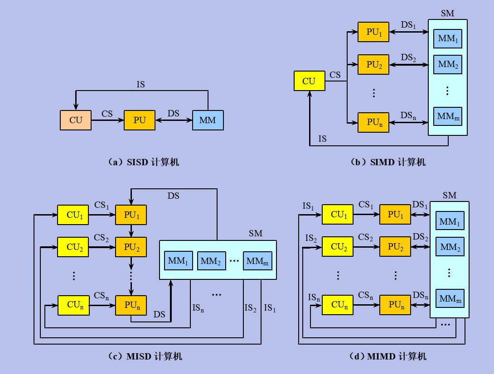

### 1.3 定量分析技术

#### 计算机系统结构的定量原理

1. 以经常性事件为重点(大概率事件优先)

2. Amdahl定律

	系统性能加速比：**$加速比=\frac{总执行时间_{改进前}}{总执行时间_{改进后}}$**

	加速比依赖于两个因素：

	1. 可改进比例：改进前的系统中，可改进部分的执行时间在总的执行时间中所占的比例

	2. 部件加速比：可改进部分改进后性能提高的倍数，改进前所需的执行时间于改进后执行时间的比

	3. 改进后的程序总执行时间：
		$$
		\begin{align}
		总执行时间_{改进后} &= 不可改进部分的执行时间 + 可改进部分改进后的执行时间 \\
		总执行时间_{改进后} &= (1-可改进比例)\times总执行时间_{改进前}+\frac{可改进比例\times总执行时间_{改进前}}{部件加速比} \\
		&= [(1-可改进比例)+\frac{可改进比例}{部件加速比}]\times总执行时间_{改进前}
		\end{align}
		$$

	4. 可得加速比为：
		$$
		\begin{align}
		加速比 &= \frac{总执行时间_{改进前}}{总执行时间_{改进后}} \\
		&= \frac{1}{(1-可改进比例)+\frac{可改进比例}{部件加速比}}
		\end{align}
		$$
		
	5. 是一种性能改进的递减规则，如果只针对整个任务的一部分进行改进和优化，那么所获得的加速比不超过1/(1－可改进比例)
	
3. CPU性能公式

     1. 执行一个程序所需的CPU时间

       	**CPU时间 = 执行程序所需的时钟周期数×时钟周期时间**

       	时钟周期时间是系统时钟频率的倒数

     2. 每条指令执行的平均时钟周期数CPI

       	**CPI = 执行程序所需的时钟周期数/IC，IC所执行的指令条数**
       	程序执行的CPU时间可以写为：IC ×CPI ×时钟周期时间 

     3. CPU的性能取决于3个参数：
          1. 时钟周期时间：取决于硬件实现技术和计算机组成
          2. CPI：取决于计算机组成和指令集结构
          3. IC：取决于指令集结构和编译技术

     4. CPU性能公式进一步细化：

         CPIi ：第i种指令的处理时间
         ICi ：在程序中第i种指令出现的次数
         $CPU时钟周期数=\sum_{i=1}^{n}{CPI_i\times IC_i}$

         $CPI=\frac{时钟周期数}{IC} = \sum_{i=1}^{n}{CPI_i\times \frac{IC_i}{IC}}$

4. 程序的局部性原理

    程序执行时所访问的存储器地址分布不是随机的，而是相对地簇聚

    常用的应该经验规则：程序执行时间的90%都是在执行程序中10%的代码

    - 程序的时间局部性：

    	程序即将用到的信息很可能就是目前正在使用的信息

    - 程序的空间局部性：

    	程序即将用到的信息很可能与目前正在使用的信息在空间上相邻或者临近

#### 计算机系统的性能测评

1. 执行时间和吞吐率

	用户角度：单个程序的执行时间

	数据管理与：吞吐率（单位时间里能够完成的任务）

2. 主要标准：执行程序的时间

	1. MIPS，每秒百万条指令数
		$$
		\begin{align}
		MIPS &= 指令条数/(执行时间\times 10^6) \\
		&= 时钟频率/(CPI\times 10^6)
		\end{align}
		$$
	
2. MFLOPS，每秒百万次浮点操作次数 = 程序中的浮点操作次数 /（执行时间×10^6）
	
3. 利用基准测试程序

### 1.4 计算机系统结构的发展

#### 冯·诺依曼结构 

主要特点：（存储程序计算机）

- 以运算器为中心。
- 在存储器中，指令和数据同等对待
- 存储器是按地址访问、按顺序线性编址的一维结构，每个单元的位数是固定的
- 指令的执行是顺序的
- 指令由操作码和地址码组成
- 指令和数据均以二进制编码表示，采用二进制运算

### 1.5 计算机系统中并行性的发展

#### 并行性的概念

1. 并行性：计算机系统在同一时刻或者同一时间间隔内进行多种运算或操作，只要在时间上相互重叠，就存在并行性
	- 同时性：两个或两个以上的事件在同一时刻发生。
	- 并发性：两个或两个以上的事件在同一时间间隔内发生。 
2. 从执行程序的角度来看，并行性等级从低到高可分为
	- 指令内部并行
	- 指令级并行
	- 线程级并行
	- 任务级或过程级并行
	- 作业或程序级并行
3. 提高并行性的技术途径
	- 时间重叠
	- 资源重复
	- 资源共享

## 第二章 计算机指令集结构（MIPS）

- CISC（复杂指令集计算机）

	增强指令功能，把越来越多的功能交由硬件来实现，并且指令的数量也是越来越多。

- RISC（精简指令集计算机）
	尽可能地把指令集简化，不仅指令的条数少，而且指令的功能也比较简单。 

## 第三章 流水线技术

### 3.1 重叠执行和先行控制

#### 重叠执行

二次重叠执行过程如下：

此时，执行n条指令花费的时间为$T=(2+n)t$

有以下优点：

- 时间缩短
- 部件利用率提高

缺点：

- 需要增加更多的硬件
- 需要设置独立的取指令部件，指令分析部件和指令执行部件

存在主存的访问冲突问题（读写主存），有以下四种解决方法：

- 设置两个独立编址的存储器： 指令存储器（存放指令）、数据存储器（存放数据）

- 指令和数据仍然混合存放在同一个主存中，但设置两个Cache：指令Cache、数据Cache，**程序空间和数据空间相互独立的系统结构被称为哈佛结构**

- 指令和数据仍然混合存放在同一个主存中，但主存采用多体交叉结构

- 在主存和指令分析部件之间增设指令缓冲站（又被称为先行指令缓冲站 ）

	先行指令缓冲站的组成如下：

	

	- 指令缓冲存储区和相应的控制逻辑
		- 按队列方式工作
		- 只要指令缓冲站不满，它就自动地向主存控制器发取指令请求，不断地预取指令
	- 指令分析部件
		- 每分析完一条指令，就自动向指令缓冲站发出取下一条指令的请求。指令取出之后就把指令缓冲站中的该指令作废
		- 指令缓冲站中存放的指令的条数是动态变化的
	- 两个程序计数器
		- 先行程序计数器PC1：用于从主存预取指令
		- 现行程序计数器PC：用来记录指令分析部件当前正在分析的指令的地址

当每个子过程执行的时间不相等时，会出现部件空闲的情况：

#### 先行控制

1. 先行控制技术：缓冲技术和预处理技术的结合

	- 缓冲技术：在工作速度不固定的两个功能部件之间设置缓冲器，用以平滑它们的工作
	- 预处理技术：预取指令、对指令进行加工以及预取操作数等。

2. 采用先行控制方式的处理机结构 

	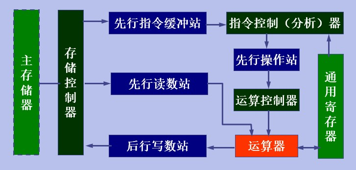

	特点：

	- 缓冲站按先进先出的方式工作
	- 每个存储单元由3部分组成：先行地址字段、先行操作数字段、标志字段

### 3.2 流水线的基本概念

#### 什么是流水线

1. 流水线技术
	- 把一个重复的过程分解为若干个子过程，每个子过程由专门的功能部件来实现
	- 把多个处理过程在时间上错开，依次通过各功能段，这样，每个子过程就可以与其他的子过程并行进行
2. 流水线中的每个子过程及其功能部件称为流水线的级或段，段与段相互连接形成流水线。流水线的段数称为流水线的深度
3. 流水技术的特点
	- 流水线把一个处理过程分解为若干个子过程（段），每个子过程由一个专门的功能部件来实现
	- 流水线中各段的时间应尽可能相等，否则将引起流水线堵塞、断流。**时间长的段将成为流水线的瓶颈**
	- 流水线每一个功能部件的后面都要有一个缓冲寄存器（锁存器），称为流水寄存器，在相邻的两段之间传送数据，以保证提供后面要用到的数据，并把各段的处理工作相互隔离
	- **流水技术适合于大量重复的时序过程，只有在输入端不断地提供任务，才能充分发挥流水线的效率**
	- 流水线需要有通过时间和排空时间
		- 通过时间：第一个任务从进入流水线到流出结果所需的时间
		- 排空时间：最后一个任务从进入流水线到流出结果所需的时间

#### 流水线的分类

- 单功能流水线于多功能流水线

	- 单功能：只能完成一种固定功能的流水线
	- 多功能：流水线的各段可以进行不同的连接，以实现不同的功能

- 静态与动态流水线

	- 静态流水线：在同一时间内，多功能流水线中的各段只能按同一种功能的连接方式工作，只有输入为一串相同的运算任务时，流水的效率才得到充分的发挥
	- 动态流水线：在同一时间内，多功能流水线中的各段可以按照不同的方式连接，同时执行多种功能

	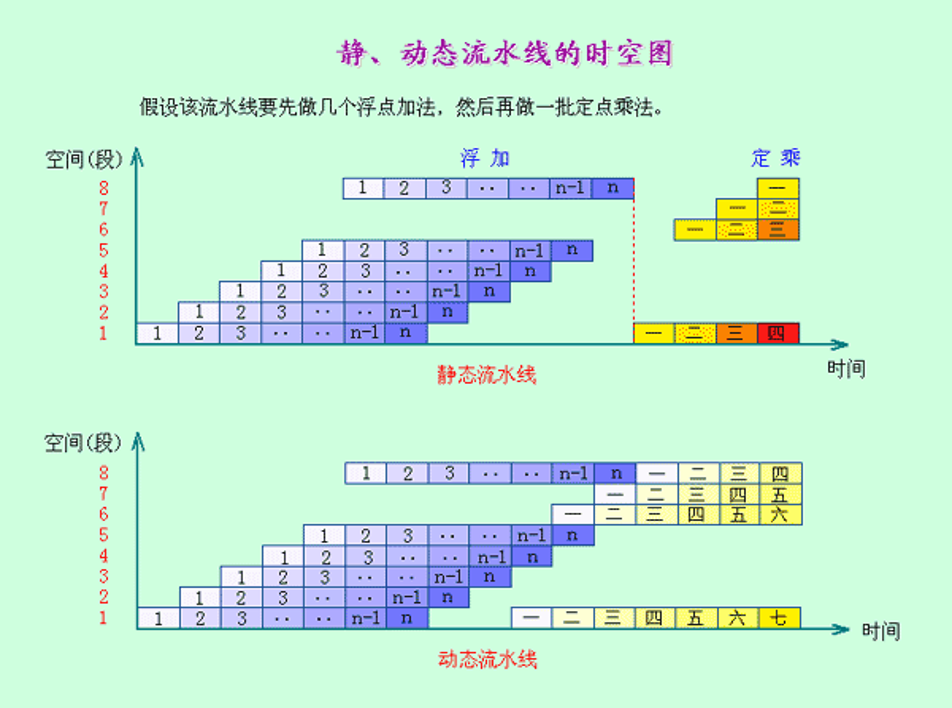

- 部件级、处理机级及处理机间流水线

	- 部件级流水线（运算操作流水线）：把处理机的算术逻辑运算部件分段，使得各种类型的运算操作能够按流水方式进行
	- 处理机级流水线（指令流水线）：把指令的解释执行过程按照流水方式处理。把一条指令的执行过程分解为若干个子过程，每个子过程在独立的功能部件中执行
	- 处理机间流水线（宏流水线）：它是由两个或者两个以上的处理机串行连接起来，对同一数据流进行处理，每个处理机完成整个任务中的一部分

- 线性流水线和非线性流水线

	- 线性流水线：流水线的各段串行连接，没有反馈回路。数据通过流水线中的各段时，每一个段最多只流过一次
	- 非线性流水线：流水线中除了有串行的连接外，还有反馈回路

- 顺序流水线和乱序流水线

	- 顺序流水线：流水线输出端任务流出的顺序与输入端任务流入的顺序完全相同。每一个任务在流水线的各段中是一个跟着一个顺序流动的。
	- 乱序流水线：流水线输出端任务流出的顺序与输入端任务流入的顺序可以不同，允许后进入流水线的任务先完成（从输出端流出）

- 标量处理机与向量流水处理机

	- 标量处理机：处理机不具有向量数据表示和向量指令，仅对标量数据进行流水处理
	- 向量流水处理机：具有向量数据表示和向量指令的处理机

### 3.3 流水线的性能指标

#### 吞吐率

> 在单位时间内流水线所完成的任务数量或输出结果的数量，$TP=\frac{n}{T_k}$，其中n为任务数，$T_k$为处理完成n个任务所用的时间

1. 各段时间均相等的流水线

	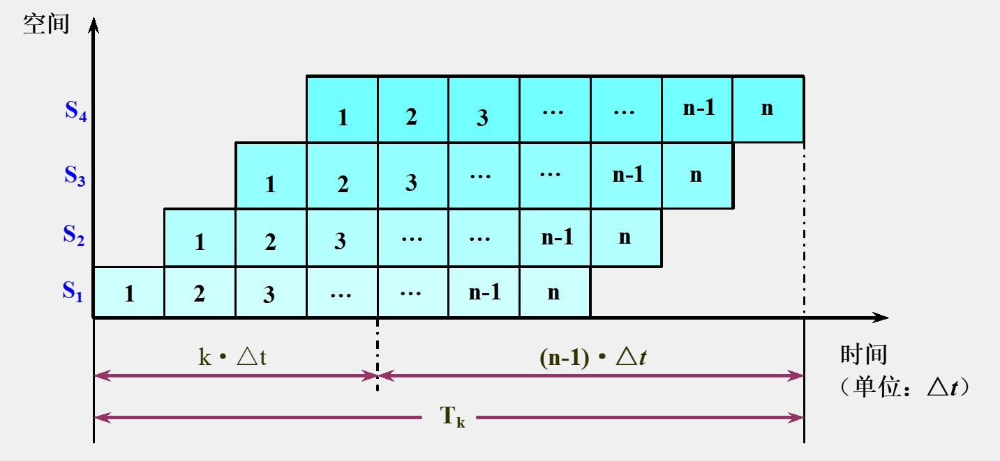

	由图可以得出，此流水线的实际吞吐率为:

	$TP=\frac{n}{(k+n-1)\Delta t}$

	最大吞吐率为：

	$TP_{max} = lim_{n\rightarrow \infty} \frac{n}{(k+n-1)\Delta t} = \frac{1}{\Delta t}$

2. 各段不完全相等的流水线

	

	实际吞吐率如下：

	$TP = \frac{n}{\sum_{i=1}^{k}\Delta t_i+(n-1)max(\Delta t_1, \dots,\Delta t_k)}$

	同样的最大吞吐率为：

	$TP_{max} = \frac{1}{max(\Delta t_1, \dots,\Delta t_k)}$

解决流水线瓶颈问题的常用方法

1. 细分瓶颈段

	对上图$S_3$，将其划分为3个子流水线段即可

	

2. 重复设置瓶颈段

	使用空间弥补的方法，对$S_3 $只需要设置3个即可

	

	重置后的时空图如下：

	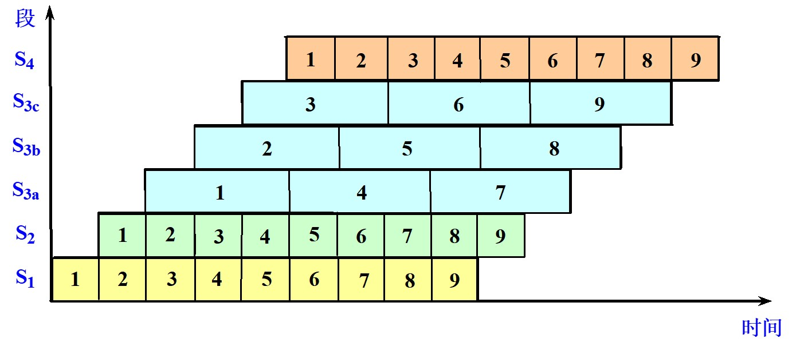

#### 加速比

> 完成同样一批任务，不使用流水线所用的时间与使用流水线所用的时间之比

即：$S=\frac{T_s}{T_k}$，$T_s$为顺序执行所用的时间，$T_k$为流水线后的时间

1. 流水线各段时间相等

	此时流水线实际加速比为：$S=\frac{nk}{k+n-1}$，最大加速比为k，当$n\rightarrow \infty$时取到

2. 流水线的各段时间不完全相等时
	$$
	S=\frac{n\sum_{i=1}^k \Delta t_i}{\sum_{i=1}^k \Delta t_i+(n-1)max{\Delta t_1,\dots,\Delta t_k}}
	$$

#### 效率

> 流水线中的设备实际使用时间与整个运行时间的比值，即流水线设备的利用率。由于流水线有通过时间和排空时间，所以在连续完成n个任务的时间内，各段并不是满负荷地工作

从时空图上看，效率就是n个任务占用的时空面积和k个段总的时空面积之比

1. 各段时间相等：

	根据面积比可以得出：$E=\frac{n\Delta t}{(k+n-1)\Delta t} = \frac{n}{k+n-1}$，可以看出和吞吐率有关系，为$E=TP\Delta t$，同样的和加速比也有关系，$E = \frac{S}{k}$

2. 各段时间不相等时：
	$$
	E=\frac{n\sum_{i=1}^k \Delta t_i}{k[\sum_{i=1}^k \Delta t_i+(n-1)\times max{\Delta t_1,\dots,\Delta t_k}]}
	$$

#### 流水线设计中的若干问题

1. 瓶颈问题

	- 理想情况下，流水线在工作时，其中的任务是同步地每一个时钟周期往前流动一段
	- 当流水线各段不均匀时，机器的时钟周期取决于瓶颈段的延迟时间
	- 在设计流水线时，要尽可能使各段时间相等

2. 流水线的额外开销

	- 流水寄存器需要建立时间和传输延迟
	- 时钟偏移开销

	注意几个细节：

	- 流水线并不能减少（而且一般是增加）单条指令的执行时间，但却能提高吞吐率
	- 增加流水线的深度（段数）可以提高流水线的性能
	- 流水线的深度受限于流水线的额外开销
	- 当时钟周期小到与额外开销相同时，流水已没意义。因为这时在每一个时钟周期中已没有时间来做有用的工作

3. 冲突问题

### 3.4 流水线的相关与冲突

#### 经典5段流水线

虚线代表此处仅花费时钟单元的一半时间,	可以在前半段时间写回后半段从寄存器读取

1. 取指令周期IF

2. 指令译码/读寄存器周期（ID）

3. 执行/有效地址计算周期（EX）

	4种不同指令所进行的操作不同：

	- 存储器访问指令：ALU把所指定的寄存器的内容与偏移量相加，形成用于访存的有效地址
	- 寄存器－寄存器ALU指令：ALU按照操作码指定的操作对从通用寄存器组中读取的数据进行运算
	- 寄存器－立即数ALU指令：ALU按照操作码指定的操作对从通用寄存器组中读取的第一操作数和立即数进行运算
	- 分支指令：ALU把偏移量与PC值相加，形成转移目标的地址。同时，对在前一个周期读出的操作数进行判断，确定分支是否成功

4. 存储器访问／分支完成周期（MEM）

	该周期处理的指令只有load、store和分支指令（分支“成功”，就把转移目标地址送入PC）。其他类型的指令在此周期不做任何操作

5. 写回周期（WB）

	ALU运算指令和load指令在这个周期把结果数据写入通用寄存器组

采用流水线实现时需要解决的问题：

1. 要保证不会在同一时钟周期要求同一个功能段做两件不同的工作
2. 避免IF段的访存（取指令）与MEM段的访存（读/写数据）发生冲突
3. ID段和WB段都要访问同一寄存器文件，**把写操作安排在时钟周期的前半拍完成，把读操作安排在后半拍完成**，解决对同一寄存器的访问冲突
4. 考虑PC的问题，在MEM段进行的分支和IF段取下一个PC的冲突

#### 相关与流水线冲突

##### 相关

> 两条指令之间存在某种依赖关系。如果两条指令相关，则它们就有可能不能在流水线中重叠执行或者只能部分重叠执行

有三种类型：

**前提条件：对于两个指令i，j且i在j前**

- **数据相关（真数据相关）**

	满足下列条件表明j与i数据相关，数据相关具有传递性

	- 指令j使用指令i产生的结果
	- 指令j与k数据相关，k与i数据相关

	寄存器的数据相关比较容易检测，单存储器检测比较复杂，因为有效地址生成的规则复杂

- **名相关**

	如果两条指令使用相同的名，但是它们之间并**没有数据流动**（不存在数据相关），则称这两条指令存在名相关，如果一条指令中的名改变了，并不影响另外一条指令的执行

	- 反相关：指令j写的名＝指令i读的名
	- 输出相关：指令j写的名＝指令i写的名

	通过**换名技术**消除名相关：通过改变指令中操作数的名来消除名相关，对于寄存器操作数进行换名称为寄存器换名

- **控制相关**

	控制相关是指由分支指令引起的相关，有以下两个限制

	- 与一条分支指令控制相关的指令不能被移到该分支之前，否则这些指令就不受该分支控制了
	- 如果一条指令与某分支指令不存在控制相关，就不能把该指令移到该分支之后

##### 流水线冲突

> 是指对于具体的流水线来说，由于相关的存在，使得指令流中的下一条指令不能在指定的时钟周期执行

带来的问题：

- 导致错误的执行结果
- 流水线可能会出现停顿，从而降低流水线的效率和实际的加速比

当一条指令被暂停时，在该暂停指令之后流出的所有指令都要被暂停，而在该暂停指令之前流出的指令则继续进行（否则就永远无法消除冲突）

有三种类型：

- **结构冲突**

	因硬件资源满足不了指令重叠执行的要求而发生的冲突

	有些流水线处理机只有一个存储器，将数据和指令放在一起，访存指令会导致访存冲突

	**通过插入暂停周期（气泡）**解决，或者设置独立的指令存储器和数据存储器或者设置独立的Cache

	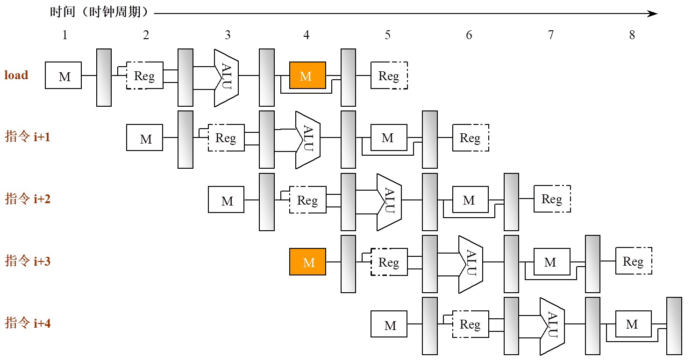

	插入气泡后：

	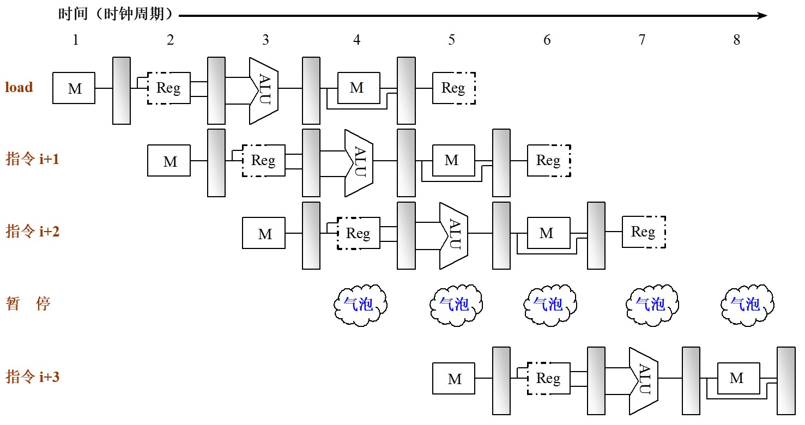

	结构冲突有时候是允许的，可以减少硬件成本

- **数据冲突**

	当指令在流水线中重叠执行时，因需要用到前面指令的执行结果而发生的冲突

	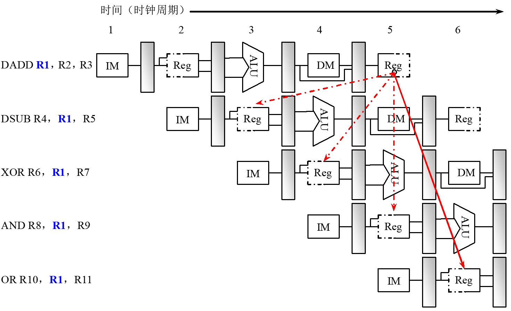

	**前提条件：对于两个指令i，j且i在j前**，有以下三种类型：

	- 写后读冲突RAW

		在i写之前j去读，对于真数据相关

	- 写后写冲突WAW

		在i写入之前j先写，对应输出相关

		仅发生在这样的流水线中：

		- 流水线中不只一个段可以进行写操作
		- 当先前某条指令停顿时，允许其后续指令继续前进

		我们之前的5段流水线不会发生

	- 读后写冲突WAR

		在i读之前j先写，对应反相关

		仅发生这样的流水线中：

		- 有些指令的写结果操作提前了，而且有些指令的读操作滞后了
		- 指令被重新排序了

		我们之前的5段流水线不会发生

	**通过定向技术（也称为旁路或短路），减少数据冲突引起的停顿：**

	关键思想：在某条指令产生计算结果之前，后面等待使用该结果的指令并不一定立即需要该结果，如果能够将该计算结果从其产生的地方（ALU出口）直接送到其他指令需要它的地方（ALU入口），那么就可以避免停顿。

	

	并不是所有的数据冲突都可以用定向技术来解决，必要时需要增加**暂停**：

	

	**通过编译器解决数据冲突**

	改变指令的执行顺序解决数据冲突

- **控制冲突**

	流水线遇到分支指令和其他会改变PC值的指令所引起的冲突

	处理分支指令最简单的方法：排空流水线，给流水线带来3个时钟周期的延迟

	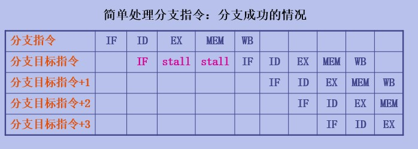

	由分支指令引起的延迟为**分支延迟**

	可采取两种措施来减少分支延迟

	- 在流水线中尽早判断出分支转移是否成功
	- 尽早计算出分支目标地址

	下面的讨论中，我们假设：这两步工作被提前到ID段完成，即分支指令是在ID段的末尾执行完成，所带来的分支延迟为一个时钟周期

	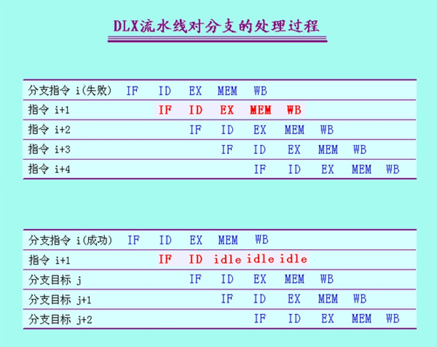

	**减少分支延迟的方法**:

	共同点:

	- 对分支的处理方法在程序的执行过程中始终是不变的，是静态的
	- 要么总是预测分支成功，要么总是预测分支失败

	- **预测分支失败**

		允许分支指令后的指令继续在流水线中流动，就好象什么都没发生似的
	若确定分支失败，将分支指令看作是一条普通指令，流水线正常流动
	
		要保证：分支结果出来之前不会改变处理机的状态，以便一旦猜错时，处理机能够回退到原先的状态
	
- **预测分支成功**
	
	假设分支转移成功，并从分支目标地址处取指令执行。
		起作用的前题：先知道分支目标地址，后知道分支是否成功
	前述5段流水线中，这种方法没有任何好处
	
- **延迟分支**
	
	从逻辑上“延长”分支指令的执行时间。把延迟分支看成是由原来的分支指令和若干个延迟槽构成，不管分支是否成功，都要按顺序执行延迟槽中的指令
	
		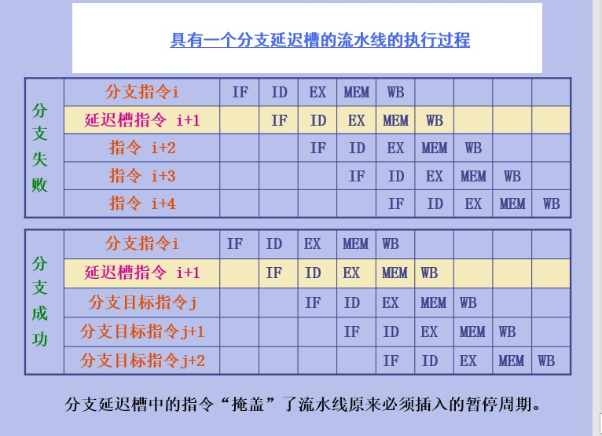
	
	分支延迟指令的调度:
	
	- 从前调度
		- 从目标处调度
	- 从失败处调度
	
		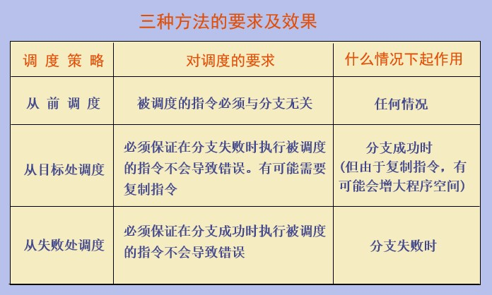

		分支延迟受到两个方面的限制：
	
	- 可以被放入延迟槽中的指令要满足一定的条件
		- 编译器预测分支转移方向的能力。
	
		进一步改进：分支取消机制（取消分支）
		当分支的实际执行方向和事先所预测的一样时，执行分支延迟槽中的指令，否则就将分支延迟槽中的指令转化成一个空操作
	
		

### 3.5 向量处理机

> 在流水线处理机中，设置向量数据表示和相应的向量指令，称为向量处理机。
> 不具有向量数据表示和相应的向量指令的流水线处理机，称为标量处理机

## 第四章 指令级并行

### 4.1 指令级并行的概念 ILP

几乎所有的处理机都利用流水线来使指令重叠并行执行，以达到提高性能的目的。这种指令之间存在的潜在并行性称为指令级并行 ILP：Instruction-Level Parallelism

### 4.2 指令的调度

#### 静态和动态调度

- 静态调度

	**依靠编译器**对代码进行静态调度，以减少相关和冲突。它不是在程序执行的过程中、而是在编译期间进行代码调度和优化。通过把相关的指令拉开距离来减少可能产生的停顿

- 动态调度

	在程序的执行过程中，**依靠专门硬件**对代码进行调度，减少数据相关导致的停顿

	优点：

	1. 能够处理一些在编译时情况不明的相关（比如涉及到存储器访问的相关），并简化了编译器
	2. 能够使本来是面向某一流水线优化编译的代码在其他的流水线（动态调度）上也能高效地执行

	但增加了硬件复杂性

#### 非线性流水线的调度问题

非线性流水线中由于有些段需要在时间上复用，就不能像线性流水线那样逐时段连续地输入指令。把前一条指令输入开始到下一条指令输入为止的时间差，称为**启动距离**

那些会引起冲突的启动距离，被称为禁止启动距离。将在任何时间都不会发生冲突的启动距离称为启动循环

#### 最优调度方法

为了避免冲突，就要对指令输入流水线的时间进行控制，这个任务就是流水线的无冲突调度。方案如下：

1. **根据预约表写出禁止向量**

	禁止向量：各个段内的X标记的差的集合

2. **由禁止向量变换成初始冲突向量**

	使用$初始冲突向量：C_0=(C_mC_{m-1}\dots C_2C_1)$，m为冲突向量的最大值，根据禁止向量，令$C_m = 1$，仅当$m \in 禁止向量$

3. **根据初始冲突向量推算出全部冲突向量**

	从初始冲突向量出发，检查其中0的位，假设初始向量中$C_k = 0$，就将初始向量右移K位之后和初始向量执行或运算，若得到一个新的向量，继续检查0的位，执行右移运算，并和$C_0$做或运算，直到不存在新的向量

4. **画出表示冲突向量迁移的有向图**

	节点值为向量，边权为右移的位数，构建有向图
	
5. **从全部调度方案中选出最优调度法**

	从**各个闭合回路**（不需要从初始向量出发）中找出平均间隔最小的一个，平均间隔为边权和除以边数

例题：

某单功能流水线预约表如下：

|      | t1   | t2   | t3   | t4   | t5   | t6   |
| ---- | ---- | ---- | ---- | ---- | ---- | ---- |
| S1   | ×    |      |      |      | ×    |      |
| S2   |      | ×    |      |      |      | ×    |
| S3   |      |      | ×    |      |      |      |
| S4   |      |      |      | ×    |      |      |

请确定最佳调度方案。按此方案输入8个指令时，性能指标如何？

禁止向量为：$F={4}$，初始冲突向量为：$C_0 = (1000)$

获取状态转换图：

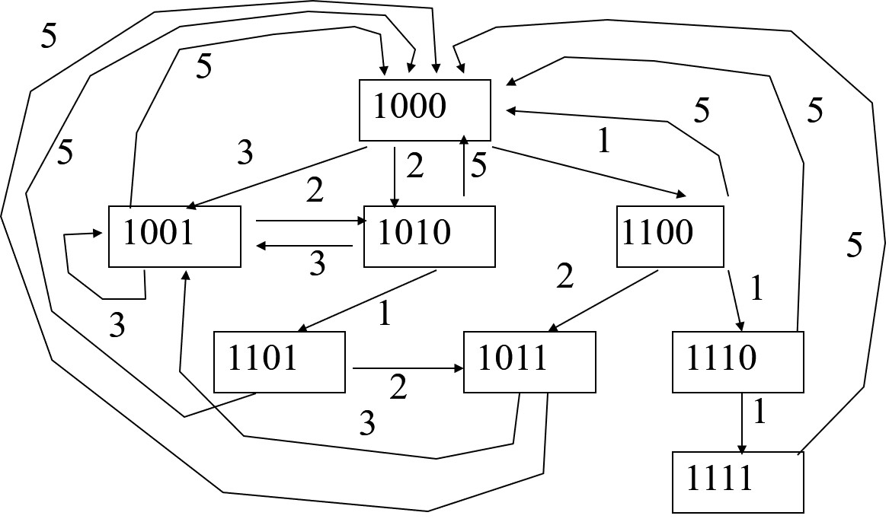

其中5权值边可以看作是0C，右移5位形成的，构建成新的闭合回路

可以获得调度方案如下：

| 回路         | 平均间隔 | 回路 | 平均间隔 |
| ----------- | ------- | ------- | ---- |
| 1,5         | 6/2     | 2,1,2,5 | 10/4 |
| 1,1,5       | 7/3     | 2,3,5   | 10/3 |
| **1,1,1,5** | **8/4** | 3,5     | 8/2  |
| 1,2,5       | 8/3     | 3       | 3    |
| 1,2,3,5     | 11/4    | 3,2,5   | 10/3 |
| 2,5         | 7/3     | 3,2,1,5 | 11/4 |
| 2,1,5       | 8/3     | 2,3     | 5/2  |

最佳方案为1，1，1，5，平均最少延时为2拍

8个指令进入流水线的时空图如下：

吞吐率  P = 8/(17Δt)；
加速比  S = (6Δt×8)/(17Δt)=48/17
效率    E = (6Δt×8) /(17Δt×4)=12/17

#### 动态调度的基本思想

到目前为止我们所使用流水线的最大的局限性，指令必须按序流出和执行，一旦一条指令受阻，其后的指令都将停顿，可以通过乱序执行解决。动态调度的流水线支持多条指令同时处于执行当中。

指令乱序完成带来的最大问题：

- 异常处理比较复杂

- 动态调度要保持正确的异常行为

	只有那些在程序严格按程序顺序执行时会发生的异常，才能真正发生

#### Tomasulo算法

> 记录和检测指令相关，操作数一旦就绪就立即执行，把发生RAW冲突的可能性减少到最小通过寄存器换名来消除WAR冲突和WAW冲突

基于MIPS的Tomasulo基本结构：

- 保留站

	每个保留站中保存一条已经流出并等待到本功能部件执行的指令（相关信息）包括：操作码、操作数以及用于检测和解决冲突的信息

	上图有3个浮点加法器保留站，2个浮点乘法器保留站

	每个保留站都有一个标识字段，唯一地标识了该保留站

- 公共数据总线CDB 

	所有功能部件的计算结果都是送到CDB上，由它把这些结果直接送到（播送到）各个需要该结果的地方。在具有多个执行部件且采用多流出（即每个时钟周期流出多条指令）的流水线中，需要采用多条CDB

- load缓冲器和store缓冲器 

	存放读/写存储器的数据或地址 
	load缓冲器的作用有3个：

	- 存放用于计算有效地址的分量
	- 记录正在进行的load访存，等待存储器的响应
	- 保存已经完成了的load的结果（即从存储器取来的数据），等待CDB传输

	store缓冲器的作用有3个：

	- 存放用于计算有效地址的分量
	- 保存正在进行的store访存的目标地址，该store正在等待存储数据的到达
	- 保存该store的地址和数据，直到存储部件接收

- 浮点寄存器FP

	它们通过一对总线连接到功能部件，并通过CDB连接到store缓冲器

- 指令队列

	指令部件送来的指令放入指令队列
	指令队列中的指令按先进先出的顺序流出

- 运算部件

Tomasulo算法具有以下两个特点:

- 冲突检测和指令执行控制是分布的
- 计算结果通过CDB直接从产生它的保留站传送到所有需要它的功能部件，而不用经过寄存器

指令执行的步骤：

1. **流出：从指令队列的头部取一条指令**

	- 如果该指令的操作所要求的保留站有空闲的，就把该指令送到该保留站
	- 如果其操作数在寄存器中已经就绪，就将这些操作数送入保留站
	- 如果其操作数还没有就绪，就把将产生该操作数的保留站的标识送入保留站
	- 一旦被记录的保留站完成计算，它将直接把数据送给保留站
	- 完成对目标寄存器的预约工作
	- 如果没有空闲的保留站，指令就不能流出

2. **执行**

	- 当两个操作数都就绪后，本保留站就用相应的功能部件开始执行指令规定的操作
	- load和store指令的执行需要两个步骤：
		- 计算有效地址（要等到基地址寄存器就绪）
		- 把有效地址放入load或store缓冲器

3. **写结果** 

	功能部件计算完毕后，就将计算结果放到CDB上，所有等待该计算结果的寄存器和保留站（包括store缓冲器）都同时从CDB上获得所需要的数据

Tomasulo示例：

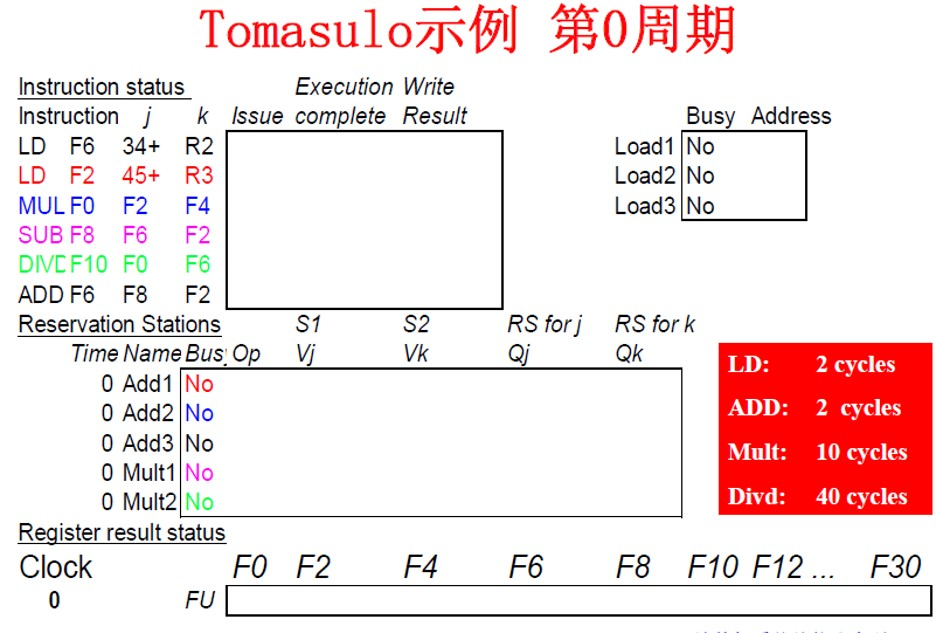

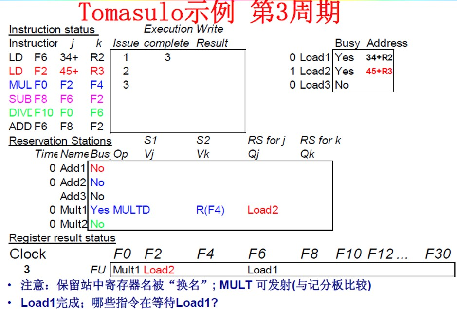

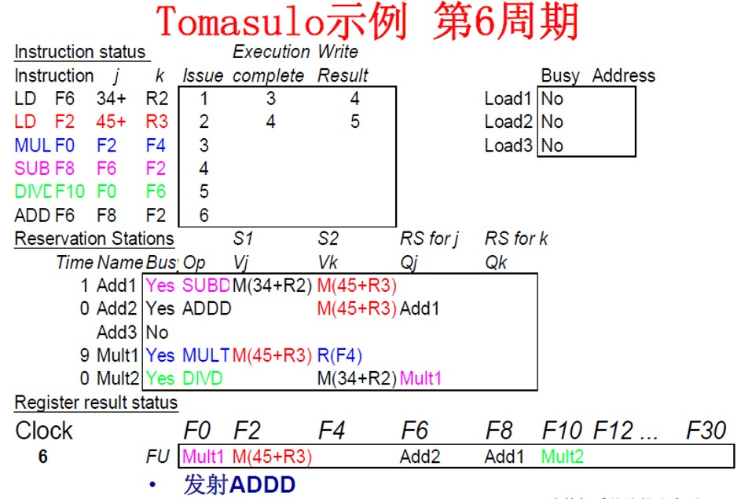

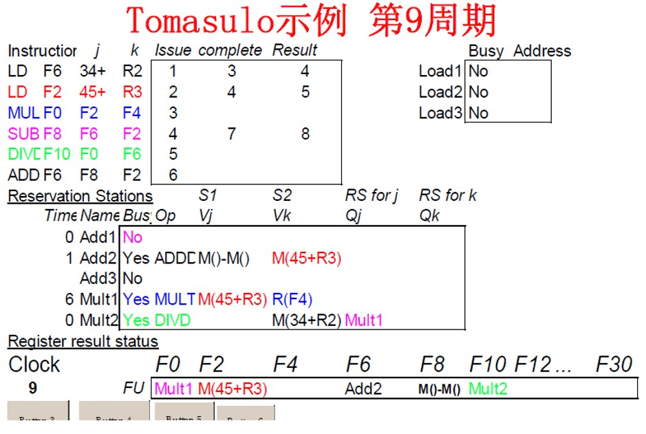

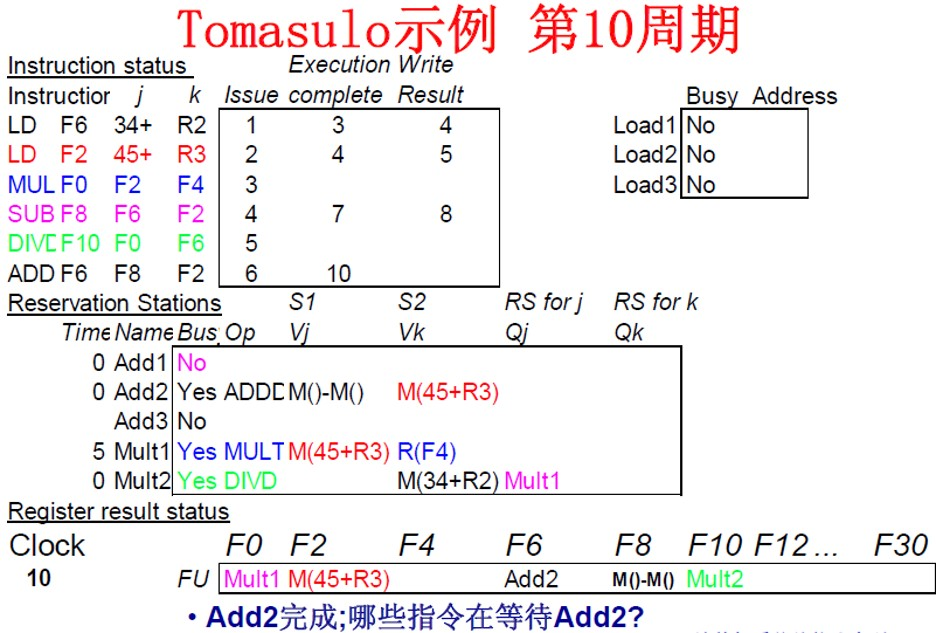

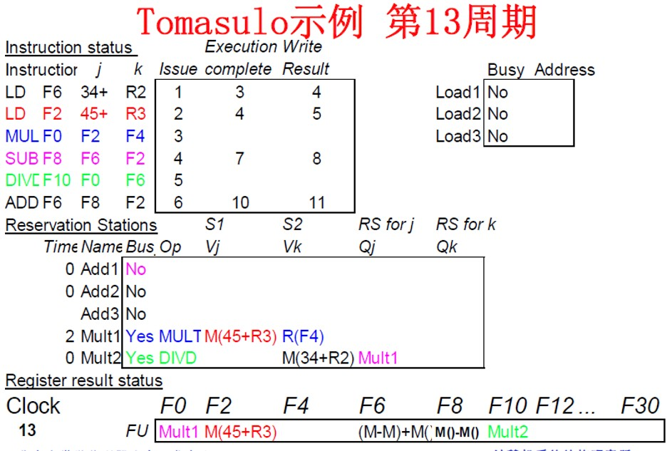

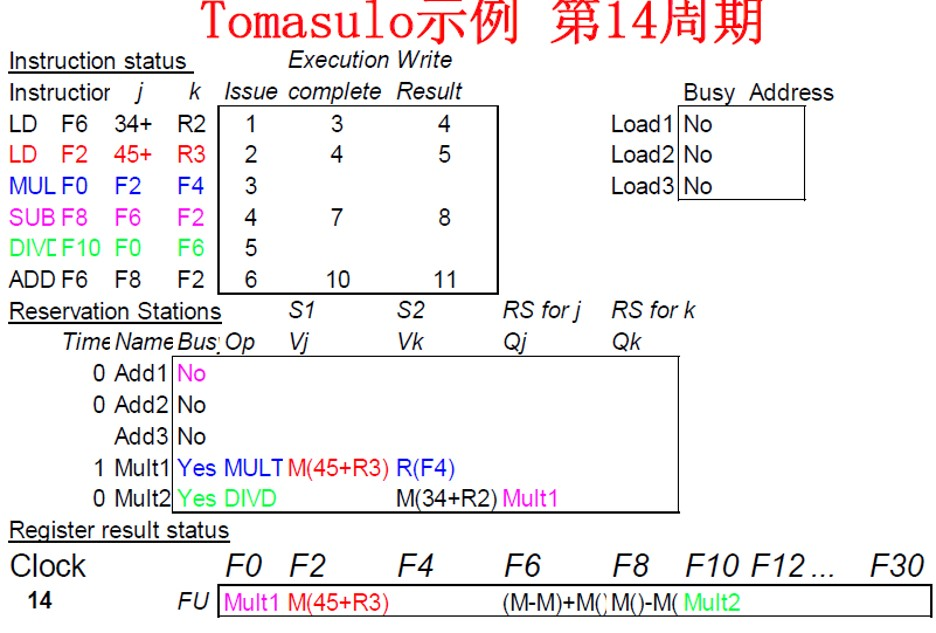

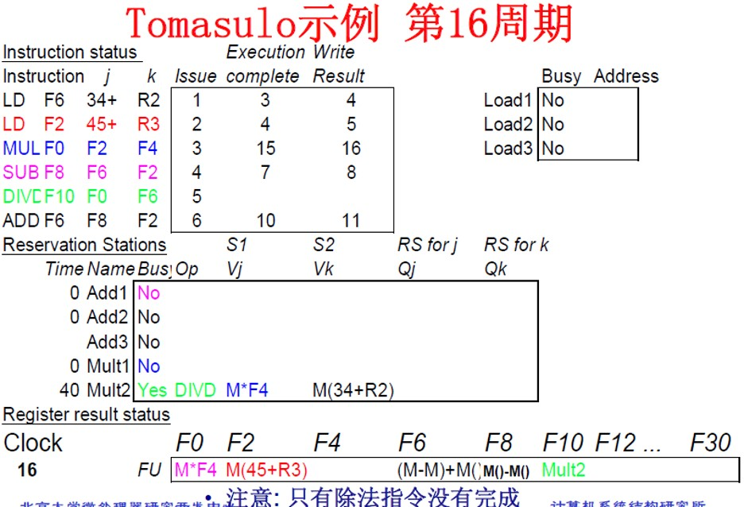

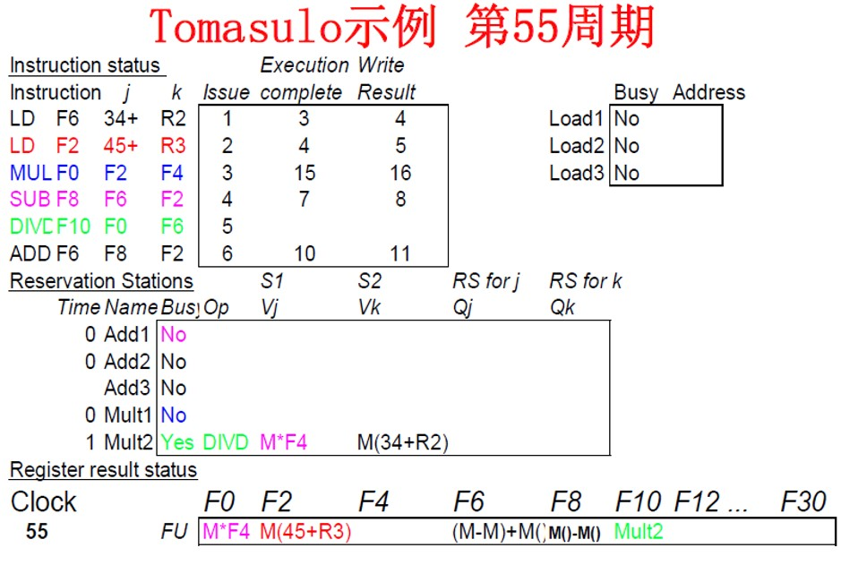

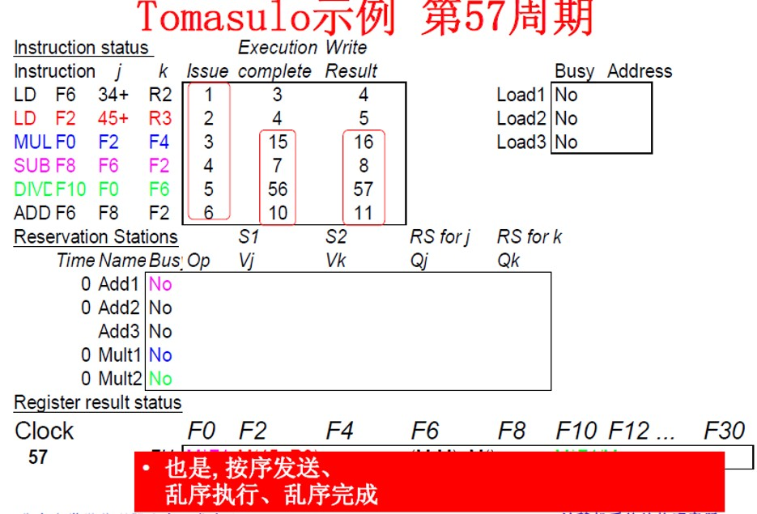

### 4.3 动态分支预测技术

所开发的ILP越多，控制相关的制约就越大，分支预测就要有更高的准确度

**动态分支预测：**在程序运行时，根据分支指令过去的表现来预测其将来的行为

分支预测的有效性取决于:

- 预测的准确性

- 预测正确和不正确两种情况下的分支开销

	决定分支开销的因素

	- 流水线的结构
	- 预测的方法
	- 预测错误时的恢复策略等

- 采用动态分支预测技术的目的

	- 预测分支是否成功
	- 尽快找到分支目标地址（或指令）

#### 采用分支历史表 BHT

> 最简单的动态分支预测方法，用BHT来记录分支指令最近一次或几次的执行情况（成功或不成功），并据此进行预测

- 只有1个预测位的分支预测缓冲

	记录分支指令最近一次的历史，BHT中只需要1位二进制位

- 采用两位二进制位来记录历史

	提高预测的准确度，研究结果表明：两位分支预测的性能与n位（n>2）分支预测的性能差不多

	

适用情况：

**判定分支是否成功所需的时间大于确定分支目标地址所需的时间**

由于判定分支是否成功和计算分支目标地址都是在ID段完成，所以BHT方法不会给该流水线带来好处。

#### 采用分支目标缓冲器BTB

目标：将分支的开销降为 0

方法：分支目标缓冲

- 将分支成功的分支指令的地址和它的分支目标地址都放到一个缓冲区中保存起来，缓冲区以分支指令的地址作为标识
- 这个缓冲区就是分支目标缓冲器（Branch-Target Buffer，简记为BTB，或者Branch-Target Cache）

结构如下：

看成是用专门的硬件实现的一张表格。 表格中的每一项至少有两个字段： 

- 执行过的成功分支指令的地址；（作为该表的匹配标识 ）
- 预测的分支目标地址

执行流程如下：

BTB的另一种形式:

在分支目标缓冲器中存放一条或者多条分支目标处的指令，有三个好处：

- 更快地获得分支目标处的指令
- 可以一次提供分支目标处的多条指令，这对于多流出处理器是很有必要的
- 使我们可以进行称为分支折叠（branch folding）的优化

#### 基于硬件的前瞻执行

基本思想（延迟写入）：

对分支指令的结果进行猜测，并假设这个猜测总是对的，然后按这个猜测结果继续取、流出和执行后续的指令。只是执行指令的结果不是写回到寄存器或存储器，而是放到一个称为ROB（ReOrder Buffer）的缓冲器中。等到相应的指令得到“确认”（commit）（即确实是应该执行的）之后，才将结果写入寄存器或存储器

1. 基于硬件的前瞻执行结合了三种思想

	- 动态分支预测。用来选择后续执行的指令
	- 在控制相关的结果尚未出来之前，前瞻地执行后续指令
	- 用动态调度对基本块的各种组合进行跨基本块的调度

2. 对Tomasulo算法加以扩充，就可以支持前瞻执行

	把Tomasulo算法的写结果和指令完成加以区分，分成两个不同的段：

	- 写结果段

		把前瞻执行的结果写到ROB中通过CDB在指令之间传送结果，供需要用到这些结果的指令使用

	- 指令确认段

		在分支指令的结果出来后，对相应指令的前瞻执行给予确认。如果前面所做的猜测是对的，把在ROB中的结果写到寄存器或存储器。如果发现前面对分支结果的猜测是错误的，那就不予以确认，并从那条分支指令的另一条路径开始重新执行。  

**实现前瞻的关键思想**：允许指令乱序执行，但必须顺序确认

符合前瞻执行的结构：

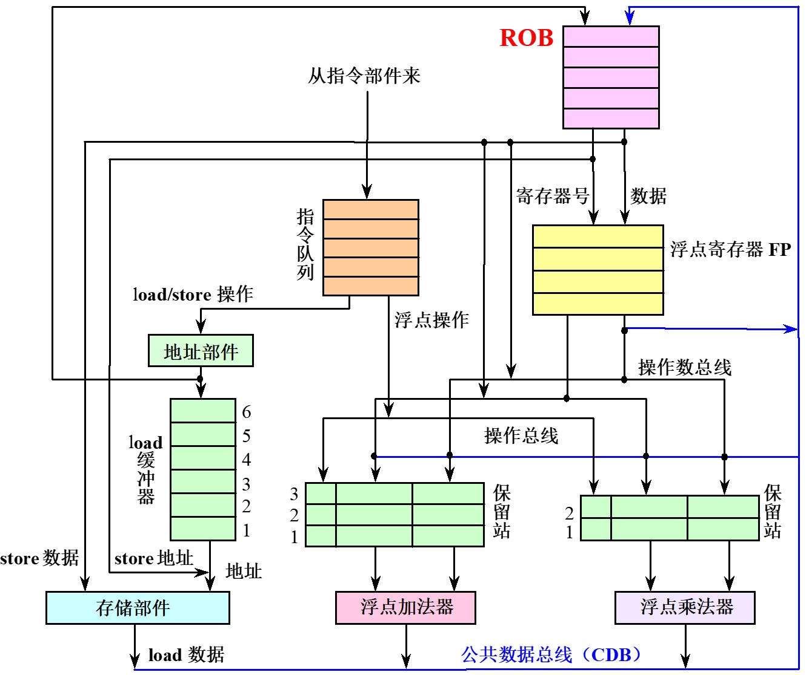

ROB中的每一项由以下4个字段组成：

- 指令类型

	指出该指令是分支指令、store指令或寄存器操作指令

- 目标地址
	给出指令执行结果应写入的目标寄存器号（如果是load和ALU指令）或存储器单元的地址（如果是store指令）

- 数据值字段
	用来保存指令前瞻执行的结果，直到指令得到确认

- 就绪字段
	指出指令是否已经完成执行并且数据已就绪

Tomasulo算法中保留站的换名功能是由ROB来完成的

**采用前瞻执行机制后，指令的执行步骤**：

1. 流出

	- 从浮点指令队列的头部取一条指令
	- 如果有空闲的保留站（设为r）且有空闲的ROB项（设为b），就流出该指令，并把相应的信息放入保留站r和ROB项b
	- 如果保留站或ROB全满，便停止流出指令，直到它们都有空闲的项

2. 执行

	- 如果有操作数尚未就绪，就等待，并不断地监测CDB。(检测RAW冲突)
	- 当两个操作数都已在保留站中就绪后，就可以执行该指令的操作

3. 写结果

	- 当结果产生后，将该结果连同本指令在流出段所分配到的ROB项的编号放到CDB上，经CDB写到ROB以及所有等待该结果的保留站
	- 释放产生该结果的保留站
	- store指令在本阶段完成，其操作为：
		- 如果要写入存储器的数据已经就绪，就把该数据写入分配给该store指令的ROB项。
		- 否则，就监测CDB，直到那个数据在CDB上播送出来，这时才将之写入分配给该store指令的ROB项。

4. 确认

	对分支指令、store指令以及其他指令的处理不同

	- 其他指令（除分支指令和store指令）

		当该指令到达ROB队列的头部而且其结果已经就绪时，就把该结果写入该指令的目标寄存器，并从ROB中删除该指令

	- store指令

		处理与上面类似，只是它把结果写入存储器

	- 分支指令

		- 当预测错误的分支指令到达ROB队列的头部时，清空ROB，并从分支指令的另一个分支重新开始执行（错误的前瞻执行）
		- 当预测正确的分支指令到达ROB队列的头部时，该指令执行完毕

	

### 4.4 多指令流出技术

1. 多流出处理机有两种基本风格
	- 超标量
		- 在每个时钟周期流出的指令条数不固定，依代码的具体情况而定。（有上限）
		- 设这个上限为n，就称该处理机为n流出
		- 可以通过编译器进行静态调度，也可以基于Tomasulo算法进行动态调度
	- 超长指令字VLIW
		- 在每个时钟周期流出的指令条数是固定的，这些指令构成一条长指令或者一个指令包。
		- 指令包中，指令之间的并行性是通过指令显式地表示出来的。
		- 指令调度是由编译器静态完成的
2. 超标量处理机与VLIW处理机相比有两个优点
	- 超标量结构对程序员是透明的，因为处理机能自己检测下一条指令能否流出，从而不需要重新排列指令来满足指令的流出。
	- 即使是没有经过编译器针对超标量结构进行调度优化的代码或是旧的编译器生成的代码也可以运行，当然运行的效果不会很好

#### 基于动态调度的多流出技术

扩展Tomasulo算法：支持两路超标量

- 每个时钟周期流出两条指令
- 一条是整数指令，另一条是浮点指令

1. 采用一种比较简单的方法

	- 指令按顺序流向保留站，否则会破坏程序语义
	- 将整数所用的表结构与浮点用的表结构分离开，分别进行处理，这样就可以同时地流出一条浮点指令和一条整数指令到各自的保留站

2. 有两种不同的方法可以实现多流出

	关键在于：对保留站的分配和对流水线控制表格的修改

	- 在半个时钟周期里完成流出步骤，这样一个时钟周期就能处理两条指令。
	- 设置一次能同时处理两条指令的逻辑电路

#### 超长指令字技术（VLIW）

- 把能并行执行的多条指令组装成一条很长的指令。（100多位到几百位）
- 设置多个功能部件
- 指令字被分割成一些字段，每个字段称为一个操作槽，直接独立地控制一个功能部件
- 在VLIW处理机中，所有的处理和指令安排都是由编译器完成的

VLIW存在的一些问题

- 程序代码长度增加了

	- 提高并行性而进行的大量的循环展开
	- 指令字中的操作槽并非总能填满

- 采用了锁步机制

	任何一个操作部件出现停顿时，整个处理机都要停顿

- 机器代码的不兼容性

#### 多流出处理器受到的限制

1. 程序所固有的指令级并行性
2. 硬件实现上的困难
3. 超标量和超长指令字处理器固有的技术限制

##### 超流水线处理机

- 将每个流水段进一步细分，这样在一个时钟周期内能够分时流出多条指令。这种处理机称为超流水线处理机。
- 对于一台每个时钟周期能流出n条指令的超流水线计算机来说，这n条指令不是同时流出的，而是每隔1/n个时钟周期流出一条指令实际上该超流水线计算机的流水线周期为1/n个时钟周期

## 第5章 存储层次

### 5.1 存储器的层次结构

假设：S（容量），$T_A$（访问时间），C（每位价格）

假设由M1和M2构成的两级存储层次		

M1的参数为：$S_1,T_{A1},C_1$

M2的参数为：$S_1,T_{A1},C_1$

1. 每位价格：$C=\frac{C_1S_1+C_2S_2}{S_1+S_2}$

2. 命中率和失效率

	- 命中率：$H=\frac{N_1}{N_1+N_2}$，N1为访问M1的次数，N2为访问M2的次数
	- 失效率：$F=1-H$

3. 平均访问时间
	$$
	\begin{align}
	T_A &= HT_{A1}+(1-H)(T_{A1}+T_M) \\
	&= T_{A1}+(1-H)T_M \\
	&= T_A1+FT_M \\
	\end{align} 
	\\
	T_M 为失效开销，从向M_2发出访问请求到把整个数据块调入M_1中所需的时间 \\
	T_M = T_{A2} + T_B \\
	T_B为传送一个信息块所需的时间
	$$

- “Cache－主存”层次：弥补主存速度的不足
- “主存－辅存”层次： 弥补主存容量的不足

### 5.2 Cache的基本知识

#### 映像规则

- 全相联规则

	主存中的任一块可以被放置到Cache中的任意一个位置

- 直接映像

	主存中的每一块只能被放置到Cache中唯一的一个位置，取模运算（模Cache的块数）

- 组相联映像

	主存中的每一块可以被放置到Cache中唯一的一个组中的任何一个位置

	若主存第i 块映象到第k 组，则：$K=i \mod G $，G为Cache的组数

	n路组相联，每组中有n个块，n也称为相联度，相联度越高，Cache空间的利用率就越高，块冲突概率就越低，失效率也就越低

#### 查找算法

通过查找目录表来实现

目录表结构：

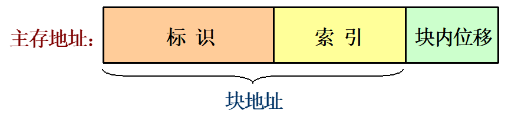

#### 替换算法

- 随机法

- 先进先出法FIFO

- 最近最少使用法LRU

	选择近期最少被访问的块作为被替换的块，选择最久没有被访问过的块作为被替换的块，失效率低

#### 写策略

“写”在所有访存操作中所占的比例：

统计结果表明，对于一组给定的程序：

- load指令：26％
- store指令：9％

“写”在所有访存操作中所占的比例：9％/(100％＋26％＋9％)≈7％（100%指：取指令的指令访存）
“写”在访问数据Cache操作中所占的比例：9％/(26％＋9％)≈25％

“写”操作必须在确认是命中后才可进行，“写”访问有可能导致Cache和主存内容的不一致

两种写策略：

- 写直达法：

	执行“写”操作时，不仅写入Cache，而且也写入下一级存储器

	易于实现，一致性好

- 写回法：

	执行“写”操作时，只写入Cache。仅当Cache中相应的块被替换时，才写回主存

	速度快，所使用的存储器带宽较低

采用写直达法时，若在进行“写”操作的过程中CPU必须等待，直到“写”操作结束，则称CPU写停顿，减少写停顿的一种常用的优化技术：**采用写缓冲器**

“写”操作时的调块：

- 按写分配(写时取)

	写失效时，先把所写单元所在的块调入Cache，再行写入

- 不按写分配(绕写法)

	写失效时，直接写入下一级存储器而不调块

写策略与调块：

- 写回法 ── 按写分配
- 写直达法 ── 不按写分配

#### Cache的性能分析

- 失效率

	- 与硬件速度无关
	- 容易产生一些误导

- 平均访存时间

	**平均访存时间 ＝ 命中时间＋失效率×失效开销**

- 程序执行时间

	

Cache失效对于一个CPI较小而时钟频率较高的CPU来说，影响是双重的：

- CPIexecution越低，固定周期数的Cache失效开销的相对影响就越大

- 在计算CPI时，失效开销的单位是时钟周期数。因此，即使两台计算机的存储层次完全相同，时钟频率较高的CPU的失效开销较大，其CPI中存储器停顿这部分也就较大

	**存储器停顿时钟周期数＝访存次数×失效率×失效开销**

因此Cache对于低CPI、高时钟频率的CPU来说更加重要

#### 改进Cache的性能

- **平均访存时间＝命中时间＋失效率×失效开销**
- 可以从三个方面改进Cache的性能：
	- 降低失效率
	- 减少失效开销
	- 减少Cache命中时间

### 5.3 降低Cache失效率的方法

三种失效：

- 强制失效

	当第一次访问一个块时，该块不在Cache中，需从下一级存储器中调入Cache

- 容量失效

	如果程序执行时所需的块不能全部调入Cache中，则当某些块被替换后，若又重新被访问，就会发生失效

- 冲突失效

	在组相联或直接映象Cache中，若太多的块映象到同一组(块)中，则会出现该组中某个块被别的块替换(即使别的组或块有空闲位置)，然后又被重新访问的情况

失效和Cache容量大小的关系：

- 相联度越高，冲突失效就越少
- 强制性失效和容量失效不受相联度的影响
- 强制性失效不受Cache容量的影响，但容量失效却随着容量的增加而减少
- 大小为N的直接映象Cache的失效率约等于大小为N/2的2路组相联Cache的失效率

减少三种失效的方法：

- 强制性失效：增加块大小，预取
- 容量失效：增加容量 
- 冲突失效：提高相联度

**许多降低失效率的方法会增加命中时间或失效开销**

#### 1. 增加Cache块大小

对于给定的Cache容量，当块大小增加时，失效率开始是下降，后来反而上升了

原因：

- 一方面它减少了强制性失效
- 另一方面，由于增加块大小会减少Cache中块的数目，所以有可能会增加冲突失效

Cache容量越大，使失效率达到最低的块大小就越大

增加块大小会增加失效开销

#### 2. 提高相联度

采用相联度超过8的方案的实际意义不大

2:1 Cache经验规则：容量为N的直接映象Cache的失效率和容量为N/2的2路组相联Cache的失效率差不多相同

提高相联度是以增加命中时间为代价

#### 3. 增加Cache的容量

最直接的方法是增加Cache的容量
缺点:

- 增加成本
- 可能增加命中时间

这种方法在片外Cache中用得比较多 

#### 4. Victim Cache 

一种能减少冲突失效次数而又不影响时钟频率的方法
基本思想：

在Cache和它从下一级存储器调数据的通路之间设置一个全相联的小Cache，用于存放被替换出去的块(称为Victim)，以备重用

作用：对于减小冲突失效很有效，特别是对于小容量的直接映象数据Cache，作用尤其明显

#### 5. 伪相联 Cache 

伪相联Cache的优点：

- 命中时间小
- 失效率低

基本思想及工作原理：

在逻辑上把直接映象Cache的空间上下平分为两个区。对于任何一次访问，伪相联Cache先按直接映象Cache的方式去处理。若命中，则其访问过程与直接映象Cache的情况一样。若不命中，则再到另一区相应的位置去查找。若找到，则发生了伪命中，否则就只好访问下一级存储器

#### 6. 硬件预取

- 指令和数据都可以预取
- 预取内容既可放入Cache，也可放在外缓冲器中。例如：指令流缓冲器
- 指令预取通常由Cache之外的硬件完成

平均访存时间预取 ＝命中时间＋失效率×预取命中率×1＋失效率×（1－预取命中率）×失效开销

#### 7. 编译器控制的预取 

在编译时加入预取指令，在数据被用到之前发出预取请求

#### 8. 编译器优化 

在编译时，对程序中的指令和数据进行重新组织，以降低Cache失效率

数组合并技术、内外循环交换技术、循环融合技术

### 5.4 减少Cache失效开销

#### 1. 让读失效优先于写

Cache中的写缓冲器导致对存储器访问的复杂化：

写缓冲器进行的写入操作是滞后进行的，所以该缓冲器也被称为后行写数缓冲器

解决问题的方法(读失效的处理)：

- 推迟对读失效的处理：（缺点：读失效的开销增加，如50％）
- 检查写缓冲器中的内容

在写回法Cache中，也可采用写缓冲器

#### 2. 写缓冲合并

- 提高写缓冲器的效率
- 写直达Cache：依靠写缓冲来减少对下一级存储器写操作的时间
- 如果写缓冲器为空，就把数据和相应地址写入该缓冲器
- 如果写缓冲器中已经有了待写入的数据，就要把这次的写入地址与写缓冲器中已有的所有地址进行比较，看是否有匹配的项。如果有地址匹配而对应的位置又是空闲的，就把这次要写入的数据与该项合并。这就叫写缓冲合并
- 如果写缓冲器满且又没有能进行写合并的项，就必须等待

**提高了写缓冲器的空间利用率，而且还能减少因写缓冲器满而要进行的等待时间**

#### 3. 请求字处理技术

- 请求字：从下一级存储器调入Cache的块中，只有一个字是立即需要的
- 应尽早把请求字发送给CPU：
	- 尽早重启动：调块时，从块的起始位置开始读起。一旦请求字到达，就立即发送给CPU，让CPU继续执行
	- 请求字优先：调块时，从请求字所在的位置读起。这样，第一个读出的字便是请求字。将之立即发送给CPU

这种技术在以下情况下效果不大：

- Cache块较小
- 下一条指令正好访问同一Cache块的另一部分

#### 4. 非阻塞Cache技术

即为：Cache失效时仍允许CPU进行其他的命中访问。即允许“失效下命中”

#### 5. 采用两级Cache

局部失效率与全局失效率：

- 局部失效率：

	该级Cache的失效次数/到达该级Cache的访问次数

- 全局失效率

	该级Cache的失效次数/CPU发出的访存的总次数

	全局失效率L2＝部分失效率L1×部分失效率L2

对于第二级Cache，我们有以下结论：

- 在第二级Cache比第一级 Cache大得多的情况下，两级Cache的全局失效率和容量与第二级Cache相同的单级Cache的失效率非常接近。
- 局部失效率不是衡量第二级Cache的一个好指标，因此，在评价第二级Cache时，应用全局失效率这个指标

第二级Cache的参数：

- 容量

	第二级Cache的容量一般比第一级的大许多

- 相联度

	第二级Cache可采用较高的相联度或伪相联方法

### 5.5 减少命中时间

命中时间直接影响到处理器的时钟频率。在当今的许多计算机中，往往是Cache的访问时间限制了处理器的时钟频率

#### 1. 容量小、结构简单的Cache

硬件越简单，速度就越快。应使Cache足够小，以便可以与CPU一起放在同一块芯片上

某些设计采用了一种折中方案：

把Cache的标识放在片内，而把Cache的数据存储器放在片外

#### 2.虚拟Cache

- 虚拟Cache：访问Cache的索引以及Cache中的标识都是虚拟地址(一部分)
- 物理Cache：使用物理地址的传统Cache

虚拟索引＋物理标识：

- 优点：兼得虚拟Cache和物理Cache的好处
- 局限性：Cache容量受到限制（Cache容量≤页大小×相联度）

#### 3. Cache访问流水化

- 对第一级Cache的访问按流水方式组织
- 访问Cache需要多个时钟周期才可以完成

#### 4. Trace Cache

- 开发指令级并行性所遇到的一个挑战是：
	当要每个时钟周期流出超过4条指令时，要提供足够多条彼此互不相关的指令是很困难的
- 一个解决方法：采用Trace Cache
	存放CPU所执行的动态指令序列包含了由分支预测展开的指令，该分支预测是否正确需要在取到该指令时进行确认

优缺点：

- 地址映象机制复杂。
- 相同的指令序列有可能被当作条件分支的不同选择而重复存放。
- 能够提高指令Cache的空间利用率

#### 5. Cache优化技术总结

“＋”号：表示改进了相应指标
“－”号：表示它使该指标变差
空格栏：表示它对该指标无影响
复杂性：0表示最容易，3表示最复杂

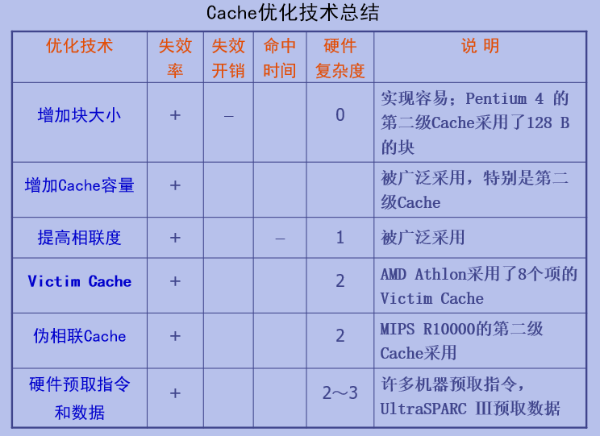

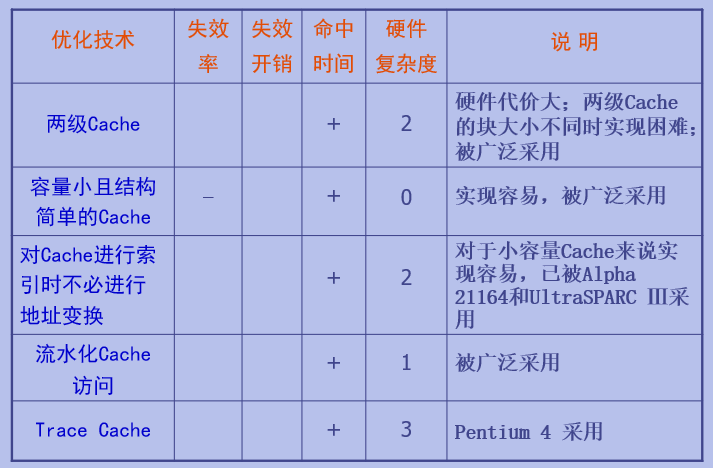